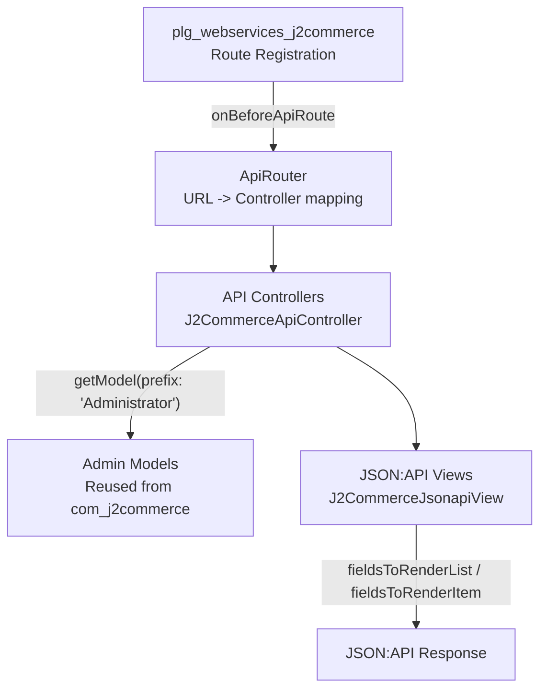

# REST API Reference

J2Commerce exposes a comprehensive REST API through Joomla's Web Services framework. The API follows the [JSON:API specification](https://jsonapi.org/) (media type `application/vnd.api+json`), uses Bearer Token authentication, and provides 40+ endpoints across 21 resource types. All routes are registered by the `plg_webservices_j2commerce` plugin.

## Architecture

The API layer consists of four parts:



### Key Source Files

| Layer | Path | Purpose |
|-------|------|---------|
| Plugin | `plugins/webservices/j2commerce/src/Extension/J2Commerce.php` | Registers all routes via `onBeforeApiRoute` |
| Base Controller | `api/components/com_j2commerce/src/Controller/J2CommerceApiController.php` | Forces `Administrator` prefix for model resolution |
| Base View | `api/components/com_j2commerce/src/View/J2CommerceJsonapiView.php` | Maps custom PKs (e.g. `j2commerce_product_id`) to `id` |
| Controllers | `api/components/com_j2commerce/src/Controller/` | 20 controllers -- one per resource type |
| Views | `api/components/com_j2commerce/src/View/` | JSON:API serializers with field whitelists |

### Key Classes

| Class | Namespace | Purpose |
|-------|-----------|---------|
| `J2CommerceApiController` | `J2Commerce\Component\J2commerce\Api\Controller` | Extends `Joomla\CMS\MVC\Controller\ApiController` -- overrides `getModel()` to force admin model resolution since no API-specific models exist |
| `J2CommerceJsonapiView` | `J2Commerce\Component\J2commerce\Api\View` | Extends `Joomla\CMS\MVC\View\JsonApiView` -- maps custom primary keys to the standard `id` field expected by the tobscure/json-api serializer |

### Route Registration

Routes are registered in `J2Commerce.php` using two mechanisms:

1. **`$router->createCRUDRoutes()`** -- registers standard GET (list + item), POST, PATCH, DELETE routes for a resource
2. **`$router->addRoutes()`** with explicit `Route` objects -- used for nested resources (order items, product variants) and custom endpoints (reports, config)

```php
// File: plugins/webservices/j2commerce/src/Extension/J2Commerce.php

// Standard CRUD -- creates 5 routes automatically
$router->createCRUDRoutes('v1/j2commerce/products', 'products', $component);

// Nested route -- explicit Route object with regex pattern
new Route(['GET'], 'v1/j2commerce/orders/:id/items', 'orderitems.displayList', ['id' => '(\d+)'], $private);
```

---

## Authentication

The API uses Joomla's built-in Bearer Token system provided by `plg_api-authentication_token`.

### Prerequisites

1. The **API Authentication - Web Services Joomla Token** plugin must be enabled at **System** -> **Plugins** -> search for "api-authentication"
2. The **Web Services - J2Commerce** plugin must be enabled at **System** -> **Plugins** -> search for "j2commerce"

### Generating a Token

1. Navigate to **Users** -> **Manage** -> select a user with appropriate permissions
2. Open the **Joomla API Token** tab
3. Click **Generate** and copy the token

### Using the Token

Include the token in the `Authorization` header with every request:

```bash
curl -X GET "https://yoursite.com/api/index.php/v1/j2commerce/products" \
  -H "Authorization: Bearer YOUR_TOKEN_HERE" \
  -H "Accept: application/vnd.api+json"
```

All write operations (POST, PATCH, DELETE) require authentication. Nested and report endpoints are also marked as `public: false` in the route registration, requiring authentication for all HTTP methods.

---

## Base URL

```
https://yoursite.com/api/index.php/v1/j2commerce/
```

All endpoint paths in this document are relative to this base.

---

## Request / Response Format

### Request Headers

| Header | Value | Required |
|--------|-------|----------|
| `Authorization` | `Bearer {token}` | All endpoints |
| `Accept` | `application/vnd.api+json` | All endpoints |
| `Content-Type` | `application/json` | POST and PATCH only |

### Response Structure

All responses follow the JSON:API specification:

```json
{
  "links": {
    "self": "https://yoursite.com/api/index.php/v1/j2commerce/products"
  },
  "data": [
    {
      "type": "products",
      "id": "42",
      "attributes": {
        "product_name": "T-Shirt",
        "sku": "TSH-001",
        "price": "29.99"
      }
    }
  ]
}
```

Single-item responses return `data` as an object instead of an array.

### Pagination

```
?page[offset]=0&page[limit]=20
```

| Parameter | Description | Default | Maximum |
|-----------|-------------|---------|---------|
| `page[offset]` | Number of records to skip | `0` | -- |
| `page[limit]` | Number of records to return | `20` | `100` |

### Filtering

Filters are passed as query parameters under the `filter` key:

```
?filter[search]=keyword
?filter[enabled]=1
```

Available filters vary by endpoint and are documented in each resource section below. Filters are processed through `Joomla\CMS\Filter\InputFilter` for sanitization.

### Sorting

```
?list[ordering]=created_on&list[direction]=desc
```

| Parameter | Description | Example Values |
|-----------|-------------|----------------|
| `list[ordering]` | Column to sort by | `created_on`, `product_name`, `order_total` |
| `list[direction]` | Sort direction | `asc`, `desc` |

Sorting is available on endpoints that implement `displayList()` with explicit list parameter handling (Products, Orders, Customers).

---

## Endpoint Reference

### Products

Full CRUD for J2Commerce product records.

| Method | Endpoint | Description |
|--------|----------|-------------|
| `GET` | `/products` | List products |
| `GET` | `/products/{id}` | Get a single product |
| `POST` | `/products` | Create a product |
| `PATCH` | `/products/{id}` | Update a product |
| `DELETE` | `/products/{id}` | Delete a product |

**Source:** `api/components/com_j2commerce/src/Controller/ProductsController.php`

#### Filters

| Parameter | Type | Maps To | Description |
|-----------|------|---------|-------------|
| `filter[search]` | string | `filter.search` | Search by product name |
| `filter[category]` | int | `filter.category_id` | Filter by Joomla category ID |
| `filter[manufacturer]` | int | `filter.manufacturer_id` | Filter by manufacturer ID |
| `filter[product_type]` | string | `filter.product_type` | Filter by product type (e.g. `simple`, `variable`, `downloadable`) |
| `filter[enabled]` | int | `filter.state` | `1` = published, `0` = unpublished |
| `filter[sku]` | string | `filter.search` | Search by SKU (internally prefixed with `sku:`) |
| `filter[visibility]` | int | `filter.visibility` | Filter by visibility flag |

**Note:** `filter[sku]` overrides `filter[search]` if both are provided, since both map to the same model state key.

#### List Fields

`j2commerce_product_id`, `product_source_id`, `product_type`, `product_name`, `visibility`, `enabled`, `manufacturer_id`, `has_options`, `sku`, `price`, `sale_price`, `quantity`, `main_image`, `created_on`

#### Detail Fields (additional)

`taxprofile_id`, `vendor_id`, `upc`, `modified_on`

#### Example: List Published Products

```bash
curl -s "https://yoursite.com/api/index.php/v1/j2commerce/products?filter[enabled]=1&page[limit]=5" \
  -H "Authorization: Bearer $TOKEN" \
  -H "Accept: application/vnd.api+json"
```

---

### Product Variants (nested)

Read-only access to variants belonging to a specific product.

| Method | Endpoint | Description |
|--------|----------|-------------|
| `GET` | `/products/{id}/variants` | List variants for a product |

**Source:** `api/components/com_j2commerce/src/Controller/VariantsController.php`

The `{id}` in the URL is the `j2commerce_product_id`. The controller sets `filter.product_id` automatically from the URL parameter.

#### List Fields

`j2commerce_variant_id`, `product_id`, `is_master`, `sku`, `price`, `manage_stock`, `availability`, `sold`, `isdefault_variant`

#### Detail Fields (additional)

`upc`, `quantity_restriction`, `min_sale_qty`, `max_sale_qty`, `allow_backorder`, `weight`, `length`, `width`, `height`, `shipping`

---

### Orders

Full CRUD for order records.

| Method | Endpoint | Description |
|--------|----------|-------------|
| `GET` | `/orders` | List orders |
| `GET` | `/orders/{id}` | Get a single order |
| `POST` | `/orders` | Create an order |
| `PATCH` | `/orders/{id}` | Update an order |
| `DELETE` | `/orders/{id}` | Delete an order |

**Source:** `api/components/com_j2commerce/src/Controller/OrdersController.php`

#### Filters

| Parameter | Type | Maps To | Description |
|-----------|------|---------|-------------|
| `filter[search]` | string | `filter.search` | Search by order ID, name, or email |
| `filter[status]` | int | `filter.order_state_id` | Filter by order status ID |
| `filter[customer_id]` | int | `filter.user_id` | Filter by Joomla user ID |
| `filter[date_from]` | string | `filter.since` | Orders created on or after this date (`YYYY-MM-DD`) |
| `filter[date_to]` | string | `filter.until` | Orders created on or before this date (`YYYY-MM-DD`) |
| `filter[payment_type]` | string | `filter.payment_type` | Filter by payment method element name |

#### List Fields

`j2commerce_order_id`, `order_id`, `user_id`, `user_email`, `order_state_id`, `orderstatus_name`, `order_total`, `orderpayment_type`, `currency_code`, `billing_first_name`, `billing_last_name`, `created_on`

#### Detail Fields (additional)

`order_state`, `order_subtotal`, `order_tax`, `order_shipping`, `order_shipping_tax`, `order_discount`, `order_surcharge`, `order_fees`, `order_credit`, `order_refund`, `transaction_id`, `transaction_status`, `currency_value`, `customer_note`, `customer_language`, `is_shippable`, `invoice_prefix`, `invoice_number`, `modified_on`

#### Example: Fetch Orders by Date Range

```bash
curl -s "https://yoursite.com/api/index.php/v1/j2commerce/orders?filter[date_from]=2026-01-01&filter[date_to]=2026-01-31" \
  -H "Authorization: Bearer $TOKEN" \
  -H "Accept: application/vnd.api+json"
```

---

### Order Items (nested)

Read-only access to line items within a specific order.

| Method | Endpoint | Description |
|--------|----------|-------------|
| `GET` | `/orders/{id}/items` | List items in an order |

**Source:** `api/components/com_j2commerce/src/Controller/OrderitemsController.php`

The `{id}` in the URL is the `j2commerce_order_id`. The controller sets `filter.order_id` automatically.

#### List Fields

`j2commerce_orderitem_id`, `order_id`, `orderitem_sku`, `orderitem_name`, `orderitem_quantity`, `orderitem_finalprice`, `orderitem_tax`

#### Detail Fields (additional)

`product_id`, `variant_id`, `orderitem_attributes`, `orderitem_price`, `orderitem_option_price`, `orderitem_finalprice_with_tax`, `orderitem_discount`, `orderitem_weight`, `created_on`

---

### Order History (nested)

View and add status change entries for a specific order.

| Method | Endpoint | Description |
|--------|----------|-------------|
| `GET` | `/orders/{id}/history` | List status changes for an order |
| `POST` | `/orders/{id}/history` | Add a new status change |

**Source:** `api/components/com_j2commerce/src/Controller/OrderhistoriesController.php`

The `{id}` in the URL is the `j2commerce_order_id`.

#### List Fields

`j2commerce_orderhistory_id`, `order_id`, `order_state_id`, `comment`, `created_on`

#### Detail Fields (additional)

`notify_customer`, `created_by`

#### Example: Add a Status Change

```bash
curl -X POST "https://yoursite.com/api/index.php/v1/j2commerce/orders/42/history" \
  -H "Authorization: Bearer $TOKEN" \
  -H "Content-Type: application/json" \
  -H "Accept: application/vnd.api+json" \
  -d '{
    "order_state_id": 4,
    "notify_customer": 1,
    "comment": "Order has been shipped via UPS"
  }'
```

---

### Customers

Full CRUD for customer address records. Customers are identified by their primary address record in J2Commerce.

| Method | Endpoint | Description |
|--------|----------|-------------|
| `GET` | `/customers` | List customers |
| `GET` | `/customers/{id}` | Get a single customer |
| `POST` | `/customers` | Create a customer |
| `PATCH` | `/customers/{id}` | Update a customer |
| `DELETE` | `/customers/{id}` | Delete a customer |

**Source:** `api/components/com_j2commerce/src/Controller/CustomersController.php`

#### Filters

| Parameter | Type | Maps To | Description |
|-----------|------|---------|-------------|
| `filter[search]` | string | `filter.search` | Search by name, email, or company |
| `filter[country]` | int | `filter.country_id` | Filter by country ID |

#### List Fields

`j2commerce_address_id`, `user_id`, `first_name`, `last_name`, `email`, `city`, `country_name`, `zone_name`, `phone_1`, `company`

#### Detail Fields (additional)

`address_1`, `address_2`, `zip`, `zone_id`, `country_id`

---

### Customer Addresses (nested)

Read-only access to all addresses belonging to a specific customer.

| Method | Endpoint | Description |
|--------|----------|-------------|
| `GET` | `/customers/{id}/addresses` | List addresses for a customer |

**Source:** `api/components/com_j2commerce/src/Controller/AddressesController.php`

The `{id}` in the URL is the Joomla `user_id`. The controller sets `filter.user_id` automatically.

#### List Fields

`j2commerce_address_id`, `user_id`, `first_name`, `last_name`, `email`, `city`, `country_name`, `zone_name`, `phone_1`, `type`

#### Detail Fields (additional)

`address_1`, `address_2`, `zip`, `zone_id`, `country_id`, `phone_2`, `company`, `tax_number`

---

### Customer Orders (nested)

Read-only access to orders belonging to a specific customer.

| Method | Endpoint | Description |
|--------|----------|-------------|
| `GET` | `/customers/{id}/orders` | List orders for a customer |

**Source:** `api/components/com_j2commerce/src/Controller/CustomerordersController.php`

The `{id}` in the URL is the Joomla `user_id`. The controller sets `filter.user_id` on the Orders model. Returns the same fields as the Orders list endpoint.

---

### Inventory

Full CRUD for product inventory records.

| Method | Endpoint | Description |
|--------|----------|-------------|
| `GET` | `/inventory` | List inventory records |
| `GET` | `/inventory/{id}` | Get inventory for a single product |
| `POST` | `/inventory` | Create an inventory record |
| `PATCH` | `/inventory/{id}` | Update inventory |
| `DELETE` | `/inventory/{id}` | Delete an inventory record |

**Source:** `api/components/com_j2commerce/src/Controller/InventoryController.php`

No custom filters are implemented. The controller uses the base `displayList()` from `J2CommerceApiController`.

#### List Fields

`j2commerce_product_id`, `sku`, `quantity`, `manage_stock`

#### Detail Fields (additional)

`product_source_id`, `min_out_qty`, `min_sale_qty`, `max_sale_qty`, `notify_qty`

---

### Coupons

Full CRUD for discount coupons.

| Method | Endpoint | Description |
|--------|----------|-------------|
| `GET` | `/coupons` | List coupons |
| `GET` | `/coupons/{id}` | Get a single coupon |
| `POST` | `/coupons` | Create a coupon |
| `PATCH` | `/coupons/{id}` | Update a coupon |
| `DELETE` | `/coupons/{id}` | Delete a coupon |

**Source:** `api/components/com_j2commerce/src/Controller/CouponsController.php`

#### Filters

| Parameter | Type | Maps To | Description |
|-----------|------|---------|-------------|
| `filter[search]` | string | `filter.search` | Search by coupon name or code |
| `filter[enabled]` | int | `filter.enabled` | `1` = active, `0` = inactive |

#### List Fields

`j2commerce_coupon_id`, `coupon_name`, `coupon_code`, `enabled`, `value`, `value_type`, `valid_from`, `valid_to`

#### Detail Fields (additional)

`max_value`, `free_shipping`, `max_uses`, `max_customer_uses`, `max_quantity`, `product_category`, `products`, `min_subtotal`, `brand_ids`

#### Example: Create a Coupon

```bash
curl -X POST "https://yoursite.com/api/index.php/v1/j2commerce/coupons" \
  -H "Authorization: Bearer $TOKEN" \
  -H "Content-Type: application/json" \
  -H "Accept: application/vnd.api+json" \
  -d '{
    "coupon_name": "Summer Sale",
    "coupon_code": "SUMMER20",
    "value": 20,
    "value_type": "percentage",
    "enabled": 1,
    "valid_from": "2026-06-01",
    "valid_to": "2026-08-31"
  }'
```

---

### Vouchers

Full CRUD for gift vouchers.

| Method | Endpoint | Description |
|--------|----------|-------------|
| `GET` | `/vouchers` | List vouchers |
| `GET` | `/vouchers/{id}` | Get a single voucher |
| `POST` | `/vouchers` | Create a voucher |
| `PATCH` | `/vouchers/{id}` | Update a voucher |
| `DELETE` | `/vouchers/{id}` | Delete a voucher |

**Source:** `api/components/com_j2commerce/src/Controller/VouchersController.php`

No custom filters are implemented.

#### List Fields

`j2commerce_voucher_id`, `voucher_code`, `voucher_type`, `email_to`, `voucher_value`, `enabled`, `created_on`

#### Detail Fields (additional)

`order_id`, `subject`, `valid_from`, `valid_to`

---

### Manufacturers

Full CRUD for product manufacturers / brands.

| Method | Endpoint | Description |
|--------|----------|-------------|
| `GET` | `/manufacturers` | List manufacturers |
| `GET` | `/manufacturers/{id}` | Get a single manufacturer |
| `POST` | `/manufacturers` | Create a manufacturer |
| `PATCH` | `/manufacturers/{id}` | Update a manufacturer |
| `DELETE` | `/manufacturers/{id}` | Delete a manufacturer |

**Source:** `api/components/com_j2commerce/src/Controller/ManufacturersController.php`

#### Filters

| Parameter | Type | Maps To | Description |
|-----------|------|---------|-------------|
| `filter[search]` | string | `filter.search` | Search by manufacturer name |
| `filter[enabled]` | int | `filter.enabled` | `1` = published, `0` = unpublished |

#### List Fields

`j2commerce_manufacturer_id`, `manufacturer_name`, `enabled`, `ordering`

#### Detail Fields (additional)

`manufacturer_desc`

---

### Currencies

Full CRUD for currency configuration.

| Method | Endpoint | Description |
|--------|----------|-------------|
| `GET` | `/currencies` | List currencies |
| `GET` | `/currencies/{id}` | Get a single currency |
| `POST` | `/currencies` | Create a currency |
| `PATCH` | `/currencies/{id}` | Update a currency |
| `DELETE` | `/currencies/{id}` | Delete a currency |

**Source:** `api/components/com_j2commerce/src/Controller/CurrenciesController.php`

No custom filters are implemented.

#### List Fields

`j2commerce_currency_id`, `currency_title`, `currency_code`, `currency_value`, `enabled`

#### Detail Fields (additional)

`currency_position`, `currency_num_decimals`, `currency_decimal`, `currency_thousands`

---

### Countries

Full CRUD for country records.

| Method | Endpoint | Description |
|--------|----------|-------------|
| `GET` | `/countries` | List countries |
| `GET` | `/countries/{id}` | Get a single country |
| `POST` | `/countries` | Create a country |
| `PATCH` | `/countries/{id}` | Update a country |
| `DELETE` | `/countries/{id}` | Delete a country |

**Source:** `api/components/com_j2commerce/src/Controller/CountriesController.php`

#### Filters

| Parameter | Type | Maps To | Description |
|-----------|------|---------|-------------|
| `filter[search]` | string | `filter.search` | Search by country name or ISO code |
| `filter[enabled]` | int | `filter.enabled` | `1` = published, `0` = unpublished |

#### All Fields

`j2commerce_country_id`, `country_name`, `country_isocode_2`, `country_isocode_3`, `enabled`

List and detail views return the same fields.

---

### Zones

Full CRUD for zones (states, provinces, regions). Also available as a nested resource under countries.

| Method | Endpoint | Description |
|--------|----------|-------------|
| `GET` | `/zones` | List all zones |
| `GET` | `/zones/{id}` | Get a single zone |
| `POST` | `/zones` | Create a zone |
| `PATCH` | `/zones/{id}` | Update a zone |
| `DELETE` | `/zones/{id}` | Delete a zone |
| `GET` | `/countries/{id}/zones` | List zones within a country |

**Source:** `api/components/com_j2commerce/src/Controller/ZonesController.php`

#### Filters

| Parameter | Type | Maps To | Description |
|-----------|------|---------|-------------|
| `filter[search]` | string | `filter.search` | Search by zone name or code |

When accessed via `/countries/{id}/zones`, the `country_id` filter is set automatically from the URL.

#### All Fields

`j2commerce_zone_id`, `zone_name`, `zone_code`, `country_id`, `enabled`

---

### Shipping Methods

Full CRUD for shipping method plugin records.

| Method | Endpoint | Description |
|--------|----------|-------------|
| `GET` | `/shippingmethods` | List shipping methods |
| `GET` | `/shippingmethods/{id}` | Get a single shipping method |
| `POST` | `/shippingmethods` | Create a shipping method |
| `PATCH` | `/shippingmethods/{id}` | Update a shipping method |
| `DELETE` | `/shippingmethods/{id}` | Delete a shipping method |

**Source:** `api/components/com_j2commerce/src/Controller/ShippingmethodsController.php`

No custom filters are implemented.

#### List Fields

`extension_id`, `name`, `element`, `enabled`, `ordering`

#### Detail Fields (additional)

`params`

---

### Payment Methods

Full CRUD for payment method plugin records.

| Method | Endpoint | Description |
|--------|----------|-------------|
| `GET` | `/paymentmethods` | List payment methods |
| `GET` | `/paymentmethods/{id}` | Get a single payment method |
| `POST` | `/paymentmethods` | Create a payment method |
| `PATCH` | `/paymentmethods/{id}` | Update a payment method |
| `DELETE` | `/paymentmethods/{id}` | Delete a payment method |

**Source:** `api/components/com_j2commerce/src/Controller/PaymentmethodsController.php`

No custom filters are implemented.

#### List Fields

`extension_id`, `name`, `element`, `enabled`, `ordering`

#### Detail Fields (additional)

`params`

---

### Tax Profiles

Full CRUD for tax profiles.

| Method | Endpoint | Description |
|--------|----------|-------------|
| `GET` | `/taxprofiles` | List tax profiles |
| `GET` | `/taxprofiles/{id}` | Get a single tax profile |
| `POST` | `/taxprofiles` | Create a tax profile |
| `PATCH` | `/taxprofiles/{id}` | Update a tax profile |
| `DELETE` | `/taxprofiles/{id}` | Delete a tax profile |

**Source:** `api/components/com_j2commerce/src/Controller/TaxprofilesController.php`

No custom filters are implemented.

#### All Fields

`j2commerce_taxprofile_id`, `taxprofile_name`, `enabled`

---

### Tax Rates

Full CRUD for tax rates.

| Method | Endpoint | Description |
|--------|----------|-------------|
| `GET` | `/taxrates` | List tax rates |
| `GET` | `/taxrates/{id}` | Get a single tax rate |
| `POST` | `/taxrates` | Create a tax rate |
| `PATCH` | `/taxrates/{id}` | Update a tax rate |
| `DELETE` | `/taxrates/{id}` | Delete a tax rate |

**Source:** `api/components/com_j2commerce/src/Controller/TaxratesController.php`

No custom filters are implemented.

#### All Fields

`j2commerce_taxrate_id`, `taxrate_name`, `tax_percent`, `geozone_id`, `enabled`

---

### Order Statuses

Full CRUD for order status definitions.

| Method | Endpoint | Description |
|--------|----------|-------------|
| `GET` | `/orderstatuses` | List order statuses |
| `GET` | `/orderstatuses/{id}` | Get a single order status |
| `POST` | `/orderstatuses` | Create an order status |
| `PATCH` | `/orderstatuses/{id}` | Update an order status |
| `DELETE` | `/orderstatuses/{id}` | Delete an order status |

**Source:** `api/components/com_j2commerce/src/Controller/OrderstatusesController.php`

No custom filters are implemented.

#### All Fields

`j2commerce_orderstatus_id`, `orderstatus_name`, `orderstatus_core`, `enabled`

---

### Categories

Full CRUD for Joomla content categories used by J2Commerce products.

| Method | Endpoint | Description |
|--------|----------|-------------|
| `GET` | `/categories` | List categories |
| `GET` | `/categories/{id}` | Get a single category |
| `POST` | `/categories` | Create a category |
| `PATCH` | `/categories/{id}` | Update a category |
| `DELETE` | `/categories/{id}` | Delete a category |

**Source:** `api/components/com_j2commerce/src/Controller/CategoriesController.php`

No custom filters are implemented. Categories use the standard Joomla `id` primary key (no custom PK mapping).

#### List Fields

`id`, `title`, `alias`, `published`, `parent_id`, `level`

#### Detail Fields (additional)

`description`, `path`, `language`

---

### Reports

Read-only report endpoints. The report type is determined by the URL path, not a query parameter.

| Method | Endpoint | Description |
|--------|----------|-------------|
| `GET` | `/reports/sales` | Sales report |
| `GET` | `/reports/products` | Product performance report |
| `GET` | `/reports/customers` | Customer report |
| `GET` | `/reports/inventory` | Inventory status report |

**Source:** `api/components/com_j2commerce/src/Controller/ReportsController.php`

The `report_type` is injected into the route defaults by the plugin and read from the input, not from query parameters.

#### Filters

| Parameter | Type | Maps To | Description |
|-----------|------|---------|-------------|
| `filter[date_from]` | string | `filter.since` | Start date (`YYYY-MM-DD`) |
| `filter[date_to]` | string | `filter.until` | End date (`YYYY-MM-DD`) |
| `filter[period]` | string | `filter.period` | Aggregation period: `day`, `week`, `month`, or `year` |

#### Example: Monthly Sales Report

```bash
curl -s "https://yoursite.com/api/index.php/v1/j2commerce/reports/sales?filter[date_from]=2026-01-01&filter[date_to]=2026-12-31&filter[period]=month" \
  -H "Authorization: Bearer $TOKEN" \
  -H "Accept: application/vnd.api+json"
```

---

### Configuration

Read-only access to the J2Commerce component configuration (all parameters from `com_j2commerce`).

| Method | Endpoint | Description |
|--------|----------|-------------|
| `GET` | `/config` | Read store configuration |

**Source:** `api/components/com_j2commerce/src/Controller/ConfigController.php`

This endpoint does not use the standard model layer. Instead, it reads component parameters directly via `ComponentHelper::getParams('com_j2commerce')` and serializes them using an anonymous `AbstractSerializer` class. The response always returns a single resource with `id: "1"`.

#### Example Response

```json
{
  "data": {
    "type": "config",
    "id": "1",
    "attributes": {
      "store_name": "My Store",
      "currency_code": "USD",
      "weight_unit": "kg"
    }
  }
}
```

The exact attributes depend on the store's configuration. All component parameters are exposed.

---

## Code Examples

### PHP: Fetch Orders by Date Range

```php
$token = 'your_api_token';
$baseUrl = 'https://yoursite.com/api/index.php/v1/j2commerce';

$ch = curl_init("{$baseUrl}/orders?filter[date_from]=2026-01-01&filter[date_to]=2026-01-31");
curl_setopt_array($ch, [
    CURLOPT_HTTPHEADER => [
        "Authorization: Bearer {$token}",
        'Accept: application/vnd.api+json',
    ],
    CURLOPT_RETURNTRANSFER => true,
]);

$response = json_decode(curl_exec($ch), true);
curl_close($ch);

foreach ($response['data'] as $order) {
    echo $order['attributes']['order_id'] . ' - $' . $order['attributes']['order_total'] . PHP_EOL;
}
```

### PHP: Update Product Stock

```php
$token = 'your_api_token';
$baseUrl = 'https://yoursite.com/api/index.php/v1/j2commerce';
$productId = 42;

$ch = curl_init("{$baseUrl}/inventory/{$productId}");
curl_setopt_array($ch, [
    CURLOPT_CUSTOMREQUEST => 'PATCH',
    CURLOPT_HTTPHEADER => [
        "Authorization: Bearer {$token}",
        'Accept: application/vnd.api+json',
        'Content-Type: application/json',
    ],
    CURLOPT_POSTFIELDS => json_encode([
        'quantity' => 150,
        'manage_stock' => 1,
    ]),
    CURLOPT_RETURNTRANSFER => true,
]);

$response = json_decode(curl_exec($ch), true);
curl_close($ch);
```

### JavaScript: Search Products

```javascript
const TOKEN = 'your_api_token';
const BASE = 'https://yoursite.com/api/index.php/v1/j2commerce';

const response = await fetch(`${BASE}/products?filter[search]=shirt&filter[enabled]=1`, {
  headers: {
    'Authorization': `Bearer ${TOKEN}`,
    'Accept': 'application/vnd.api+json',
  },
});

const { data } = await response.json();
data.forEach(product => {
  console.log(`${product.attributes.sku} - ${product.attributes.product_name} ($${product.attributes.price})`);
});
```

### JavaScript: Create an Order History Entry

```javascript
const TOKEN = 'your_api_token';
const BASE = 'https://yoursite.com/api/index.php/v1/j2commerce';
const orderId = 42;

const response = await fetch(`${BASE}/orders/${orderId}/history`, {
  method: 'POST',
  headers: {
    'Authorization': `Bearer ${TOKEN}`,
    'Accept': 'application/vnd.api+json',
    'Content-Type': 'application/json',
  },
  body: JSON.stringify({
    order_state_id: 4,
    notify_customer: 1,
    comment: 'Shipped via FedEx, tracking #123456789',
  }),
});

const result = await response.json();
console.log('History entry created:', result.data.id);
```

---

## Connecting via MCP

### MCP4Joomla (PHP)

[MCP4Joomla](https://github.com/nikosdion/joomla-mcp-php) is a free, open-source MCP server that bridges AI assistants (Claude, ChatGPT, etc.) with Joomla's Web Services API. It wraps the REST API into MCP tools that AI agents can call directly.

#### Install and Configure

```bash
# Clone and install
git clone https://github.com/nikosdion/joomla-mcp-php.git
cd joomla-mcp-php
composer install

# Add to Claude Code
claude mcp add mcp4joomla --transport stdio \
  -e JOOMLA_BASE_URL=https://yoursite.com \
  -e BEARER_TOKEN=your_api_token \
  -- /usr/bin/php /path/to/mcp4joomla.php server
```

#### Limit to Specific Categories

```bash
claude mcp add mcp4joomla --transport stdio \
  -e JOOMLA_BASE_URL=https://yoursite.com \
  -e BEARER_TOKEN=your_api_token \
  -- /usr/bin/php /path/to/mcp4joomla.php server --categories=Content,Users
```

#### Read-Only Mode

```bash
-- /usr/bin/php /path/to/mcp4joomla.php server --non-destructive
```

This restricts the MCP server to GET operations only, preventing accidental writes.

---

## Error Handling

| HTTP Status | Meaning | Common Cause |
|-------------|---------|--------------|
| `200 OK` | Success | -- |
| `201 Created` | Resource created | Successful POST |
| `204 No Content` | Resource deleted | Successful DELETE |
| `400 Bad Request` | Invalid request body | Malformed JSON or missing required fields |
| `401 Unauthorized` | Authentication failed | Missing or invalid token, or `plg_api-authentication_token` plugin is disabled |
| `403 Forbidden` | Insufficient permissions | User lacks ACL permissions for the requested resource |
| `404 Not Found` | Resource not found | Invalid ID, or `plg_webservices_j2commerce` plugin is disabled |
| `422 Unprocessable Entity` | Validation error | Business rule violation (e.g., duplicate SKU, invalid date range) |

### Error Response Format

```json
{
  "errors": [
    {
      "title": "Forbidden",
      "status": 403,
      "detail": "Access denied."
    }
  ]
}
```

---

## Troubleshooting

### All Endpoints Return 404

**Cause:** The Web Services plugin is not enabled.

**Solution:** Navigate to **System** -> **Plugins**, search for "Web Services - J2Commerce", and set its status to **Enabled**.

### 401 Unauthorized on Every Request

**Cause:** The API Authentication plugin is not enabled, or the token is invalid.

**Solution:**

1. Ensure the **API Authentication - Web Services Joomla Token** plugin is enabled at **System** -> **Plugins**
2. Regenerate the token in the user's profile under the **Joomla API Token** tab
3. Verify the `Authorization` header format is exactly `Bearer {token}` with no extra spaces or line breaks

### PATCH Requests Have No Effect

**Cause:** The request body is missing the `Content-Type: application/json` header, or the JSON payload is malformed.

**Solution:** Verify both headers are present and the JSON body parses correctly:

```bash
# Test with verbose output
curl -v -X PATCH "https://yoursite.com/api/index.php/v1/j2commerce/products/42" \
  -H "Authorization: Bearer $TOKEN" \
  -H "Content-Type: application/json" \
  -H "Accept: application/vnd.api+json" \
  -d '{"product_name": "Updated Name"}'
```

### Nested Endpoints Return Empty Data

**Cause:** The parent resource ID does not exist, or the parent has no child records.

**Solution:** First verify the parent resource exists with a direct GET, then access the nested endpoint:

```bash
# Verify order exists
curl -s ".../orders/42" -H "Authorization: Bearer $TOKEN" -H "Accept: application/vnd.api+json"

# Then fetch its items
curl -s ".../orders/42/items" -H "Authorization: Bearer $TOKEN" -H "Accept: application/vnd.api+json"
```

---

## Security Best Practices

- Create dedicated API users with the minimum required Joomla ACL permissions. Do not use Super Admin tokens for integrations.
- Always use HTTPS in production. API tokens are sent in plain text in the `Authorization` header.
- Rotate tokens regularly. Regenerate tokens in the user's profile when staff members leave or roles change.
- Use `--non-destructive` mode in MCP4Joomla for read-only integrations such as reporting dashboards.
- Log and monitor all API access. Joomla's built-in logging captures API requests when configured.
- The Config endpoint (`/config`) exposes all component parameters. Restrict access to trusted users only.

---

## Endpoint Summary Table

| Resource | Endpoint | Methods | Filters | PK Field |
|----------|----------|---------|---------|----------|
| Products | `/products` | GET, POST, PATCH, DELETE | `search`, `category`, `manufacturer`, `product_type`, `enabled`, `sku`, `visibility` | `j2commerce_product_id` |
| Product Variants | `/products/{id}/variants` | GET | (parent ID) | `j2commerce_variant_id` |
| Orders | `/orders` | GET, POST, PATCH, DELETE | `search`, `status`, `customer_id`, `date_from`, `date_to`, `payment_type` | `j2commerce_order_id` |
| Order Items | `/orders/{id}/items` | GET | (parent ID) | `j2commerce_orderitem_id` |
| Order History | `/orders/{id}/history` | GET, POST | (parent ID) | `j2commerce_orderhistory_id` |
| Customers | `/customers` | GET, POST, PATCH, DELETE | `search`, `country` | `j2commerce_address_id` |
| Customer Addresses | `/customers/{id}/addresses` | GET | (parent ID) | `j2commerce_address_id` |
| Customer Orders | `/customers/{id}/orders` | GET | (parent ID) | `j2commerce_order_id` |
| Inventory | `/inventory` | GET, POST, PATCH, DELETE | -- | `j2commerce_product_id` |
| Coupons | `/coupons` | GET, POST, PATCH, DELETE | `search`, `enabled` | `j2commerce_coupon_id` |
| Vouchers | `/vouchers` | GET, POST, PATCH, DELETE | -- | `j2commerce_voucher_id` |
| Manufacturers | `/manufacturers` | GET, POST, PATCH, DELETE | `search`, `enabled` | `j2commerce_manufacturer_id` |
| Currencies | `/currencies` | GET, POST, PATCH, DELETE | -- | `j2commerce_currency_id` |
| Countries | `/countries` | GET, POST, PATCH, DELETE | `search`, `enabled` | `j2commerce_country_id` |
| Zones | `/zones` | GET, POST, PATCH, DELETE | `search` | `j2commerce_zone_id` |
| Country Zones | `/countries/{id}/zones` | GET | (parent ID) | `j2commerce_zone_id` |
| Shipping Methods | `/shippingmethods` | GET, POST, PATCH, DELETE | -- | `extension_id` |
| Payment Methods | `/paymentmethods` | GET, POST, PATCH, DELETE | -- | `extension_id` |
| Tax Profiles | `/taxprofiles` | GET, POST, PATCH, DELETE | -- | `j2commerce_taxprofile_id` |
| Tax Rates | `/taxrates` | GET, POST, PATCH, DELETE | -- | `j2commerce_taxrate_id` |
| Order Statuses | `/orderstatuses` | GET, POST, PATCH, DELETE | -- | `j2commerce_orderstatus_id` |
| Categories | `/categories` | GET, POST, PATCH, DELETE | -- | `id` |
| Reports (Sales) | `/reports/sales` | GET | `date_from`, `date_to`, `period` | -- |
| Reports (Products) | `/reports/products` | GET | `date_from`, `date_to`, `period` | -- |
| Reports (Customers) | `/reports/customers` | GET | `date_from`, `date_to`, `period` | -- |
| Reports (Inventory) | `/reports/inventory` | GET | `date_from`, `date_to`, `period` | -- |
| Configuration | `/config` | GET | -- | `1` (static) |

---

## Related

- [User Guide: REST API](../../user_guide6/apps-and-extensions/rest-api.md)
- [Cron Tasks and Queue System](../features/cron-tasks.md)
