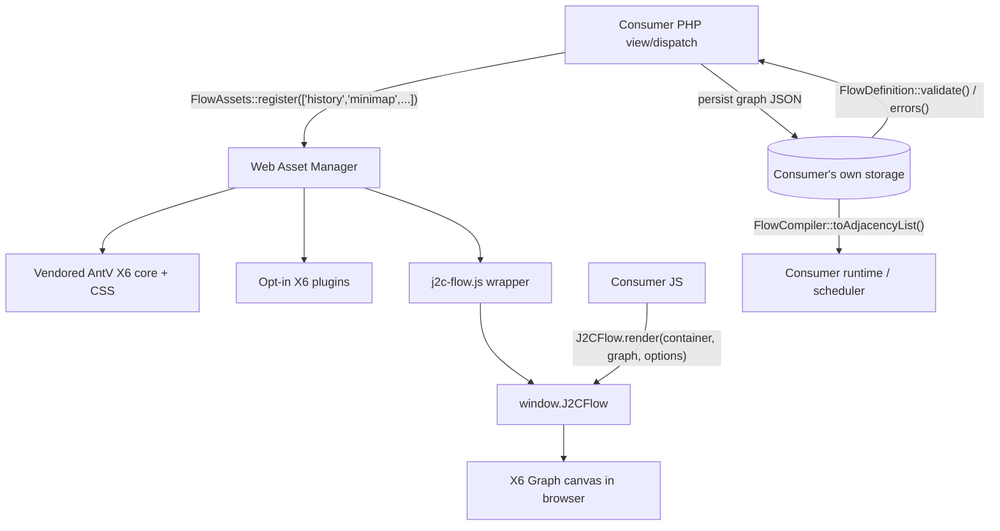

# lib_j2commerceflow — Flow / User-Journey Diagram SDK

`lib_j2commerceflow` is an installable Joomla library that any J2Commerce extension — component, plugin, or module — can use to render a visual flow / user-journey graph editor in the admin. It wraps the vendored [AntV X6](https://x6.antv.antgroup.com/) canvas engine (MIT license, version 2.19.2) behind a small, generic PHP asset loader and a vanilla-JS client API (`window.J2CFlow`).

**Library element:** `j2commerceflow`
**Namespace:** `J2Commerce\Library\Flow`
**Media destination:** `media/lib_j2commerceflow/`
**Current version:** `6.4.0`

The library is domain-agnostic — it knows nothing about products, offers, promotions, or any other J2Commerce concept. It renders a generic node/edge graph and lets the host page decide what each node type means.

---

## When to Use This SDK

Use `lib_j2commerceflow` when your extension's admin screen needs a **branching, node-and-edge diagram** — a marketing automation journey, a conditional-logic builder, an approval workflow, or any other "boxes connected by arrows" UI. The library ships the reference implementation extracted from J2Commerce's own after-sale-offer builder (`app_aftersalespecial`), so the same canvas, styling, and interaction model (drag, click-to-edit, undo/redo, auto-layout) is available to third-party extensions without re-implementing a canvas library integration.

Do **not** use it for simple hierarchical trees, category pickers, or anything that doesn't need free-form node positioning and edge routing — a standard Joomla list/form view is simpler and more accessible for those cases.

---

## Ships With J2Commerce Core

This library ships with J2Commerce 6 as one of the two core libraries in the `com_j2commerce` package (alongside `lib_j2commerce`) and is installed automatically by the component's `postflight()` install script. It is **not** a separate purchase — any J2Commerce 6 installation already has it available. Consumers only need to guard against running on an older core version that predates this library (see [Dependency & Version Gating](#dependency--version-gating) below), not against the library being absent from a fully-updated store.

---

## Architecture



The library has three PHP classes and one JS file:

| Class / File | Role |
|---|---|
| `FlowAssets` | Loads the X6 core engine, the `j2c-flow.js` wrapper, and any opt-in official X6 2.x plugins via the Web Asset Manager. |
| `FlowDefinition` | Structural validation of a graph JSON payload (node/edge shape) before you persist it. |
| `FlowCompiler` | Compiles a graph JSON payload into a simple adjacency list for walking/executing a stored flow. |
| `Version` | Runtime SDK version constant, for consumer version gating. |
| `media/lib_j2commerceflow/js/j2c-flow.js` | The browser-side `window.J2CFlow` API that actually mounts and renders the canvas. |

`FlowDefinition` and `FlowCompiler` are **not** used by J2Commerce's own reference consumer (`app_aftersalespecial`), whose flow is derived from domain rows rather than stored as graph JSON. They exist for future/third-party consumers that want to store and execute a flow as graph-authoritative data (for example, a scheduler-driven marketing-journey runtime).

---

## Dependency & Version Gating

Because `lib_j2commerceflow` installs as part of the `com_j2commerce` package but versions independently per release, a third-party extension that supports multiple J2Commerce versions must guard both **class presence** and **minimum version** before calling into the SDK. Never call `FlowAssets::register()` or reference `J2Commerce\Library\Flow\*` classes unconditionally.

```php
// File: plugins/j2commerce/app_example/src/Extension/AppExample.php

declare(strict_types=1);

namespace J2Commerce\Plugin\J2Commerce\AppExample\Extension;

use J2Commerce\Library\Flow\FlowAssets;
use J2Commerce\Library\Flow\Version as FlowVersion;

final class AppExample
{
    private const MIN_FLOW_VERSION = '6.4.0';

    private function flowSdkAvailable(): bool
    {
        return \class_exists(FlowAssets::class)
            && \version_compare(FlowVersion::VERSION, self::MIN_FLOW_VERSION, '>=');
    }

    public function renderJourneyBuilder(): void
    {
        if (!$this->flowSdkAvailable()) {
            // Graceful degradation — fall back to a plain list/form view, or show
            // an admin notice asking the store owner to update J2Commerce core.
            return;
        }

        FlowAssets::register(['history', 'keyboard']);
    }
}
```

- `class_exists(\J2Commerce\Library\Flow\FlowAssets::class)` confirms the library is installed at all (protects against extensions running on a pre-6.4.0 core that predates the library, or a broken/partial install).
- `\version_compare(\J2Commerce\Library\Flow\Version::VERSION, self::MIN_FLOW_VERSION, '>=')` confirms the installed library is new enough for the API surface your extension relies on (for example, a plugin key added to `FlowAssets::PLUGIN_ALLOWLIST` in a later release).
- On failure, degrade gracefully — do not fatal. Fall back to a simpler admin UI or show an actionable notice.

---

## PHP Side — Loading Assets with `FlowAssets`

`FlowAssets::register()` is the single entry point for loading everything the canvas needs: the vendored X6 engine, its stylesheet, the `j2c-flow.js` wrapper, and any opt-in official X6 2.x plugins. Call it once per flow-shaped admin screen, from your view or dispatch code, before the page renders.

```php
// File: plugins/j2commerce/app_example/src/Extension/AppExample.php

use J2Commerce\Library\Flow\FlowAssets;

FlowAssets::register(['history', 'snapline', 'keyboard', 'minimap']);
```

```php
/**
 * @param string[] $plugins Official X6 2.x plugin names to opt into (see PLUGIN_ALLOWLIST keys).
 *
 * @throws \InvalidArgumentException When a name is not in the allowlist.
 */
public static function register(array $plugins = []): void
```

Calling `register()` with no arguments loads only the core X6 engine and the `j2c-flow.js` wrapper — no optional plugins. `register()` is idempotent per request: calling it multiple times (for example, from both a shared layout and a specific view) only registers the core assets and each requested plugin once.

### Plugin Allowlist

Pass any subset of these keys to `register()`. Passing an unknown name throws `\InvalidArgumentException`.

| Key | Loads | Has its own CSS |
|---|---|---|
| `history` | `x6-plugin-history` — undo/redo stack | No |
| `snapline` | `x6-plugin-snapline` — alignment guides while dragging | Yes |
| `selection` | `x6-plugin-selection` — shift+click / rubberband multi-select | Yes |
| `keyboard` | `x6-plugin-keyboard` — required for Ctrl+Z / Ctrl+Shift+Z bindings | No |
| `minimap` | `x6-plugin-minimap` — canvas minimap, only mounted if you pass `options.minimapContainer` to `render()` | Yes |
| `scroller` | `x6-plugin-scroller` — pan support for large diagrams | Yes |
| `stencil` | `x6-plugin-stencil` — drag-source shape palette | Yes |
| `dnd` | `x6-plugin-dnd` — drag-and-drop node creation | Yes |
| `export` | `x6-plugin-export` — export canvas to image/JSON | No |
| `transform` | `x6-plugin-transform` — resize/rotate handles | Yes |
| `dagre` | `dagre` layout engine (not an X6 plugin) — powers `J2CFlow.tidy()` auto-layout | No |

Each plugin only "wires up" behavior in `j2c-flow.js` if its UMD global is actually present on `window` — `FlowAssets::register()` loading the script is what makes that global exist, so the PHP-side allowlist and the JS-side feature set always stay in sync.

> **Scroller caution:** with the `scroller` plugin mounted, the canvas's drag-clamping (`translating.restrict`) does not track the graph's resize, and drags can snap back unexpectedly. If your screen already scrolls via its own CSS overflow container, do not opt into `scroller`.

### Media Path

Once registered, the library's assets are served from:

```
media/lib_j2commerceflow/js/j2c-flow.js
media/lib_j2commerceflow/js/vendor/x6/x6.min.js
media/lib_j2commerceflow/js/vendor/x6/plugins/*.min.js
media/lib_j2commerceflow/js/vendor/dagre/dagre.min.js
media/lib_j2commerceflow/css/j2c-flow.css
media/lib_j2commerceflow/css/vendor/x6.css
```

You never need to reference these paths directly — `FlowAssets::register()` handles registration and dependency ordering (the X6 core script is a dependency of `j2c-flow.js`) through the Web Asset Manager's `registerAndUseScript`/`registerAndUseStyle`.

`FlowAssets::register()` also loads the library's own language strings (`LIB_J2COMMERCEFLOW_UNDO`, `LIB_J2COMMERCEFLOW_REDO`, `LIB_J2COMMERCEFLOW_TIDY_LAYOUT`) via `Text::script()`, so a consumer's own toolbar template can call `Joomla.Text._('LIB_J2COMMERCEFLOW_UNDO')` etc. without loading the language file itself.

---

## JS Side — Rendering the Canvas

Once `FlowAssets::register()` has run, `window.J2CFlow` is available on the page. Mount the canvas by calling `render()` against a container element and a graph JSON payload.

```php
// File: plugins/j2commerce/app_example/tmpl/journey/edit.php

declare(strict_types=1);

\defined('_JEXEC') or die;
?>
<div id="j2c-flow-canvas" class="j2c-flow-canvas"></div>
```

```javascript
// File: plugins/j2commerce/app_example/media/js/journey-editor.js
'use strict';

document.addEventListener('DOMContentLoaded', () => {
    const container = document.getElementById('j2c-flow-canvas');

    if (!container || !window.J2CFlow) {
        return;
    }

    const graph = {
        nodes: [
            { id: 'trigger-1', type: 'trigger', icon: 'bolt', title: 'Order placed', body: ['Fires when an order is confirmed'] },
            { id: 'offer-1', type: 'offer', icon: 'tag', title: 'Send discount email', body: ['10% off next order'] },
        ],
        edges: [
            { from: 'trigger-1', to: 'offer-1', label: 'Yes', variant: 'yes' },
        ],
    };

    window.J2CFlow.render(container, graph, {
        onNodeClick(nodeId, nodeType) {
            // Open your own edit panel/modal for this node.
        },
        onNodePositionChange(nodeId, x, y) {
            // Persist the node's new x/y via your own save endpoint (fetch/async-await).
        },
        onHistoryChange() {
            // Sync your own undo/redo toolbar button disabled states.
        },
    });
});
```

### `render(containerEl, data, options)`

| Argument | Type | Description |
|---|---|---|
| `containerEl` | `HTMLElement` | The mount point. The first call for a given element clears it and mounts a new X6 `Graph`. Every call (first or later) clears and rebuilds the graph's cells from `data`, reusing the same `Graph` instance so listeners and wired plugins are only set up once. |
| `data` | `object` | The graph JSON payload — see [Graph JSON Schema](#graph-json-schema) below. |
| `options.onNodeClick(nodeId, nodeType)` | `function` | Fires on mouse click and on Enter/Space when a node has keyboard focus. |
| `options.onNodePositionChange(nodeId, x, y)` | `function` | Fires once a drag ends, and once per node after a `J2CFlow.tidy()` call or an undo/redo that replays a position change. |
| `options.onHistoryChange()` | `function` | Fires on every undo/redo-stack change — only emitted when the `history` plugin is loaded. |
| `options.minimapContainer` | `HTMLElement` | Optional. Only honoured on the first `render()` call for a given `containerEl`, and only if the `minimap` plugin is loaded. |

The graph's width is recomputed from the container's actual `clientWidth` on every `render()` call, and each node's rendered height is measured from its real content — neither is a fixed constant, so the canvas adapts to responsive layouts and variable-length node body text.

### Graph JSON Schema

The schema is **frozen** for the fields below (see [Stability Contract](#stability-contract)); newer fields may be added but existing fields will not be renamed or removed.

**Node object** (`data.nodes[]`):

| Field | Type | Required | Description |
|---|---|---|---|
| `id` | `string` | Yes | Unique node identifier. Referenced by edges' `from`/`to`. |
| `type` | `string` | Yes | Your own node-type key (for example `trigger`, `offer`, `terminal`). Drives the CSS class `j2c-flow-node--[type]` and the default icon/height floor, and is passed to `registerStepType()` custom renderers. |
| `icon` | `string` | No | One of `bolt`, `tag`, `circle-check`, `plus`. Falls back to the registered step type's icon, then to `tag`. |
| `title` | `string` | No | Node header text. |
| `body` | `string[]` | No | Array of body lines, each rendered as its own paragraph by the default renderer. |
| `badges` | `array<{text: string, variant: string}>` | No | Small pill badges in the node header. `variant` is one of `secondary` (default), `warning`, `danger`. |
| `x` | `number` | No | Persisted canvas X position. Omit to auto-stack the node in a vertical column on first load. |
| `y` | `number` | No | Persisted canvas Y position. Omit to auto-stack. |
| `locked` | `boolean` | No | Additive/optional. Disables dragging for this one node. |

**Edge object** (`data.edges[]`):

| Field | Type | Required | Description |
|---|---|---|---|
| `from` | `string` | Yes | Source node `id`. |
| `to` | `string` | Yes | Target node `id`. |
| `label` | `string` | No | Text on the pill-style label riding the connector. |
| `style` | `string` | No | `'solid'` (default) or `'dashed'`. |
| `variant` | `string` | No | Additive/optional. `'yes'` (blue pill) or `'no'` (grey pill) — lets you style a branch without keying on the (possibly localized) label text. |

A same-source/same-target pair of edges (a "Yes/No fork" that both advance to the same next node) is automatically drawn as two visually distinct forked lines rather than overlapping.

### Registering Custom Step Types

`registerStepType()` lets a consumer customize how a specific node `type`'s **body** renders, while the header (icon, title, badges) stays generic and consistent across every node type on the canvas.

```javascript
window.J2CFlow.registerStepType({
    type: 'offer',
    icon: 'tag',
    renderCard(bodyEl, node) {
        const p = document.createElement('p');
        p.className = 'j2c-flow-node-line';
        p.textContent = `Discount: ${node.discountPercent}%`;
        bodyEl.append(p);
    },
});
```

`config.type` (`string`) is required; `config.icon` (`string`) and `config.renderCard(bodyEl, node)` are optional. An unregistered node type falls back to the default renderer — one `<p>` per line of `node.body`. `renderCard` receives the live body `<div>` and the full node object, and must build DOM nodes directly (`createElement`/`append`) — never `innerHTML`.

### History (Undo/Redo) and Auto-Layout

These methods are no-ops (or return `false`) until the relevant assets are loaded via `FlowAssets::register()`.

| Method | Requires | Description |
|---|---|---|
| `J2CFlow.hasHistory(containerEl)` | — | `true` once a graph is mounted for `containerEl` **and** the `history` plugin is wired. |
| `J2CFlow.undo(containerEl)` | `history` | Undoes the last change if `canUndo()` is true. |
| `J2CFlow.redo(containerEl)` | `history` | Redoes the last undone change if `canRedo()` is true. |
| `J2CFlow.canUndo(containerEl)` | `history` | Returns `boolean`. |
| `J2CFlow.canRedo(containerEl)` | `history` | Returns `boolean`. |
| `J2CFlow.tidy(containerEl)` | `dagre` | Runs a top-down ranked auto-layout via dagre, repositioning every node and firing `onNodePositionChange` once per node so you can persist the result. No-op if `dagre` isn't loaded or no graph is mounted. |

When the `keyboard` plugin is also loaded alongside `history`, Ctrl+Z / Cmd+Z and Ctrl+Shift+Z / Ctrl+Y / Cmd+Shift+Z are bound automatically. `keyboard` deliberately does **not** bind Delete/Backspace — J2CFlow's cells are ephemeral view state that gets fully rebuilt from your server-confirmed data on every `render()` call, so a client-only cell delete with no save round trip would look like data loss without actually persisting one. Wire your own delete UI/confirmation and re-render from your saved data afterward.

Every `render()` call disables history recording for the duration of that programmatic rebuild — a full data-driven re-render (for example, after your own save completes) is never itself pushed onto the undo stack, so a user's next Ctrl+Z undoes their last drag, not the whole rebuild.

---

## Server-Side Helpers

### `FlowDefinition` — Validate Before You Persist

```php
/** @param array{nodes?: array<int, array<string, mixed>>, edges?: array<int, array<string, mixed>>} $graph */
public static function validate(array $graph): bool

/**
 * @param array{nodes?: array<int, array<string, mixed>>, edges?: array<int, array<string, mixed>>} $graph
 *
 * @return string[]
 */
public static function errors(array $graph): array
```

`validate()` returns `true` only when `errors()` is empty. `errors()` checks:

- `nodes` must be an array; each node requires `id` and `type` (`each node requires id and type` if missing).
- `edges` must be an array (`edges must be an array` if not).
- Each edge requires `from` and `to` (`each edge requires from and to` if missing).
- Every edge's `from`/`to` must reference a node `id` that actually exists in `nodes` (`edge [from]->[to] references an unknown node` if not).

```php
// File: plugins/j2commerce/app_example/src/Model/JourneyModel.php

use J2Commerce\Library\Flow\FlowDefinition;

$graph = \json_decode($input->getRaw('graph', '{}'), true) ?? [];

if (!FlowDefinition::validate($graph)) {
    $this->setError(\implode('; ', FlowDefinition::errors($graph)));

    return false;
}

// Safe to persist $graph.
```

Call `FlowDefinition::validate()`/`errors()` server-side before writing a submitted graph payload to storage — never trust client-side validation alone for data that will later be walked or executed.

### `FlowCompiler` — Walk a Stored Flow

```php
/**
 * @param array{nodes?: array<int, array<string, mixed>>, edges?: array<int, array<string, mixed>>} $graph
 *
 * @return array<string, array<int, string>> node id => outgoing target node ids
 */
public static function toAdjacencyList(array $graph): array
```

```php
use J2Commerce\Library\Flow\FlowCompiler;

$adjacency = FlowCompiler::toAdjacencyList($graph);
// ['trigger-1' => ['offer-1'], 'offer-1' => []]

foreach ($adjacency['trigger-1'] as $nextNodeId) {
    // Walk/execute the next step in your own runtime (e.g. a cron-driven journey scheduler).
}
```

Every node `id` present in `nodes` is guaranteed a key in the returned array (even with an empty array value if it has no outgoing edges), so callers can safely index into the result without an `isset()` check for known node ids.

---

## Complete Minimal Example

**PHP — register assets and emit the container (view template):**

```php
// File: plugins/j2commerce/app_example/tmpl/journey/edit.php

declare(strict_types=1);

\defined('_JEXEC') or die;

use J2Commerce\Library\Flow\FlowAssets;
use J2Commerce\Library\Flow\Version as FlowVersion;

if (!\class_exists(FlowAssets::class) || \version_compare(FlowVersion::VERSION, '6.4.0', '<')) {
    echo '<div class="alert alert-warning">' . \htmlspecialchars('Update J2Commerce core to enable the journey builder.') . '</div>';

    return;
}

FlowAssets::register(['history', 'keyboard']);

$wa = Factory::getApplication()->getDocument()->getWebAssetManager();
$wa->registerAndUseScript('plg_j2commerce_app_example.journey', 'media/plg_j2commerce_app_example/js/journey-editor.js', [], ['defer' => true], ['lib_j2commerceflow.j2c-flow']);
?>
<div id="j2c-flow-canvas" class="j2c-flow-canvas" data-graph="<?php echo htmlspecialchars(json_encode($this->graph), ENT_QUOTES, 'UTF-8'); ?>"></div>
```

**JS — read the graph JSON and mount the canvas:**

```javascript
// File: plugins/j2commerce/app_example/media/js/journey-editor.js
'use strict';

document.addEventListener('DOMContentLoaded', () => {
    const container = document.getElementById('j2c-flow-canvas');

    if (!container || !window.J2CFlow) {
        return;
    }

    const graph = JSON.parse(container.dataset.graph || '{"nodes":[],"edges":[]}');

    window.J2CFlow.render(container, graph, {
        onNodeClick(nodeId) {
            console.log('Selected node', nodeId);
        },
        onNodePositionChange(nodeId, x, y) {
            fetch('index.php?option=com_ajax&group=j2commerce&plugin=example&format=json&task=savePosition', {
                method: 'POST',
                headers: { 'Content-Type': 'application/json' },
                body: JSON.stringify({ nodeId, x, y }),
            });
        },
    });
});
```

**PHP — validate the saved payload before persisting:**

```php
// File: plugins/j2commerce/app_example/src/Model/JourneyModel.php

use J2Commerce\Library\Flow\FlowDefinition;

public function saveGraph(array $graph): bool
{
    if (!FlowDefinition::validate($graph)) {
        $this->setError(\implode('; ', FlowDefinition::errors($graph)));

        return false;
    }

    return $this->getTable()->save(['graph_json' => \json_encode($graph)]);
}
```

---

## Stability Contract

`lib_j2commerceflow`'s public surface is versioned in lockstep with the `com_j2commerce` core package, not independently.

- **Static API.** `FlowAssets::register()`, `FlowDefinition::validate()`/`errors()`, `FlowCompiler::toAdjacencyList()`, and `window.J2CFlow`'s methods are all static/global entry points by design — there is no instance to construct or inject.
- **Frozen, additive-only graph schema.** The node fields (`id`, `type`, `icon`, `title`, `body`, `badges`, `x`, `y`) and edge fields (`from`, `to`, `label`, `style`) documented above will not be renamed or removed. New optional fields (like `node.locked` and `edge.variant`, both already additive extensions to the original contract) may be introduced in future releases without breaking existing consumers.
- **Plugin allowlist can grow, not shrink.** `FlowAssets::PLUGIN_ALLOWLIST` may gain new keys in future releases; existing keys will not be renamed or removed. Guard new-plugin usage with the version check shown in [Dependency & Version Gating](#dependency--version-gating).
- **Version consumers gate on:** `\J2Commerce\Library\Flow\Version::VERSION`, stamped from the core `j2commerce.xml` at package build time.

---

## Related

- [TaxHelper — Public Tax-Calculation API](tax-helper.md)
- [Using Checkout Features in Extensions](using-checkout-features-in-extensions.md)
