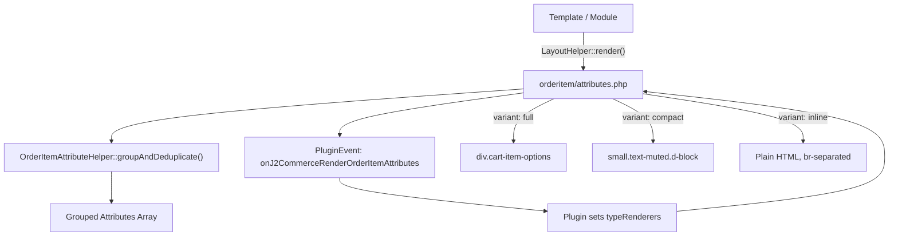

# Order Item Attribute Rendering

J2Commerce stores product option selections (size, color, bundle children, box contents) per order item in the `#__j2commerce_orderitemattributes` table and the `orderitem_attributes` column. A single shared layout renders these attributes consistently across every view. Plugins can override the rendering of specific attribute groups using the `onJ2CommerceRenderOrderItemAttributes` event.

## Architecture Overview



## Shared Layout

**File:** `components/com_j2commerce/layouts/orderitem/attributes.php`

This layout is the single entry point for all attribute rendering in J2Commerce. Every view passes its context and variant to the same file.

| View | Context value | Variant |
|------|--------------|---------|
| Admin order view | `admin_order` | `full` |
| Admin order edit | `admin_edit` | `compact` |
| Cart page | `cart` | `full` |
| Checkout sidecart | `checkout` | `compact` |
| Checkout cart summary | `checkout_summary` | `compact` |
| Confirmation page | `confirmation` | `compact` |
| My Profile order history | `myprofile` | `compact` |
| Advanced cart drawer | `drawer` | `compact` |
| Email templates | `email` | `inline` |

## OrderItemAttributeHelper

**Namespace:** `J2Commerce\Component\J2commerce\Administrator\Helper\OrderItemAttributeHelper`

**File:** `administrator/components/com_j2commerce/src/Helper/OrderItemAttributeHelper.php`

A `final` static utility class. Do not subclass it.

### `parseRawAttributes(string $raw, int $productId = 0): array`

Parses the raw `orderitem_attributes` column into a normalized array of attribute objects. Handles three stored formats transparently:

1. **JSON array** — Written by `CartOrder::saveOrderItems()` in the current format.
2. **Pre-resolved base64** — Used by bundle and box builder products. Contains associative arrays with a `name` key.
3. **Legacy option-ID base64** — Written by J2Store v4. Contains `{optionId => valueId}` maps that are resolved against `#__j2commerce_product_options` and `#__j2commerce_optionvalues`.

```php
use J2Commerce\Component\J2commerce\Administrator\Helper\OrderItemAttributeHelper;

$attributes = OrderItemAttributeHelper::parseRawAttributes(
    $item->orderitem_attributes ?? '',
    (int) $item->product_id
);
// Returns array of stdObject with properties:
//   orderitemattribute_name, orderitemattribute_value, orderitemattribute_type
```

### `groupAndDeduplicate(array $attributes): array`

Groups attributes by type and deduplicates child-product entries by name, summing their quantities. Returns an array of group arrays:

```php
$grouped = OrderItemAttributeHelper::groupAndDeduplicate($attributes);
// [
//     [
//         'type'  => 'product_children',
//         'items' => [
//             ['name' => 'Milk Me Daddy', 'value' => '', 'qty' => 2, 'type' => 'bundleproduct'],
//             ['name' => 'Blonde Bombshell', 'value' => '', 'qty' => 1, 'type' => 'bundleproduct'],
//         ],
//     ],
//     [
//         'type'  => 'standard',
//         'items' => [
//             ['type' => 'select', 'name' => 'Size', 'value' => 'Large'],
//             ['type' => 'radio', 'name' => 'Color', 'value' => 'Red'],
//         ],
//     ],
// ]
```

### `formatForEmail(array $attributes): string`

Returns a plain HTML string with `<br>` separators, suitable for inclusion in email bodies without CSS. Calls `groupAndDeduplicate()` internally.

```php
$html = OrderItemAttributeHelper::formatForEmail($attributes);
// "(2) Milk Me Daddy<br>Blonde Bombshell<br>Size: Large<br>Color: Red"
```

## Attribute Types

| Type | Group | Description |
|------|-------|-------------|
| `select` | `standard` | Dropdown option selection |
| `radio` | `standard` | Radio button option selection |
| `checkbox` | `standard` | Checkbox option selection |
| `text` | `standard` | Free-text option entry |
| `bundleproduct` | `product_children` | Bundle product child item |
| `bundle` | `product_children` | Alias for bundleproduct |
| `boxbuilderproduct` | `product_children` | Box builder child item |
| `boxbuilder` | `product_children` | Alias for boxbuilderproduct |
| `boxbuilder_selections` | *(skipped)* | Internal metadata — never rendered |

## Display Variants

### `full`

Used in the admin order view and the cart page. Wraps each attribute in a flex row:

```html
<div class="cart-item-options">
    <div class="small d-flex align-items-center">
        <div class="item-option item-option-name">Size:</div>
        <div class="item-option item-option-value fw-bold ms-1">Large</div>
    </div>
</div>
```

### `compact`

Used in the sidecart, checkout summary, confirmation page, my profile, and the advanced cart drawer. Each attribute is a truncating inline label:

```html
<small class="text-muted d-block text-truncate">Size: Large</small>
```

### `inline`

Used in email templates. Produces plain HTML with `<br>` separators and no CSS classes, so it renders correctly in email clients.

## Event: `onJ2CommerceRenderOrderItemAttributes`

The layout dispatches this event after calling `groupAndDeduplicate()` and before rendering any output. Plugins respond by setting a `typeRenderers` map on the event object, where each key is a group `type` value and each value is the complete HTML string to render for that group.

### Event Arguments

The event receives four positional arguments (accessed by numeric index):

| Index | Description |
|-------|-------------|
| `0` | The order/cart item object (`$item`) |
| `1` | Grouped attributes array from `groupAndDeduplicate()` |
| `2` | Context string (e.g., `'cart'`, `'admin_order'`, `'drawer'`) |
| `3` | Variant string (`'full'`, `'compact'`, or `'inline'`) |

```php
public function onRenderOrderItemAttributes(PluginEvent $event): void
{
    $item    = $event->getArgument(0);
    $grouped = $event->getArgument(1);
    $context = $event->getArgument(2);
    $variant = $event->getArgument(3);
}
```

### Returning Output

Set the `typeRenderers` argument on the event with an associative array. Each key must match a group `type` from the `$grouped` array. The layout replaces the default rendering for that group with the provided HTML string.

```php
$event->setArgument('typeRenderers', [
    'product_children' => '<ul>...</ul>',
    // 'standard' could also be overridden
]);
```

Only the groups you add to `typeRenderers` are overridden. Groups without a matching key render using the default layout logic.

## Complete Plugin Example

This example shows a plugin that overrides the `product_children` group to render bundle/box-builder child items as a bulleted list.

```php
<?php
// File: plugins/j2commerce/app_mybundlerenderer/src/Extension/AppMybundlerenderer.php

declare(strict_types=1);

namespace J2Commerce\Plugin\J2Commerce\AppMybundlerenderer\Extension;

\defined('_JEXEC') or die;

use J2Commerce\Component\J2commerce\Administrator\Event\PluginEvent;
use Joomla\CMS\Plugin\CMSPlugin;
use Joomla\Event\SubscriberInterface;

final class AppMybundlerenderer extends CMSPlugin implements SubscriberInterface
{
    protected $autoloadLanguage = true;

    public static function getSubscribedEvents(): array
    {
        return [
            'onJ2CommerceRenderOrderItemAttributes' => 'onRenderOrderItemAttributes',
        ];
    }

    public function onRenderOrderItemAttributes(PluginEvent $event): void
    {
        $grouped = $event->getArgument(1);
        $variant = $event->getArgument(3);

        // Find the product_children group
        $childGroup = null;
        foreach ($grouped as $group) {
            if ($group['type'] === 'product_children') {
                $childGroup = $group;
                break;
            }
        }

        if ($childGroup === null) {
            return;
        }

        $html = $this->renderChildList($childGroup['items'], $variant);

        $event->setArgument('typeRenderers', ['product_children' => $html]);
    }

    private function renderChildList(array $items, string $variant): string
    {
        if ($variant === 'inline') {
            $parts = [];
            foreach ($items as $item) {
                $qty   = (int) ($item['qty'] ?? 1);
                $name  = htmlspecialchars($item['name'], ENT_QUOTES, 'UTF-8');
                $parts[] = $qty > 1 ? "({$qty}) {$name}" : $name;
            }
            return implode('<br>', $parts);
        }

        $out = '<ul class="list-unstyled mb-0 small">';
        foreach ($items as $item) {
            $qty  = (int) ($item['qty'] ?? 1);
            $name = htmlspecialchars($item['name'], ENT_QUOTES, 'UTF-8');
            $out .= '<li>';
            if ($qty > 1) {
                $out .= '<span class="badge bg-secondary me-1">' . $qty . '</span>';
            }
            $out .= $name . '</li>';
        }
        $out .= '</ul>';

        return $out;
    }
}
```

The plugin manifest registers it in the `j2commerce` group:

```xml
<!-- File: plugins/j2commerce/app_mybundlerenderer/app_mybundlerenderer.xml -->
<?xml version="1.0" encoding="utf-8"?>
<extension type="plugin" group="j2commerce" method="upgrade">
    <name>PLG_J2COMMERCE_APP_MYBUNDLERENDERER</name>
    <version>1.0.0</version>
    <namespace path="src">J2Commerce\Plugin\J2Commerce\AppMybundlerenderer</namespace>
    <files>
        <folder plugin="app_mybundlerenderer">services</folder>
        <folder>src</folder>
        <folder>language</folder>
    </files>
</extension>
```

## Calling the Layout Directly

Any custom template or module can invoke the shared layout directly:

```php
use Joomla\CMS\Layout\LayoutHelper;

echo LayoutHelper::render(
    'orderitem.attributes',
    [
        'attributes' => $item->orderitemattributes,
        'item'       => $item,
        'context'    => 'my_custom_view',
        'variant'    => 'compact',
    ],
    JPATH_ROOT . '/components/com_j2commerce/layouts'
);
```

`$item->orderitemattributes` must be an array of attribute objects produced by `OrderItemAttributeHelper::parseRawAttributes()`. Raw strings from the database column are not accepted by the layout.

## Template Override

Override the layout via the standard Joomla template override path:

```
templates/{your_template}/html/layouts/com_j2commerce/orderitem/attributes.php
```

The override receives the same `$displayData` array:

```php
$attributes = $displayData['attributes']; // array of stdObject
$item       = $displayData['item'];       // order/cart item object
$context    = $displayData['context'];    // string
$variant    = $displayData['variant'];    // 'full' | 'compact' | 'inline'
```

Call `OrderItemAttributeHelper::groupAndDeduplicate($attributes)` in your override to get the same normalized group structure the default layout uses.

## Related

- [Order Item Attributes Database Table](../../api-reference/database-schema.md)
- [App Plugin Development](../../extensions/plugins/app-plugins.md)
- [Bundle Product Plugin](../../features/products/bundle-products.md)
- [Box Builder Plugin](../../features/products/box-builder.md)
