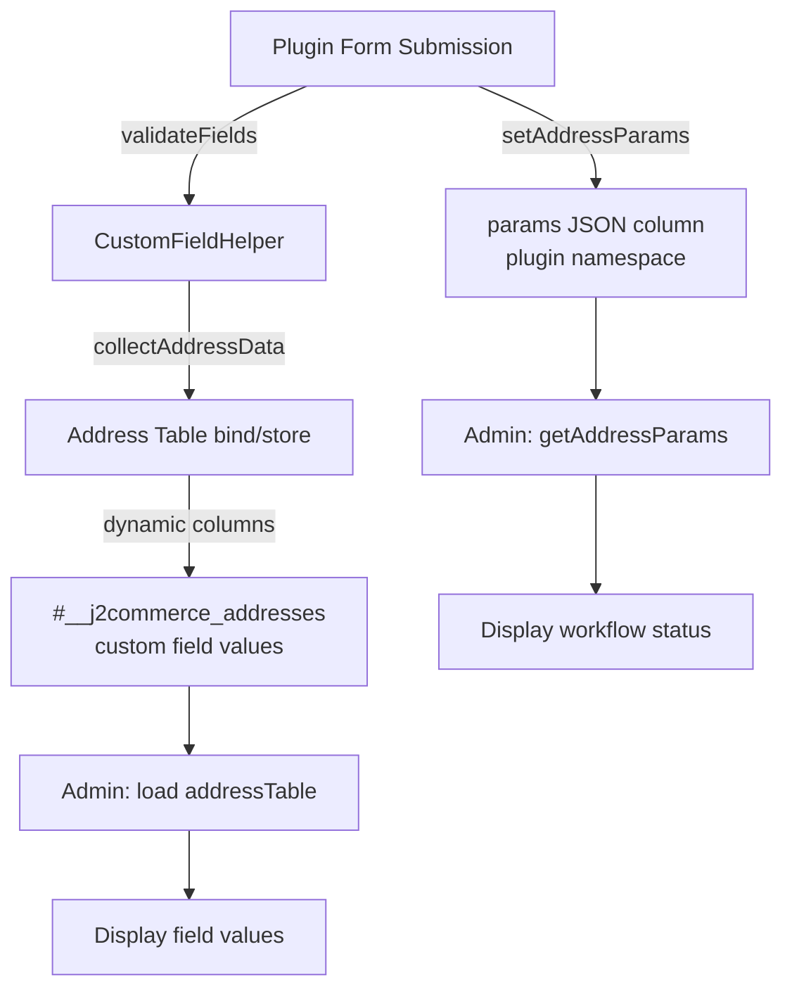

# Storing Plugin Data in Address Records

J2Commerce stores all form data — checkout addresses, plugin application forms, membership submissions — in `#__j2commerce_addresses`. Plugins reuse this table by setting a plugin-specific `type` value (e.g., `type = 'vendor_application'`) and storing custom field values in the dynamic columns the field system creates.

Non-field metadata (workflow status, tier assignments, approval notes) goes into the `params` TEXT column as namespaced JSON. Multiple plugins share the `params` column safely because each plugin writes only to its own top-level key.

## Table Structure

| Column | Type | Plugin Usage |
|---|---|---|
| `j2commerce_address_id` | INT (PK) | Record identifier |
| `user_id` | INT | The Joomla user who submitted the form |
| `type` | VARCHAR | Set to the plugin's area key (e.g., `vendor_application`) |
| `first_name`, `last_name`, `email`, etc. | VARCHAR | Standard address fields — populate from the form if used |
| `[dynamic columns]` | TEXT NULL | One column per custom field, created by `addAddressColumn()` |
| `params` | TEXT | Namespaced JSON — plugin metadata, workflow state, etc. |

## `params` JSON Structure

The `params` column stores a JSON object keyed by plugin element name. Each plugin owns its top-level key:

```json
{
    "app_vendormanagement": {
        "status": "approved",
        "tier_id": 3,
        "tier_name": "Gold Dealer",
        "reviewed_by": 42,
        "reviewed_on": "2026-03-26 14:30:00"
    },
    "app_giftwrapping": {
        "selected_option": "premium_wrap",
        "gift_message": "Happy Birthday!",
        "gift_price": 5.99
    }
}
```

Each plugin only reads and writes its own key. Other plugins' data is preserved on every write.

## Helper Methods

All four methods live on `CustomFieldHelper` and require a `$pluginName` parameter (the plugin element name string) to enforce namespace isolation.

### `getAddressParams(int $addressId, string $pluginName): array`

Reads the `params` column and returns the array stored under `$pluginName`. Returns an empty array if the record does not exist, `params` is empty, or the plugin has no entry.

```php
use J2Commerce\Component\J2commerce\Administrator\Helper\CustomFieldHelper;

$params = CustomFieldHelper::getAddressParams($addressId, 'app_vendormanagement');

$status = $params['status'] ?? 'unknown';
$tierId = (int) ($params['tier_id'] ?? 0);
```

### `setAddressParams(int $addressId, string $pluginName, array $params): void`

Replaces the entire `$pluginName` namespace with `$params`. Other plugins' namespaces are preserved.

```php
CustomFieldHelper::setAddressParams($addressId, 'app_vendormanagement', [
    'status'      => 'pending',
    'tier_id'     => 0,
    'created_on'  => Factory::getDate()->toSql(),
    'created_by'  => $userId,
]);
```

### `mergeAddressParams(int $addressId, string $pluginName, array $merge): void`

Merges `$merge` into the existing `$pluginName` namespace using `array_merge`. Existing keys not in `$merge` are preserved. Other plugins' namespaces are preserved.

```php
// Approve a vendor — preserve existing keys, update status
CustomFieldHelper::mergeAddressParams($addressId, 'app_vendormanagement', [
    'status'      => 'approved',
    'reviewed_by' => Factory::getApplication()->getIdentity()->id,
    'reviewed_on' => Factory::getDate()->toSql(),
]);
```

### `getAllAddressParams(int $addressId): array`

Returns the full decoded `params` array including all plugin namespaces. Use this only when you need to inspect or migrate data across namespaces. Normal read operations should use `getAddressParams()`.

```php
$allParams = CustomFieldHelper::getAllAddressParams($addressId);
// ['app_vendormanagement' => [...], 'app_giftwrapping' => [...]]
```

## Complete Working Example

The following example shows a complete save-and-retrieve cycle for a vendor application form.

### Save — Form Submission Handler

```php
<?php
// File: plugins/j2commerce/app_myplugin/src/Controller/ApplyController.php

declare(strict_types=1);

namespace Acme\Plugin\J2commerce\App_myplugin\Controller;

\defined('_JEXEC') or die;

use J2Commerce\Component\J2commerce\Administrator\Helper\CustomFieldHelper;
use Joomla\CMS\Factory;
use Joomla\CMS\MVC\Controller\BaseController;
use Joomla\CMS\Session\Session;

class ApplyController extends BaseController
{
    public function submit(): void
    {
        Session::checkToken() or die;

        $app      = $this->getApplication();
        $input    = $app->getInput();
        $userId   = $app->getIdentity()->id;
        $formData = $input->get('jform', [], 'array');

        // 1. Validate custom fields
        $fields = CustomFieldHelper::getFieldsByArea('vendor_application');
        $errors = CustomFieldHelper::validateFields($fields, $formData);

        if (!empty($errors)) {
            $app->enqueueMessage(reset($errors), 'error');
            $app->redirect(Route::_('index.php?option=com_j2commerce&view=vendorapply'));
            return;
        }

        // 2. Build address data from submitted fields
        $addressData = CustomFieldHelper::collectAddressData($fields, $formData);
        $addressData['user_id'] = $userId;
        $addressData['type']    = 'vendor_application';

        // 3. Save address record (custom field values go into dynamic columns)
        $mvcFactory   = $app->bootComponent('com_j2commerce')->getMVCFactory();
        $addressTable = $mvcFactory->createTable('Address', 'Administrator');
        $addressTable->bind($addressData);
        $addressTable->check();
        $addressTable->store();
        $addressId = (int) $addressTable->j2commerce_address_id;

        // 4. Save plugin metadata in the namespaced params JSON
        CustomFieldHelper::setAddressParams($addressId, 'app_myplugin', [
            'status'     => 'pending',
            'created_on' => Factory::getDate()->toSql(),
            'created_by' => $userId,
        ]);

        $app->redirect(Route::_('index.php?option=com_j2commerce&view=vendorapply&layout=success'));
    }
}
```

### Retrieve — Admin View

```php
<?php
// File: plugins/j2commerce/app_myplugin/src/View/ApplicationDetail.php

use J2Commerce\Component\J2commerce\Administrator\Helper\CustomFieldHelper;
use Joomla\CMS\Language\Text;

$addressId = (int) $input->getInt('id');

// Load address record — custom field values are properties on the object
$mvcFactory   = $app->bootComponent('com_j2commerce')->getMVCFactory();
$addressTable = $mvcFactory->createTable('Address', 'Administrator');
$addressTable->load($addressId);

// Load custom fields for this area (ordered by plugin area ordering)
$fields = CustomFieldHelper::getFieldsByArea('vendor_application');

// Load plugin-specific metadata
$params = CustomFieldHelper::getAddressParams($addressId, 'app_myplugin');
$status = $params['status'] ?? 'unknown';

// Render field values
echo '<dl class="row">';
foreach ($fields as $field) {
    $label = htmlspecialchars(Text::_($field->field_name), ENT_QUOTES, 'UTF-8');
    $value = htmlspecialchars((string) ($addressTable->{$field->field_namekey} ?? ''), ENT_QUOTES, 'UTF-8');
    echo '<dt class="col-sm-4">' . $label . '</dt>';
    echo '<dd class="col-sm-8">' . ($value !== '' ? $value : '<em class="text-muted">—</em>') . '</dd>';
}
echo '</dl>';
```

### Update — Approve/Reject Action

```php
<?php
// Approve the application — merge into existing params, preserve other keys

CustomFieldHelper::mergeAddressParams($addressId, 'app_myplugin', [
    'status'      => 'approved',
    'reviewed_by' => Factory::getApplication()->getIdentity()->id,
    'reviewed_on' => Factory::getDate()->toSql(),
]);
```

## Data Flow Diagram



## Choosing What Goes Where

| Data | Storage |
|---|---|
| Field values from the form (name, email, company, custom fields) | Dynamic columns via `collectAddressData()` + `store()` |
| Workflow state (status, reviewed_by, approved_on) | `params` JSON via `setAddressParams()` / `mergeAddressParams()` |
| Relational references (tier_id, usergroup_id) | `params` JSON — store the ID, join against your own table in queries |
| Large blobs or aggregated metrics | Dedicated plugin table (`#__j2commerce_pluginname_tablename`) |

## Best Practices

- Use your plugin element name as `$pluginName` exactly as it appears in `#__extensions` (`app_myplugin`, not `App_myplugin`).
- Prefer `mergeAddressParams()` for status updates — it preserves keys you did not intend to change.
- Do not store large arrays (order history lists, file contents) in `params`. Use a dedicated table for relational data.
- `setAddressParams()` is a full replace of your namespace. If another process may write to your namespace concurrently, use `mergeAddressParams()` instead.

## Related

- [Display Areas](display-areas.md) — Register the area so store owners can assign fields to your form
- [Field Ordering](field-ordering.md) — Control which fields appear and in what order
- [Custom Fields Plugin API](index.md) — Overview and architecture
