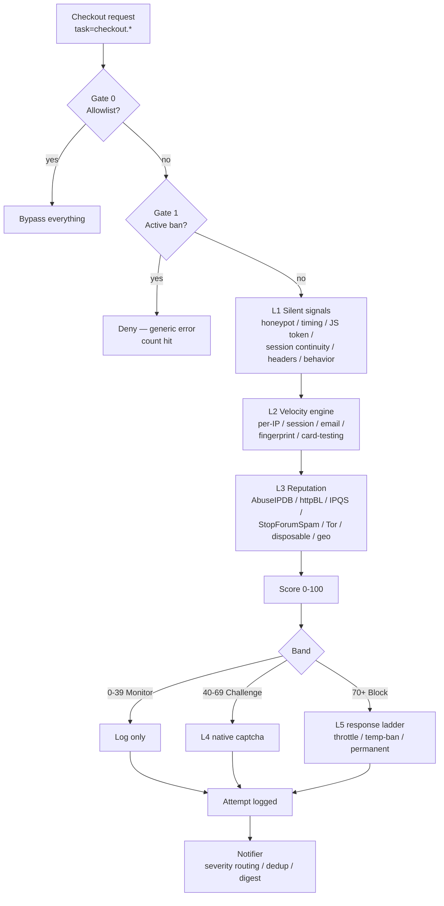

# Checkout Shield

Checkout Shield (`plg_j2commerce_app_checkoutshield`) is a non-core J2Commerce app plugin that runs a layered, score-based risk pipeline against the checkout funnel — honeypots, timing traps, velocity limits, a card-testing signature detector, optional IP/email reputation, native-captcha challenges, and an escalating ban ladder — with its own Analytics-menu dashboard and a companion task plugin (`plg_task_j2commerce_checkoutshield`, group `task`) for scheduled maintenance.

This page documents the plugin's **extensibility surface**: the three events other extensions can subscribe to in order to inject content into the Checkout Shield dashboard, the database schema, the full configuration parameter reference, and the task-plugin routines. It does not re-document the internal detection pipeline (signals, velocity, response ladder) — that is internal to the plugin and not a public API.

## Identity

| | |
|---|---|
| Element (app plugin) | `app_checkoutshield` |
| Element (task plugin) | `j2commerce_checkoutshield` |
| Namespace (app plugin) | `J2Commerce\Plugin\J2Commerce\AppCheckoutshield` |
| Namespace (task plugin) | `J2Commerce\Plugin\Task\J2commerceCheckoutshield` |
| Path (app plugin) | `plugins/j2commerce/app_checkoutshield/` |
| Path (task plugin) | `plugins/task/j2commerce_checkoutshield/` |
| Dependency | `com_j2commerce` (installer script checks for it and refuses to install without it) |

The two plugins are independent Joomla extensions that cooperate at runtime: the task plugin reads the app plugin's own params (`PluginHelper::getPlugin('j2commerce', 'app_checkoutshield')`) and constructs the app plugin's PSR-4 service classes directly (`ListSyncService`, `Notifier`, `CardTestingService`, `GeoService`, `StateStore`) rather than reaching into the running plugin instance. Neither extension owns any core file.

## Architecture



Enforcement is gated by the `mode` param (`monitor` default, `enforce`). In `monitor` mode nothing is ever denied — every request is logged with the action it *would* have taken. The single gating decision (allowlist -> active ban -> lockdown guest block -> velocity cooldown -> block band -> challenge band) is shared between `onAfterRoute` (the earliest possible gate, and the *only* veto path for event-less tasks such as `checkout.confirm` and the AJAX lookups) and the `onJ2CommerceCheckoutValidate*` listeners (which own scoring for tasks that do have a validate event). Every enforcement path is wrapped in try/catch and fails open — a DB, DNS, or HTTP error is logged and the checkout is allowed to continue.

## Dashboard Extensibility Events

The Checkout Shield dashboard (`view=appplugin&plugin=app_checkoutshield&pluginview=dashboard`) dispatches three events that let other plugins inject their own quick-link tiles, widget cards, and KPI tiles — without any core-file coupling. This mirrors the `app_marketplace` filter-style event pattern (`EventHelper::getPayoutDashboardQuickLinks()`). **No other reference dashboard in the codebase (`app_avalaratax` included) exposes injection events like this** — it is unique to Checkout Shield.

All three are dispatched from `CheckoutShieldDashboardHelper` (`src/Helper/CheckoutShieldDashboardHelper.php`), a static, dependency-free helper class — not an MVC model — that never makes a network call. Verified dispatch code:

```php
// File: plugins/j2commerce/app_checkoutshield/src/Helper/CheckoutShieldDashboardHelper.php

public static function dashboardQuickLinks(): array
{
    $links = [];

    try {
        $event = J2CommerceHelper::plugin()->event('CheckoutShieldDashboardQuickLinks', ['links' => &$links]);
        $links = (array) $event->getArgument('links', $links);
    } catch (\Throwable $e) {
        Log::add('dashboardQuickLinks dispatch failed: ' . $e->getMessage(), Log::WARNING, self::LOG_CATEGORY);
    }

    return $links;
}
```

`J2CommerceHelper::plugin()->event()` **prepends `onJ2Commerce`** to the string you pass it — calling `->event('CheckoutShieldDashboardQuickLinks', ...)` dispatches `onJ2CommerceCheckoutShieldDashboardQuickLinks`, which is the event name your listener subscribes to. All three dispatch calls are wrapped in try/catch: a broken or missing listener logs a `WARNING` under the `plg_j2commerce_app_checkoutshield` log category and the dashboard simply renders without that extension's content — a third-party plugin can never break the dashboard page.

:::info Timing
All three events fire once, from `AppCheckoutshield::renderDashboard()`, on a **full page load** of `pluginview=dashboard`. They are **not** re-dispatched by the `dashboard.data` AJAX handler that powers the KPI-band/chart date-filter refresh (`ajaxDashboardData()`) — third-party quick links, widgets, and KPI tiles only update on page reload, not on every date-range change.
:::

### `onJ2CommerceCheckoutShieldDashboardQuickLinks`

Adds tiles to an extra "Extension Links" quick-icon row (rendered only when non-empty, via the core `dashboard.quickicon` layout — the same layout the shield's own Attempts/Blocked IPs/Allowlist/Settings row uses).

| | |
|---|---|
| Argument | `['links' => &$links]` |
| Item shape | `['link', 'image', 'name', 'id'?]` |

```php
// File: plugins/j2commerce/app_example/src/Extension/AppExample.php

declare(strict_types=1);

namespace J2Commerce\Plugin\J2Commerce\AppExample\Extension;

use Joomla\CMS\Language\Text;
use Joomla\CMS\Plugin\CMSPlugin;
use Joomla\Event\Event;
use Joomla\Event\SubscriberInterface;

final class AppExample extends CMSPlugin implements SubscriberInterface
{
    public static function getSubscribedEvents(): array
    {
        return ['onJ2CommerceCheckoutShieldDashboardQuickLinks' => 'onShieldQuickLinks'];
    }

    public function onShieldQuickLinks(Event $event): void
    {
        $links   = (array) $event->getArgument('links', []);
        $links[] = [
            'link'  => 'index.php?option=com_j2commerce&view=appplugin&plugin=app_example&pluginview=report',
            'image' => 'fa-solid fa-chart-column',
            'name'  => Text::_('PLG_J2COMMERCE_APP_EXAMPLE_SHIELD_LINK'),
            'id'    => 'example-shield-link',
        ];
        $event->setArgument('links', $links);
    }
}
```

### `onJ2CommerceCheckoutShieldDashboardWidgets`

Adds a card to the dashboard's data-card grid, after the shield's own "Recent attempts / Top offenders / Top domains / List sync status" cards.

| | |
|---|---|
| Arguments | `['widgets' => &$widgets, 'fromDate' => $fromDate, 'toDate' => $toDate]` |
| Item shape | `['title', 'html', 'col'?]` — `col` defaults to `col-md-6` |
| **Contract** | **The provider MUST pre-escape `html`.** The dashboard template echoes it raw: `<?php echo (string) ($widget['html'] ?? ''); ?>` — this is the one documented spot in Checkout Shield where trusted-provider raw HTML is intentional, on the same trust model as core `pluginWidgets`. |

```php
// File: plugins/j2commerce/app_example/src/Extension/AppExample.php

public static function getSubscribedEvents(): array
{
    return [
        'onJ2CommerceCheckoutShieldDashboardQuickLinks' => 'onShieldQuickLinks',
        'onJ2CommerceCheckoutShieldDashboardWidgets'    => 'onShieldWidgets',
    ];
}

public function onShieldWidgets(Event $event): void
{
    $widgets  = (array) $event->getArgument('widgets', []);
    $fromDate = (string) $event->getArgument('fromDate', '');
    $toDate   = (string) $event->getArgument('toDate', '');

    $flagged = $this->countExampleFlagsInRange($fromDate, $toDate);

    $widgets[] = [
        'title' => Text::_('PLG_J2COMMERCE_APP_EXAMPLE_SHIELD_WIDGET_TITLE'),
        // Contract: pre-escape everything yourself — the shield echoes 'html' RAW.
        'html'  => '<p>' . htmlspecialchars(
            Text::sprintf('PLG_J2COMMERCE_APP_EXAMPLE_SHIELD_WIDGET_BODY', $flagged),
            ENT_QUOTES,
            'UTF-8'
        ) . '</p>',
        'col' => 'col-md-6',
    ];
    $event->setArgument('widgets', $widgets);
}
```

### `onJ2CommerceCheckoutShieldDashboardKpis`

Adds a tile to a second KPI band, rendered below the shield's own six-tile KPI band (same `quickicon`/`alert alert-{accent}` markup), only when at least one listener contributes a tile.

| | |
|---|---|
| Arguments | `['kpis' => &$kpis, 'fromDate' => $fromDate, 'toDate' => $toDate]` |
| Item shape | `['id', 'label', 'value', 'accent', 'change'?]` |
| `accent` values | `success` \| `info` \| `warning` \| `danger` \| `purple` (an invalid value silently falls back to `info` in the template) |

```php
public static function getSubscribedEvents(): array
{
    return ['onJ2CommerceCheckoutShieldDashboardKpis' => 'onShieldKpis'];
}

public function onShieldKpis(Event $event): void
{
    $kpis     = (array) $event->getArgument('kpis', []);
    $fromDate = (string) $event->getArgument('fromDate', '');
    $toDate   = (string) $event->getArgument('toDate', '');

    $kpis[] = [
        'id'     => 'example-flags',
        'label'  => Text::_('PLG_J2COMMERCE_APP_EXAMPLE_SHIELD_KPI_LABEL'),
        'value'  => (string) $this->countExampleFlagsInRange($fromDate, $toDate),
        'accent' => 'info',
        'change' => null,
    ];
    $event->setArgument('kpis', $kpis);
}
```

## Other Events Checkout Shield Subscribes To

Not extensibility hooks — listed for context on how the plugin integrates with J2Commerce core. All handlers are registered in `AppCheckoutshield::getSubscribedEvents()`.

| Event | Priority | Purpose |
|---|---|---|
| `onAfterRoute` (core Joomla) | default | Earliest enforcement gate for `option=com_j2commerce`; the only veto path for event-less tasks. |
| `onJ2CommerceBeforeCheckout` | default | Checkout-only asset hook (WebAssetManager unlocked here) — registers `shield-checkout.js`/css, issues signed tokens via script options, sets the session-continuity marker. |
| `onAfterRender` (core Joomla) | default | Splices the off-screen honeypot input into the checkout page HTML buffer. |
| `onAjaxApp_checkoutshield` (com_ajax, site) | default | Serves challenge state + captcha widget markup to the checkout JS. Guest-accessible by design, CSRF-checked, no personal data, self velocity-limited. |
| `onJ2CommercePostPayment` | `Priority::LOW` | Captures the payment-attempt outcome for the card-testing detector, after payment plugins have populated the event result. |
| `onJ2CommerceAfterPayment` | default | Success-confirmation fallback (rarely fires — `onPostPayment` normally already logs). |
| `onJ2CommerceCheckoutValidateGuest` / `ValidateBilling` / `BeforeCheckoutValidateShipping` / `BeforeCheckoutValidateGuestShipping` | `Priority::HIGH` | Scoring + veto for the checkout steps that have a validate event. |
| `onJ2CommerceRegisterEmailTypes` / `GetEmailTemplateCards` / `GetEmailTemplates` / `ProcessEmailTags` | default | Registers the "Checkout Shield Alert" and "Checkout Shield Digest" email types under **Design → Email Templates** (J2Commerce has no Joomla `MailTemplate` — it rolls its own DB-backed template system). |
| `onJ2CommerceAddDashboardMenuInJ2Commerce` | default | Appends the "Checkout Shield" child under the Analytics menu group — only when the current user passes both `j2commerce.viewreports` and `j2commerce.viewsetup`. |
| `onJ2CommerceAppPluginView` | default | The plugin-owned admin container: routes `pluginview` (dashboard/attempts/blocklist/allowlist) to a render method. |
| `onJ2CommerceAppPluginAjax` | default | All admin AJAX actions (see below) — three-gated: CSRF token, authenticated, `core.admin` on `com_j2commerce`. |
| `onJ2CommerceAfterAdminOrderDetails` | default | Injects the read-only per-order risk card into the admin order view via the `addResult` pattern. |
| `onJ2CommerceGetAnalyticsWidgets` | default | Optional widget on the core Statistics Dashboard (attempts/blocked in range + health badge). |
| `onPrivacyExportRequest` / `onPrivacyRemoveData` (core Joomla) | default | GDPR export/anonymize of the subject's own attempt rows. |

### Admin AJAX actions

`onAppPluginAjax` routes on the `action` GET/POST param (`task=appPlugin.ajax&plugin=app_checkoutshield&action=...`). Every action passes through the same three-gate check before the `match`: CSRF token (`Session::checkToken('request')`), authenticated user (`(int) $user->id !== 0`), and `$user->authorise('core.admin', 'com_j2commerce')`.

| `action` value | Purpose |
|---|---|
| `toggleBlock` | Per-row Attempts Log / Blocked IPs jgrid-style block/unblock toggle. |
| `block` | Bulk-block the stored IPs of selected Attempts Log rows (duration from a toolbar dropdown). |
| `blockManual` | Blocklist "Add Block…" form — blocks a single admin-typed IP. |
| `unblock` | Bulk-unblock selected Blocked IPs rows. |
| `makePermanent` | Promote selected temporary bans to permanent. |
| `allowlistIp` | Allowlist the stored IPs of selected Attempts Log rows. |
| `allowlistAdd` | Allowlist "Add Entry…" form — IP/CIDR/Email/Email domain. |
| `allowlistDelete` | Delete selected Allowlist rows. |
| `lockdown` | Toggle Lockdown Mode (`state=on\|off`). |
| `clearCounters` | Truncates the velocity counters table. |
| `purge` | Purges the entire attempts log. |
| `sendTestAlert` | Sends a test alert through the configured notification channels. |
| `exportCsv` | Streams a formula-injection-guarded CSV export for `attempts`, `blocklist`, or `allowlist`. |
| `dashboard.data` | Refresh payload for the dashboard date-filter (KPIs + charts only — does **not** re-dispatch the three F.1a extensibility events). |

## Database Schema

Eight new tables, all `CREATE TABLE IF NOT EXISTS`, `InnoDB`, `utf8mb4_unicode_ci`, prefixed `#__j2commerce_appcheckoutshield_*`. Shipped via `sql/install.mysql.utf8.sql` / `sql/uninstall.mysql.utf8.sql` / `sql/updates/mysql/`.

### `#__j2commerce_appcheckoutshield_attempts`

The core log — one row per evaluated checkout request. Primary key `id` (`BIGINT UNSIGNED AUTO_INCREMENT`).

| Column | Type | Notes |
|---|---|---|
| `created_on` | `DATETIME` | UTC. |
| `ip` | `VARCHAR(64)` | Raw, hashed, or truncated per the `ip_storage` privacy setting. |
| `country` | `CHAR(2)` | Set only when Geolocation is enabled. |
| `session_hash` | `VARCHAR(64)` | Keyed hash of the checkout session. |
| `fingerprint` | `VARCHAR(64)` | Lightweight, no-canvas composite device hash. |
| `user_id` | `INT UNSIGNED` | 0 for guest. |
| `email_hash` | `VARCHAR(64)` | Keyed hash — never a raw email. |
| `email_domain` | `VARCHAR(190)` | Bare domain only. |
| `task` | `VARCHAR(64)` | e.g. `checkout.confirmPayment`. |
| `signals` | `TEXT` | JSON: triggered signals + values. |
| `score` | `SMALLINT UNSIGNED` | 0-100 composite. |
| `band` | `TINYINT UNSIGNED` | `0` monitor, `1` challenge, `2` block. |
| `action` | `TINYINT UNSIGNED` | `0` logged, `1` would-block, `2` challenged, `3` throttled, `4` blocked, `5` banned. |
| `outcome` | `TINYINT` | Payment rows only: `NULL` n/a, `1` success, `0` declined. |
| `gateway_code` | `VARCHAR(32)` | Best-effort. |
| `amount` | `DECIMAL(15,4)` | |
| `card_hash` | `VARCHAR(64)` | Best-effort BIN+last4 hash when a gateway exposes a short masked fragment — never a full PAN. |
| `user_agent` | `VARCHAR(255)` | |

Indexed on `(ip, created_on)`, `(session_hash, created_on)`, `(fingerprint, created_on)`, `(created_on)`, `(action, created_on)`. Retention: `retention_days` (default 180, purged daily by the task plugin).

### `#__j2commerce_appcheckoutshield_blocklist`

`id INT UNSIGNED AUTO_INCREMENT`. `ip VARCHAR(64)` (raw or SHA-256 hex in hashed-IP mode), `cidr TINYINT UNSIGNED` (prefix length, `NULL` = single IP), `type TINYINT UNSIGNED` (`0` temp / `1` permanent), `reason VARCHAR(255)`, `source TINYINT UNSIGNED` (`0` auto / `1` manual / `2` reputation), `hits INT UNSIGNED`, `ban_count TINYINT UNSIGNED` (escalation level), `created_on DATETIME`, `expires_on DATETIME` (`NULL` = permanent), `created_by INT UNSIGNED`. `UNIQUE (ip, cidr)`.

### `#__j2commerce_appcheckoutshield_allowlist`

`id INT UNSIGNED AUTO_INCREMENT`. `type TINYINT UNSIGNED` (`0` ip / `1` cidr / `2` email / `3` email_domain), `value VARCHAR(190)`, `note VARCHAR(255)`, `created_on DATETIME`, `created_by INT UNSIGNED`. `UNIQUE (type, value)`.

### `#__j2commerce_appcheckoutshield_counters`

The velocity engine's sliding-window store. `id BIGINT UNSIGNED AUTO_INCREMENT`. `counter_key VARCHAR(120)` (e.g. `ip:1.2.3.4:attempts`), `bucket INT UNSIGNED` (unix minute — `0` is a reserved namespace holding a cooldown-expiry unix timestamp in `value`, **not** a count), `value INT UNSIGNED`. `UNIQUE (counter_key, bucket)`.

:::warning
The task plugin's `purgeCounters` routine runs **two separate deletes**: `bucket > 0 AND bucket < minBucket` ages out real sliding-window buckets, and `bucket = 0 AND value < now` ages out expired cooldowns only. An age-based purge that ignored the `bucket = 0` reservation would silently un-throttle active offenders.
:::

### `#__j2commerce_appcheckoutshield_reputation`

The per-IP live-lookup cache — strictly separate from `_iplists` below. `id INT UNSIGNED AUTO_INCREMENT`. `ip VARCHAR(45)`, `provider VARCHAR(32)`, `score SMALLINT`, `flags VARCHAR(190)` (csv: `tor,vpn,proxy,datacenter,abuse`), `checked_on DATETIME`, `expires_on DATETIME`. `UNIQUE (ip)`. Stores raw IPs only — hashed-IP privacy mode disables L3 reputation lookups entirely because this table has nowhere to put a hash.

### `#__j2commerce_appcheckoutshield_iplists`

Bulk lists synced wholesale by the task plugin's `syncLists` routine — never merged into `_reputation`. `id INT UNSIGNED AUTO_INCREMENT`. `list ENUM('tor','sfs')`, `ip VARCHAR(64)`, `cidr VARCHAR(64)`, `synced_on DATETIME`.

### `#__j2commerce_appcheckoutshield_maildomains`

Disposable-email domain list. `id INT UNSIGNED AUTO_INCREMENT`. `domain VARCHAR(190)` (`UNIQUE`), `source TINYINT UNSIGNED` (`0` bundled seed / `1` synced / `2` manual), `created_on DATETIME`.

### `#__j2commerce_appcheckoutshield_state`

Generic key-value store for Lockdown state, spike-detection baselines, sync stamps, and alert dedup counters. `id INT UNSIGNED AUTO_INCREMENT`. `keyname VARCHAR(64)` (`UNIQUE`), `value TEXT` (JSON), `modified_on DATETIME`. Read via `StateStore` (`src/Service/StateStore.php`) — the app plugin and the task plugin both construct their own `StateStore` instance against the same table, so state set by one is visible to the other.

## Configuration Parameter Reference

All fields live on the `app_checkoutshield` plugin's own params (`administrator/components/com_j2commerce/...` never touched — this is entirely the plugin's own manifest XML). Yes/no fields use `type="radio" layout="joomla.form.field.radio.switcher"`; multi-selects use `type="list" multiple="true" layout="joomla.form.field.list-fancy-select"`.

### General

| Param | Type | Default | Notes |
|---|---|---|---|
| `mode` | list | `monitor` | `monitor` \| `enforce`. Master switch. |
| `protect_tasks` | multi-select | all 7 steps | `guest,billing,shipping,payment,confirm,register,ajax_lookups` |

### Signals

| Param | Type | Default |
|---|---|---|
| `honeypot_enable` / `honeypot_weight` | radio / number | 1 / 60 |
| `jstoken_enable` / `jstoken_weight` | radio / number | 1 / 35 |
| `timing_enable` / `timing_min_seconds` / `timing_weight` / `timing_max_minutes` / `timing_stale_weight` | radio / numbers | 1 / 2 / 20 / 30 / 15 |
| `session_enable` / `session_weight` | radio / number | 1 / 25 |
| `header_enable` / `header_weight` | radio / number | 1 / 10 |
| `behavior_enable` / `behavior_weight` | radio / number | 1 / 15 |
| `fingerprint_enable` | radio | 1 |

### Velocity

| Param | Type | Default |
|---|---|---|
| `velocity_enable` | radio | 1 |
| `window_minutes` | number | 10 |
| `guest_ip_limit` / `auth_user_limit` | number | 30 / 60 |
| `session_limit` / `email_limit` / `fingerprint_limit` | number | 15 / 10 / 15 |
| `confirm_ip_limit` | number | 10 |
| `cooldown_multiplier` | number | 3 |
| `velocity_weight_ip` / `_session` / `_email` / `_fingerprint` | number | 30 / 35 / 30 / 35 |

### Card Testing

| Param | Type | Default |
|---|---|---|
| `ct_enable` | radio | 1 |
| `ct_window_minutes` / `ct_max_attempts` | number | 5 / 5 |
| `ct_decline_ratio` / `ct_min_attempts` | number | 0.5 / 5 |
| `ct_distinct_cards` | number | 3 |
| `ct_small_amount` / `ct_small_amount_weight` | number | 5.00 / 10 |
| `ct_weight` | number | 40 |

### IP & Email Reputation

| Param | Type | Default | Notes |
|---|---|---|---|
| `rep_enable` | radio | 0 | Gates AbuseIPDB/httpBL/IPQS only; requires `ip_storage=full`. |
| `rep_cache_hours` | number | 24 | |
| `abuseipdb_key` / `abuseipdb_min_confidence` / `abuseipdb_weight` | text / number | — / 75 / 30 | |
| `httpbl_key` / `httpbl_weight` | text / number | — / 25 | Project Honey Pot. |
| `ipqs_key` / `ipqs_threshold` / `ipqs_weight` | text / number | — / 85 / 30 | |
| `stopforumspam_enable` / `_weight` | radio / number | 1 / 25 | Local match against `_iplists`. |
| `tor_mode` / `tor_weight` | list / number | `score` / 35 | `off` \| `score` \| `block`. |
| `disposable_enable` / `_weight` | radio / number | 1 / 25 | |

### Geolocation

| Param | Type | Default |
|---|---|---|
| `geo_enable` | radio | 0 |
| `maxmind_license_key` | text | — |
| `geo_mode` | list | `blocklisted` (`blocklisted` \| `allowlisted`) |
| `geo_countries` | multi-select | — |
| `geo_action` | list | `score` (`score` \| `challenge` \| `block`) |
| `geo_weight` | number | 25 |
| `asn_enable` / `asn_weight` | radio / number | 0 / 15 |

### Challenge

| Param | Type | Default |
|---|---|---|
| `challenge_captcha` | `type="plugins" folder="captcha"` | site default |
| `challenge_min_score` | number | 40 |
| `challenge_always_steps` | multi-select | none |
| `challenge_pass_ttl` | number (minutes) | 30 |

### Response & Banning

| Param | Type | Default |
|---|---|---|
| `block_min_score` | number | 70 |
| `ban_enable` | radio | 1 |
| `ban_after_blocks` / `ban_window_minutes` | number | 3 / 60 |
| `ban_ladder` | text (csv minutes) | `60,360,1440,10080` |
| `perm_after_bans` | number | 4 |

### Notifications

| Param | Type | Default |
|---|---|---|
| `notify_email_enable` | radio | 1 |
| `notify_recipients` | text | (site mailfrom) |
| `notify_min_severity` | list | `high` |
| `notify_min_score` | number | 40 |
| `notify_cooldown_hours` | number | 6 |
| `spike_multiplier` / `spike_min_attempts` / `decline_spike_ratio` | number | 5 / 10 / 0.5 |
| `digest_mode` | list | `daily` (`off` \| `hourly` \| `daily`) |
| `webhook_url` / `webhook_min_severity` | url / list | — / `critical` |

### Privacy

| Param | Type | Default |
|---|---|---|
| `retention_days` | number | 180 (range 30-365) |
| `ip_storage` | list | `full` (`full` \| `hashed` \| `truncated`) |

### Lockdown

| Param | Type | Default |
|---|---|---|
| `lockdown_force_challenge` | radio | 1 |
| `lockdown_block_guest` | radio | 1 |
| `lockdown_threshold_multiplier` | number | 0.25 |
| `lockdown_auto_expire_hours` | number | 24 (0 = manual only) |

### Advanced

| Param | Type | Default | Notes |
|---|---|---|---|
| `min_log_score` | number | 0 | Payment-outcome rows are **always** logged regardless of this setting — they feed the card-testing detector. |

## Task Plugin Routines

`plugins/task/j2commerce_checkoutshield/src/Extension/Checkoutshield.php` implements `TaskPluginTrait` with a 7-entry `TASKS_MAP`. Every routine returns `Status::OK` on success or `Status::KNOCKOUT` on a caught `\Throwable` — never throws, so a bad run never blocks the next scheduler tick or the checkout path. Routines that need the companion app plugin's params call `PluginHelper::getPlugin('j2commerce', 'app_checkoutshield')` and return `Status::NO_RUN` with a warning log if it isn't installed/enabled.

| Task name | Method | Suggested cadence | Behavior |
|---|---|---|---|
| `checkoutshield.purgeBans` | `purgeBans()` | Hourly | Deletes `_blocklist` rows where `type=0` (temp) and `expires_on` is more than 30 days in the past. |
| `checkoutshield.purgeAttempts` | `purgeAttempts()` | Daily | Deletes `_attempts` rows older than `retention_days` (clamped 30-365), or a per-task `override_retention_days` form field when set. |
| `checkoutshield.purgeCounters` | `purgeCounters()` | Hourly | Two-phase delete: stale `bucket > 0` velocity buckets, and expired `bucket = 0` cooldowns (see the counters-table warning above). |
| `checkoutshield.syncLists` | `syncLists()` | Daily | Calls `ListSyncService::syncDisposableDomains()` / `syncStopForumSpam()` / `syncTor()`, constructed with the bundled seed file at `data/disposable-domains-seed.txt`. |
| `checkoutshield.sendDigest` | `sendDigest()` | Hourly | Calls `Notifier::sendDigest()`, which self-gates on `digest_mode` — safe to schedule hourly regardless of whether the merchant chose hourly or daily. |
| `checkoutshield.recomputeBaseline` | `recomputeBaseline()` | Hourly | Writes trailing 7-day same-hour attempt-volume and decline-rate baselines into `StateStore::KEY_ATTEMPTS_BASELINE` / `KEY_DECLINE_BASELINE`, read by the spike detectors and `CheckoutShieldDashboardHelper::declineRatio()`. |
| `checkoutshield.refreshGeoDb` | `refreshGeoDb()` | Weekly | No-ops (fail-open, `Status::OK`) if `maxmind_license_key` is empty. On download/verify failure, fires a `medium`-severity `geo_db_refresh_failed` Notifier alert and returns `Status::KNOCKOUT`; the existing database (if any) stays in use. |

The task plugin's `geoDataDir()` helper mirrors `AppCheckoutshield::geoDataDir()` **exactly** (`{tmp_path}/plg_j2commerce_app_checkoutshield/geoip`) — both plugins must resolve to the identical server-fixed directory, never a request-derived path.

## Best Practices for Extension Authors

- **Always guard `getArgument()` returns with a cast** (`(array)`, `(string)`) — the shield's own dispatch code does this defensively and your listener should too.
- **Escape everything you put in a `widgets` item's `html` key.** The contract is explicit: the shield template echoes it raw (`echo (string) ($widget['html'] ?? '')`). This is the one place in the whole extension where unescaped output is intentional and documented.
- **Don't assume your listener runs on every dashboard interaction.** The three events fire once per full page load of `pluginview=dashboard`; they are not re-dispatched by the AJAX date-filter refresh.
- **Fail open in your own listener.** Wrap your handler body in try/catch and never let an exception propagate — Checkout Shield's own dispatch already tolerates a broken listener, but a well-behaved third party shouldn't rely on that safety net alone.
- **Never write to the shield's own tables directly.** There is no public data-access API for `_attempts`/`_blocklist`/`_allowlist` beyond the dashboard events — reach for `onJ2CommerceAfterAdminOrderDetails` (per-order data) or the dashboard events (aggregate data) instead.

## Related

- [Dashboard Events](../../features/dashboard-events.md)
- [Dashboard Extensions](../../features/dashboard-extensions.md)
- [Cron Tasks](../../features/cron-tasks.md)
- [Email Type Provider Interface](email-type-provider.md)
