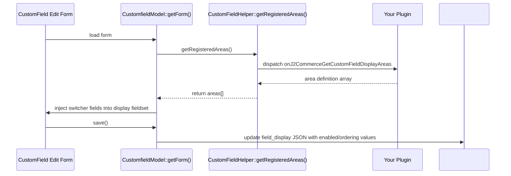

# Registering Display Areas

A display area is a named context in which custom fields can appear. The six core areas (`billing`, `shipping`, `payment`, `register`, `guest`, `guest_shipping`) are built into J2Commerce. The `onJ2CommerceGetCustomFieldDisplayAreas` event lets plugins register additional areas.

Once registered, your area appears as a switcher in the **Display Settings** tab of the custom field edit form. Store owners toggle it on or off per field, just like they do for core checkout areas.

## When to Use

Register a display area when you want store owners to choose which existing custom fields appear in your plugin's form — without code changes. Examples: dealer application form, membership registration, trade account request.

You do not need to register a display area to use core checkout fields programmatically. `CustomFieldHelper::getFieldsByArea('billing')` always works without an event.

## Event Specification

| Property | Value |
|---|---|
| Event name | `onJ2CommerceGetCustomFieldDisplayAreas` |
| Dispatched by | `CustomFieldHelper::getRegisteredAreas()` |
| Argument `0` | `array &$areas` — list of area definition arrays, passed by reference |
| When fired | When the custom field edit form loads (to inject switcher fields) and on save (to sync the JSON) |

### Area Definition Keys

| Key | Required | Description |
|---|---|---|
| `key` | Yes | Unique snake\_case identifier for this area. Used in `field_display` JSON and in `getFieldsByArea()` calls. |
| `label` | Yes | Language key for the switcher label shown in the admin form. |
| `description` | No | Language key for the switcher description (shown as tooltip). |
| `plugin` | No | Plugin element name. Used for display purposes only. |

The `key` must be unique across all plugins. Use your plugin element name as a prefix: `app_myplugin_area_name`.

## How `field_display` JSON Stores Area Mappings

When a store owner enables your area for a field and saves, the core model syncs the switcher state into the `field_display` TEXT column on `#__j2commerce_customfields`:

```json
{
    "vendor_application": {
        "enabled": 1,
        "ordering": 5
    },
    "membership_form": {
        "enabled": 0,
        "ordering": 0
    }
}
```

Each area key maps to an object with:

- `enabled` — `1` if the store owner turned the switcher on, `0` if off
- `ordering` — the field's position in your area's form (managed separately from core `ordering`)

The core `field_display_billing`, `field_display_shipping`, etc. columns are **not touched** by plugin areas.

## Querying Fields for Your Area

Call `CustomFieldHelper::getFieldsByArea()` with your area key. When the key is not one of the six core areas, the helper reads the `field_display` JSON and filters accordingly:

```php
use J2Commerce\Component\J2commerce\Administrator\Helper\CustomFieldHelper;

$fields = CustomFieldHelper::getFieldsByArea('vendor_application');

foreach ($fields as $field) {
    echo CustomFieldHelper::renderField($field);
}
```

Fields are returned sorted by the `ordering` value stored in your area's JSON — independent of the core `ordering` column.

## Complete Working Example

### Plugin Class

```php
<?php
// File: plugins/j2commerce/app_myplugin/src/Extension/MyPlugin.php

declare(strict_types=1);

namespace Acme\Plugin\J2commerce\App_myplugin\Extension;

\defined('_JEXEC') or die;

use Joomla\CMS\Plugin\CMSPlugin;
use Joomla\Event\Event;
use Joomla\Event\SubscriberInterface;

final class MyPlugin extends CMSPlugin implements SubscriberInterface
{
    public $autoloadLanguage = true;

    public static function getSubscribedEvents(): array
    {
        return [
            'onJ2CommerceGetCustomFieldDisplayAreas' => 'onGetCustomFieldDisplayAreas',
        ];
    }

    public function onGetCustomFieldDisplayAreas(Event $event): void
    {
        $areas = &$event->getArgument(0);
        $areas[] = [
            'key'         => 'vendor_application',
            'label'       => 'PLG_J2COMMERCE_APP_MYPLUGIN_AREA_VENDOR_APPLICATION',
            'description' => 'PLG_J2COMMERCE_APP_MYPLUGIN_AREA_VENDOR_APPLICATION_DESC',
            'plugin'      => 'app_myplugin',
        ];
    }
}
```

### Using the Fields in a Frontend Template

```php
<?php
// File: plugins/j2commerce/app_myplugin/tmpl/apply/default.php

use J2Commerce\Component\J2commerce\Administrator\Helper\CustomFieldHelper;

$fields = CustomFieldHelper::getFieldsByArea('vendor_application');
?>
<form method="post" action="<?php echo Route::_('index.php'); ?>">
    <div class="row g-3">
        <?php foreach ($fields as $field) : ?>
            <?php echo CustomFieldHelper::renderField($field); ?>
        <?php endforeach; ?>
    </div>
    <?php echo HTMLHelper::_('form.token'); ?>
</form>
```

### Language Strings

```ini
; File: plugins/j2commerce/app_myplugin/language/en-GB/plg_j2commerce_app_myplugin.ini

PLG_J2COMMERCE_APP_MYPLUGIN_AREA_VENDOR_APPLICATION="Show in Dealer Application"
PLG_J2COMMERCE_APP_MYPLUGIN_AREA_VENDOR_APPLICATION_DESC="Enable this field on the dealer application form."
```

## How the Admin Form Reflects Your Area

After your plugin registers the area, the Custom Field edit form's **Display Settings** tab gains a new switcher row:

```
Display Settings
─────────────────────────────────────────────────
Show in Billing Address        [ No / Yes ]
Show in Shipping Address       [ No / Yes ]
Show in Payment                [ No / Yes ]
Show in Registration           [ No / Yes ]
Show in Guest Checkout         [ No / Yes ]
Show in Dealer Application     [ No / Yes ]   ← injected by your plugin
─────────────────────────────────────────────────
```

The switcher is a standard Joomla radio field using the `joomla.form.field.radio.switcher` layout. It appears in the existing `display` fieldset — no new tab required.

## Internal Flow



## Best Practices

- Use a `key` that starts with your plugin area name to avoid collisions: `vendor_application`, not just `application`.
- Always provide a `description` language key. Store owners need context to know what "Show in Dealer Application" means.
- Call `getFieldsByArea()` with your exact `key` string — it is case-sensitive.
- Plugin areas share the `field_display` JSON column. Do not write to this column directly; use the save flow via the admin form or the [field ordering endpoint](field-ordering.md).

## Related

- [Field Ordering](field-ordering.md) — Manage per-area ordering from your plugin admin view
- [Custom Field Types](custom-field-types.md) — Register new field types for use in your area
- [Address Params](address-params.md) — Store plugin metadata alongside field values
