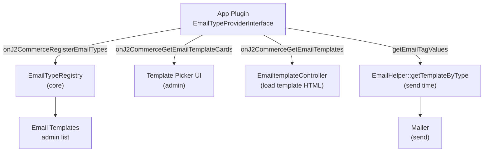

# Email Type Provider Interface

App plugins can register their own email types with J2Commerce's core email template system. Once registered, the email type appears in the **Email Templates** admin UI, its shortcodes appear in the template editor, and emails are sent via `EmailHelper::getTemplateByType()` with full template customisation by the store owner.

The `app_reviews` plugin (version 6.1.0) is the canonical implementation. The patterns shown here come directly from that plugin.

## Architecture



## Interface

```php
// File: administrator/components/com_j2commerce/src/Contract/EmailTypeProviderInterface.php

namespace J2Commerce\Component\J2commerce\Administrator\Contract;

interface EmailTypeProviderInterface
{
    /**
     * Return all email types provided by this plugin.
     * Keyed by type identifier (e.g. 'reviews').
     */
    public function getEmailTypes(): array;

    /**
     * Return true if this plugin handles the given email type.
     */
    public function handlesEmailType(string $emailType): bool;

    /**
     * Return tag name => replacement value pairs for a specific send context.
     * Called by EmailHelper at send time.
     */
    public function getEmailTagValues(string $emailType, string $context, object $data): array;
}
```

## Minimum Viable Implementation

### 1. Declare the interface and subscribe to events

```php
// File: plugins/j2commerce/app_example/src/Extension/AppExample.php

declare(strict_types=1);

namespace MyVendor\Plugin\J2commerce\AppExample\Extension;

use J2Commerce\Component\J2commerce\Administrator\Contract\EmailTypeProviderInterface;
use Joomla\CMS\Plugin\CMSPlugin;
use Joomla\Event\Event;
use Joomla\Event\SubscriberInterface;

final class AppExample extends CMSPlugin implements SubscriberInterface, EmailTypeProviderInterface
{
    public static function getSubscribedEvents(): array
    {
        return [
            'onJ2CommerceRegisterEmailTypes'    => 'onRegisterEmailTypes',
            'onJ2CommerceGetEmailTemplateCards' => 'onGetEmailTemplateCards',
            'onJ2CommerceGetEmailTemplates'     => 'onGetEmailTemplates',
        ];
    }
```

### 2. Register the email type

```php
    public function onRegisterEmailTypes(Event $event): void
    {
        $registry = $event->getArgument('registry');

        $registry->registerType('example', [
            'type'            => 'example',
            'label'           => 'PLG_J2COMMERCE_APP_EXAMPLE_EMAILTYPE_LABEL',
            'description'     => 'PLG_J2COMMERCE_APP_EXAMPLE_EMAILTYPE_DESC',
            'icon'            => 'fa-solid fa-envelope',
            'contexts'        => [
                'example_notification' => 'PLG_J2COMMERCE_APP_EXAMPLE_CONTEXT_NOTIFICATION',
            ],
            'tags'            => $this->getEmailTags(),
            'default_subject' => 'PLG_J2COMMERCE_APP_EXAMPLE_DEFAULT_SUBJECT',
            'default_body'    => 'PLG_J2COMMERCE_APP_EXAMPLE_DEFAULT_BODY',
            'receiver_types'  => ['customer'],
        ]);
    }
```

The `tags` key is an array of tag definitions used to populate the shortcode picker in the editor. See [Tag definition format](#tag-definition-format) below.

### 3. Implement `getEmailTypes` and `handlesEmailType`

These satisfy the `EmailTypeProviderInterface` contract and must match the type string registered in `onRegisterEmailTypes`:

```php
    public function getEmailTypes(): array
    {
        return [
            'example' => [
                'type'           => 'example',
                'label'          => 'PLG_J2COMMERCE_APP_EXAMPLE_EMAILTYPE_LABEL',
                'receiver_types' => ['customer'],
            ],
        ];
    }

    public function handlesEmailType(string $emailType): bool
    {
        return $emailType === 'example';
    }
```

### 4. Supply tag values at send time

This is where shortcodes become actual values. `$data` is the context object your plugin passes when calling the mailer:

```php
    public function getEmailTagValues(string $emailType, string $context, object $data): array
    {
        return [
            'CUSTOMER_NAME' => htmlspecialchars($data->user->name ?? '', ENT_QUOTES, 'UTF-8'),
            'PRODUCT_NAME'  => htmlspecialchars($data->product->title ?? '', ENT_QUOTES, 'UTF-8'),
            'STORE_NAME'    => htmlspecialchars($data->storeName ?? '', ENT_QUOTES, 'UTF-8'),
        ];
    }
```

The keys here must match the tag names registered in `getEmailTags()`. The square-bracket wrapping (`[CUSTOMER_NAME]` → value) is handled by `EmailHelper::getTemplateByType()`.

### 5. Send using EmailHelper

```php
    protected function sendExampleEmail(object $request): bool
    {
        $data      = $this->buildEmailData($request);
        $tagValues = $this->getEmailTagValues('example', 'example_notification', $data);

        $template  = \J2Commerce\Component\J2commerce\Administrator\Helper\EmailHelper::getTemplateByType(
            'example',
            'example_notification'
        );

        if ($template !== null) {
            $subject = $template->subject;
            $body    = $template->body;

            foreach ($tagValues as $tag => $value) {
                $subject = str_replace('[' . $tag . ']', $value, $subject);
                $body    = str_replace('[' . $tag . ']', $value, $body);
            }
        } else {
            // Fallback to plain language string
            $subject = \Joomla\CMS\Language\Text::_('PLG_J2COMMERCE_APP_EXAMPLE_DEFAULT_SUBJECT');
            $body    = \Joomla\CMS\Language\Text::_('PLG_J2COMMERCE_APP_EXAMPLE_DEFAULT_BODY');
        }

        $mailerFactory = \Joomla\CMS\Factory::getContainer()
            ->get(\Joomla\CMS\Mail\MailerFactoryInterface::class);
        $mailer = $mailerFactory->createMailer();
        $config = $this->getApplication()->getConfig();

        $mailer->setSender([$config->get('mailfrom'), $config->get('fromname')]);
        $mailer->addRecipient($data->user->email, $data->user->name);
        $mailer->setSubject($subject);
        $mailer->setBody($body);
        $mailer->isHtml(true);

        return $mailer->Send() === true;
    }
```

## Tag Definition Format

Each entry in the `getEmailTags()` array describes one shortcode:

```php
private function getEmailTags(): array
{
    return [
        'CUSTOMER_NAME' => [
            'label'       => 'PLG_J2COMMERCE_APP_EXAMPLE_TAG_CUSTOMER_NAME',
            'description' => 'PLG_J2COMMERCE_APP_EXAMPLE_TAG_CUSTOMER_NAME_DESC',
            'group'       => 'customer',   // Groups tags in the picker sidebar
        ],
        'PRODUCT_NAME' => [
            'label'       => 'PLG_J2COMMERCE_APP_EXAMPLE_TAG_PRODUCT_NAME',
            'description' => 'PLG_J2COMMERCE_APP_EXAMPLE_TAG_PRODUCT_NAME_DESC',
            'group'       => 'product',
        ],
    ];
}
```

The `group` value controls which collapsible section the tag appears in within the template editor's shortcode panel. Common group names used by J2Commerce: `customer`, `product`, `order`, `store`, `review`.

## Shipping a Bundled HTML Template

Plugins can ship pre-designed HTML files that store owners can load into the editor from the template picker.

### Step 1: Create the HTML file

Place template HTML under the plugin's `tmpl/email/` directory:

```
plugins/j2commerce/app_example/tmpl/email/default.html
```

Use shortcodes directly in the HTML as `[CUSTOMER_NAME]`, `[PRODUCT_NAME]`, etc.

### Step 2: Register a template card

The card appears in the template picker modal when creating or editing an email template:

```php
    public function onGetEmailTemplateCards(Event $event): void
    {
        $cards = $event->getArgument('result', []);

        $cards[] = [
            'type'          => 'example',
            'email_type'    => 'example',
            'context'       => 'example_notification',
            'design'        => 'default',
            'label'         => 'PLG_J2COMMERCE_APP_EXAMPLE_TEMPLATE_DEFAULT',
            'description'   => 'PLG_J2COMMERCE_APP_EXAMPLE_TEMPLATE_DEFAULT_DESC',
            'thumbnail'     => 'media/plg_j2commerce_app_example/images/template_default_thumb.webp',
            'template_file' => JPATH_PLUGINS . '/j2commerce/app_example/tmpl/email/default.html',
        ];

        $event->setArgument('result', $cards);
    }
```

### Step 3: Serve the HTML when the admin loads the card

```php
    public function onGetEmailTemplates(Event $event): void
    {
        $type   = $event->getArgument('type', '');
        $design = $event->getArgument('design', '');

        if ($type !== 'example') {
            return;
        }

        $allowed = ['default'];

        if (!\in_array($design, $allowed, true)) {
            return;
        }

        $filePath = JPATH_PLUGINS . '/j2commerce/app_example/tmpl/email/' . $design . '.html';

        if (!is_file($filePath)) {
            return;
        }

        $result         = $event->getArgument('result', ['body' => null]);
        $result['body'] = file_get_contents($filePath);
        $event->setArgument('result', $result);
    }
```

### The `plg:` prefix in `body_source_file`

When a default email template row is inserted into `#__j2commerce_emailtemplates` with `body_source = 'file'`, the `body_source_file` column can use a plugin-prefixed path to avoid copying the HTML into the component directory:

```
plg:j2commerce.app_example:default.html
```

`EmailHelper::getTemplateFromFile()` resolves this as:

```
JPATH_PLUGINS/j2commerce/app_example/tmpl/email/default.html
```

The format is `plg:[group].[name]:[relative/path.html]`. Without the prefix, the path is resolved under `administrator/components/com_j2commerce/layouts/templates/email/`.

**Insert the default template row in your install SQL:**

```sql
INSERT IGNORE INTO `#__j2commerce_emailtemplates`
  (`email_type`, `context`, `receiver_type`, `orderstatus_id`, `group_id`,
   `paymentmethod`, `subject`, `body`, `body_source`, `body_source_file`,
   `language`, `enabled`, `ordering`)
VALUES
  ('example', 'example_notification', 'customer', '*', '*', '*',
   'Default subject line',
   '', 'file', 'plg:j2commerce.app_example:default.html',
   '*', 1, 1);
```

Using `INSERT IGNORE` makes the statement idempotent — safe to re-run on update without duplicating templates.

## Event Contract Summary

| Event | When fired | Your handler must |
|-------|-----------|-------------------|
| `onJ2CommerceRegisterEmailTypes` | Admin loads Email Templates | Call `$registry->registerType()` with type config |
| `onJ2CommerceGetEmailTemplateCards` | Admin opens template picker | Append card array(s) to `$event->getArgument('result', [])`, then call `$event->setArgument('result', $cards)` |
| `onJ2CommerceGetEmailTemplates` | Admin clicks "Load Template" | Set `$result['body']` to the HTML string, call `$event->setArgument('result', $result)` |

**Important:** `SubscriberInterface` handlers must not return values — the dispatcher discards them. Always use `$event->setArgument('result', ...)` to pass data back.

## The Dead-Shortcode Pitfall

Registering tags in `onRegisterEmailTypes` makes them appear in the editor sidebar, but does **not** make them work in sent emails. Tags are replaced only if `getEmailTagValues()` returns a matching key at send time.

The common mistake:

```php
// Tags visible in editor — but getEmailTagValues() only returns 3 of 20 keys
// Result: 17 shortcodes render as literal "[TAG_NAME]" in the customer's inbox
```

Before version 6.1.0, `app_reviews` had exactly this bug: 20 shortcodes were shown to the admin but only 5 were replaced in the sent email. The fix requires that every tag name in `getEmailTags()` has a matching key in `getEmailTagValues()`.

Check all 20 tags are covered:

```php
// Validate at development time — not in production code
$tags    = array_keys($this->getEmailTags());
$values  = array_keys($this->getEmailTagValues('example', 'example_notification', $dummyData));
$missing = array_diff($tags, $values);
// $missing must be empty
```

## Queue Integration

If your plugin sends emails on a delayed schedule, use `QueueHelper` to avoid blocking the request:

```php
use J2Commerce\Component\J2commerce\Administrator\Helper\QueueHelper;

// Enqueue — returns the new queue_id
$queueId = QueueHelper::enqueue(
    'app_example',            // queue_type  (your plugin's unique identifier)
    (string) $requestId,      // relation_id (FK to your domain table)
    ['request_id' => $requestId, 'product_id' => $productId],
    'example_notification',   // item_type
    0,                        // priority (0 = normal)
    5                         // max_attempts
);
```

Subscribe to `onQueueProcess` and check `$item->queue_type`:

```php
public function onQueueProcess(Event $event): void
{
    $item = $event->getArgument('item', null);

    if (!$item || ($item->queue_type ?? '') !== 'app_example') {
        return;
    }

    $data = json_decode($item->queue_data, true);
    // ... load domain data, call sendExampleEmail(), then:

    if ($success) {
        QueueHelper::complete((int) $item->j2commerce_queue_id);
    } else {
        QueueHelper::fail((int) $item->j2commerce_queue_id, 'Email send failed');
    }
}
```

`QueueHelper::fail()` applies exponential backoff (2^n minutes, capped at 24 hours) and marks the item as `dead` when `max_attempts` is exceeded. Failed items are visible in the J2Commerce admin queue view at **J2Commerce** -> **Configuration** -> **Queues**.

## Related

- [App Reviews — User Guide](../../../docs-v6/apps-and-extensions/apps/app-reviews.md)
- [Payment Plugin Development](../payment/payment-plugin-development.md)
