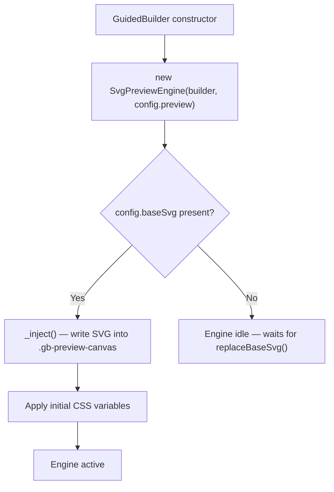
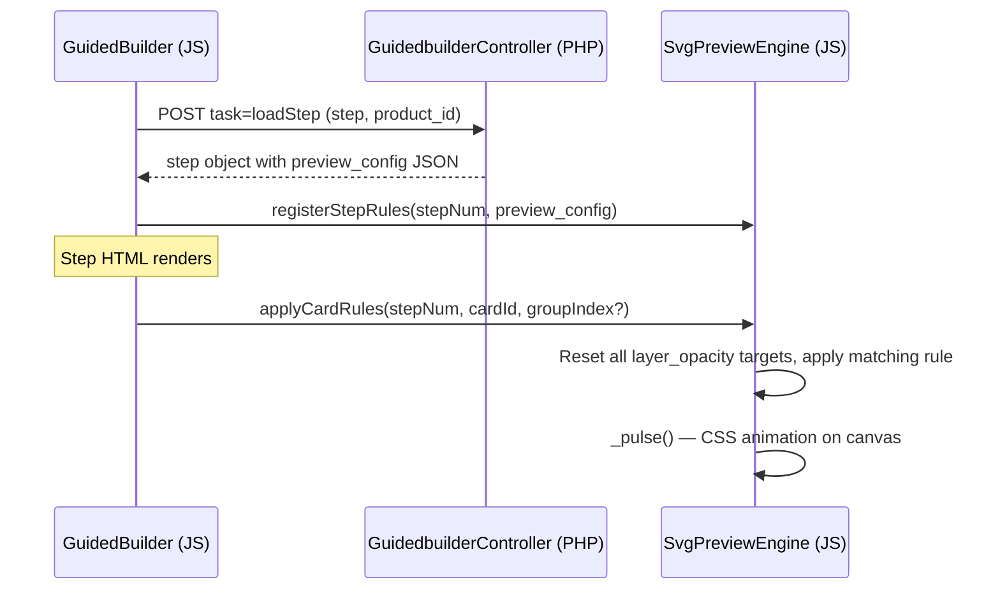

# Guided Builder SVG Preview: Recipe System

The Guided Builder app plugin supports an interactive SVG preview system that updates a product illustration in real time as a customer makes selections. Glass type switches, hardware finishes change color, dimensions resize — all without a page reload.

This guide teaches you how to design an SVG, write `preview_config` rules for each step, and wire everything together. The Custom Shower Door configurator is the running reference implementation throughout.

---

## Architecture

### Initialization

`SvgPreviewEngine` is always constructed when a `GuidedBuilder` instance starts. It becomes active once a base SVG exists:



The `baseSvg` value comes from a product parameter named `gb_base_svg`, set in the J2Commerce product edit form. If the product has no base SVG configured but a card on Step 1 uses `image_type: svg`, clicking that card calls `replaceBaseSvg()` and activates the engine.

### Request / Render Flow

When a step loads via AJAX, the controller returns `preview_config` as part of the step object. `GuidedBuilder.loadStep()` calls `registerStepRules()` immediately — before the step HTML is rendered. Rule lookup is instant on card click.



For slider steps, `selectBuilderSliderOption()` collects all slider values in the step then calls `applySliderRules(stepNum, sliderValues)`.

### How Rules Are Stored

Rules live in the `preview_config` column of `#__j2commerce_appguidedbuilder_steps`. The value is a JSON object:

```json
{
  "rules": [
    { ...rule1... },
    { ...rule2... }
  ]
}
```

The admin save behavior (`Guidedbuilder.php` behavior) writes this column. If no `preview_rules` array is submitted from the form, the behavior **preserves the existing value** — it does a read-before-write to avoid wiping rules that were set directly in the database or via a future rules UI.

---

## Creating Your SVG

### Recommended viewBox

The reference shower door uses `viewBox="0 0 340 480"`. Choose a viewBox that gives enough canvas for labels, dimension arrows, and generous interior spacing. Avoid very wide aspect ratios — the preview canvas uses `aspect-ratio` CSS so the SVG fills the area proportionally.

### Required Element IDs

Elements controlled by rules must have stable `id` attributes. The engine uses `svg.querySelector('#' + CSS.escape(id))` — so IDs must be valid CSS identifiers (no spaces, no leading digits, no special characters except hyphens and underscores).

```xml
<!-- Good IDs -->
<g id="glass-fill-clear" .../>
<rect id="door-panel" .../>
<text id="previewWidthLabel" .../>

<!-- Avoid — CSS.escape handles these but they're fragile -->
<g id="1glass" .../>
<g id="glass fill" .../>
```

### Layered Opacity Approach for Material Options

For mutually exclusive visual states (glass types, material colors), stack elements on top of each other at the same coordinates. Set all to `opacity="0"` except the default state. Rules then toggle them by setting `opacity` to `1` or `0`.

```xml
<!-- Clear glass — default visible -->
<rect id="glass-fill-clear"
      x="52" y="48" width="236" height="382"
      fill="url(#glass-clear-grad)"
      opacity="1"/>

<!-- Frosted — hidden by default -->
<rect id="glass-fill-frosted"
      x="52" y="48" width="236" height="382"
      fill="rgba(230,235,245,0.85)"
      opacity="0"/>

<!-- Rain — hidden by default -->
<rect id="glass-fill-rain"
      x="52" y="48" width="236" height="382"
      fill="rgba(160,200,235,0.45)"
      opacity="0"/>
```

The engine resets all `layer_opacity` targets to their `reset_value` before activating the selected card's rules. This means every rule in a step shares responsibility for restoring the "off" state.

### CSS Variables for Color Properties

Hardware finishes affect many elements simultaneously. Use a CSS custom property on the SVG root so a single JS `setProperty` call changes all hardware color at once.

```xml
<svg xmlns="http://www.w3.org/2000/svg" viewBox="0 0 340 480">
  <defs>
    <style>
      :root {
        --gb-hardware-fill: #2D2D2D;
      }
    </style>
  </defs>

  <!-- All hardware elements reference the variable -->
  <rect id="hwTopChannel" ... fill="var(--gb-hardware-fill)"/>
  <rect id="hwBottomChannel" ... fill="var(--gb-hardware-fill)"/>
  <g id="hwHingeGroup" fill="var(--gb-hardware-fill)">...</g>
</svg>
```

When the engine applies a `css_variable` rule it calls `svg.style.setProperty('--gb-hardware-fill', '#C0C0C0')`. Because the property is set on the `<svg>` element (not `:root`), it scopes to this SVG instance only — important when multiple configurators appear on one page.

The engine also has automatic label contrast: if the CSS variable value is a valid hex color, it looks for an element matching `#hwFinishLabel, #hwFinishText, [id*="FinishLabel"], [id*="FinishText"]` and sets its `fill` to black or white based on luminance.

### `display` Attribute for Mutually Exclusive Components

For elements that are structurally different (not just colored differently), use `display="none"` / `display=""` via `group_toggle` rules. This is the correct approach for handle styles — a knob is geometrically different from a C-pull bar.

```xml
<!-- C-Pull handle — shown by default -->
<g id="hwHandleCPull">
  <rect x="264" y="200" width="12" height="80" fill="var(--gb-hardware-fill)" rx="6"/>
</g>

<!-- Knob — hidden by default -->
<g id="hwHandleKnob" display="none">
  <circle cx="272" cy="240" r="14" fill="var(--gb-hardware-fill)"/>
</g>

<!-- Ladder pull — hidden by default -->
<g id="hwHandleLadder" display="none">
  <rect x="258" y="185" width="8" height="110" fill="var(--gb-hardware-fill)" rx="4"/>
  <rect x="278" y="185" width="8" height="110" fill="var(--gb-hardware-fill)" rx="4"/>
</g>
```

### Door Panel Border for Visibility

The glass panel base `rect` should have a visible stroke so the door outline is always clear regardless of glass type:

```xml
<rect id="door-panel"
      x="52" y="48" width="236" height="382" rx="2"
      fill="rgba(240,244,247,0.3)"
      stroke="#7BA3C9"
      stroke-width="2"/>
```

### Smooth Transitions

The `_inject()` method inserts a `<style>` element into the SVG with:

```css
* { transition: opacity 300ms ease, fill 300ms ease; }
```

This gives all opacity and fill changes a smooth 300ms animation automatically. You do not need to add transitions manually.

### Dimension Annotations

Use `<text>` elements with stable IDs for dimension labels, and `<line>` / `<polygon>` elements for dimension arrows. Keep labels outside the glass area so they remain readable regardless of glass type.

```xml
<g id="widthDimension">
  <line x1="52" y1="20" x2="288" y2="20" stroke="#94A3B8" stroke-width="1" stroke-dasharray="3,3"/>
  <polygon points="52,17 52,23 46,20" fill="#94A3B8"/>
  <polygon points="288,17 288,23 294,20" fill="#94A3B8"/>
  <text id="previewWidthLabel" x="170" y="16"
        text-anchor="middle"
        font-family="system-ui, sans-serif"
        font-size="11"
        fill="#64748B">36" W</text>
</g>
```

---

## The 5 Rule Types

### 1. `layer_opacity`

Toggles the opacity of a stacked SVG element. Used for glass types, material overlays, and any other situation where multiple visual states share the same geometry.

**JSON schema:**

```json
{
  "type": "layer_opacity",
  "trigger": { "card_id": "card_1" },
  "target": "glass-fill-frosted",
  "value": 1,
  "reset_value": 0
}
```

| Field | Required | Description |
|-------|----------|-------------|
| `type` | yes | `"layer_opacity"` |
| `trigger.card_id` | yes | The card ID that activates this rule (e.g., `"card_1"`, `"card_2"`) |
| `target` | yes | The SVG element `id` to manipulate |
| `value` | yes | Opacity to set when this card is selected (typically `1`) |
| `reset_value` | yes | Opacity to restore before applying new selections (typically `0`) |

**How it works:** When `applyCardRules()` is called, the engine first loops all `layer_opacity` rules in the step and sets every target to its `reset_value`. It then loops again and applies only the rules whose `trigger.card_id` matches the selected card. This guarantees a clean state before each selection.

**Shower door — Clear Glass (card_1) example:**

```json
{
  "rules": [
    {
      "type": "layer_opacity",
      "trigger": { "card_id": "card_1" },
      "target": "glass-fill-clear",
      "value": 1,
      "reset_value": 0
    },
    {
      "type": "layer_opacity",
      "trigger": { "card_id": "card_1" },
      "target": "glass-highlight",
      "value": 1,
      "reset_value": 0
    },
    {
      "type": "layer_opacity",
      "trigger": { "card_id": "card_1" },
      "target": "tile-grid",
      "value": 0.06,
      "reset_value": 0
    },
    {
      "type": "layer_opacity",
      "trigger": { "card_id": "card_2" },
      "target": "glass-fill-frosted",
      "value": 1,
      "reset_value": 0
    },
    {
      "type": "layer_opacity",
      "trigger": { "card_id": "card_2" },
      "target": "glass-fill-frosted-texture",
      "value": 1,
      "reset_value": 0
    },
    {
      "type": "layer_opacity",
      "trigger": { "card_id": "card_3" },
      "target": "glass-fill-rain",
      "value": 1,
      "reset_value": 0
    },
    {
      "type": "layer_opacity",
      "trigger": { "card_id": "card_3" },
      "target": "glass-fill-rain-pattern",
      "value": 1,
      "reset_value": 0
    },
    {
      "type": "layer_opacity",
      "trigger": { "card_id": "card_4" },
      "target": "glass-fill-bronze",
      "value": 1,
      "reset_value": 0
    },
    {
      "type": "layer_opacity",
      "trigger": { "card_id": "card_4" },
      "target": "glass-highlight",
      "value": 0.6,
      "reset_value": 0
    }
  ]
}
```

Note that `glass-highlight` appears in both `card_1` (opacity 1) and `card_4` (opacity 0.6). Its `reset_value: 0` applies before every selection, so the correct value is always set.

---

### 2. `css_variable`

Sets a CSS custom property on the SVG root element. Used when many SVG elements share a single color property — hardware finishes being the canonical example.

**JSON schema:**

```json
{
  "type": "css_variable",
  "trigger": { "card_id": "card_1" },
  "target": "--gb-hardware-fill",
  "value": "#C0C0C0"
}
```

| Field | Required | Description |
|-------|----------|-------------|
| `type` | yes | `"css_variable"` |
| `trigger.card_id` | yes | The card ID that activates this rule |
| `target` | yes | CSS variable name — with or without the `--` prefix (engine adds it if missing) |
| `value` | yes | The value to set (hex color, named color, any valid CSS value) |

There is no `reset_value` for CSS variables — setting a new value overwrites the previous one, so ordering within the rules array handles the "previous state" automatically.

**Shower door — Hardware Finish examples:**

```json
{
  "rules": [
    {
      "type": "css_variable",
      "trigger": { "card_id": "card_1" },
      "target": "--gb-hardware-fill",
      "value": "#C0C0C0"
    },
    {
      "type": "css_variable",
      "trigger": { "card_id": "card_2" },
      "target": "--gb-hardware-fill",
      "value": "#B0B0A8"
    },
    {
      "type": "css_variable",
      "trigger": { "card_id": "card_3" },
      "target": "--gb-hardware-fill",
      "value": "#2D2D2D"
    },
    {
      "type": "css_variable",
      "trigger": { "card_id": "card_4" },
      "target": "--gb-hardware-fill",
      "value": "#DDB860"
    },
    {
      "type": "css_variable",
      "trigger": { "card_id": "card_5" },
      "target": "--gb-hardware-fill",
      "value": "#4A3728"
    }
  ]
}
```

---

### 3. `dimension_scale`

Resizes an SVG element by mapping a real-world measurement (inches, cm) to an SVG coordinate range. Driven by `builder_slider` steps, not card clicks.

**JSON schema:**

```json
{
  "type": "dimension_scale",
  "trigger": { "slider_id": "slider_1" },
  "target": "door-panel",
  "attribute": "width",
  "real_min": 24,
  "real_max": 60,
  "svg_min": 100,
  "svg_max": 260,
  "anchor": "center",
  "anchor_pos": 170,
  "sync_targets": ["glass-fill-clear", "glass-fill-frosted", "glass-fill-rain", "glass-fill-bronze"],
  "label_target": "previewWidthLabel",
  "label_template": "{value}\" W"
}
```

| Field | Required | Description |
|-------|----------|-------------|
| `type` | yes | `"dimension_scale"` |
| `trigger.slider_id` | yes | Matches `id` from the step's `sliders` array (e.g., `"slider_1"`) |
| `target` | yes | Primary SVG element `id` to resize |
| `attribute` | yes | SVG attribute to set — `"width"` or `"height"` |
| `real_min` | yes | Minimum real-world value (customer input) |
| `real_max` | yes | Maximum real-world value (customer input) |
| `svg_min` | yes | SVG units at `real_min` |
| `svg_max` | yes | SVG units at `real_max` |
| `anchor` | no | `"center"` (default) or `"bottom"` — how position adjusts as size changes |
| `anchor_pos` | no | Fixed axis position in SVG units (center of element in `"center"` mode) |
| `sync_targets` | no | Additional element IDs to resize the same way (glass fill layers on top of door-panel) |
| `label_target` | no | Text element ID to update with the current value |
| `label_template` | no | Template string — `{value}` is replaced with the raw input value |

**How the mapping works:**

```
ratio = clamp((rawValue - real_min) / (real_max - real_min), 0, 1)
svgValue = svg_min + ratio * (svg_max - svg_min)
```

For `anchor: "center"` the element's position attribute (`x` for width, `y` for height) is set to `anchor_pos - svgValue / 2`.

**Shower door — Dimensions step example:**

```json
{
  "rules": [
    {
      "type": "dimension_scale",
      "trigger": { "slider_id": "slider_1" },
      "target": "door-panel",
      "attribute": "width",
      "real_min": 24,
      "real_max": 60,
      "svg_min": 100,
      "svg_max": 260,
      "anchor": "center",
      "anchor_pos": 170,
      "sync_targets": [
        "glass-fill-clear",
        "glass-fill-frosted",
        "glass-fill-frosted-texture",
        "glass-fill-rain",
        "glass-fill-rain-pattern",
        "glass-fill-bronze"
      ],
      "label_target": "previewWidthLabel",
      "label_template": "{value}\" W"
    },
    {
      "type": "dimension_scale",
      "trigger": { "slider_id": "slider_2" },
      "target": "door-panel",
      "attribute": "height",
      "real_min": 60,
      "real_max": 96,
      "svg_min": 200,
      "svg_max": 400,
      "anchor": "bottom",
      "anchor_pos": 430,
      "sync_targets": [
        "glass-fill-clear",
        "glass-fill-frosted",
        "glass-fill-frosted-texture",
        "glass-fill-rain",
        "glass-fill-rain-pattern",
        "glass-fill-bronze"
      ],
      "label_target": "previewHeightLabel",
      "label_template": "{value}\" H"
    }
  ]
}
```

---

### 4. `group_toggle`

Shows one group of SVG elements and hides others. Used for mutually exclusive component shapes — handle styles, frame profiles, door configurations.

**JSON schema (show/hide arrays):**

```json
{
  "type": "group_toggle",
  "trigger": { "card_id": "card_1" },
  "show": ["hwHandleCPull"],
  "hide": ["hwHandleKnob", "hwHandleLadder"]
}
```

**JSON schema (legacy single target):**

```json
{
  "type": "group_toggle",
  "trigger": { "card_id": "card_1" },
  "target": "hwHandleCPull",
  "hide_ids": ["hwHandleKnob", "hwHandleLadder"]
}
```

Both formats are supported. The `show`/`hide` array format is preferred for clarity.

| Field | Required | Description |
|-------|----------|-------------|
| `type` | yes | `"group_toggle"` |
| `trigger.card_id` | yes | The card ID that activates this rule |
| `show` | yes (or `target`) | Array of element IDs to show (`display` set to `""`) |
| `hide` | yes (or `hide_ids`) | Array of element IDs to hide (`display` set to `"none"`) |

**Shower door — Handle Style examples:**

```json
{
  "rules": [
    {
      "type": "group_toggle",
      "trigger": { "card_id": "card_1" },
      "show": ["hwHandleCPull"],
      "hide": ["hwHandleKnob", "hwHandleLadder"]
    },
    {
      "type": "group_toggle",
      "trigger": { "card_id": "card_2" },
      "show": ["hwHandleKnob"],
      "hide": ["hwHandleCPull", "hwHandleLadder"]
    },
    {
      "type": "group_toggle",
      "trigger": { "card_id": "card_3" },
      "show": ["hwHandleLadder"],
      "hide": ["hwHandleCPull", "hwHandleKnob"]
    }
  ]
}
```

---

### 5. `text_update`

Updates the text content of an SVG `<text>` element. Primarily used in combination with `dimension_scale` (the `label_target` / `label_template` shorthand on dimension rules) but also available as a standalone rule for static label changes on card selection.

**JSON schema:**

```json
{
  "type": "text_update",
  "trigger": { "slider_id": "slider_1" },
  "target": "previewWidthLabel",
  "template": "{value}\" W",
  "unit": "in"
}
```

| Field | Required | Description |
|-------|----------|-------------|
| `type` | yes | `"text_update"` |
| `trigger.slider_id` | slider | Slider ID — the rule receives the slider's raw value |
| `trigger.card_id` | card | Card ID — for static text changes on selection |
| `target` | yes | SVG `<text>` element `id` |
| `template` | no | Template string. `{value}` replaced with slider value, `{unit}` replaced with `unit` field |
| `unit` | no | Unit string appended via `{unit}` in template |
| `value` | no | Static string to set (used for card-triggered text updates) |

Note: When using `dimension_scale` with `label_target` and `label_template`, a separate `text_update` rule is unnecessary — the dimension rule handles the label internally. Use a standalone `text_update` when you need text to change on a card click.

---

## Multi-Group Steps

A multi-group step has several option groups on the same step — for example, Step 4 Hardware has a Finish group and a Handle Style group. Each group is a row in `#__j2commerce_appguidedbuilder_step_groups` linked to the parent step.

### How `group_index` Works

When a step has groups, the `GuidedbuilderController` returns a `groups` array alongside the `step` object. Each group has an index (0, 1, 2, ...) based on its `ordering` in the database.

When a builder card is clicked inside a group, `selectBuilderCard()` reads `card.closest('.gb-group[data-group-index]')` to get the `groupIndex`. It then calls:

```javascript
this.preview.svgEngine.applyCardRules(stepNum, String(cardId), groupIndex);
```

Inside `applyCardRules()`, rules are filtered by `group_index` before being applied:

```javascript
const ruleGroup = t.group_index ?? 0;
return ruleGroup === groupIndex;
```

Rules without a `group_index` field default to group index 0.

### The Card ID Collision Problem

Builder cards always get IDs like `card_1`, `card_2`, etc. — sequentially within each group. If Step 4 has two groups (Finish with 5 cards, Handle with 3 cards), both groups have a `card_1`, `card_2`, and `card_3`.

Without `group_index` filtering, selecting the first Handle card (`card_1`) in group index 1 would also fire rules for the first Finish card (`card_1`) in group index 0.

The solution: add `group_index` to every trigger in a multi-group step's `preview_config`.

```json
{
  "rules": [
    {
      "type": "css_variable",
      "trigger": { "card_id": "card_1", "group_index": 0 },
      "target": "--gb-hardware-fill",
      "value": "#C0C0C0"
    },
    {
      "type": "group_toggle",
      "trigger": { "card_id": "card_1", "group_index": 1 },
      "show": ["hwHandleCPull"],
      "hide": ["hwHandleKnob", "hwHandleLadder"]
    }
  ]
}
```

Group 0 (Finish) uses `"group_index": 0`. Group 1 (Handle Style) uses `"group_index": 1`. When card_1 is clicked in group 1, only rules with `"group_index": 1` fire.

### When to Omit `group_index`

A step with no groups (standard single-display-type step) does not need `group_index` on any rule. Omitting it is equivalent to `"group_index": 0`, which matches the default filter logic for non-grouped steps.

---

## Complete Recipe: Custom Shower Door

This section walks through all four configurable steps of the shower door product.

### Step 1 — Enclosure Type (`builder_card`, replaceBaseSvg)

Step 1 presents enclosure type options (framed, semi-frameless, frameless pivot, etc.). Each card has `image_type: "svg"` and embeds the full SVG markup for that enclosure style.

When a card is clicked, `selectBuilderCard()` detects `cardData.image_type === 'svg'` and calls `replaceBaseSvg(cardData.svg_code)` instead of `applyCardRules()`. The entire SVG in the canvas is replaced with the selected enclosure's SVG.

**Step 1 `preview_config`:** Typically empty (`{}`) because replacing the base SVG is the preview action — no rules needed.

**Card configuration in `params.cards`:**

```json
{
  "cards": [
    {
      "id": "card_1",
      "title": "Single Panel Frameless",
      "image_type": "svg",
      "svg_code": "<svg xmlns=\"http://www.w3.org/2000/svg\" viewBox=\"0 0 340 480\">...</svg>",
      "price_modifier": "0",
      "price_prefix": "+"
    },
    {
      "id": "card_2",
      "title": "Semi-Frameless Pivot",
      "image_type": "svg",
      "svg_code": "<svg xmlns=\"http://www.w3.org/2000/svg\" viewBox=\"0 0 340 480\">...</svg>",
      "price_modifier": "150",
      "price_prefix": "+"
    }
  ]
}
```

The `svg_code` value is the full SVG markup. After a card is selected on Step 1, the `SvgPreviewEngine` has an active SVG in the canvas. Subsequent steps apply rules against that SVG's element IDs.

---

### Step 2 — Dimensions (`builder_slider`, dimension_scale)

Step 2 uses the `builder_slider` display type with two sliders: Width and Height. The `preview_config` maps each slider to dimension_scale rules.

**Step 2 `preview_config`:**

```json
{
  "rules": [
    {
      "type": "dimension_scale",
      "trigger": { "slider_id": "slider_1" },
      "target": "door-panel",
      "attribute": "width",
      "real_min": 24,
      "real_max": 60,
      "svg_min": 100,
      "svg_max": 260,
      "anchor": "center",
      "anchor_pos": 170,
      "sync_targets": [
        "glass-fill-clear",
        "glass-fill-frosted",
        "glass-fill-frosted-texture",
        "glass-fill-rain",
        "glass-fill-rain-pattern",
        "glass-fill-bronze",
        "glass-highlight",
        "tile-grid"
      ],
      "label_target": "previewWidthLabel",
      "label_template": "{value}\" W"
    },
    {
      "type": "dimension_scale",
      "trigger": { "slider_id": "slider_2" },
      "target": "door-panel",
      "attribute": "height",
      "real_min": 60,
      "real_max": 96,
      "svg_min": 200,
      "svg_max": 400,
      "anchor": "bottom",
      "anchor_pos": 430,
      "sync_targets": [
        "glass-fill-clear",
        "glass-fill-frosted",
        "glass-fill-frosted-texture",
        "glass-fill-rain",
        "glass-fill-rain-pattern",
        "glass-fill-bronze",
        "glass-highlight",
        "tile-grid"
      ],
      "label_target": "previewHeightLabel",
      "label_template": "{value}\" H"
    }
  ]
}
```

**Step 2 `params.sliders`:**

```json
{
  "sliders": [
    {
      "id": "slider_1",
      "title": "Width",
      "unit": "in",
      "min": 24,
      "max": 60,
      "step": 1,
      "default_value": 36,
      "price_per_unit": 12,
      "base_value": 24
    },
    {
      "id": "slider_2",
      "title": "Height",
      "unit": "in",
      "min": 60,
      "max": 96,
      "step": 1,
      "default_value": 78,
      "price_per_unit": 8,
      "base_value": 60
    }
  ]
}
```

The `sync_targets` array ensures all glass fill layers resize with the door panel. Without them, the glass overlay layers would not match the panel boundaries after resizing.

---

### Step 3 — Glass (`builder_card`, multi-group, layer_opacity)

Step 3 is a multi-group step with two groups: Glass Type (group 0) and Glass Thickness (group 1). Glass Type uses `builder_card` with `layer_opacity` rules. Glass Thickness is a `builder_card` with no SVG rules (thickness does not visibly change the SVG geometry in this recipe).

**Step 3 `preview_config`:**

```json
{
  "rules": [
    {
      "type": "layer_opacity",
      "trigger": { "card_id": "card_1", "group_index": 0 },
      "target": "glass-fill-clear",
      "value": 1,
      "reset_value": 0
    },
    {
      "type": "layer_opacity",
      "trigger": { "card_id": "card_1", "group_index": 0 },
      "target": "glass-highlight",
      "value": 1,
      "reset_value": 0
    },
    {
      "type": "layer_opacity",
      "trigger": { "card_id": "card_1", "group_index": 0 },
      "target": "tile-grid",
      "value": 0.06,
      "reset_value": 0
    },
    {
      "type": "layer_opacity",
      "trigger": { "card_id": "card_2", "group_index": 0 },
      "target": "glass-fill-frosted",
      "value": 1,
      "reset_value": 0
    },
    {
      "type": "layer_opacity",
      "trigger": { "card_id": "card_2", "group_index": 0 },
      "target": "glass-fill-frosted-texture",
      "value": 1,
      "reset_value": 0
    },
    {
      "type": "layer_opacity",
      "trigger": { "card_id": "card_3", "group_index": 0 },
      "target": "glass-fill-rain",
      "value": 1,
      "reset_value": 0
    },
    {
      "type": "layer_opacity",
      "trigger": { "card_id": "card_3", "group_index": 0 },
      "target": "glass-fill-rain-pattern",
      "value": 1,
      "reset_value": 0
    },
    {
      "type": "layer_opacity",
      "trigger": { "card_id": "card_4", "group_index": 0 },
      "target": "glass-fill-bronze",
      "value": 1,
      "reset_value": 0
    },
    {
      "type": "layer_opacity",
      "trigger": { "card_id": "card_4", "group_index": 0 },
      "target": "glass-highlight",
      "value": 0.6,
      "reset_value": 0
    }
  ]
}
```

Group 1 (Glass Thickness) has no rules — no `group_index: 1` entries. That is intentional; selecting a thickness option does not change the SVG.

---

### Step 4 — Hardware (`builder_card`, multi-group, css_variable + group_toggle)

Step 4 is a multi-group step with three groups: Finish (group 0), Handle Style (group 1), and Hinge Type (group 2). Finish drives `css_variable` rules. Handle Style drives `group_toggle` rules. Hinge Type has no SVG rules in this recipe (all hinges look identical in the simplified SVG).

**Step 4 `preview_config`:**

```json
{
  "rules": [
    {
      "type": "css_variable",
      "trigger": { "card_id": "card_1", "group_index": 0 },
      "target": "--gb-hardware-fill",
      "value": "#C0C0C0"
    },
    {
      "type": "css_variable",
      "trigger": { "card_id": "card_2", "group_index": 0 },
      "target": "--gb-hardware-fill",
      "value": "#B0B0A8"
    },
    {
      "type": "css_variable",
      "trigger": { "card_id": "card_3", "group_index": 0 },
      "target": "--gb-hardware-fill",
      "value": "#2D2D2D"
    },
    {
      "type": "css_variable",
      "trigger": { "card_id": "card_4", "group_index": 0 },
      "target": "--gb-hardware-fill",
      "value": "#DDB860"
    },
    {
      "type": "css_variable",
      "trigger": { "card_id": "card_5", "group_index": 0 },
      "target": "--gb-hardware-fill",
      "value": "#4A3728"
    },
    {
      "type": "group_toggle",
      "trigger": { "card_id": "card_1", "group_index": 1 },
      "show": ["hwHandleCPull"],
      "hide": ["hwHandleKnob", "hwHandleLadder"]
    },
    {
      "type": "group_toggle",
      "trigger": { "card_id": "card_2", "group_index": 1 },
      "show": ["hwHandleKnob"],
      "hide": ["hwHandleCPull", "hwHandleLadder"]
    },
    {
      "type": "group_toggle",
      "trigger": { "card_id": "card_3", "group_index": 1 },
      "show": ["hwHandleLadder"],
      "hide": ["hwHandleCPull", "hwHandleKnob"]
    }
  ]
}
```

---

## Database Schema

### `#__j2commerce_appguidedbuilder_steps`

| Column | Type | Description |
|--------|------|-------------|
| `j2commerce_appguidedbuilder_step_id` | `int unsigned` PK | Auto-increment primary key |
| `product_id` | `int` | Foreign key to `#__j2commerce_products` |
| `productoption_id` | `int` | Product option this step maps to |
| `step_number` | `int` | Display order (1, 2, 3, ...) |
| `step_label` | `varchar(255)` | Human-readable step name |
| `display_type` | `varchar(50)` | `builder_card`, `builder_slider`, `visual_card`, etc. |
| `preview_config` | `text` | JSON object with `rules` array |
| `params` | `text` | JSON — stores `cards` array or `sliders` array |
| `enabled` | `tinyint` | 1 = enabled |
| `ordering` | `int` | Sort order |

The `preview_config` column holds the rules JSON documented in this guide. The `params` column holds the builder card or slider definitions.

### `#__j2commerce_appguidedbuilder_step_groups`

| Column | Type | Description |
|--------|------|-------------|
| `j2commerce_appguidedbuilder_step_group_id` | `int unsigned` PK | Auto-increment primary key |
| `step_id` | `int unsigned` | FK to `j2commerce_appguidedbuilder_step_id` |
| `ordering` | `int` | Group order (determines `group_index`) |
| `productoption_id` | `int` | Product option for this group |
| `group_name` | `varchar(255)` | Label shown above the group in the configurator |
| `display_type` | `varchar(50)` | `builder_card`, `builder_slider`, etc. |
| `required` | `tinyint` | 1 = customer must select an option |
| `params` | `text` | JSON — stores `cards` or `sliders` for this group |

Group index is determined by `ordering` at query time — the first group by `ordering ASC` is index 0.

### Preserving `preview_config` on Admin Save

The Guidedbuilder behavior (`Behavior/Guidedbuilder.php`) handles `preview_config` preservation:

```php
// Build preview_config from preview_rules (preserve existing if no new rules submitted)
$previewConfig = '';
if ($stepId > 0) {
    $existingQuery = $db->getQuery(true)
        ->select($db->quoteName('preview_config'))
        ->from($db->quoteName('#__j2commerce_appguidedbuilder_steps'))
        ->where($db->quoteName('j2commerce_appguidedbuilder_step_id') . ' = :existId')
        ->bind(':existId', $stepId, ParameterType::INTEGER);
    $previewConfig = $db->setQuery($existingQuery)->loadResult() ?: '{}';
}
if (!empty($step['preview_rules']) && \is_array($step['preview_rules'])) {
    // Build new rules from form data and overwrite
    $rules = [];
    // ... build rules ...
    if (!empty($rules)) {
        $previewConfig = json_encode(['rules' => $rules], JSON_THROW_ON_ERROR);
    }
}
```

If the admin form does not submit a `preview_rules` field, the existing `preview_config` is read from the database and written back unchanged. This means you can safely edit step labels, prices, and card titles in the admin without wiping manually written rule JSON.

---

## Creating Your Own Recipe

Follow this checklist when building a new product type with SVG preview.

### 1. Design the SVG

- Choose a viewBox that gives comfortable working space (e.g., `0 0 400 500`)
- Identify every visual state the customer can change
- Plan element IDs before drawing — they must be unique and CSS-safe
- Keep the SVG structure flat where possible; deeply nested groups complicate `querySelector` targets

### 2. Build Glass / Material Layers

- Stack all material options at identical coordinates
- Set all layers to `opacity="0"` except the default
- Write down the complete list of layer IDs and their default/active opacities
- These become your `layer_opacity` rules

### 3. Add CSS Variables for Color Properties

- Identify elements that share a color (e.g., all metal parts in a product)
- Define a CSS custom property in `<defs><style>` with a sensible default
- Replace every `fill="#..."` on those elements with `fill="var(--your-variable)"`
- One variable per color dimension (finish, accent, background, etc.)

### 4. Use `display` for Component Swap Groups

- Group each distinct component variant in a `<g>` with an ID
- Set all but the default variant to `display="none"`
- Document which IDs belong to each group — they are your `group_toggle` `show`/`hide` arrays

### 5. Create Builder Card SVGs for Enclosure Options

- If Step 1 offers structurally different product configurations, each card needs its own SVG
- Embed the SVG markup in `params.cards[n].svg_code` with `image_type: "svg"`
- All subsequent step rule targets must exist in every enclosure SVG, or those rules silently do nothing

### 6. Write `preview_config` JSON

- Write rules for one step at a time
- Start with the simplest rule type (`layer_opacity`) and verify it works before adding others
- For multi-group steps, add `group_index` to every trigger
- Test with a database client: `UPDATE #__j2commerce_appguidedbuilder_steps SET preview_config = '...' WHERE j2commerce_appguidedbuilder_step_id = X`

### 7. Test Each Rule Independently

Open the product page, open browser devtools, and inspect the canvas SVG. After clicking each card, verify:

- `layer_opacity` — target element's `opacity` attribute is set correctly
- `css_variable` — SVG root element's `style` attribute contains the new CSS variable value
- `dimension_scale` — target element's `width` / `height` attribute changes as you drag the slider
- `group_toggle` — correct group has `display=""`, others have `display="none"`
- `text_update` — text element content updates

---

## Troubleshooting

### `\r\n` in JSON from SQL clients

Windows SQL clients (MySQL Workbench, HeidiSQL) may insert `\r\n` line endings when you paste multi-line JSON. The PHP `json_decode()` call in the controller handles this, but the JavaScript `JSON.parse()` in `registerStepRules()` wraps in a try/catch and returns silently if parse fails. Verify with:

```sql
SELECT HEX(preview_config) FROM j6_j2commerce_appguidedbuilder_steps
WHERE j2commerce_appguidedbuilder_step_id = 1;
```

Look for `0D0A` sequences. Fix by re-saving through the admin form or with:

```sql
UPDATE j6_j2commerce_appguidedbuilder_steps
SET preview_config = REPLACE(REPLACE(preview_config, '\r\n', ''), '\r', '')
WHERE j2commerce_appguidedbuilder_step_id = 1;
```

### `preview_config` Gets Wiped on Admin Save

This happens when the admin form submits an empty `preview_rules` array that passes the `!empty()` check. The behavior only preserves the existing value when `$step['preview_rules']` is empty or not an array. If the admin form posts a `preview_rules` key with an empty array, the behavior overwrites with `{}`.

Ensure the admin form template does not post an empty `preview_rules` unless the user explicitly cleared the rules.

### Card ID Collisions Across Groups

Symptom: clicking card_1 in group 1 (Handle) also fires rules intended for group 0 (Finish).

Cause: Rules missing `group_index` in the trigger default to `group_index: 0`.

Fix: Add `"group_index": N` to every trigger in a multi-group step's `preview_config`.

### SVG Elements Not Found

The engine uses `svg.querySelector('#' + CSS.escape(target))`. If the rule fires but nothing changes, the element ID either:

- Does not exist in the current SVG (remember: Step 1 replaces the SVG — new SVG must contain the same IDs)
- Contains characters that `CSS.escape()` transforms differently than expected
- Is inside a `<defs>` block (unreachable by querySelector)

Verify in the browser console: `document.querySelector('.gb-preview-canvas svg #your-id')`.

### CSS Variables Not Applying

`css_variable` rules set the property on the `<svg>` element using `svg.style.setProperty()`. SVG elements using `fill="var(--gb-hardware-fill)"` inherit from the SVG root via CSS cascade. If elements use a hardcoded color instead of `var()`, the rule applies to the SVG root but the elements ignore it.

Check that every element meant to respond to the variable actually uses `fill="var(--your-variable)"` in the SVG source — not `style="fill: #..."` and not a hardcoded `fill` attribute.

### Dimension Scale Not Syncing Glass Layers

The `target` element is resized but the glass fill layers on top remain at their original dimensions.

Fix: Add all glass layer IDs that cover the same area as the target element to the `sync_targets` array. Every element positioned at the same `x`/`y` coordinates as `door-panel` must be listed in `sync_targets` or it will no longer align after resizing.

### Rules Apply on Wrong Step

`registerStepRules()` is keyed by step number. If two steps have the same `step_number` value in the database, the second registration overwrites the first. Ensure step numbers are unique per product.

---

## Related

- [Guided Builder App Plugin](./app-guidedbuilder.md)
- [Builder Card Display Type](./guidedbuilder-display-types.md)
- [Product Form Fields](./product-form-fields.md)
