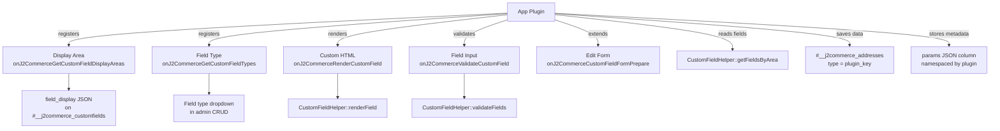

# Custom Fields Plugin API

J2Commerce's custom field system powers all checkout forms — billing address, shipping address, registration, guest checkout, and payment. The Custom Fields Plugin API opens this system to third-party app plugins, letting them reuse the same fields, field types, and storage infrastructure in their own forms.

## What This API Enables

| Capability | Mechanism |
|---|---|
| Register new field types (`file_upload`, `color_picker`, etc.) | `onJ2CommerceGetCustomFieldTypes` event |
| Add a display area switcher to the custom field edit form | `onJ2CommerceGetCustomFieldDisplayAreas` event |
| Render plugin-defined field types as HTML | `onJ2CommerceRenderCustomField` event |
| Validate plugin-defined field types | `onJ2CommerceValidateCustomField` event |
| Inject extra fieldsets/tabs into the custom field edit form | `onJ2CommerceCustomFieldFormPrepare` event |
| Query fields assigned to a plugin area | `CustomFieldHelper::getFieldsByArea('your_area_key')` |
| Store plugin-specific metadata alongside field values | `CustomFieldHelper::setAddressParams()` / `getAddressParams()` |

## Architecture



## Design Principles

**No new tables for field data.** Plugin form submissions are stored as address records with a plugin-specific `type` value (e.g., `type = 'vendor_application'`). Custom field values populate the dynamic columns that the custom field system already creates. Non-field metadata (workflow status, tier assignments, etc.) goes into the `params` JSON column, namespaced by plugin element name.

**No schema changes for new areas.** Adding a plugin display area only requires a JSON key in the existing `field_display` column on `#__j2commerce_customfields`. No `ALTER TABLE`.

**Independent per-area ordering.** Each plugin area tracks its own `ordering` value inside the `field_display` JSON, completely independent of the core `ordering` column used by checkout areas.

## Database Columns Involved

| Table | Column | How Used |
|---|---|---|
| `#__j2commerce_customfields` | `field_display` (TEXT) | JSON map of plugin area keys → `enabled` and `ordering` |
| `#__j2commerce_addresses` | `type` (varchar) | Plugin sets this to its area key (e.g., `vendor_application`) |
| `#__j2commerce_addresses` | `params` (TEXT) | JSON object namespaced by plugin element name |

## Pages in This Section

| Page | What It Covers |
|---|---|
| [Custom Field Types](custom-field-types.md) | Register new field types; implement rendering and validation |
| [Display Areas](display-areas.md) | Register plugin areas as switchers in the field edit form |
| [Form Extension](form-extension.md) | Inject additional fieldsets into the custom field edit form |
| [Address Params](address-params.md) | Store plugin metadata alongside field data in address records |
| [Field Ordering](field-ordering.md) | Manage per-area field ordering independently of checkout |

## Event Dispatch Pattern

All five events use `J2CommerceHelper::plugin()->event()`:

```php
// File: administrator/components/com_j2commerce/src/Helper/J2CommerceHelper.php

// Dispatching (done by core — shown for reference)
J2CommerceHelper::plugin()->event('GetCustomFieldTypes', [&$types]);

// Handling (done by your plugin)
public function onGetCustomFieldTypes(Event $event): void
{
    $types = &$event->getArgument(0);
    $types['my_type'] = Text::_('PLG_J2COMMERCE_APP_MYPLUGIN_FIELDTYPE_MY_TYPE');
}
```

Events that pass mutable data use a by-reference argument at index `0`. Events that pass named read-only arguments (form, field object) use named keys accessed via `$event->getArgument('name')`.

## Related

- [Apps View Hook](../apps-view-hook.md) — Register your plugin in the J2Commerce Apps view
- [App Plugin: Gift Wrapping](../../../../features/dashboard-extensions.md) — Example app plugin pattern
