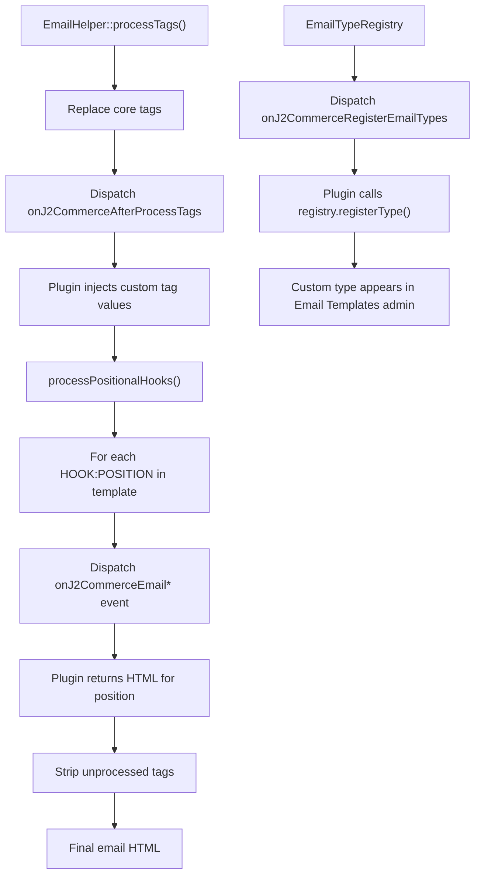

# Email Template Hooks

J2Commerce provides three ways for plugins to extend the email template system:

1. **Custom Tags** — inject replacement values for `[YOUR_TAG]` shortcodes via `onJ2CommerceAfterProcessTags`
2. **Positional Hooks** — inject HTML at predefined positions in the email body via `onJ2CommerceEmail*` events
3. **Custom Email Types** — register entirely new email categories (with their own tags and contexts) via `onJ2CommerceRegisterEmailTypes`

All three mechanisms use Joomla's `SubscriberInterface` pattern. No legacy `trigger()` calls — events are dispatched through the application dispatcher and plugins respond by modifying event arguments.

## Architecture



## Hook 1: Custom Tag Processing

Subscribe to `onJ2CommerceAfterProcessTags` to replace custom `[TAG]` shortcodes in any email template body.

### Event Details

| Property | Value |
|----------|-------|
| Event name | `onJ2CommerceAfterProcessTags` |
| Dispatched by | `EmailHelper::processTags()` |
| Dispatched when | After all core tags are replaced, before positional hooks |
| Event class | `Joomla\CMS\Event\GenericEvent` |

### Event Arguments

| Argument | Type | Access | Description |
|----------|------|--------|-------------|
| `text` | `string` (by reference) | Read/Write | The email body HTML with core tags already replaced |
| `order` | `object` | Read | The order object with full order data |
| `tags` | `array` | Read | The core tag map (`[TAG] => value`) already applied |

### Implementation

```php
// File: plugins/j2commerce/app_example/src/Extension/AppExample.php

declare(strict_types=1);

namespace J2Commerce\Plugin\J2Commerce\AppExample\Extension;

use Joomla\CMS\Plugin\CMSPlugin;
use Joomla\Event\Event;
use Joomla\Event\SubscriberInterface;

final class AppExample extends CMSPlugin implements SubscriberInterface
{
    public static function getSubscribedEvents(): array
    {
        return [
            'onJ2CommerceAfterProcessTags' => 'AfterProcessTags',
        ];
    }

    public function AfterProcessTags(Event $event): void
    {
        $args  = $event->getArguments();
        $text  = $args[1] ?? '';
        $order = $args[2] ?? null;

        if (!$order) {
            return;
        }

        // Replace custom tags in the email body
        $customTags = [
            '[MY_CUSTOM_TAG]'   => $this->getCustomValue($order),
            '[ANOTHER_TAG]'     => 'Static content',
        ];

        foreach ($customTags as $tag => $value) {
            $text = str_replace($tag, (string) $value, $text);
        }

        // Write the modified text back via index-based argument
        $event->setArgument(1, $text);
    }
}
```

### Real Example: Gift Certificate Plugin

The gift certificate plugin uses this hook to inject voucher codes into order confirmation emails. When a store owner places `[VOUCHER_CODE]` or `[VOUCHER_QUANTITY]` in an email template, the plugin resolves them at send time:

```php
// File: plugins/j2commerce/app_giftcertificate/src/Extension/AppGiftcertificate.php

public function AfterProcessTags(Event $event): void
{
    $args  = $event->getArguments();
    $text  = $args[1] ?? '';
    $order = $args[2] ?? null;

    if (!$order) {
        return;
    }

    $voucher_list = $this->getOrderVoucherCodeList($order->order_id);
    $voucher_code = !empty($voucher_list) ? implode('<br>', $voucher_list) : '';

    $gift_tag = [
        '[VOUCHER_CODE]'     => $voucher_code,
        '[VOUCHER_QUANTITY]' => count($voucher_list),
    ];

    foreach ($gift_tag as $key => $value) {
        $text = str_replace($key, (string) $value, $text);
    }

    $event->setArgument(1, $text);
}
```

Store owners can then use `[VOUCHER_CODE]` anywhere in their email templates — the GrapesJS visual editor and code editor both support it.

## Hook 2: Positional Content Injection

Positional hooks let plugins inject HTML at specific locations within the email body. The store owner places `[HOOK:POSITION]` shortcodes in their email template, and plugins respond with HTML content.

### Available Positions

| Shortcode | Event Name | Location in Email |
|-----------|-----------|-------------------|
| `[HOOK:AFTER_HEADER]` | `onJ2CommerceEmailAfterHeader` | After the email header/logo section |
| `[HOOK:BEFORE_ITEMS]` | `onJ2CommerceEmailBeforeItems` | Before the order items table |
| `[HOOK:AFTER_ITEMS]` | `onJ2CommerceEmailAfterItems` | After the order items table |
| `[HOOK:BEFORE_SHIPPING]` | `onJ2CommerceEmailBeforeShipping` | Before the shipping information |
| `[HOOK:AFTER_PAYMENT]` | `onJ2CommerceEmailAfterPayment` | After the payment method details |
| `[HOOK:BEFORE_FOOTER]` | `onJ2CommerceEmailBeforeFooter` | Before the email footer |

### Event Arguments

| Argument | Type | Access | Description |
|----------|------|--------|-------------|
| `order` | `object` | Read | The order object |
| `receiverType` | `string` | Read | `customer`, `admin`, or `*` |
| `result` | `string` | Write | Set this to your HTML output |

### How It Works

`EmailHelper::processPositionalHooks()` scans the email body for `[HOOK:POSITION]` shortcodes. For each one found, it dispatches the corresponding event. If a plugin sets the `result` argument, that HTML replaces the shortcode:

```php
// From EmailHelper::processPositionalHooks() — core implementation
$hookMap = [
    'AFTER_HEADER'    => 'onJ2CommerceEmailAfterHeader',
    'BEFORE_ITEMS'    => 'onJ2CommerceEmailBeforeItems',
    'AFTER_ITEMS'     => 'onJ2CommerceEmailAfterItems',
    'BEFORE_SHIPPING' => 'onJ2CommerceEmailBeforeShipping',
    'AFTER_PAYMENT'   => 'onJ2CommerceEmailAfterPayment',
    'BEFORE_FOOTER'   => 'onJ2CommerceEmailBeforeFooter',
];

foreach ($hookMap as $position => $eventName) {
    $shortcode = '[HOOK:' . $position . ']';
    if (str_contains($text, $shortcode)) {
        $event = new GenericEvent($eventName, [
            'order'        => $order,
            'receiverType' => $receiverType,
            'result'       => '',
        ]);
        $dispatcher->dispatch($eventName, $event);
        $hookHtml = $event->getArgument('result') ?: '';
        $text = str_replace($shortcode, $hookHtml, $text);
    }
}
```

### Implementation

```php
// File: plugins/j2commerce/app_example/src/Extension/AppExample.php

public static function getSubscribedEvents(): array
{
    return [
        'onJ2CommerceEmailAfterItems'  => 'emailAfterItems',
        'onJ2CommerceEmailBeforeFooter' => 'emailBeforeFooter',
    ];
}

public function emailAfterItems(Event $event): void
{
    $order        = $event->getArgument('order');
    $receiverType = $event->getArgument('receiverType');

    // Only inject content for customer-facing emails
    if ($receiverType === 'admin') {
        return;
    }

    $html = '<tr><td style="padding: 16px; background: #f0fdf4; border-radius: 8px;">'
        . '<p style="margin: 0; color: #166534;">Thank you for your order!</p>'
        . '</td></tr>';

    $event->setArgument('result', $html);
}

public function emailBeforeFooter(Event $event): void
{
    $order = $event->getArgument('order');

    $html = '<tr><td style="padding: 12px; text-align: center;">'
        . '<a href="https://example.com/support" style="color: #2563eb;">Need help? Contact support</a>'
        . '</td></tr>';

    $event->setArgument('result', $html);
}
```

### Real Example: Gift Certificate After Items

A gift certificate plugin could use the `[HOOK:AFTER_ITEMS]` position to display voucher details directly below the order items table:

```php
public function emailAfterItems(Event $event): void
{
    $order = $event->getArgument('order');
    $codes = $this->getOrderVoucherCodeList($order->order_id);

    if (empty($codes)) {
        return;
    }

    $html = '<tr><td style="padding: 16px; background: #fef3c7; border: 1px solid #f59e0b; border-radius: 8px; margin-top: 12px;">';
    $html .= '<h3 style="margin: 0 0 8px; color: #92400e;">Your Gift Certificate Codes</h3>';
    $html .= '<ul style="margin: 0; padding-left: 20px;">';

    foreach ($codes as $code) {
        $html .= '<li style="font-family: monospace; font-size: 16px; padding: 4px 0;">' . htmlspecialchars($code) . '</li>';
    }

    $html .= '</ul></td></tr>';

    $event->setArgument('result', $html);
}
```

## Hook 3: Custom Email Types

Register a new email type so store owners can create templates for your plugin's emails in the **J2Commerce** -> **Design** -> **Email Templates** admin view.

### Event Details

| Property | Value |
|----------|-------|
| Event name | `onJ2CommerceRegisterEmailTypes` |
| Dispatched by | `EmailTypeRegistry::loadPluginTypes()` |
| Dispatched when | Admin loads email template list or edit view |
| Event class | `Joomla\Event\Event` |

### Event Arguments

| Argument | Type | Access | Description |
|----------|------|--------|-------------|
| `registry` | `EmailTypeRegistry` | Read/Write | Call `$registry->registerType()` to add your type |

### Type Configuration

Pass this structure to `$registry->registerType()`:

| Key | Type | Required | Description |
|-----|------|----------|-------------|
| `type` | `string` | Yes | Unique identifier (e.g., `giftcertificate`) |
| `label` | `string` | Yes | Language key for the type name |
| `description` | `string` | Yes | Language key for the description |
| `icon` | `string` | No | Font Awesome class (e.g., `fa-solid fa-gift`) |
| `contexts` | `array` | Yes | Sending contexts — keys are identifiers, values are language keys |
| `tags` | `array` | Yes | Custom shortcodes available for this email type |
| `default_subject` | `string` | No | Language key for the default email subject |
| `default_body` | `string` | No | Language key for the default email body HTML |
| `receiver_types` | `array` | Yes | Who can receive: `customer`, `admin`, `*` |

### Tag Definition Structure

Each entry in the `tags` array:

```php
'TAG_NAME' => [
    'label'       => 'LANGUAGE_KEY_FOR_LABEL',       // Shown in shortcode panel
    'description' => 'LANGUAGE_KEY_FOR_DESCRIPTION',  // Tooltip text
    'group'       => 'group_name',                    // Groups tags in the UI
],
```

### Real Example: Gift Certificate Email Type

The gift certificate plugin registers a complete email type with voucher-specific tags, gift-specific tags, and multiple sending contexts:

```php
// File: plugins/j2commerce/app_giftcertificate/src/Extension/AppGiftcertificate.php

public static function getSubscribedEvents(): array
{
    return [
        'onJ2CommerceRegisterEmailTypes' => 'registerEmailTypes',
        'onJ2CommerceAfterProcessTags'   => 'AfterProcessTags',
        // ... other events
    ];
}

public function registerEmailTypes(Event $event): void
{
    $registry = $event->getArgument('registry');

    $registry->registerType('giftcertificate', [
        'type'           => 'giftcertificate',
        'label'          => 'PLG_J2COMMERCE_APP_GIFTCERTIFICATE_EMAILTYPE',
        'description'    => 'PLG_J2COMMERCE_APP_GIFTCERTIFICATE_EMAILTYPE_DESC',
        'icon'           => 'fa-solid fa-gift',
        'contexts'       => [
            'sent'     => 'PLG_J2COMMERCE_APP_GIFTCERTIFICATE_CONTEXT_SENT',
            'expired'  => 'PLG_J2COMMERCE_APP_GIFTCERTIFICATE_CONTEXT_EXPIRED',
            'reminder' => 'PLG_J2COMMERCE_APP_GIFTCERTIFICATE_CONTEXT_REMINDER',
        ],
        'tags'           => [
            'VOUCHER_CODE' => [
                'label'       => 'PLG_J2COMMERCE_APP_GIFTCERTIFICATE_TAG_VOUCHER_CODE',
                'description' => 'PLG_J2COMMERCE_APP_GIFTCERTIFICATE_TAG_VOUCHER_CODE_DESC',
                'group'       => 'voucher',
            ],
            'VOUCHER_VALUE' => [
                'label'       => 'PLG_J2COMMERCE_APP_GIFTCERTIFICATE_TAG_VOUCHER_VALUE',
                'description' => 'PLG_J2COMMERCE_APP_GIFTCERTIFICATE_TAG_VOUCHER_VALUE_DESC',
                'group'       => 'voucher',
            ],
            'VOUCHER_QUANTITY' => [
                'label'       => 'PLG_J2COMMERCE_APP_GIFTCERTIFICATE_TAG_VOUCHER_QUANTITY',
                'description' => 'PLG_J2COMMERCE_APP_GIFTCERTIFICATE_TAG_VOUCHER_QUANTITY_DESC',
                'group'       => 'voucher',
            ],
            'GIFT_NOTE' => [
                'label'       => 'PLG_J2COMMERCE_APP_GIFTCERTIFICATE_TAG_GIFT_NOTE',
                'description' => 'PLG_J2COMMERCE_APP_GIFTCERTIFICATE_TAG_GIFT_NOTE_DESC',
                'group'       => 'gift',
            ],
            'GIFT_RECEIVER_FIRST_NAME' => [
                'label'       => 'PLG_J2COMMERCE_APP_GIFTCERTIFICATE_TAG_GIFT_RECEIVER_FIRST_NAME',
                'description' => 'PLG_J2COMMERCE_APP_GIFTCERTIFICATE_TAG_GIFT_RECEIVER_FIRST_NAME_DESC',
                'group'       => 'gift',
            ],
            // ... additional tags for sender name, receiver email, etc.
        ],
        'default_subject' => 'PLG_J2COMMERCE_APP_GIFTCERTIFICATE_SUBJECT_DEFAULT',
        'default_body'    => 'PLG_J2COMMERCE_APP_GIFTCERTIFICATE_BODY_DEFAULT',
        'receiver_types'  => ['customer', 'admin'],
    ]);
}
```

Once registered, store owners see "Gift Certificate" as an email type option when creating new email templates in the admin. The GrapesJS editor's shortcode panel automatically displays the voucher and gift tag groups.

## Service Provider Setup

Every plugin that hooks into email templates needs a standard Joomla 6 service provider:

```php
// File: plugins/j2commerce/app_example/services/provider.php

declare(strict_types=1);

\defined('_JEXEC') or die;

use J2Commerce\Plugin\J2Commerce\AppExample\Extension\AppExample;
use Joomla\CMS\Extension\PluginInterface;
use Joomla\CMS\Factory;
use Joomla\CMS\Plugin\PluginHelper;
use Joomla\Database\DatabaseInterface;
use Joomla\DI\Container;
use Joomla\DI\ServiceProviderInterface;
use Joomla\Event\DispatcherInterface;

return new class () implements ServiceProviderInterface {
    public function register(Container $container): void
    {
        $container->set(
            PluginInterface::class,
            function (Container $container) {
                $plugin = new AppExample(
                    $container->get(DispatcherInterface::class),
                    (array) PluginHelper::getPlugin('j2commerce', 'app_example')
                );

                $plugin->setDatabase($container->get(DatabaseInterface::class));
                $plugin->setApplication(Factory::getApplication());

                return $plugin;
            }
        );
    }
};
```

## Processing Order

Understanding the order of operations in `EmailHelper::processTags()` is important for knowing what state the email body is in when your hook fires:

1. **Core tag replacement** — `[ORDER_ID]`, `[CUSTOMER_NAME]`, `[BILLING_ADDRESS]`, etc. are replaced with order data
2. **Items loop processing** — `[ITEMS_LOOP]...[/ITEMS_LOOP]` blocks are expanded
3. **Custom field processing** — `[BILLING_CUSTOM_*]`, `[SHIPPING_CUSTOM_*]`, `[PAYMENT_CUSTOM_*]` are replaced
4. **`onJ2CommerceAfterProcessTags` dispatched** — your plugin can inject custom tag values here
5. **Positional hooks processed** — `[HOOK:AFTER_HEADER]`, `[HOOK:BEFORE_ITEMS]`, etc. are replaced with plugin HTML
6. **Unprocessed tag cleanup** — any remaining `[TAG]` shortcodes (except `[if mso]`/`[endif]`) are stripped

If your custom tags are not being replaced, verify that step 4 runs before step 6 strips them.

## Key Classes

| Class | Namespace | Purpose |
|-------|-----------|---------|
| `EmailHelper` | `J2Commerce\Component\J2commerce\Administrator\Helper` | Core email processing — tag replacement, positional hooks, template matching |
| `EmailTypeRegistry` | `J2Commerce\Component\J2commerce\Administrator\Service` | Registry for email types and their tags, dispatches `onJ2CommerceRegisterEmailTypes` |
| `PluginEvent` | `J2Commerce\Component\J2Commerce\Administrator\Event` | Base event class for J2Commerce plugin events (mutable arguments: `result`, `forms`, `html`) |

## Best Practices

- **Use language keys** for all labels and descriptions in your type registration. Store owners may use different languages.
- **Group related tags** using the `group` key so they appear together in the GrapesJS shortcode panel.
- **Check `receiverType`** in positional hooks — admin notification emails and customer emails often need different content.
- **Escape HTML output** with `htmlspecialchars()` for any user-supplied data injected into email HTML.
- **Keep email HTML inline-styled** — most email clients strip `<style>` blocks. Use inline `style` attributes on every element.
- **Test with preview** — the Email Template editor has a preview button that processes all tags with sample order data. Verify your tags render correctly.

## Related

- [Payment Plugin Development](payment/payment-plugin-development.md)
- [Apps View Hook](apps-view-hook.md)
- [Product Form Fields](product-form-fields.md)
