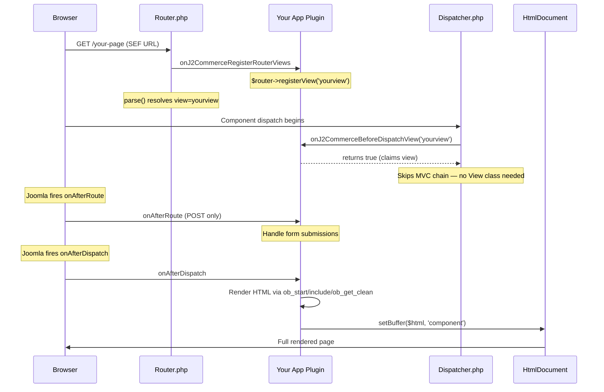

# Plugin-Driven Frontend Views

J2Commerce app plugins can own complete frontend views — with menu items, SEF URLs, and full page rendering — without modifying any core component file. Two event hooks in the component enable this:

1. **`onJ2CommerceRegisterRouterViews`** — Register your view with the Router for SEF URL support.
2. **`onJ2CommerceBeforeDispatchView`** — Claim your view so the Dispatcher skips the MVC chain (no View class or template needed in the component).

Rendering happens in Joomla's standard `onAfterDispatch` event, where the plugin builds HTML and sets the component buffer. Joomla's Menu Manager discovers the view through a `default.xml` file the install script deploys to `components/com_j2commerce/tmpl/{viewname}/`.

The `app_vendormanagement` plugin (`vendorapply` view) is the reference implementation for this pattern.

---

## Architecture



---

## Event Reference

| Event | Fired By | Arguments | Plugin Response |
|---|---|---|---|
| `onJ2CommerceRegisterRouterViews` | `Router.php` constructor | `['router' => $routerInstance]` (named) | Call `$router->registerView(new RouterViewConfiguration('yourview'))` |
| `onJ2CommerceBeforeDispatchView` | `Dispatcher.php` dispatch() | `[$viewName]` (positional, index 0) | Call `$event->addResult(true)` if view matches |
| `onAfterRoute` | Joomla kernel | None (standard Joomla event) | Handle POST form submissions |
| `onAfterDispatch` | Joomla kernel | None (standard Joomla event) | Render HTML, call `setBuffer($html, 'component')` |

---

## What Your Plugin Needs

| Requirement | How |
|---|---|
| SEF URL support | Subscribe to `onJ2CommerceRegisterRouterViews`, call `$router->registerView()` |
| Skip MVC dispatch | Subscribe to `onJ2CommerceBeforeDispatchView`, return `true` for your view |
| Page rendering | Subscribe to `onAfterDispatch`, render HTML, call `setBuffer()` |
| Menu item discovery | Deploy `default.xml` to `components/com_j2commerce/tmpl/{viewname}/` via install script |
| POST handling | Subscribe to `onAfterRoute`, check task name, process form |

**Zero core file modifications required.** The Router and Dispatcher events are generic — they fire for all J2Commerce plugins.

---

## Complete Working Example

### File Structure

```
plugins/j2commerce/app_yourplugin/
├── app_yourplugin.xml                  # XML manifest
├── script.app_yourplugin.php           # Install/uninstall script
├── services/
│   └── provider.php                    # DI service provider
├── src/
│   └── Extension/
│       └── AppYourPlugin.php           # Main plugin class
├── tmpl/
│   ├── yourview/
│   │   └── default.php                 # Frontend page template
│   └── application/
│       └── default.xml                 # Menu item metadata (deployed to component)
├── media/
│   ├── css/
│   │   └── yourplugin.css              # Plugin styles
│   └── js/
│       └── yourplugin.js               # Plugin scripts
└── language/
    └── en-GB/
        ├── plg_j2commerce_app_yourplugin.ini
        └── plg_j2commerce_app_yourplugin.sys.ini
```

### Plugin Extension Class

```php
<?php
/**
 * @package     J2Commerce
 * @subpackage  plg_j2commerce_app_yourplugin
 */

declare(strict_types=1);

namespace YourCompany\Plugin\J2Commerce\AppYourPlugin\Extension;

defined('_JEXEC') or die;

use Joomla\CMS\Component\Router\RouterViewConfiguration;
use Joomla\CMS\Plugin\CMSPlugin;
use Joomla\CMS\Router\Route;
use Joomla\CMS\Session\Session;
use Joomla\Event\Event;
use Joomla\Event\SubscriberInterface;

final class AppYourPlugin extends CMSPlugin implements SubscriberInterface
{
    protected $autoloadLanguage = true;

    public static function getSubscribedEvents(): array
    {
        return [
            'onJ2CommerceRegisterRouterViews'  => 'onRegisterRouterViews',
            'onJ2CommerceBeforeDispatchView'   => 'onBeforeDispatchView',
            'onAfterRoute'                     => 'onAfterRoute',
            'onAfterDispatch'                  => 'onAfterDispatch',
        ];
    }

    // -----------------------------------------------------------------
    // Router: Register SEF route for this view
    // -----------------------------------------------------------------

    public function onRegisterRouterViews(Event $event): void
    {
        $router = $event->getArgument('router');
        $router->registerView(new RouterViewConfiguration('yourview'));
    }

    // -----------------------------------------------------------------
    // Dispatcher: Claim the view so MVC chain is skipped
    // -----------------------------------------------------------------

    public function onBeforeDispatchView(Event $event): void
    {
        $view = $event->getArgument(0);

        if ($view === 'yourview') {
            $event->addResult(true);
        }
    }

    // -----------------------------------------------------------------
    // POST handling (form submissions)
    // -----------------------------------------------------------------

    public function onAfterRoute(): void
    {
        $app   = $this->getApplication();
        $input = $app->getInput();

        if ($input->getCmd('option') !== 'com_j2commerce') {
            return;
        }

        if ($app->isClient('site') && $input->getCmd('task') === 'yourplugin.submit') {
            Session::checkToken() or die;
            $this->handleFormSubmit();
            $app->redirect(Route::_('index.php?option=com_j2commerce&view=yourview'));
        }
    }

    // -----------------------------------------------------------------
    // Rendering: Build HTML and set component buffer
    // -----------------------------------------------------------------

    public function onAfterDispatch(): void
    {
        $app   = $this->getApplication();
        $input = $app->getInput();

        if ($input->getCmd('option') !== 'com_j2commerce') {
            return;
        }

        if ($app->isClient('site') && $input->getCmd('view') === 'yourview') {
            $this->renderFrontendView();
        }
    }

    private function renderFrontendView(): void
    {
        $app    = $this->getApplication();
        $user   = $app->getIdentity();
        $params = $this->params;

        // Register plugin assets via Web Asset Manager
        $wa = $app->getDocument()->getWebAssetManager();
        $wa->registerAndUseStyle(
            'plg_j2commerce_app_yourplugin',
            'media/plg_j2commerce_app_yourplugin/css/yourplugin.css'
        );
        $wa->registerAndUseScript(
            'plg_j2commerce_app_yourplugin',
            'media/plg_j2commerce_app_yourplugin/js/yourplugin.js',
            [],
            ['defer' => true]
        );

        // Resolve template (check for site template override first)
        $templateFile = $this->resolveTemplate();

        ob_start();
        include $templateFile;
        $html = ob_get_clean() ?: '';

        $app->getDocument()->setBuffer($html, 'component');
    }

    private function resolveTemplate(): string
    {
        $tpl      = $this->getApplication()->getTemplate();
        $override = JPATH_SITE . '/templates/' . $tpl
            . '/html/plg_j2commerce_app_yourplugin/yourview/default.php';

        if (is_file($override)) {
            return $override;
        }

        return __DIR__ . '/../../tmpl/yourview/default.php';
    }

    private function handleFormSubmit(): void
    {
        // Process form data here
    }
}
```

### Service Provider

```php
<?php
// File: plugins/j2commerce/app_yourplugin/services/provider.php

declare(strict_types=1);

defined('_JEXEC') or die;

use YourCompany\Plugin\J2Commerce\AppYourPlugin\Extension\AppYourPlugin;
use Joomla\CMS\Extension\PluginInterface;
use Joomla\CMS\Factory;
use Joomla\CMS\Plugin\PluginHelper;
use Joomla\DI\Container;
use Joomla\DI\ServiceProviderInterface;
use Joomla\Event\DispatcherInterface;

return new class () implements ServiceProviderInterface
{
    public function register(Container $container): void
    {
        $container->set(
            PluginInterface::class,
            function (Container $container) {
                $plugin = new AppYourPlugin(
                    $container->get(DispatcherInterface::class),
                    (array) PluginHelper::getPlugin('j2commerce', 'app_yourplugin')
                );

                $plugin->setApplication(Factory::getApplication());

                return $plugin;
            }
        );
    }
};
```

### Install Script

The install script deploys the menu item XML to the component's `tmpl/` directory so Joomla's Menu Manager discovers the view. On uninstall, it removes the deployed file.

```php
<?php
// File: plugins/j2commerce/app_yourplugin/script.app_yourplugin.php

declare(strict_types=1);

defined('_JEXEC') or die;

use Joomla\CMS\Installer\InstallerScript;
use Joomla\Filesystem\File;
use Joomla\Filesystem\Folder;
use Joomla\Filesystem\Path;

class plgJ2CommerceApp_yourpluginInstallerScript extends InstallerScript
{
    public function postflight(string $type, object $parent): bool
    {
        if ($type === 'uninstall') {
            return true;
        }

        $this->deployMenuItemXml();

        return true;
    }

    public function uninstall(object $parent): bool
    {
        // Remove the menu item XML from the component tmpl directory
        $targetDir = Path::clean(
            JPATH_SITE . '/components/com_j2commerce/tmpl/yourview'
        );

        if (is_dir($targetDir)) {
            Folder::delete($targetDir);
        }

        return true;
    }

    private function deployMenuItemXml(): void
    {
        $sourceFile = Path::clean(
            JPATH_PLUGINS . '/j2commerce/app_yourplugin/tmpl/application/default.xml'
        );
        $targetDir  = Path::clean(
            JPATH_SITE . '/components/com_j2commerce/tmpl/yourview'
        );
        $targetFile = $targetDir . '/default.xml';

        if (!is_file($sourceFile)) {
            return;
        }

        if (!is_dir($targetDir)) {
            Folder::create($targetDir);
        }

        File::copy($sourceFile, $targetFile);
    }
}
```

### Menu Item Metadata

Stored in the plugin at `tmpl/application/default.xml`, deployed to `components/com_j2commerce/tmpl/yourview/default.xml` by the install script.

```xml
<?xml version="1.0" encoding="utf-8"?>
<metadata>
    <layout title="PLG_J2COMMERCE_APP_YOURPLUGIN_MENU_TITLE"
            option="PLG_J2COMMERCE_APP_YOURPLUGIN_MENU_OPTION">
        <message>
            <![CDATA[PLG_J2COMMERCE_APP_YOURPLUGIN_MENU_DESC]]>
        </message>
    </layout>

    <fields name="params">
        <fieldset name="page_display" label="JGLOBAL_FIELDSET_PAGE_OPTIONS">

            <field
                name="show_page_heading"
                type="radio"
                layout="joomla.form.field.radio.switcher"
                label="JGLOBAL_SHOW_PAGE_HEADING"
                default="1"
                filter="integer"
            >
                <option value="0">JNO</option>
                <option value="1">JYES</option>
            </field>

            <field
                name="page_heading"
                type="text"
                label="JGLOBAL_PAGE_HEADING"
                showon="show_page_heading:1"
                default=""
            />

        </fieldset>
    </fields>
</metadata>
```

### Frontend Template

```php
<?php
// File: plugins/j2commerce/app_yourplugin/tmpl/yourview/default.php

declare(strict_types=1);

defined('_JEXEC') or die;

use Joomla\CMS\Language\Text;
use Joomla\CMS\Router\Route;
use Joomla\CMS\Session\Session;
?>
<div class="j2commerce yourplugin-view">
    <h2><?php echo Text::_('PLG_J2COMMERCE_APP_YOURPLUGIN_PAGE_HEADING'); ?></h2>

    <?php if ($user->guest) : ?>
        <div class="alert alert-info">
            <?php echo Text::_('PLG_J2COMMERCE_APP_YOURPLUGIN_LOGIN_REQUIRED'); ?>
        </div>
    <?php else : ?>
        <form method="post"
              action="<?php echo Route::_('index.php?option=com_j2commerce&view=yourview'); ?>">

            <input type="hidden" name="task" value="yourplugin.submit" />
            <?php echo \Joomla\CMS\HTML\HTMLHelper::_('form.token'); ?>

            <!-- Your form fields here -->

            <button type="submit" class="btn btn-primary">
                <?php echo Text::_('JSUBMIT'); ?>
            </button>
        </form>
    <?php endif; ?>
</div>
```

---

## How the Events Work Internally

### `onJ2CommerceRegisterRouterViews`

Fired in `components/com_j2commerce/src/Service/Router.php` after all core views are registered but **before** `parent::__construct()` builds the view tree:

```php
// Router.php constructor (after core view registrations)
JoomlaPluginHelper::importPlugin('j2commerce');
$app->getDispatcher()->dispatch(
    'onJ2CommerceRegisterRouterViews',
    new Event('onJ2CommerceRegisterRouterViews', ['router' => $this])
);

parent::__construct($app, $menu);  // Builds view tree including plugin views
```

The event passes the Router instance as a named argument. Plugins call `$router->registerView()` to add their views. The `parent::__construct()` call after the event builds the complete view tree, so plugin views are included in SEF URL generation and parsing.

### `onJ2CommerceBeforeDispatchView`

Fired in `components/com_j2commerce/src/Dispatcher/Dispatcher.php` before `parent::dispatch()` calls the MVC chain:

```php
// Dispatcher.php dispatch() — before parent::dispatch()
$claimed = J2CommerceHelper::plugin()->eventWithArray(
    'BeforeDispatchView',
    [$view]
);

if (\in_array(true, $claimed, true)) {
    return;  // Skip MVC chain — onAfterDispatch will still fire
}

parent::dispatch();
```

Uses J2Commerce's `eventWithArray()` helper which fires `onJ2CommerceBeforeDispatchView` with `[$viewName]` as arguments. If any plugin returns `true` via `$event->addResult(true)`, the Dispatcher returns early — skipping `parent::dispatch()` which would require a View class and template. Joomla's `onAfterDispatch` event still fires afterward, allowing the plugin to render.

---

## Template Overrides

Site templates can override your plugin's frontend output using the standard Joomla template override path:

```
templates/{template}/html/plg_j2commerce_app_yourplugin/yourview/default.php
```

Implement priority resolution in your `renderFrontendView()` method as shown in the example above. Check the active template's override directory first, then fall back to the plugin's own template.

---

## Troubleshooting

### View returns a 404

1. Verify your plugin is **enabled** in **System → Manage → Plugins**.
2. Confirm `onJ2CommerceRegisterRouterViews` is in your `getSubscribedEvents()` array and the handler calls `$router->registerView()`.
3. Confirm `onJ2CommerceBeforeDispatchView` is subscribed and returns `true` for your view name. Without this, the Dispatcher tries to load a View class that doesn't exist.
4. Test with the non-SEF URL first: `index.php?option=com_j2commerce&view=yourview`. If this works but the SEF URL doesn't, the issue is in Router registration.

### Page loads but the component area is blank

1. Verify `onAfterDispatch` is subscribed and the handler guards on `$input->getCmd('view') === 'yourview'` — the check is case-sensitive.
2. A PHP error inside `ob_start()` / `ob_get_clean()` suppresses output silently. Enable Joomla error reporting temporarily.
3. Confirm the template file path in `include` is correct — use `__DIR__` relative paths.

### Menu Manager does not list the view type

1. Confirm `default.xml` exists at `components/com_j2commerce/tmpl/yourview/default.xml`.
2. Clear Joomla's cache and reload the Menu Manager.
3. Language keys in `<layout title="...">` must be loaded during admin requests. Deploy your `.sys.ini` to `administrator/language/en-GB/` or register with the J2Commerce language registry (see `app_vendormanagement` for the pattern).

### POST submissions not processed

1. `onAfterRoute` fires on every request including GET. Always guard with a task check.
2. Pass the CSRF token as a hidden `<input>` field, not in the query string.
3. Always call `$app->redirect()` after processing to prevent `onAfterDispatch` from rendering over the POST response.

---

## Checklist

Before releasing a plugin that uses this pattern:

- [ ] `getSubscribedEvents()` includes all four events
- [ ] `onRegisterRouterViews` registers the view with `RouterViewConfiguration`
- [ ] `onBeforeDispatchView` returns `true` only for your view name
- [ ] `onAfterDispatch` guards on both `option=com_j2commerce` and `isClient('site')`
- [ ] Install script deploys `default.xml` to `tmpl/{viewname}/`
- [ ] Uninstall script removes `tmpl/{viewname}/` directory
- [ ] `.sys.ini` language keys available for Menu Manager discovery
- [ ] POST handlers verify CSRF token via `Session::checkToken()`
- [ ] POST handlers end with `$app->redirect()`
- [ ] Template override resolution checks active site template first
- [ ] Tested with SEF URLs both enabled and disabled

---

## Reference Implementation

The `app_vendormanagement` plugin is the canonical reference:

| File | Role |
|---|---|
| `plugins/j2commerce/app_vendormanagement/src/Extension/AppVendorManagement.php` | Subscribes to all four events |
| `plugins/j2commerce/app_vendormanagement/script.app_vendormanagement.php` | `deployMenuItemXml()` and `uninstall()` cleanup |
| `plugins/j2commerce/app_vendormanagement/tmpl/application/default.xml` | Menu item metadata deployed to `tmpl/vendorapply/` |
| `plugins/j2commerce/app_vendormanagement/tmpl/application/default.php` | Frontend application form template |

---

## Related

- [Apps View Hook](./apps-view-hook.md) — Register your plugin in the J2Commerce admin Apps view.
- [Payment Plugin Development](./payment/payment-plugin-development.md) — Full guide for payment gateway plugins.
- [Shipping & Payment Template Overrides](./shipping-payment-overrides.md) — Override checkout templates from plugins.