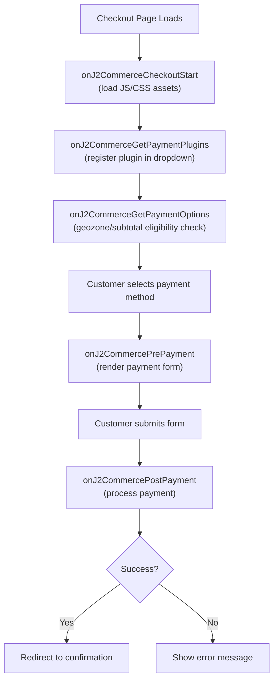
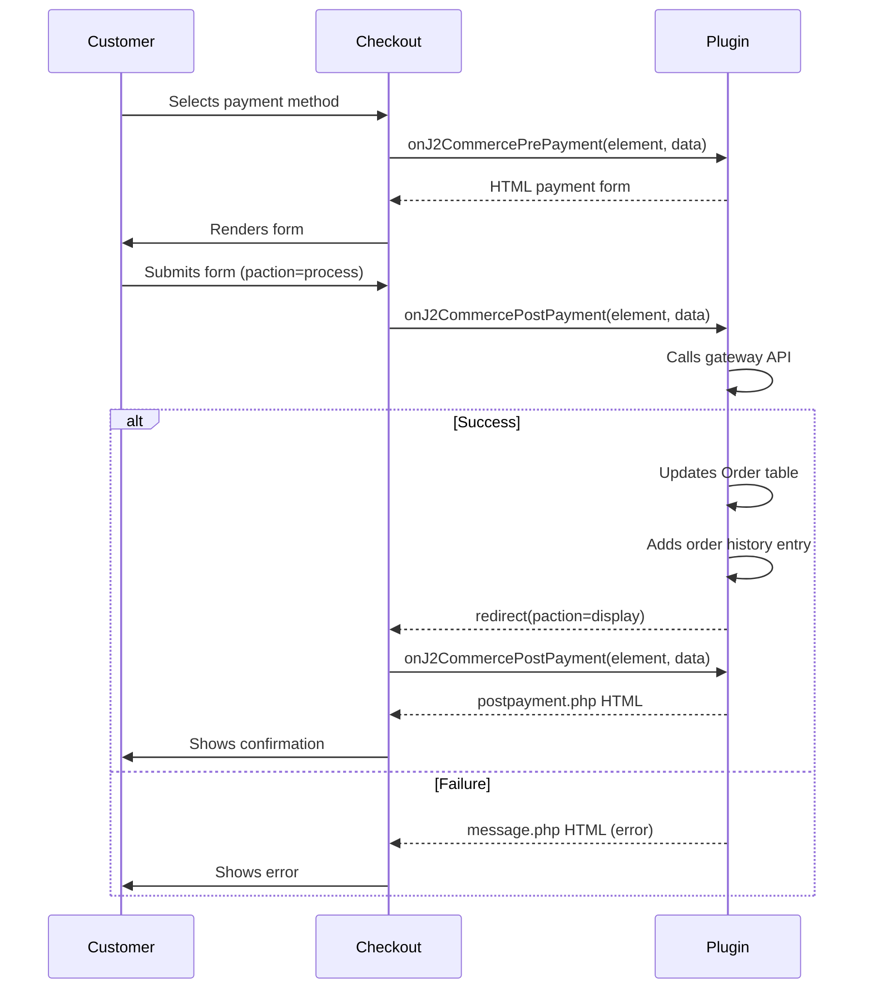

# Payment Plugin Development

Payment plugins integrate third-party payment gateways into the J2Commerce checkout flow. They are Joomla plugins in the `j2commerce` group and implement an event-driven architecture using `SubscriberInterface`. A single plugin handles the complete payment lifecycle: registration, form rendering, processing, voids, refunds, stored payment methods, and subscription renewals.

---

## Overview

Payment plugins participate in checkout through a series of J2Commerce events. The core component fires events at each stage; your plugin responds only to the events it needs. This decoupling means a minimal plugin can be just three event handlers while a full-featured gateway implements a dozen or more.



Payment plugins also respond to admin events for void, refund, and charging stored cards, and to frontend events for the My Account saved-cards tab.

---

## Getting Started — MVP Plugin

The minimum viable payment plugin requires five files. This is a complete, copy-paste-ready starting point.

### File Structure

```
plugins/j2commerce/payment_mygateway/
├── payment_mygateway.xml          # XML manifest
├── services/
│   └── provider.php               # DI service provider
├── src/
│   └── Extension/
│       └── PaymentMygateway.php   # Main plugin class
├── tmpl/
│   ├── prepayment.php             # Checkout payment form
│   └── postpayment.php            # Post-payment confirmation
└── language/
    └── en-GB/
        ├── plg_j2commerce_payment_mygateway.ini
        └── plg_j2commerce_payment_mygateway.sys.ini
```

### XML Manifest

```xml
<?xml version="1.0" encoding="utf-8"?>
<extension type="plugin" group="j2commerce" method="upgrade">
    <name>PLG_J2COMMERCE_PAYMENT_MYGATEWAY</name>
    <version>1.0.0</version>
    <creationDate>January 2025</creationDate>
    <author>Your Name</author>
    <copyright>(C)2025 Your Company. All rights reserved.</copyright>
    <license>GNU General Public License version 2 or later</license>
    <authorEmail>support@yourcompany.com</authorEmail>
    <authorUrl>https://yourcompany.com</authorUrl>
    <description>PLG_J2COMMERCE_PAYMENT_MYGATEWAY_DESC</description>
    <namespace path="src">YourCompany\Plugin\J2Commerce\PaymentMygateway</namespace>

    <files>
        <folder plugin="payment_mygateway">services</folder>
        <folder>src</folder>
        <folder>tmpl</folder>
    </files>

    <languages folder="language">
        <language tag="en-GB">en-GB/plg_j2commerce_payment_mygateway.ini</language>
        <language tag="en-GB">en-GB/plg_j2commerce_payment_mygateway.sys.ini</language>
    </languages>

    <config>
        <fields name="params">
            <fieldset name="basic" label="PLG_J2COMMERCE_PAYMENT_MYGATEWAY">

                <field
                    name="payment_method_type"
                    type="hidden"
                    default="PLG_J2COMMERCE_PAYMENT_METHOD"
                />

                <field
                    name="display_name"
                    type="text"
                    label="COM_J2COMMERCE_PLUGIN_DISPLAY_NAME"
                    description="COM_J2COMMERCE_PLUGIN_DISPLAY_NAME_DESC"
                    default="Pay with MyGateway"
                />
                <field
                    name="display_image"
                    type="media"
                    label="COM_J2COMMERCE_PLUGIN_DISPLAY_IMAGE"
                    description="COM_J2COMMERCE_PLUGIN_DISPLAY_IMAGE_DESC"
                />

                <field
                    name="api_key"
                    type="text"
                    label="PLG_J2COMMERCE_PAYMENT_MYGATEWAY_API_KEY"
                    size="80"
                />
                <field
                    name="sandbox"
                    type="radio"
                    label="PLG_J2COMMERCE_PAYMENT_MYGATEWAY_SANDBOX"
                    layout="joomla.form.field.radio.switcher"
                    filter="integer"
                    default="0"
                >
                    <option value="0">JNO</option>
                    <option value="1">JYES</option>
                </field>

                <field type="spacer" />

                <field
                    name="subtemplate"
                    type="PluginSubtemplate"
                    plugin_group="j2commerce"
                    plugin_element="payment_mygateway"
                    label="COM_J2COMMERCE_PLUGIN_SUBTEMPLATE"
                    description="COM_J2COMMERCE_PLUGIN_SUBTEMPLATE_DESC"
                    default=""
                    addfieldprefix="J2Commerce\Component\J2commerce\Administrator\Field"
                />

                <field type="spacer" />

                <field
                    name="payment_status"
                    type="OrderStatus"
                    label="PLG_J2COMMERCE_ORDER_STATUS"
                    description="PLG_J2COMMERCE_ORDER_STATUS_DESC"
                    addfieldprefix="J2Commerce\Component\J2commerce\Administrator\Field"
                    layout="joomla.form.field.list-fancy-select"
                    default="1"
                />

                <field type="spacer" />

                <field
                    name="geozone_id"
                    type="geozone"
                    label="COM_J2COMMERCE_GEOZONE_RESTRICTION"
                    description="COM_J2COMMERCE_GEOZONE_RESTRICTION_DESC"
                    addfieldprefix="J2Commerce\Component\J2commerce\Administrator\Field"
                    layout="joomla.form.field.list-fancy-select"
                    default=""
                />
                <field
                    name="min_subtotal"
                    type="text"
                    label="COM_J2COMMERCE_PLUGIN_MIN_SUBTOTAL"
                    description="COM_J2COMMERCE_PLUGIN_MIN_SUBTOTAL_DESC"
                    default=""
                />
                <field
                    name="max_subtotal"
                    type="text"
                    label="COM_J2COMMERCE_PLUGIN_MAX_SUBTOTAL"
                    description="COM_J2COMMERCE_PLUGIN_MAX_SUBTOTAL_DESC"
                    default=""
                />

                <field type="spacer" />

                <field
                    name="onbeforepayment"
                    type="textarea"
                    label="COM_J2COMMERCE_ON_BEFORE_PAYMENT_LABEL"
                    description="COM_J2COMMERCE_ON_BEFORE_PAYMENT_DESC"
                    cols="10"
                    rows="3"
                    default=""
                />
                <field
                    name="onafterpayment"
                    type="textarea"
                    label="COM_J2COMMERCE_ON_AFTER_PAYMENT_LABEL"
                    description="COM_J2COMMERCE_ON_AFTER_PAYMENT_DESC"
                    cols="10"
                    rows="3"
                    default=""
                />
                <field
                    name="onerrorpayment"
                    type="textarea"
                    label="COM_J2COMMERCE_ON_ERROR_PAYMENT_LABEL"
                    description="COM_J2COMMERCE_ON_ERROR_PAYMENT_DESC"
                    cols="10"
                    rows="3"
                    default=""
                />

                <field type="spacer" />

                <field
                    name="debug"
                    type="radio"
                    label="PLG_J2COMMERCE_PAYMENT_MYGATEWAY_DEBUG"
                    description="PLG_J2COMMERCE_PAYMENT_MYGATEWAY_DEBUG_DESC"
                    layout="joomla.form.field.radio.switcher"
                    filter="integer"
                    default="0"
                >
                    <option value="0">JNO</option>
                    <option value="1">JYES</option>
                </field>

            </fieldset>
        </fields>
    </config>
</extension>
```

### Service Provider

```php
<?php
// File: plugins/j2commerce/payment_mygateway/services/provider.php

declare(strict_types=1);

defined('_JEXEC') or die;

use YourCompany\Plugin\J2Commerce\PaymentMygateway\Extension\PaymentMygateway;
use Joomla\CMS\Extension\PluginInterface;
use Joomla\CMS\Factory;
use Joomla\CMS\Plugin\PluginHelper;
use Joomla\Database\DatabaseInterface;
use Joomla\DI\Container;
use Joomla\DI\ServiceProviderInterface;
use Joomla\Event\DispatcherInterface;

return new class implements ServiceProviderInterface
{
    public function register(Container $container): void
    {
        $container->set(
            PluginInterface::class,
            function (Container $container) {
                $plugin = new PaymentMygateway(
                    $container->get(DispatcherInterface::class),
                    (array) PluginHelper::getPlugin('j2commerce', 'payment_mygateway'),
                    $container->get(DatabaseInterface::class)
                );

                $plugin->setApplication(Factory::getApplication());

                return $plugin;
            }
        );
    }
};
```

### Extension Class (MVP)

```php
<?php
// File: plugins/j2commerce/payment_mygateway/src/Extension/PaymentMygateway.php

declare(strict_types=1);

namespace YourCompany\Plugin\J2Commerce\PaymentMygateway\Extension;

\defined('_JEXEC') or die;

use J2Commerce\Component\J2commerce\Administrator\Helper\OrderHistoryHelper;
use J2Commerce\Component\J2commerce\Administrator\Library\Plugins\PluginLayoutTrait;
use Joomla\CMS\Factory;
use Joomla\CMS\Language\Text;
use Joomla\CMS\Log\Log;
use Joomla\CMS\Plugin\CMSPlugin;
use Joomla\CMS\Router\Route;
use Joomla\Database\DatabaseAwareTrait;
use Joomla\Database\DatabaseInterface;
use Joomla\Event\DispatcherInterface;
use Joomla\Event\Event;
use Joomla\Event\SubscriberInterface;

final class PaymentMygateway extends CMSPlugin implements SubscriberInterface
{
    use DatabaseAwareTrait;
    use PluginLayoutTrait;

    protected $autoloadLanguage = true;

    protected $_name = 'payment_mygateway';

    public function __construct(
        DispatcherInterface $dispatcher,
        array $config,
        DatabaseInterface $db
    ) {
        parent::__construct($dispatcher, $config);
        $this->setDatabase($db);
    }

    public static function getSubscribedEvents(): array
    {
        return [
            'onJ2CommerceGetPaymentPlugins' => 'onGetPaymentPlugins',
            'onJ2CommercePrePayment'        => 'onPrePayment',
            'onJ2CommercePostPayment'       => 'onPostPayment',
        ];
    }

    public function onGetPaymentPlugins(Event $event): void
    {
        $result   = $event->getArgument('result', []);
        $result[] = [
            'element' => $this->_name,
            'name'    => Text::_($this->params->get('display_name', 'MyGateway')),
            'image'   => $this->params->get('display_image', ''),
        ];
        $event->setArgument('result', $result);
    }

    public function onPrePayment(Event $event): void
    {
        $args    = $event->getArguments();
        $element = $args[0] ?? '';
        $data    = $args[1] ?? [];

        if ($element !== $this->_name) {
            return;
        }

        $vars = new \stdClass();
        $vars->order_id            = $data['order_id'];
        $vars->orderpayment_amount = $data['orderpayment_amount'];
        $vars->display_name        = Text::_($this->params->get('display_name', 'MyGateway'));
        $vars->onbeforepayment_text = $this->params->get('onbeforepayment', '');

        $result   = $event->getArgument('result', []);
        $result[] = $this->resolvePluginLayout('prepayment', $vars);
        $event->setArgument('result', $result);
    }

    public function onPostPayment(Event $event): void
    {
        $args    = $event->getArguments();
        $element = $args[0] ?? '';
        $data    = $args[1] ?? [];

        if ($element !== $this->_name) {
            return;
        }

        $app    = Factory::getApplication();
        $paction = $app->input->getString('paction');

        $result   = $event->getArgument('result', []);
        $result[] = match ($paction) {
            'process' => $this->processPayment((object) $data),
            'display' => $this->resolvePluginLayout('postpayment', (object) [
                'onafterpayment_text' => Text::_($this->params->get('onafterpayment', '')),
            ]),
            default   => $this->resolvePluginLayout('message', (object) [
                'message' => Text::_($this->params->get('onerrorpayment', 'PLG_J2COMMERCE_PAYMENT_MYGATEWAY_ERR_PAYMENT_FAILED')),
            ]),
        };
        $event->setArgument('result', $result);
    }

    private function processPayment(object $data): string
    {
        $orderId = (int) ($data->order_id ?? Factory::getApplication()->input->getInt('order_id', 0));

        // Call your gateway API here. On success, finalize the order:
        $success = true; // Replace with real API call result

        if (!$success) {
            return $this->resolvePluginLayout('message', (object) [
                'message' => Text::_('PLG_J2COMMERCE_PAYMENT_MYGATEWAY_ERR_PAYMENT_FAILED'),
            ]);
        }

        // Finalize order
        $orderTable = Factory::getApplication()
            ->bootComponent('com_j2commerce')
            ->getMVCFactory()
            ->createTable('Order', 'Administrator');

        if ($orderTable->load(['order_id' => $orderId])) {
            $orderTable->transaction_id     = 'YOUR_TRANSACTION_ID';
            $orderTable->transaction_status  = 'Completed';
            $orderTable->orderpayment_type   = $this->_name;
            $orderTable->order_state_id      = (int) $this->params->get('payment_status', 1);
            $orderTable->store();

            OrderHistoryHelper::add(
                orderId: $orderTable->order_id,
                comment: Text::sprintf('COM_J2COMMERCE_ORDER_HISTORY_PAYMENT_RECEIVED', Text::_('PLG_J2COMMERCE_PAYMENT_MYGATEWAY')),
                orderStateId: (int) $orderTable->order_state_id,
            );
        }

        Factory::getApplication()->redirect(
            Route::_(
                'index.php?option=com_j2commerce&view=checkout&task=checkout.confirmPayment'
                . '&orderpayment_type=' . $this->_name
                . '&paction=display',
                false
            )
        );

        return '';
    }
}
```

---

## Plugin File Structure

The full directory tree for a feature-complete payment plugin:

```
plugins/j2commerce/payment_mygateway/
├── payment_mygateway.xml          # XML manifest (required)
├── services/
│   └── provider.php               # DI container wiring (required)
├── src/
│   └── Extension/
│       └── PaymentMygateway.php   # Main plugin class (required)
│   └── Helper/
│       └── MygatewayHelper.php    # Static utility methods (optional)
│   └── Service/
│       ├── PaymentProcessor.php   # Handles pre/post payment logic (optional)
│       ├── AdminActions.php       # Void/refund/charge-card logic (optional)
│       └── ProfileManager.php     # Saved payment method management (optional)
├── tmpl/
│   ├── prepayment.php             # Checkout form (default subtemplate)
│   ├── postpayment.php            # Post-payment screen
│   ├── message.php                # Generic error/cancel message
│   ├── admin_payment_buttons.php  # Void/refund buttons in order view
│   ├── admin_charge_card.php      # Admin charge stored card UI
│   ├── profile_cards.php          # My Account saved cards tab
│   └── bootstrap5/                # Bootstrap 5 subtemplate overrides
│       ├── prepayment.php
│       ├── postpayment.php
│       └── profile_cards.php
│   └── uikit/                     # UIkit subtemplate overrides
│       └── prepayment.php
├── media/                         # Installed to media/plg_j2commerce_payment_mygateway/
│   ├── css/
│   │   └── mygateway-checkout.css
│   ├── js/
│   │   ├── mygateway-checkout.js
│   │   └── mygateway-admin.js
│   └── images/
│       ├── payment_mygateway.webp
│       └── payment_mygateway_thumb.webp
├── sql/
│   ├── install.mysql.utf8.sql     # Tables created on install
│   └── uninstall.mysql.utf8.sql   # Tables dropped on uninstall
└── language/
    └── en-GB/
        ├── plg_j2commerce_payment_mygateway.ini
        └── plg_j2commerce_payment_mygateway.sys.ini
```

### Key directory notes

- `services/` — The `<folder plugin="payment_mygateway">services</folder>` attribute in the manifest registers this as the plugin entry point. The `plugin` attribute value must match the plugin element name exactly.
- `tmpl/` — Layout files. The `PluginLayoutTrait::resolvePluginLayout()` method searches these. Subdirectories (`bootstrap5/`, `uikit/`) are named subtemplates selectable from the plugin configuration.
- `media/` — The manifest `destination` attribute `plg_j2commerce_payment_mygateway` controls where Joomla copies these files. Assets are loaded from `media/plg_j2commerce_payment_mygateway/` at runtime.
- `sql/` — Standard Joomla install/uninstall SQL. Reference as `#__j2commerce_mygateway_*` for any plugin-specific tables.

---

## XML Manifest

### Configuration Field Groups

Payment plugin manifests follow a consistent field grouping pattern. The standard sections are:

| Section | Purpose |
|---------|---------|
| `payment_method_type` hidden field | Internal marker used by the payment methods list view |
| Display fields | `display_name`, `display_image` — shown in checkout dropdown |
| API credentials | Your gateway's keys/tokens (live and optionally sandbox) |
| Transaction settings | Auth-capture vs auth-only, card types, etc. |
| `subtemplate` field | Lets merchants choose between Bootstrap 5, UIkit, or custom layouts |
| `payment_status` | Order status to set on successful payment |
| Void/refund status fields | Optional: change order status on void or refund |
| Surcharge fields | `surcharge_name`, `surcharge_percent`, `surcharge_fixed`, `surcharge_tax_class_id` |
| Geo/subtotal restrictions | `geozone_id`, `min_subtotal`, `max_subtotal` |
| `articleid` | Optional Joomla article to display after successful payment |
| Custom JS hooks | `onselection`, `onbeforepayment`, `onafterpayment`, `onerrorpayment`, `oncancelpayment` |
| Dashboard icon | `show_dashboard_icon`, `dashboard_icon_label` |
| `debug` | Enable verbose logging |

### Custom J2Commerce Field Types

These field types are registered by the J2Commerce component and available in plugin manifests:

| Type | `addfieldprefix` | Purpose |
|------|-----------------|---------|
| `OrderStatus` | `J2Commerce\Component\J2commerce\Administrator\Field` | Dropdown of order statuses |
| `TaxProfile` | `J2Commerce\Component\J2commerce\Administrator\Field` | Dropdown of tax profiles |
| `geozone` | `J2Commerce\Component\J2commerce\Administrator\Field` | Dropdown of geo-zones |
| `PluginSubtemplate` | `J2Commerce\Component\J2commerce\Administrator\Field` | Subtemplate selector for the plugin |

### Sandbox credential pattern

When a plugin supports both live and sandbox environments, duplicate the credential fields with a `sandbox_` prefix and use `showon` to show the correct set:

```xml
<field name="sandbox" type="radio" layout="joomla.form.field.radio.switcher"
       filter="integer" default="0">
    <option value="0">JNO</option>
    <option value="1">JYES</option>
</field>

<!-- Live credentials — hidden when sandbox=1 -->
<field name="api_key" type="text" label="..." showon="sandbox:0" />

<!-- Sandbox credentials — hidden when sandbox=0 -->
<field name="sandbox_api_key" type="text" label="..." showon="sandbox:1" />
```

Read credentials in PHP using a helper that respects the sandbox toggle:

```php
private function getCredential(string $key): string
{
    $sandbox = (int) $this->params->get('sandbox', 0);

    return $sandbox
        ? (string) $this->params->get('sandbox_' . $key, '')
        : (string) $this->params->get($key, '');
}
```

---

## Service Provider

The service provider (`services/provider.php`) wires the plugin class into Joomla's DI container.

```php
<?php
// File: plugins/j2commerce/payment_mygateway/services/provider.php

declare(strict_types=1);

defined('_JEXEC') or die;

use YourCompany\Plugin\J2Commerce\PaymentMygateway\Extension\PaymentMygateway;
use Joomla\CMS\Extension\PluginInterface;
use Joomla\CMS\Factory;
use Joomla\CMS\Plugin\PluginHelper;
use Joomla\Database\DatabaseInterface;
use Joomla\DI\Container;
use Joomla\DI\ServiceProviderInterface;
use Joomla\Event\DispatcherInterface;

return new class implements ServiceProviderInterface
{
    public function register(Container $container): void
    {
        $container->set(
            PluginInterface::class,
            function (Container $container) {
                $plugin = new PaymentMygateway(
                    $container->get(DispatcherInterface::class),
                    (array) PluginHelper::getPlugin('j2commerce', 'payment_mygateway'),
                    $container->get(DatabaseInterface::class)
                );

                $plugin->setApplication(Factory::getApplication());

                return $plugin;
            }
        );
    }
};
```

If your constructor needs additional services (e.g., Joomla's `Language` or `UserFactoryInterface`), resolve them from the container here:

```php
use Joomla\CMS\User\UserFactoryInterface;

$plugin = new PaymentMygateway(
    $container->get(DispatcherInterface::class),
    (array) PluginHelper::getPlugin('j2commerce', 'payment_mygateway'),
    $container->get(DatabaseInterface::class),
    Factory::getApplication()->getLanguage(),
    $container->get(UserFactoryInterface::class)
);
```

---

## Extension Class

### Class declaration

```php
final class PaymentMygateway extends CMSPlugin implements SubscriberInterface
{
    use DatabaseAwareTrait;
    use PluginLayoutTrait; // Provides resolvePluginLayout()

    protected $autoloadLanguage = true;

    protected $_name = 'payment_mygateway'; // Must match plugin element name
```

The `$_name` property identifies this plugin to every event. Events carry the plugin element name as their first argument; your handlers compare against `$this->_name` and return early if the event targets a different plugin.

### `getSubscribedEvents()`

```php
public static function getSubscribedEvents(): array
{
    return [
        'onJ2CommerceGetPaymentPlugins'              => 'onGetPaymentPlugins',
        'onJ2CommerceGetPaymentOptions'              => 'onGetPaymentOptions',
        'onJ2CommerceCheckoutStart'                  => 'onCheckoutStart',
        'onJ2CommerceCalculateFees'                  => 'onCalculateFees',
        'onJ2CommercePrePayment'                     => 'onPrePayment',
        'onJ2CommercePostPayment'                    => 'onPostPayment',
        'onJ2CommerceRefundPayment'                  => 'onRefundPayment',
        'onJ2CommerceProcessWebhook'                 => 'onProcessWebhook',
        'onJ2CommerceProcessRenewalPayment'          => 'onProcessRenewalPayment',
        'onJ2CommerceAcceptSubscriptionPayment'      => 'onAcceptSubscriptionPayment',
        'onJ2CommerceAfterSubscriptionCanceled'      => 'onAfterSubscriptionCanceled',
        'onJ2CommerceMyProfileTab'                   => 'onMyProfileTab',
        'onJ2CommerceMyProfileTabContent'            => 'onMyProfileTabContent',
        'onJ2CommerceGetQuickIcons'                  => 'onGetQuickIcons',
        'onJ2CommerceGetDashboardMessages'           => 'onGetDashboardMessages',
        'onJ2CommerceBeforeAdminOrderPaymentButton'  => 'onBeforeAdminOrderPaymentButton',
        'onJ2CommerceAfterAdminOrderSummery'         => 'onAfterAdminOrderSummery',
        'onAjaxPayment_mygateway'                    => 'onAjaxHandler',
    ];
}
```

Only subscribe to events you implement. A minimal plugin needs only the first three.

### `PluginLayoutTrait`

The trait provides `resolvePluginLayout(string $name, array|object $data): string`. It searches layout paths in priority order:

1. `templates/{active_template}/html/plg_j2commerce_payment_mygateway/{subtemplate}/{name}.php`
2. `plugins/j2commerce/payment_mygateway/tmpl/{subtemplate}/{name}.php`
3. `templates/{active_template}/html/plg_j2commerce_payment_mygateway/{name}.php`
4. `plugins/j2commerce/payment_mygateway/tmpl/{name}.php`

The `subtemplate` plugin parameter (set by the merchant) selects which subdirectory is tried first.

---

## Checkout Integration

### `onJ2CommerceGetPaymentPlugins`

Fires when J2Commerce builds the list of available payment methods at checkout. Add your plugin's descriptor to the result array.

```php
public function onGetPaymentPlugins(Event $event): void
{
    $result   = $event->getArgument('result', []);
    $result[] = [
        'element' => $this->_name,
        'name'    => Text::_($this->params->get('display_name', 'MyGateway')),
        'image'   => $this->params->get('display_image', ''),
    ];
    $event->setArgument('result', $result);
}
```

| Key | Type | Description |
|-----|------|-------------|
| `element` | `string` | Plugin element name — must match `$this->_name` |
| `name` | `string` | Display label shown in the checkout payment selector |
| `image` | `string` | Optional media URL for a payment method logo |

### `onJ2CommerceGetPaymentOptions`

Fires to check whether this payment method is available for the current order. Return `false` to hide it (e.g., outside a geo-zone or below minimum subtotal). This event passes the element name and order object as positional arguments.

```php
public function onGetPaymentOptions(Event $event): void
{
    $args    = $event->getArguments();
    $element = $args[0] ?? null;
    $order   = $args[1] ?? null;

    if ($element !== $this->_name || $order === null) {
        return;
    }

    $available = true;

    // Example: geo-zone restriction
    $geozoneId = (int) $this->params->get('geozone_id', 0);
    if ($geozoneId > 0) {
        $order->setAddress();
        $address   = $order->getBillingAddress();
        $available = $this->checkGeozone($geozoneId, $address);
    }

    // Example: subtotal limits
    if ($available) {
        $min = (float) $this->params->get('min_subtotal', 0);
        $max = (float) $this->params->get('max_subtotal', 0);

        if ($min > 0 && $order->order_subtotal < $min) {
            $available = false;
        }

        if ($max > 0 && $order->order_subtotal > $max) {
            $available = false;
        }
    }

    $event->setArgument('result', $available);
}
```

### `onJ2CommerceCheckoutStart`

Fires once when the checkout page is initialized — use it to load your plugin's CSS and JavaScript assets. Assets registered here are available for the entire checkout session.

```php
public function onCheckoutStart(Event $event): void
{
    $wa = Factory::getApplication()->getDocument()->getWebAssetManager();

    $wa->registerAndUseScript(
        'plg_j2commerce_payment_mygateway.checkout',
        'media/plg_j2commerce_payment_mygateway/js/mygateway-checkout.js',
        [],
        ['defer' => true]
    );
    $wa->registerAndUseStyle(
        'plg_j2commerce_payment_mygateway.css',
        'media/plg_j2commerce_payment_mygateway/css/mygateway-checkout.css'
    );
}
```

Use the asset name pattern `plg_j2commerce_{element}.{descriptor}` so the Web Asset Manager deduplicates if the same asset is registered elsewhere.

### `onJ2CommercePrePayment`

Fires when the customer selects your payment method and the checkout renders the payment form. Return an HTML string — typically rendered through `resolvePluginLayout()`.

```php
public function onPrePayment(Event $event): void
{
    $args    = $event->getArguments();
    $element = $args[0] ?? '';
    $data    = $args[1] ?? [];

    if ($element !== $this->_name) {
        return;
    }

    $vars = new \stdClass();
    $vars->order_id            = $data['order_id'];
    $vars->orderpayment_amount = $data['orderpayment_amount'];
    $vars->orderpayment_type   = $this->_name;
    $vars->display_name        = Text::_($this->params->get('display_name', 'MyGateway'));
    $vars->display_image       = $this->params->get('display_image', '');
    $vars->onbeforepayment_text = $this->params->get('onbeforepayment', '');
    $vars->csrf_token          = \Joomla\CMS\Session\Session::getFormToken();

    $result   = $event->getArgument('result', []);
    $result[] = $this->resolvePluginLayout('prepayment', $vars);
    $event->setArgument('result', $result);
}
```

The `$data` array contains at minimum: `order_id`, `orderpayment_amount`, `orderpayment_type`.

### `onJ2CommercePostPayment`

Fires when the payment form is submitted. The `paction` input parameter controls which sub-action to execute:

| `paction` value | Meaning |
|----------------|---------|
| `process` | Customer submitted the payment form — process the transaction |
| `display` | Payment was already processed — show the confirmation screen |
| `cancel` | Customer cancelled — show cancellation message |
| _(anything else)_ | Show generic error |

```php
public function onPostPayment(Event $event): void
{
    $args    = $event->getArguments();
    $element = $args[0] ?? '';
    $data    = $args[1] ?? [];

    if ($element !== $this->_name) {
        return;
    }

    $paction = Factory::getApplication()->input->getString('paction');

    $result   = $event->getArgument('result', []);
    $result[] = match ($paction) {
        'process' => $this->processPayment((object) $data),
        'display' => $this->resolvePluginLayout('postpayment', (object) [
            'onafterpayment_text' => Text::_($this->params->get('onafterpayment', '')),
        ]),
        'cancel'  => $this->resolvePluginLayout('message', (object) [
            'message' => Text::_($this->params->get('oncancelpayment', '')),
        ]),
        default   => $this->resolvePluginLayout('message', (object) [
            'message' => Text::_($this->params->get('onerrorpayment', 'PLG_J2COMMERCE_PAYMENT_MYGATEWAY_ERR_PAYMENT_FAILED')),
        ]),
    };
    $event->setArgument('result', $result);
}
```

### Full payment flow



### Finalizing the order on success

After a successful API response, update the order table and add a history entry:

```php
private function finalizeOrder(int $orderId, string $transactionId): void
{
    $orderTable = Factory::getApplication()
        ->bootComponent('com_j2commerce')
        ->getMVCFactory()
        ->createTable('Order', 'Administrator');

    if (!$orderTable->load(['order_id' => $orderId])) {
        return;
    }

    $orderTable->transaction_id     = $transactionId;
    $orderTable->transaction_status  = 'Completed';
    $orderTable->orderpayment_type   = $this->_name;
    $orderTable->order_state_id      = (int) $this->params->get('payment_status', 1);
    $orderTable->transaction_details = json_encode([
        'transId'   => $transactionId,
        // Include any gateway-specific data here
    ]);
    $orderTable->store();

    OrderHistoryHelper::add(
        orderId: $orderTable->order_id,
        comment: Text::sprintf(
            'COM_J2COMMERCE_ORDER_HISTORY_PAYMENT_RECEIVED',
            Text::_('PLG_J2COMMERCE_PAYMENT_MYGATEWAY')
        ),
        orderStateId: (int) $orderTable->order_state_id,
    );
}
```

Then redirect to the confirmation step:

```php
Factory::getApplication()->redirect(
    Route::_(
        'index.php?option=com_j2commerce&view=checkout&task=checkout.confirmPayment'
        . '&orderpayment_type=' . $this->_name
        . '&paction=display',
        false
    )
);
```

### External gateway redirects

For gateways that redirect the customer to an external payment page (e.g., PayPal Standard, bank redirect), return a redirect URL from `processPayment()` instead of rendering a form:

```php
private function processPayment(object $data): string
{
    $orderId    = (int) ($data->order_id ?? 0);
    $returnUrl  = Route::_('index.php?option=com_j2commerce&view=checkout'
        . '&task=checkout.confirmPayment&orderpayment_type=' . $this->_name
        . '&paction=process', false, Route::TLS_IGNORE, true);

    $gatewayUrl = 'https://pay.mygateway.com/checkout?'
        . 'amount=' . $data->orderpayment_amount
        . '&order_id=' . $orderId
        . '&return=' . urlencode($returnUrl);

    Factory::getApplication()->redirect($gatewayUrl);

    return '';
}
```

The gateway redirects back to `paction=process` after payment, where your plugin receives the callback and finalizes the order.

---

## Payment Processing

### Loading order context

```php
private function loadOrder(int $orderId): ?object
{
    $orderTable = Factory::getApplication()
        ->bootComponent('com_j2commerce')
        ->getMVCFactory()
        ->createTable('Order', 'Administrator');

    return $orderTable->load(['order_id' => $orderId]) ? $orderTable : null;
}
```

### Storing transaction details

The `transaction_details` column stores gateway-specific data as a JSON string. Include enough information to support later void/refund operations:

```php
$orderTable->transaction_details = json_encode([
    'transId'       => $transactionId,
    'authCode'      => $authCode,
    'accountType'   => 'Visa',
    'accountNumber' => 'XXXX1234',
    // Do NOT store raw card numbers or CVV values — ever
]);
```

### `onJ2CommerceCalculateFees`

Fires to add a payment surcharge to the order total. The event passes the element name and order object.

```php
public function onCalculateFees(Event $event): void
{
    $args    = $event->getArguments();
    $element = $args[0] ?? null;
    $order   = $args[1] ?? null;

    if ($element !== $this->_name || $order === null) {
        return;
    }

    if (($order->orderpayment_type ?? '') !== $this->_name) {
        return;
    }

    $surchargePercent = (float) $this->params->get('surcharge_percent', 0);
    $surchargeFixed   = (float) $this->params->get('surcharge_fixed', 0);

    if ($surchargePercent <= 0 && $surchargeFixed <= 0) {
        return;
    }

    $total     = $order->order_subtotal + $order->order_shipping + $order->order_shipping_tax;
    $surcharge = ($total * $surchargePercent / 100) + $surchargeFixed;

    if ($surcharge <= 0) {
        return;
    }

    $name       = $this->params->get('surcharge_name', 'Payment surcharge');
    $taxClassId = $this->params->get('surcharge_tax_class_id', '');
    $taxable    = !empty($taxClassId) && (int) $taxClassId > 0;

    $order->add_fee($name, round($surcharge, 2), $taxable, $taxClassId);
}
```

---

## Subscriptions and Recurring Payments

If your plugin supports recurring billing, implement these two events.

### `onJ2CommerceAcceptSubscriptionPayment`

Fired to ask whether your plugin can handle subscription payments. Return `true` if yes.

```php
public function onAcceptSubscriptionPayment(Event $event): void
{
    $args    = $event->getArguments();
    $element = $args[0] ?? null;

    if ($element !== $this->_name) {
        return;
    }

    $event->setArgument('result', true);
}
```

### `onJ2CommerceProcessRenewalPayment`

Fired by the subscription system when a renewal payment is due. The event passes the element name, subscription object, and new order object.

```php
public function onProcessRenewalPayment(Event $event): void
{
    $args         = $event->getArguments();
    $element      = $args[0] ?? '';
    $subscription = $args[1] ?? null;
    $order        = $args[2] ?? null;

    if ($element !== $this->_name || $subscription === null || $order === null) {
        return;
    }

    // Retrieve the stored payment profile for this subscription
    // Charge the stored card
    // On success:
    $event->setArgument('result', [
        'success'        => true,
        'transaction_id' => 'TXN_ID_FROM_GATEWAY',
    ]);

    // On failure:
    // $event->setArgument('result', ['success' => false, 'error' => 'Declined']);
}
```

### `onJ2CommerceAfterSubscriptionCanceled`

Fired when a subscription is cancelled. Use this to clean up any gateway-side recurring billing profiles.

```php
public function onAfterSubscriptionCanceled(Event $event): void
{
    $args    = $event->getArguments();
    $element = $args[0] ?? '';

    if ($element !== $this->_name) {
        return;
    }

    // Cancel recurring profile at the gateway if applicable
    $event->setArgument('result', ['status' => 'subscription_cancellation_registered']);
}
```

### Subscription metadata storage

Store the mapping between a subscription and its gateway profile in `#__j2commerce_metafields`:

```php
// Write
$row = new \stdClass();
$row->owner_resource = 'subscriptions';
$row->owner_id       = $subscriptionId;
$row->namespace      = 'subscription';
$row->metakey        = 'mygateway_profile_id';
$row->metavalue      = $gatewayCustomerProfileId;
$db->insertObject('#__j2commerce_metafields', $row);

// Read
$query = $db->getQuery(true)
    ->select([$db->quoteName('metakey'), $db->quoteName('metavalue')])
    ->from($db->quoteName('#__j2commerce_metafields'))
    ->where($db->quoteName('owner_resource') . ' = ' . $db->quote('subscriptions'))
    ->where($db->quoteName('owner_id') . ' = :subId')
    ->where($db->quoteName('namespace') . ' = ' . $db->quote('subscription'))
    ->bind(':subId', $subscriptionId, ParameterType::INTEGER);
```

---

## Save Card / Stored Payments

Stored payment methods let customers save a payment profile at the gateway and reuse it for future purchases or subscription renewals without re-entering card details.

### Database table

Create a table to store the link between Joomla user IDs and gateway customer profile IDs:

```sql
-- sql/install.mysql.utf8.sql
CREATE TABLE IF NOT EXISTS `#__j2commerce_paymentprofiles` (
    `id` INT UNSIGNED NOT NULL AUTO_INCREMENT,
    `user_id` INT NOT NULL,
    `provider` VARCHAR(50) NOT NULL DEFAULT 'mygateway',
    `customer_profile_id` VARCHAR(50) NOT NULL,
    `environment` VARCHAR(10) NOT NULL DEFAULT 'production',
    `created_at` DATETIME NOT NULL DEFAULT CURRENT_TIMESTAMP,
    `updated_at` DATETIME NOT NULL DEFAULT CURRENT_TIMESTAMP ON UPDATE CURRENT_TIMESTAMP,
    PRIMARY KEY (`id`),
    UNIQUE KEY `idx_user_provider_env` (`user_id`, `provider`, `environment`),
    KEY `idx_customer_profile` (`customer_profile_id`)
) ENGINE=InnoDB DEFAULT CHARSET=utf8mb4 DEFAULT COLLATE=utf8mb4_unicode_ci;
```

### AJAX handler for card management

Customer-facing card operations (add, delete, update) are handled through a Joomla AJAX plugin event named `onAjax{ElementName}`. For `payment_mygateway` this is `onAjaxPayment_mygateway`.

Subscribe to it and dispatch by task:

```php
'onAjaxPayment_mygateway' => 'onAjaxHandler',
```

```php
public function onAjaxHandler(Event $event): void
{
    $app  = Factory::getApplication();
    $user = $app->getIdentity();

    if (!$user || $user->guest) {
        $event->setArgument('result', [['success' => false, 'error' => 'Not authenticated']]);
        return;
    }

    if (!\Joomla\CMS\Session\Session::checkToken('request')) {
        $event->setArgument('result', [['success' => false, 'error' => 'Invalid token']]);
        return;
    }

    $task   = $app->input->getCmd('task', '');
    $result = match ($task) {
        'addCard'    => $this->addCard($user->id, $app->input),
        'deleteCard' => $this->deleteCard($user->id, $app->input->getString('profile_id', '')),
        default      => ['success' => false, 'error' => 'Unknown task'],
    };

    $event->setArgument('result', [$result]);
}
```

AJAX endpoint URL: `index.php?option=com_ajax&plugin=payment_mygateway&group=j2commerce&task=addCard&format=json`

Always pass the CSRF token: `&{token}=1` appended to the URL, or in the POST body.

### Admin charge stored card

`onJ2CommerceAfterAdminOrderSummery` fires in the order view after the summary block. Return HTML to inject a UI that lets administrators charge a stored card against an unpaid order.

```php
public function onAfterAdminOrderSummery(Event $event): void
{
    $args   = $event->getArguments();
    $item   = $args[0] ?? null;
    $userId = (int) ($item->user_id ?? 0);

    if (!$item || ($item->orderpayment_type ?? '') !== $this->_name || $userId < 1) {
        return;
    }

    // Load stored cards for this user, render the charge UI
    $cards = $this->getStoredCards($userId);

    if (empty($cards)) {
        return;
    }

    $vars              = new \stdClass();
    $vars->order_id    = $item->order_id ?? $item->j2commerce_order_id ?? 0;
    $vars->order_total = (float) ($item->order_total ?? 0);
    $vars->cards       = $cards;
    $vars->csrf_token  = \Joomla\CMS\Session\Session::getFormToken();

    $result   = $event->getArgument('result', []);
    $result[] = $this->resolvePluginLayout('admin_charge_card', $vars);
    $event->setArgument('result', $result);
}
```

Admin charge operations should verify the user has `core.edit` on `com_j2commerce`:

```php
$user = Factory::getApplication()->getIdentity();
if (!$user->authorise('core.edit', 'com_j2commerce')) {
    throw new \RuntimeException(Text::_('JLIB_APPLICATION_ERROR_ACCESS_FORBIDDEN'), 403);
}
```

---

## Void and Refund

### `onJ2CommerceRefundPayment`

Fired by the admin order view **Refund** button. The event passes element name, order ID, and optional partial refund amount (null = full refund).

```php
public function onRefundPayment(Event $event): void
{
    $args    = $event->getArguments();
    $element = $args[0] ?? '';
    $orderId = (int) ($args[1] ?? 0);
    $amount  = $args[2] !== null ? (float) $args[2] : null;

    if ($element !== $this->_name) {
        return;
    }

    try {
        $result = $this->processRefund($orderId, $amount);
        $event->setArgument('result', $result);
    } catch (\Exception $e) {
        $event->setArgument('result', ['success' => false, 'error' => $e->getMessage()]);
    }
}
```

After a successful refund, update the order:

```php
$orderTable->transaction_status = 'Refunded';
$orderTable->order_refund       = $existingRefunds + $refundAmount;

if ((int) $this->params->get('refund_change_status', 0)) {
    $refundStatusId = (int) $this->params->get('refund_order_status', 0);
    if ($refundStatusId > 0) {
        $orderTable->order_state_id = $refundStatusId;
    }
}

$orderTable->store();

OrderHistoryHelper::add(
    orderId: $orderTable->order_id,
    comment: 'Refund processed — ' . number_format($refundAmount, 2),
    orderStateId: (int) $orderTable->order_state_id,
);
```

### Void (AJAX)

The void operation is typically implemented as an AJAX task within `onAjaxHandler` (or via `onJ2CommerceBeforeAdminOrderPaymentButton` buttons) rather than a separate event. The void/refund UI buttons are injected by `onJ2CommerceBeforeAdminOrderPaymentButton`:

```php
public function onBeforeAdminOrderPaymentButton(Event $event): void
{
    $args = $event->getArguments();
    $item = $args[0] ?? null;

    if (!$item || ($item->orderpayment_type ?? '') !== $this->_name) {
        return;
    }

    $vars             = new \stdClass();
    $vars->order_id   = $item->order_id ?? $item->j2commerce_order_id ?? 0;
    $vars->can_void   = true;  // Check transaction status from gateway
    $vars->can_refund = true;  // Check if settled
    $vars->csrf_token = \Joomla\CMS\Session\Session::getFormToken();

    $result   = $event->getArgument('result', []);
    $result[] = $this->resolvePluginLayout('admin_payment_buttons', $vars);
    $event->setArgument('result', $result);

    // Load admin JS for the button event handlers
    Factory::getApplication()->getDocument()->getWebAssetManager()
        ->registerAndUseScript(
            'plg_j2commerce_payment_mygateway.admin',
            'media/plg_j2commerce_payment_mygateway/js/mygateway-admin.js',
            [],
            ['defer' => true]
        );
}
```

---

## My Account — My Payments

### `onJ2CommerceMyProfileTab`

Fires when building the tab navigation on the My Account page. Return the `<li>` nav item HTML.

```php
public function onMyProfileTab(Event $event): void
{
    if (!(int) $this->params->get('allow_saved_cards', 1)) {
        return;
    }

    $user = Factory::getApplication()->getIdentity();

    if (!$user || $user->guest) {
        return;
    }

    $result   = $event->getArgument('result', []);
    $result[] = '<li class="nav-item" role="presentation">'
        . '<button class="nav-link" id="mygateway-cards-tab" data-bs-toggle="tab"'
        . ' data-bs-target="#mygateway-cards-pane" type="button" role="tab"'
        . ' aria-controls="mygateway-cards-pane" aria-selected="false">'
        . '<span class="fa-solid fa-credit-card me-1"></span>'
        . htmlspecialchars(Text::_('PLG_J2COMMERCE_PAYMENT_MYGATEWAY_PROFILE_TAB'), ENT_QUOTES, 'UTF-8')
        . '</button></li>';
    $event->setArgument('result', $result);
}
```

### `onJ2CommerceMyProfileTabContent`

Fires when building the tab pane content. Return the `<div class="tab-pane ...">` HTML wrapping your layout.

```php
public function onMyProfileTabContent(Event $event): void
{
    if (!(int) $this->params->get('allow_saved_cards', 1)) {
        return;
    }

    $user = Factory::getApplication()->getIdentity();

    if (!$user || $user->guest) {
        return;
    }

    $vars           = new \stdClass();
    $vars->cards    = $this->getStoredCards($user->id);
    $vars->csrf_token = \Joomla\CMS\Session\Session::getFormToken();

    $content = $this->resolvePluginLayout('profile_cards', $vars);

    $result   = $event->getArgument('result', []);
    $result[] = '<div class="tab-pane fade" id="mygateway-cards-pane" role="tabpanel"'
        . ' aria-labelledby="mygateway-cards-tab">' . $content . '</div>';
    $event->setArgument('result', $result);
}
```

---

## Layout Overrides

### Default layout resolution

`PluginLayoutTrait::resolvePluginLayout()` uses Joomla's `FileLayout` class. This means the standard Joomla template override mechanism applies. Merchants can override any plugin layout by creating a file at:

```
templates/{template_name}/html/plg_j2commerce_payment_mygateway/{layout_name}.php
```

For example, to override the payment form:

```
templates/cassiopeia/html/plg_j2commerce_payment_mygateway/prepayment.php
```

### Subtemplate directories

The `subtemplate` plugin parameter selects a named subdirectory. Ship your plugin with subdirectory layouts for each supported template framework:

```
tmpl/
├── prepayment.php       ← default (no subtemplate)
└── bootstrap5/
    └── prepayment.php   ← used when subtemplate = "bootstrap5"
└── uikit/
    └── prepayment.php   ← used when subtemplate = "uikit"
```

Template override for a specific subtemplate:

```
templates/cassiopeia/html/plg_j2commerce_payment_mygateway/bootstrap5/prepayment.php
```

### Layout file conventions

Layout files receive `$displayData` as their context. Always access variables through `$displayData`:

```php
<?php
// File: plugins/j2commerce/payment_mygateway/tmpl/prepayment.php

declare(strict_types=1);
defined('_JEXEC') or die;

use Joomla\CMS\Language\Text;

$orderId    = $displayData['order_id'] ?? 0;
$amount     = $displayData['orderpayment_amount'] ?? '0.00';
$csrfToken  = $displayData['csrf_token'] ?? '';
$beforeText = $displayData['onbeforepayment_text'] ?? '';
?>

<form class="j2commerce-mygateway-payment" method="post"
    data-csrf-token="<?php echo htmlspecialchars($csrfToken, ENT_QUOTES, 'UTF-8'); ?>"
    data-order-id="<?php echo (int) $orderId; ?>">

    <input type="hidden" name="orderpayment_type" value="payment_mygateway">

    <?php if (!empty($beforeText)) : ?>
        <div class="mb-3"><?php echo htmlspecialchars($beforeText, ENT_QUOTES, 'UTF-8'); ?></div>
    <?php endif; ?>

    <!-- Your payment form fields -->

    <button type="submit" class="btn btn-primary btn-lg w-100 mt-3">
        <?php echo Text::_('COM_J2COMMERCE_PLACE_ORDER'); ?>
    </button>
</form>
```

Always `htmlspecialchars()` every output variable. Never echo raw input data.

---

## Language Strings

### Naming convention

All language strings for payment plugins follow this pattern:

```
PLG_J2COMMERCE_PAYMENT_{NAME}_*
```

Where `{NAME}` is the uppercase plugin element suffix (e.g., `MYGATEWAY` for `payment_mygateway`).

### Required files

- `language/en-GB/plg_j2commerce_payment_mygateway.ini` — All strings except the plugin title/description
- `language/en-GB/plg_j2commerce_payment_mygateway.sys.ini` — Plugin title and description (used by Joomla extension manager)

### sys.ini minimum

```ini
PLG_J2COMMERCE_PAYMENT_MYGATEWAY="MyGateway Payment"
PLG_J2COMMERCE_PAYMENT_MYGATEWAY_DESC="Accept payments via MyGateway"
```

### ini recommended strings

```ini
; Plugin label
PLG_J2COMMERCE_PAYMENT_MYGATEWAY="MyGateway Payment"

; Configuration
PLG_J2COMMERCE_PAYMENT_MYGATEWAY_API_KEY="API Key"
PLG_J2COMMERCE_PAYMENT_MYGATEWAY_API_KEY_DESC="Your MyGateway API key from the merchant dashboard"
PLG_J2COMMERCE_PAYMENT_MYGATEWAY_SANDBOX="Use Sandbox"
PLG_J2COMMERCE_PAYMENT_MYGATEWAY_SANDBOX_DESC="Enable test mode. No real payments are processed."
PLG_J2COMMERCE_PAYMENT_MYGATEWAY_DEBUG="Debug Mode"
PLG_J2COMMERCE_PAYMENT_MYGATEWAY_DEBUG_DESC="Enable detailed logging to administrator/logs/payment_mygateway.php"

; Checkout
PLG_J2COMMERCE_PAYMENT_MYGATEWAY_PROCESSING="Processing your payment..."
PLG_J2COMMERCE_PAYMENT_MYGATEWAY_COMPLETED="Payment completed successfully"

; Errors
PLG_J2COMMERCE_PAYMENT_MYGATEWAY_ERR_PAYMENT_FAILED="Payment processing failed. Please try again."
PLG_J2COMMERCE_PAYMENT_MYGATEWAY_ERR_INVALID_ORDER="Invalid or expired order"

; Admin
PLG_J2COMMERCE_PAYMENT_MYGATEWAY_REFUND="Refund"
PLG_J2COMMERCE_PAYMENT_MYGATEWAY_VOID="Void"
PLG_J2COMMERCE_PAYMENT_MYGATEWAY_REFUND_SUCCESS="Refund processed successfully"
PLG_J2COMMERCE_PAYMENT_MYGATEWAY_VOID_SUCCESS="Transaction voided successfully"

; Sandbox warning (dashboard message)
PLG_J2COMMERCE_PAYMENT_MYGATEWAY_SANDBOX_WARNING="MyGateway is in Sandbox mode — no real payments will be processed"

; My Account tab
PLG_J2COMMERCE_PAYMENT_MYGATEWAY_PROFILE_TAB="Payment Methods"
```

### Shared J2Commerce strings

These strings are defined by the J2Commerce component and do not need to be duplicated in your plugin:

| Key | Used for |
|-----|---------|
| `COM_J2COMMERCE_PLACE_ORDER` | Submit button label on checkout |
| `COM_J2COMMERCE_CART_RETURN` | "Return to cart" link label |
| `COM_J2COMMERCE_ORDER_HISTORY_PAYMENT_RECEIVED` | Order history entry (sprintf, gateway name as arg) |
| `COM_J2COMMERCE_PLUGIN_DISPLAY_NAME` | Label for display name field |
| `COM_J2COMMERCE_PLUGIN_DISPLAY_IMAGE` | Label for display image field |
| `COM_J2COMMERCE_PLUGIN_SUBTEMPLATE` | Label for subtemplate selector |
| `COM_J2COMMERCE_PLUGIN_SURCHARGE_NAME` | Label for surcharge name field |
| `PLG_J2COMMERCE_ORDER_STATUS` | Label for payment status field |
| `PLG_J2COMMERCE_ORDER_STATUS_DESC` | Description for payment status field |
| `PLG_J2COMMERCE_PAYMENT_METHOD` | Hidden field default value |

---

## Security Best Practices

### CSRF tokens

Every form submission that modifies data — payment form submission and AJAX requests — must include and verify a CSRF token.

In the layout template, embed the token:

```php
<input type="hidden" name="<?php echo \Joomla\CMS\Session\Session::getFormToken(); ?>" value="1">
```

Or for AJAX, pass it as a data attribute on the form and read it in JavaScript:

```php
data-csrf-token="<?php echo htmlspecialchars(\Joomla\CMS\Session\Session::getFormToken(), ENT_QUOTES, 'UTF-8'); ?>"
```

Verify in your AJAX handler before processing any task:

```php
if (!\Joomla\CMS\Session\Session::checkToken('request')) {
    $event->setArgument('result', [['success' => false, 'error' => 'Invalid token']]);
    return;
}
```

### Input validation and sanitization

Always retrieve input through Joomla's `Input` class with the appropriate filter:

```php
$app    = Factory::getApplication();
$amount = (float) $app->input->getString('amount', '0');  // Cast after retrieval
$orderId = $app->input->getInt('order_id', 0);            // Use typed getter
$token  = $app->input->getString('token', '');            // getString for arbitrary strings
```

Never echo unfiltered POST or GET values. Always `htmlspecialchars()` before output.

### PCI compliance

- **Never log card numbers, CVV codes, or expiration dates.** This applies to every log statement, debug output, and database column.
- **Never transmit raw card data** through your server. Use the gateway's JavaScript tokenization library (equivalent to Authorize.Net's Accept.js) to convert card data to an opaque token before the form is submitted to your server.
- **Store only tokens and last-four digits** in your database. The full card number must never reach your PHP code.
- **HTTPS is required.** Never render a payment form over HTTP.
- **Validate webhook signatures** if your gateway sends webhooks. Always verify the cryptographic signature before processing the payload.

### Debug logging

Use Joomla's `Log` class rather than `error_log()` or `var_dump()`:

```php
use Joomla\CMS\Log\Log;

// Add a log category in your constructor or first call:
Log::addLogger(
    ['text_file' => 'payment_mygateway.php'],
    Log::ALL,
    ['plg_j2commerce_payment_mygateway']
);

// Log an event:
Log::add('Payment failed for order #' . $orderId . ': ' . $errorMessage, Log::ERROR, 'plg_j2commerce_payment_mygateway');
```

Guard verbose logging behind the `debug` parameter:

```php
if ((bool) (int) $this->params->get('debug', 0)) {
    Log::add('API request: ' . $endpoint, Log::DEBUG, 'plg_j2commerce_payment_mygateway');
}
```

Log files are written to `administrator/logs/payment_mygateway.php`.

---

## Webhook Support

### `onJ2CommerceProcessWebhook`

Fired when J2Commerce receives an inbound webhook notification. The event passes the element name as argument 0.

```php
public function onProcessWebhook(Event $event): void
{
    $args    = $event->getArguments();
    $element = $args[0] ?? '';

    if ($element !== $this->_name) {
        return;
    }

    $rawBody = file_get_contents('php://input');

    if ($rawBody === false || $rawBody === '') {
        $event->setArgument('result', ['status' => 400, 'message' => 'No body']);
        return;
    }

    // Verify signature before processing
    $signature = Factory::getApplication()->input->server->getString('HTTP_X_GATEWAY_SIGNATURE', '');

    if (!$this->verifyWebhookSignature($rawBody, $signature)) {
        $event->setArgument('result', ['status' => 401, 'message' => 'Invalid signature']);
        return;
    }

    try {
        $payload = json_decode($rawBody, true, 512, JSON_THROW_ON_ERROR);
        $result  = $this->handleWebhookPayload($payload);
        $event->setArgument('result', $result);
    } catch (\Exception $e) {
        $event->setArgument('result', ['status' => 500, 'message' => 'Internal error']);
    }
}

private function verifyWebhookSignature(string $body, string $receivedSignature): bool
{
    $secret           = $this->getCredential('webhook_secret');
    $expectedSignature = hash_hmac('sha256', $body, $secret);
    return hash_equals($expectedSignature, $receivedSignature);
}
```

Return an array with a `status` key (HTTP status code) and optional `message`.

---

## Testing and Debugging

### Install and enable

```bash
php cli/joomla.php extension:discover
```

After installing the plugin zip, enable it at **J2Commerce** -> **Payments** -> **Payment Methods**.

### Sandbox mode

All payment plugins should include a sandbox parameter. When enabled, the plugin connects to the gateway's test environment. Always test the full payment flow in sandbox mode before going live:

1. Enable sandbox in the plugin configuration.
2. Place a test order.
3. Use the gateway's test card numbers to simulate success, decline, and error scenarios.
4. Verify the order status changes correctly.
5. Test the void and refund flows from the admin order view.

### Debug log

Enable the `debug` parameter in the plugin configuration. Check `administrator/logs/payment_mygateway.php` for API request/response details.

### Common issues

**Plugin not appearing in checkout**

- Verify the plugin is enabled in **J2Commerce** -> **Payments**.
- Check that `onGetPaymentPlugins` always calls `$event->setArgument('result', $result)`.
- Confirm `$this->_name` matches the plugin element name exactly.

**Payment form not rendering**

- Confirm `onPrePayment` appends to `$event->getArgument('result', [])` and calls `setArgument` — do not return the HTML directly from the method.
- Verify the layout file path. Check `plugins/j2commerce/payment_mygateway/tmpl/prepayment.php` exists.

**Order not updating after payment**

- Ensure `$orderTable->store()` is called after setting `transaction_id`, `order_state_id`, etc.
- Check that the `OrderHistoryHelper::add()` call receives a non-empty `orderId`.

**AJAX task returning 403**

- Pass the CSRF token: append `&{getFormToken}=1` or include it in the POST body.
- Confirm `Session::checkToken('request')` is called with `'request'` (not the default `'post'`), as AJAX requests use GET or mixed methods.

**Assets not loading**

- Use `registerAndUseScript` / `registerAndUseStyle`, not `useScript` / `useStyle`. The `useScript` form requires a pre-registered `joomla.asset.json` entry and fails silently if the asset is not registered.
- Asset names must be globally unique. Use `plg_j2commerce_{element}.{descriptor}` to avoid collisions.

---

## CLI and MCP Tools

### Scaffold a new payment plugin

The J2Commerce MCP server includes a `j2c_scaffold_plugin` tool that generates a complete payment plugin boilerplate from a single command. It creates all required files with correct namespaces, language keys, and event stubs pre-filled.

Refer to the companion MCP server documentation (`.documentation/developer6/tools/mcp-server.md`) for connection details and full tool reference.

### CLI commands

```bash
# Clear Joomla's extension cache after code changes
php cli/joomla.php cache:clear

# Discover newly placed extension files
php cli/joomla.php extension:discover

# Check syntax of a specific PHP file
php -l plugins/j2commerce/payment_mygateway/src/Extension/PaymentMygateway.php
```

---

## Events Reference

| Event | Arguments | Required | Purpose |
|-------|-----------|----------|---------|
| `onJ2CommerceGetPaymentPlugins` | — | Yes | Register plugin in checkout dropdown |
| `onJ2CommerceGetPaymentOptions` | `element`, `order` | No | Eligibility check (geo-zone, subtotal) |
| `onJ2CommerceCheckoutStart` | — | No | Load checkout JS/CSS assets |
| `onJ2CommerceCalculateFees` | `element`, `order` | No | Add payment surcharge to order total |
| `onJ2CommercePrePayment` | `element`, `data[]` | Yes | Render checkout payment form |
| `onJ2CommercePostPayment` | `element`, `data[]` | Yes | Process payment and finalize order |
| `onJ2CommerceRefundPayment` | `element`, `orderId`, `amount\|null` | No | Process refund from admin order view |
| `onJ2CommerceProcessWebhook` | `element` | No | Handle inbound webhook from gateway |
| `onJ2CommerceAcceptSubscriptionPayment` | `element` | No | Declare subscription support |
| `onJ2CommerceProcessRenewalPayment` | `element`, `subscription`, `order` | No | Charge renewal for a subscription |
| `onJ2CommerceAfterSubscriptionCanceled` | `element` | No | Clean up on subscription cancellation |
| `onJ2CommerceMyProfileTab` | — | No | Add tab to My Account page |
| `onJ2CommerceMyProfileTabContent` | — | No | Add tab content to My Account page |
| `onJ2CommerceGetQuickIcons` | — | No | Add icon to J2Commerce dashboard |
| `onJ2CommerceGetDashboardMessages` | — | No | Add warning/info messages to dashboard |
| `onJ2CommerceBeforeAdminOrderPaymentButton` | `item` | No | Inject void/refund buttons in order view |
| `onJ2CommerceAfterAdminOrderSummery` | `item` | No | Inject charge-card UI in order view |
| `onAjaxPayment_{element}` | — | No | AJAX endpoint for JS-driven tasks |

All event handlers **must** call `$event->setArgument('result', ...)` to pass data back — return values from handler methods are silently discarded.

---

## Related Documentation

- [Payment Plugin Images](./payment_images.md) — Adding payment method logos
- [Payment Plugin Profiles](./payment_profiles.md) — Stored payment profile management in depth
- [Shipping Plugin Development](../shipping-payment-overrides.md) — Parallel architecture for shipping
