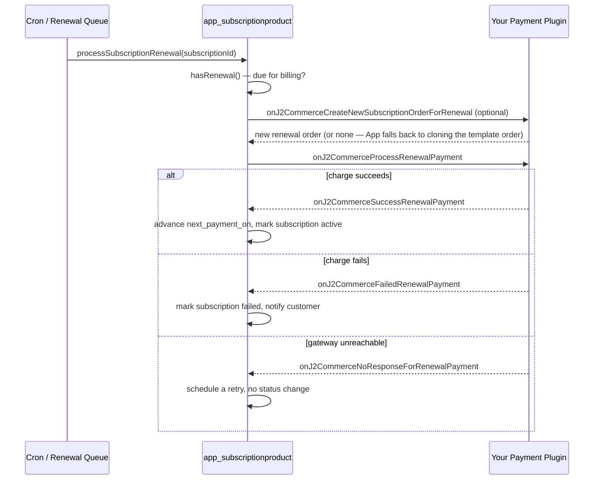
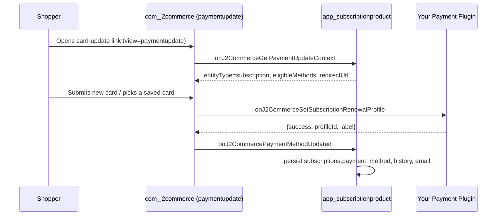

# Subscription Renewal & Card-Relink Support

## Overview

Recurring billing for subscription products is driven by the **app_subscriptionproduct** add-on, not by core J2Commerce. app_subscriptionproduct owns the subscription schedule (`#__j2commerce_subscriptions`), decides when a renewal is due, and creates the renewal order — but it never talks to a gateway API directly. Instead it dispatches events and asks whichever payment plugin took the subscription's original payment to do the actual charging.

This gives a payment plugin **two independent, opt-in contracts**:

1. **Renewal charge** — `onJ2CommerceProcessRenewalPayment`. Fired once per renewal cycle to charge the stored credential for the subscription's next payment.
2. **Relink / card update** — `onJ2CommerceGetSubscriptionRenewalProfileCapability` + `onJ2CommerceSetSubscriptionRenewalProfile`. Lets the shopper (or an admin) swap which saved card/mandate backs *future* renewals, without touching the subscription's billing schedule.

A gateway can implement either contract on its own — supporting renewals does not automatically enable the relink picker, and vice versa. If a payment plugin implements neither, its subscriptions still get created and tracked; they simply never auto-renew and never expose a card-update picker for that gateway. This is the same "fail open, don't break the base feature" design used by the [Supplemental Payment](./supplmental_payment_features.md) contract.

The After-Sale Special Offers and subscription-renewal contracts are also independent of each other: implementing one does not implement the other. Build and test each on its own merits.

## How It Works



Separately, whenever a shopper needs to change the card/mandate backing a subscription — through the in-portal "Update Payment Information" picker or the universal card-update link (`view=paymentupdate`) — the relink contract fires on its own, independent of the renewal cycle above:



## When to Implement This Contract

Implement `onJ2CommerceProcessRenewalPayment` if your gateway can charge a **stored credential** (a vaulted card, mandate, or billing agreement) without the shopper being present. If your gateway has no server-initiated recurring-charge capability, do not implement it — subscriptions paid with that gateway will simply never auto-renew; the shopper still gets a subscription record, but app_subscriptionproduct's renewal cron logs `no_gateway_handler_for_[element]` and routes the cycle through the same no-response/retry-backoff path used for an unreachable gateway.

Implement `onJ2CommerceGetSubscriptionRenewalProfileCapability` and `onJ2CommerceSetSubscriptionRenewalProfile` together if your gateway can also **rewire** which stored credential a subscription bills against, independent of a live charge. A gateway is free to implement the renewal-charge event without the relink pair (the subscription still renews against whatever credential it started with), or to implement the relink pair without renewal support (useful if the gateway is only ever billed manually but you still want shoppers to keep their card on file current).

## Event 1: onJ2CommerceProcessRenewalPayment

Fired once per renewal cycle, after app_subscriptionproduct has confirmed the subscription is due and a renewal order exists (either created by your own `onJ2CommerceCreateNewSubscriptionOrderForRenewal` handler, or by app_subscriptionproduct's fallback that clones the subscription's template order).

### Registration

```php
public static function getSubscribedEvents(): array
{
    return [
        // ... other events ...
        'onJ2CommerceProcessRenewalPayment' => 'onProcessRenewalPayment',
    ];
}
```

### Arguments

Arguments are passed **by name** (`$event->getArgument('name')`), constructed with a named-argument array on the dispatch side — never rely on positional indexing for this event.

| Argument | Type | Description |
|----------|------|--------------|
| `payment_method` | string | The subscription's stored `payment_method` element name — match this against `$this->_name` (or `$this->_element`) before responding. |
| `subscription` | object | The `#__j2commerce_subscriptions` row. |
| `order` | object | The renewal order row. `order_total` is the authoritative charge amount, **not yet converted** — call `CurrencyHelper::gatewayAmount($order)` yourself to get the amount in the order's display currency. |

### Handler Signature

```php
public function onProcessRenewalPayment(Event $event): void
{
    $element      = (string) $event->getArgument('payment_method', '');
    $subscription = $event->getArgument('subscription');
    $order        = $event->getArgument('order');

    if ($element !== $this->_name || $subscription === null || $order === null) {
        return;
    }

    $result = $event->getArgument('result', []);

    try {
        $outcome = $this->getPaymentProcessor()->processRenewalPayment($subscription, $order);
    } catch (\Throwable $e) {
        $this->getClient()->log('Renewal exception: ' . $e->getMessage(), Log::ERROR);
        $result[] = ['success' => false, 'error' => Text::_('PLG_J2COMMERCE_PAYMENT_EXAMPLE_ERR_API_COMMUNICATION')];
        $event->setArgument('result', $result);
        $this->dispatchRenewalOutcome('onJ2CommerceNoResponseForRenewalPayment', $subscription, $order);
        return;
    }

    $result[] = $outcome;
    $event->setArgument('result', $result);

    if (!empty($outcome['success'])) {
        $this->dispatchRenewalOutcome('onJ2CommerceSuccessRenewalPayment', $subscription, $order, true);
        return;
    }

    $this->dispatchRenewalOutcome('onJ2CommerceFailedRenewalPayment', $subscription, $order);
}
```

### Result Shape

Push an array onto `result` (via `$event->setArgument('result', $result)`) with at least a `success` key. An empty `result` after every subscriber has run is treated by app_subscriptionproduct as "no gateway handled this" — it routes the cycle through the retry/backoff path exactly as if the gateway had thrown, so a plugin that forgets to push anything silently disables renewals for its own gateway.

| Key | Type | Required | Description |
|-----|------|----------|--------------|
| `success` | bool | Yes | Whether the renewal charge succeeded. |
| `error` | string\|null | No | Generic, user-safe text only. **Never** pass `$e->getMessage()` through to this field. |

Extra keys (`outcome`, `transaction_id`, `gateway_response`, …) are ignored by the caller but are useful for your own logging — `payment_paypal`'s handler, for example, adds `outcome` (`success` / `failed` / `no_response`) to distinguish a terminal failure from a transient one.

### Follow-Up Outcome Events

After you've pushed a result, dispatch exactly one of the following so app_subscriptionproduct can advance the subscription's status and billing date. These are separate `Joomla\Event\Event` dispatches (not delivered through the `result` array), also with **named** arguments:

| Event | When to dispatch | Extra argument |
|-------|-------------------|-----------------|
| `onJ2CommerceSuccessRenewalPayment` | Charge succeeded. | `updateRenewalDate` (bool, optional) — pass `true` to advance `next_payment_on`; a listener can still override it via `onJ2CommerceDoUpdateRenewalDateOnRenewalSuccess`. |
| `onJ2CommerceFailedRenewalPayment` | Charge was declined/rejected — a terminal failure for this cycle. | — |
| `onJ2CommerceNoResponseForRenewalPayment` | The gateway could not be reached, or you're not sure the charge happened (network timeout, 5xx, etc.). Routes through retry/backoff instead of marking the subscription failed. | — |
| `onJ2CommercePendingRenewalPayment` | The charge is asynchronous and settlement is still pending (e.g., an ACH/bank-debit gateway). Not currently dispatched by any reference plugin, but the handler exists in app_subscriptionproduct for gateways with a genuine pending state. | — |

```php
private function dispatchRenewalOutcome(string $eventName, object $subscription, object $order, ?bool $updateRenewalDate = null): void
{
    $args = ['subscription' => $subscription, 'order' => $order];

    if ($updateRenewalDate !== null) {
        $args['updateRenewalDate'] = $updateRenewalDate;
    }

    Factory::getApplication()->getDispatcher()->dispatch($eventName, new Event($eventName, $args));
}
```

### Optional: Creating the Renewal Order Yourself

Before dispatching `onJ2CommerceProcessRenewalPayment`, app_subscriptionproduct dispatches `onJ2CommerceCreateNewSubscriptionOrderForRenewal` with a single named argument, `subscription`. If no subscriber returns an order, app_subscriptionproduct falls back to cloning the subscription's template order itself — so implementing this event is optional. Gateways that need to attach gateway-specific metadata to the renewal order at creation time (payment_authorizenet does this) can implement it; everyone else can rely on the fallback.

## Event 2: onJ2CommerceGetSubscriptionRenewalProfileCapability

A capability probe. app_subscriptionproduct's in-portal "Update Payment Information" picker calls this once per gateway (result is memoized per request) to decide whether it's worth showing a card picker at all for that gateway — a picker that can't influence billing would be dead UI.

### Registration

```php
public static function getSubscribedEvents(): array
{
    return [
        // ... other events ...
        'onJ2CommerceGetSubscriptionRenewalProfileCapability' => 'onGetSubscriptionRenewalProfileCapability',
    ];
}
```

### Arguments

| Argument | Type | Description |
|----------|------|--------------|
| `element` | string | The gateway's element name — match against `$this->_name`. |

### Handler Signature

```php
public function onGetSubscriptionRenewalProfileCapability(Event $event): void
{
    if ((string) $event->getArgument('element', '') !== $this->_name) {
        return;
    }

    $event->addResult(true);
}
```

Call `$event->addResult()` — never `$event->setArgument('result', ...)` — so that a mismatch from another plugin never clobbers your `true`. If no subscriber calls `addResult(true)`, the capability defaults to `false` and the picker never renders for that gateway.

## Event 3: onJ2CommerceSetSubscriptionRenewalProfile

The actual relink action. Fired both by the in-portal saved-card picker and by the universal `view=paymentupdate` surface (see below) whenever a shopper selects a different saved card, or submits a brand-new one, for a subscription. Your handler owns tokenization (vault a new card, or accept a posted saved-profile id as-is) and rewiring whatever internal lookup your `onJ2CommerceProcessRenewalPayment` handler uses to find the credential to charge. **It never charges anything.**

### Registration

```php
public static function getSubscribedEvents(): array
{
    return [
        // ... other events ...
        'onJ2CommerceGetSubscriptionRenewalProfileCapability' => 'onGetSubscriptionRenewalProfileCapability',
        'onJ2CommerceSetSubscriptionRenewalProfile'            => 'onSetSubscriptionRenewalProfile',
    ];
}
```

### Arguments

| Argument | Type | Description |
|----------|------|--------------|
| `element` | string | The gateway's element name — match against `$this->_name`. |
| `subscription_id` | int | The local subscription's `#__j2commerce_subscriptions.id`. |
| `user_id` | int | The subscription owner's Joomla user id. |
| `profile_id` | string | A durable saved-method id posted by the shopper's saved-card picker (e.g. a vaulted `customerPaymentProfileId`). Empty when the shopper is submitting a brand-new card via a nonce/token instead. |
| `cardInput` | array | Everything else the card form posted — the `paymentupdate` surface forwards the **entire POST body** unchanged; the in-portal picker does not set this key at all, so always default it to `[]`. Each gateway reads its own keys out of it (e.g. an Accept.js data descriptor/value pair). |

### Result Shape

Call `$event->addResult()` with an array. Both callers scan every result for the first one with a truthy `success`:

| Key | Type | Required | Description |
|-----|------|----------|--------------|
| `success` | bool | Yes | Whether the relink succeeded. |
| `profileId` | string | No | The resolved saved-method id now backing renewals. Callers fall back to the posted `profile_id` when omitted (e.g. a minimal `{success: true}` from a plain saved-card relink). |
| `label` | string | No | A human-readable label for the newly linked card (e.g. `"Visa •••4242"`), shown in the confirmation UI and stored for later display. |
| `error` | string | No | Generic, user-safe text only, surfaced when `success` is falsy. |

### Handler Signature

```php
public function onSetSubscriptionRenewalProfile(Event $event): void
{
    if ((string) $event->getArgument('element', '') !== $this->_name) {
        return;
    }

    $subId     = (int) $event->getArgument('subscription_id', 0);
    $userId    = (int) $event->getArgument('user_id', 0);
    $profileId = (string) $event->getArgument('profile_id', '');
    $cardInput = (array) $event->getArgument('cardInput', []);

    try {
        $result = $this->getPaymentProcessor()->setSubscriptionRenewalProfile($subId, $userId, $profileId, $cardInput);
    } catch (\Throwable $e) {
        $this->getClient()->log('onSetSubscriptionRenewalProfile exception: ' . $e->getMessage(), Log::ERROR);
        $result = ['success' => false, 'error' => Text::_('PLG_J2COMMERCE_PAYMENT_EXAMPLE_ERR_API_COMMUNICATION')];
    }

    $event->addResult($result);
}
```

A reference `setSubscriptionRenewalProfile()` implementation:

- Resolves (or lazily creates) the gateway's own customer profile for `$userId`.
- If `$profile_id` is non-empty, **re-verifies it belongs to this user's own saved cards** before accepting it — never trust a posted id at face value.
- Otherwise looks for a nonce/token in `$cardInput` and vaults it as a new payment profile (no `$1` auth/void — a charge-free vault operation only).
- Persists the new linkage against the subscription (e.g. via your own metafield or lookup table — this is entirely gateway-owned storage, not `#__j2commerce_paymentprofiles`).
- Returns `['success' => true, 'profileId' => ..., 'label' => ...]` on success.

## The Universal Payment-Method-Update Surface (`view=paymentupdate`)

`view=paymentupdate` is a standalone, chrome-free page (`index.php?option=com_j2commerce&view=paymentupdate`) that any extension can point a shopper at to update the credential behind one of its own entities — for subscriptions, this is the surface behind both the emailed "update your card" link and the guest (non-logged-in) card-update flow. It never creates or touches an order; the vaulted card/profile is applied directly against the driving extension's entity.

The surface's own contract belongs to the *driving extension* (app_subscriptionproduct implements it for subscriptions), not to payment plugins — a payment plugin only needs to implement `onJ2CommerceSetSubscriptionRenewalProfile` above and the surface will call it automatically. It is documented here only so the relink contract's full request lifecycle is clear:

1. `PaymentupdateContextHelper::resolve()` dispatches `onJ2CommerceGetPaymentUpdateContext` (named args: `contextKey`, `token`, `requestUserId`) and expects a `result` array back with `entityType`, `entityId`, `ownerUserId`, `eligibleMethods`, `redirectUrl`. The same resolution runs on both the page load and the AJAX submit — a context is never trusted across requests.
2. On submit, `PaymentupdateController::submit()` dispatches `onJ2CommerceSetSubscriptionRenewalProfile` with `element`, `subscription_id` (`= $context['entityId']`), `user_id` (`= $context['ownerUserId']`), `profile_id`, and `cardInput` (the raw POST array) — the exact same event and argument set your plugin already implements above.
3. On a successful relink, the controller dispatches `onJ2CommercePaymentMethodUpdated` (`context`, `newMethod`, `profileInfo`) so app_subscriptionproduct can persist `subscriptions.payment_method`, write an audit history row, and send the "payment method updated" email.

Because steps 2 and 3 reuse the identical events and payload shapes as the in-portal saved-card picker, **implementing `onJ2CommerceSetSubscriptionRenewalProfile` once covers both surfaces** — there is no separate event to add for `paymentupdate` support.

## Related Contract: After-Sale Supplemental Payments

`onJ2CommerceGetSupplementalPaymentCapability` and `onJ2CommerceProcessSupplementalPayment` are a **separate**, independent contract for charging a stored credential against an after-sale upsell offer on an already-paid order (not a subscription renewal). They are documented in full in [Supplemental Payment Support](./supplmental_payment_features.md). The two contracts share the same underlying idea — charge a stored token without the shopper re-entering card details — but must be implemented and tested independently: supporting one does not enable the other.

One difference worth calling out because it is easy to get backwards: `onJ2CommerceProcessSupplementalPayment`'s `amount` argument arrives **pre-converted** to the order's display currency (charge it as-is). `onJ2CommerceProcessRenewalPayment` hands you the full `order` object instead and expects **you** to call `CurrencyHelper::gatewayAmount($order)` to get the display-currency charge amount — there is no separate pre-converted `amount` argument on this event.

## Example: Complete Implementation

```php
<?php
declare(strict_types=1);

namespace Your\Plugin\J2Commerce\PaymentExample\Extension;

use J2Commerce\Component\J2commerce\Administrator\Helper\CurrencyHelper;
use Joomla\CMS\Log\Log;
use Joomla\CMS\Language\Text;
use Joomla\CMS\Plugin\CMSPlugin;
use Joomla\Event\Event;
use Joomla\Event\SubscriberInterface;

final class PaymentExample extends CMSPlugin implements SubscriberInterface
{
    protected $_name = 'payment_example';

    public static function getSubscribedEvents(): array
    {
        return [
            'onJ2CommerceGetPaymentPlugins'                        => 'onGetPaymentPlugins',
            'onJ2CommerceGetPaymentOptions'                        => 'onGetPaymentOptions',
            'onJ2CommercePrePayment'                               => 'onPrePayment',
            'onJ2CommercePostPayment'                              => 'onPostPayment',
            'onJ2CommerceProcessRenewalPayment'                    => 'onProcessRenewalPayment',
            'onJ2CommerceGetSubscriptionRenewalProfileCapability'  => 'onGetSubscriptionRenewalProfileCapability',
            'onJ2CommerceSetSubscriptionRenewalProfile'            => 'onSetSubscriptionRenewalProfile',
            'onAjaxPayment_example'                                 => 'onAjaxHandler',
        ];
    }

    public function onGetSubscriptionRenewalProfileCapability(Event $event): void
    {
        if ((string) $event->getArgument('element', '') !== $this->_name) {
            return;
        }

        $event->addResult(true);
    }

    public function onSetSubscriptionRenewalProfile(Event $event): void
    {
        if ((string) $event->getArgument('element', '') !== $this->_name) {
            return;
        }

        $subId     = (int) $event->getArgument('subscription_id', 0);
        $userId    = (int) $event->getArgument('user_id', 0);
        $profileId = (string) $event->getArgument('profile_id', '');
        $cardInput = (array) $event->getArgument('cardInput', []);

        try {
            $result = $this->relinkRenewalProfile($subId, $userId, $profileId, $cardInput);
        } catch (\Throwable $e) {
            $this->log('onSetSubscriptionRenewalProfile exception: ' . $e->getMessage());
            $result = ['success' => false, 'error' => Text::_('PLG_J2COMMERCE_PAYMENT_EXAMPLE_ERR_API_COMMUNICATION')];
        }

        $event->addResult($result);
    }

    public function onProcessRenewalPayment(Event $event): void
    {
        $element      = (string) $event->getArgument('payment_method', '');
        $subscription = $event->getArgument('subscription');
        $order        = $event->getArgument('order');

        if ($element !== $this->_name || $subscription === null || $order === null) {
            return;
        }

        $result = $event->getArgument('result', []);

        try {
            $outcome = $this->chargeStoredCredential($subscription, $order);
        } catch (\Throwable $e) {
            $this->log('Renewal exception: ' . $e->getMessage());
            $result[] = ['success' => false, 'error' => Text::_('PLG_J2COMMERCE_PAYMENT_EXAMPLE_ERR_API_COMMUNICATION')];
            $event->setArgument('result', $result);
            $this->dispatchRenewalOutcome('onJ2CommerceNoResponseForRenewalPayment', $subscription, $order);
            return;
        }

        $result[] = $outcome;
        $event->setArgument('result', $result);

        if (!empty($outcome['success'])) {
            $this->dispatchRenewalOutcome('onJ2CommerceSuccessRenewalPayment', $subscription, $order, true);
            return;
        }

        $this->dispatchRenewalOutcome('onJ2CommerceFailedRenewalPayment', $subscription, $order);
    }

    /** @return array{success: bool, error: ?string} */
    private function chargeStoredCredential(object $subscription, object $order): array
    {
        $storedToken = $this->lookupStoredTokenForSubscription((int) $subscription->id);

        if ($storedToken === null) {
            return ['success' => false, 'error' => Text::_('PLG_J2COMMERCE_PAYMENT_EXAMPLE_ERR_NO_PAYMENT_SELECTED')];
        }

        // $order->order_total is NOT pre-converted for this event — convert it yourself.
        $chargeAmount = CurrencyHelper::gatewayAmount($order);

        $response = $this->getGatewayClient()->chargeStoredToken($storedToken, $chargeAmount, (string) $order->currency_code);

        if (!$response->isSuccessful()) {
            $this->log('Renewal charge failed for subscription #' . $subscription->id . ': ' . $response->getErrorMessage());

            return ['success' => false, 'error' => Text::_('PLG_J2COMMERCE_PAYMENT_EXAMPLE_ERR_API_COMMUNICATION')];
        }

        return ['success' => true];
    }

    /** @return array{success: bool, profileId?: string, label?: string, error?: string} */
    private function relinkRenewalProfile(int $subId, int $userId, string $profileId, array $cardInput): array
    {
        if ($subId <= 0 || $userId <= 0) {
            return ['success' => false, 'error' => Text::_('JLIB_APPLICATION_ERROR_ACCESS_FORBIDDEN')];
        }

        if ($profileId !== '') {
            // A saved-card relink — re-verify ownership before trusting it.
            if (!$this->userOwnsSavedCard($userId, $profileId)) {
                return ['success' => false, 'error' => Text::_('PLG_J2COMMERCE_PAYMENT_EXAMPLE_ERR_CARD_NOT_OWNED')];
            }
        } else {
            // A brand-new card — vault the token posted in cardInput (charge-free).
            $token = (string) ($cardInput['example_gateway_token'] ?? '');

            if ($token === '') {
                return ['success' => false, 'error' => Text::_('PLG_J2COMMERCE_PAYMENT_EXAMPLE_ERR_NO_PAYMENT_SELECTED')];
            }

            $profileId = $this->vaultNewCard($userId, $token);
        }

        $this->storeSubscriptionRenewalToken($subId, $profileId);

        return [
            'success'   => true,
            'profileId' => $profileId,
            'label'     => $this->describeSavedCard($userId, $profileId),
        ];
    }

    private function dispatchRenewalOutcome(string $eventName, object $subscription, object $order, ?bool $updateRenewalDate = null): void
    {
        $args = ['subscription' => $subscription, 'order' => $order];

        if ($updateRenewalDate !== null) {
            $args['updateRenewalDate'] = $updateRenewalDate;
        }

        \Joomla\CMS\Factory::getApplication()->getDispatcher()->dispatch($eventName, new Event($eventName, $args));
    }

    private function log(string $message): void
    {
        Log::add($message, Log::ERROR, 'j2commerce.payment_example');
    }

    // lookupStoredTokenForSubscription(), userOwnsSavedCard(), vaultNewCard(),
    // storeSubscriptionRenewalToken(), describeSavedCard(), getGatewayClient()
    // follow the same patterns your plugin already uses for the checkout
    // PrePayment/PostPayment flow — see the full reference implementation in
    // plugins/j2commerce/payment_authorizenet/src/Extension/PaymentAuthorizenet.php
    // (event handlers around lines 305-340 and 553-602) and
    // plugins/j2commerce/payment_authorizenet/src/Service/PaymentProcessor.php
    // (processRenewalPayment() around line 146 and setSubscriptionRenewalProfile()
    // around line 605).
}
```

## Best Practices

1. **Amount handling differs from the supplemental-payment contract.** `onJ2CommerceProcessRenewalPayment` gives you the full order row and expects you to call `CurrencyHelper::gatewayAmount($order)` yourself; `onJ2CommerceProcessSupplementalPayment` hands you an already-converted `amount`. Mixing these up either double-converts or under-charges.
2. **Named arguments throughout.** Every event in this contract (`ProcessRenewalPayment`, `GetSubscriptionRenewalProfileCapability`, `SetSubscriptionRenewalProfile`, and the `Success`/`Failed`/`NoResponse`/`PendingRenewalPayment` follow-ups) is dispatched with a named-argument array — read arguments with `$event->getArgument('name')`, never by position. This is a deliberate departure from older positional-style J2Commerce events (`onJ2CommerceCalculateFees`, `onJ2CommercePostPayment`) that still read `$event->getArguments()[0]` for the element name — do not copy that pattern into new subscription-contract handlers.
3. **Match on the right field.** `ProcessRenewalPayment` and the outcome follow-ups key off `subscription->payment_method`; `GetSubscriptionRenewalProfileCapability` and `SetSubscriptionRenewalProfile` key off a plain `element` argument. Both should equal `$this->_name` (or `$this->_element`, depending on your plugin's convention) — a mismatched comparison means your handler silently never fires.
4. **Relink never charges.** `onJ2CommerceSetSubscriptionRenewalProfile` must be a charge-free vault/verify operation only. If you need a `$1` network-validation auth, void it immediately — never leave an uncaptured authorization sitting on the shopper's card just to confirm it's live.
5. **Re-verify ownership on every posted `profile_id`.** Both the in-portal picker and `view=paymentupdate` forward whatever the client posts; never trust it without confirming the saved method actually belongs to `user_id`.
6. **Push a result even on failure.** An empty `result` after `ProcessRenewalPayment` looks identical to "no gateway plugin installed" to app_subscriptionproduct and gets routed through the no-response retry path — always push at least `['success' => false, 'error' => ...]`.
7. **`GetSubscriptionRenewalProfileCapability` uses `addResult()`, not `setArgument('result', ...)`.** The capability cache in app_subscriptionproduct treats any `true` in the result set as capable — clobbering the array with `setArgument` risks erasing another plugin's `true`.
8. **Catch `\Throwable` around every gateway call** in both events. Log the real error server-side and return the generic failure shape — never surface `$e->getMessage()` to the shopper.
9. **These are two independent opt-in contracts, and a third (supplemental payments) sits alongside them.** Implementing renewal charging does not give you the relink picker; implementing the relink pair does not give you renewals; and neither gives you after-sale supplemental charging. Build and test each pair on its own.

## Testing Checklist

- Create a subscription paid with your gateway and confirm a renewal order is created (either by your `onJ2CommerceCreateNewSubscriptionOrderForRenewal` handler or the core fallback) when the renewal cron/queue runs.
- Force a successful renewal charge and confirm `next_payment_on` advances and the subscription stays/returns to `active`.
- Force a declined charge and confirm the subscription moves to `failed` and the customer is notified.
- Force a network/timeout error and confirm the subscription is **not** marked failed — it should show a retry-scheduled history entry instead.
- If you implement the relink pair: confirm `onJ2CommerceGetSubscriptionRenewalProfileCapability` gates the picker's visibility (uninstall/disable the plugin params flag and confirm the picker disappears for that gateway).
- Submit a relink with a saved-card `profile_id` that does **not** belong to the requesting user and confirm it is rejected, not silently accepted.
- Submit a relink through both the in-portal picker and `view=paymentupdate` and confirm both end in the same `onJ2CommerceSetSubscriptionRenewalProfile` call with the same result shape.
- After a successful relink, force the next renewal and confirm the charge goes against the newly linked credential, not the original one.

## Related

- [Supplemental Payment Support](./supplmental_payment_features.md) - The independent after-sale add-on charge contract
- [Saved Payment Methods Event](./saved_methods_event.md) - Unified Payment Methods tab integration
- [Payment Profiles Table](./payment_profiles.md) - Shared database table for stored gateway customer profile IDs
- [Payment Plugin Development](./payment-plugin-development.md) - General payment plugin guide
