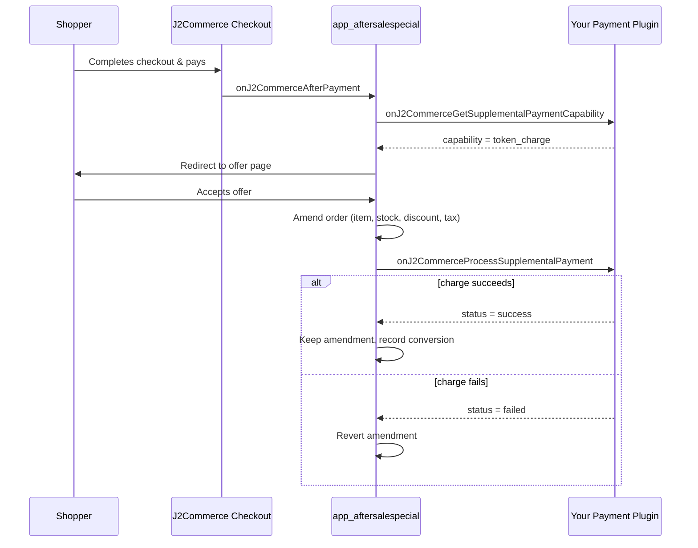

# Supplemental Payment Support (After-Sale Special Offers)

## Overview

After a customer completes checkout, J2Commerce can show one or more post-purchase "special offer" add-ons on the order confirmation flow — a discounted accessory, a bundle upsell, and so on. If the shopper accepts an offer, the add-on item is appended to their **existing, already-paid order** and charged against the **same payment method they originally used**, using a stored credential (token). The shopper never re-enters card details.

This behavior is provided by the `app_aftersalespecial` add-on. It does not process payments itself — it delegates the actual charge to whichever payment plugin took the order's original payment. A payment plugin opts in to this feature by implementing **two events**. If a gateway does not implement them, orders paid with that gateway never see after-sale offers at all: display is gated on a capability probe (`AppAftersalespecial::canSettleCharges()`) that runs immediately after payment.

The After-Sale Special Offers add-on is distributed separately from the J2Commerce core component. This page only covers the contract a payment plugin must implement to interoperate with it.

## How It Works

1. Checkout completes; the customer's order is paid and moves to an eligible order state.
2. `AppAftersalespecial::onAfterPayment()` fires. It calls `canSettleCharges()`, which asks the order's payment plugin for its **capability** via `onJ2CommerceGetSupplementalPaymentCapability`. If the gateway returns anything other than `none` (and the order has a logged-in user), the offer queue is built and stored in session.
3. The shopper is redirected to the offer page (`view=aftersale`) at the confirmation step and shown the first offer in the queue.
4. If the shopper accepts, `AftersaleController::accept()` takes an atomic per-offer claim, amends the order (adds the line item, updates stock/discount/tax), and asks the gateway to **charge** the delta via `onJ2CommerceProcessSupplementalPayment`.
5. On success, the amendment is kept and a conversion row is recorded. On failure, the order amendment (item, stock, discount, tax) is atomically reverted — the order is left exactly as it was before the offer was accepted.



## When to Implement This Contract

Implement this contract if your payment plugin can charge a **stored credential** without the customer re-entering payment details — for example a card vaulted through your gateway's customer-profile API. If your gateway has no vault/tokenization support, do not implement these events; `app_aftersalespecial` will simply never queue offers for orders paid with that gateway.

This contract is **independent** of the subscription/renewal events (`onJ2CommerceProcessRenewalPayment` and friends). Supporting subscription renewals does not automatically enable after-sale offers, and vice versa — each event pair must be implemented on its own merits.

## Event 1: onJ2CommerceGetSupplementalPaymentCapability

Called once per eligible order, immediately after payment, to determine whether the gateway that took the order's payment can settle a later supplemental charge. If no plugin returns a result, the capability defaults to `none` and no offers are ever shown for that order.

### Registration

```php
public static function getSubscribedEvents(): array
{
    return [
        // ... other events ...
        'onJ2CommerceGetSupplementalPaymentCapability' => 'onGetSupplementalPaymentCapability',
    ];
}
```

### Arguments

Arguments are passed by name (`$event->getArgument('name')`), not by position.

| Argument | Type | Description |
|----------|------|--------------|
| `payment_method` | string | The order's `orderpayment_type` element name — match this against `$this->_name` before responding. |
| `order` | object | The order table row. |

### Handler Signature

```php
public function onGetSupplementalPaymentCapability(Event $event): void
{
    if ((string) $event->getArgument('payment_method', '') !== $this->_name) {
        return;
    }

    $event->addResult(['capability' => 'token_charge']);
}
```

Call `$event->addResult()` — never `$event->setArgument('result', ...)` — so multiple plugins can each contribute a result without clobbering one another.

### Capability Values

| Value | Meaning |
|-------|---------|
| `token_charge` | The gateway can charge a stored customer token without the shopper's involvement. |
| `order_update` | Reserved for a future non-token settlement path. Not currently consumed differently from `token_charge` by the caller. |
| *(no result added)* | Treated as `none` — offers are never shown for orders paid with this gateway. |

## Event 2: onJ2CommerceProcessSupplementalPayment

Called once, at most, per accepted offer — only after `app_aftersalespecial` has already amended the order and needs the actual charge executed.

### Registration

```php
public static function getSubscribedEvents(): array
{
    return [
        // ... other events ...
        'onJ2CommerceGetSupplementalPaymentCapability' => 'onGetSupplementalPaymentCapability',
        'onJ2CommerceProcessSupplementalPayment'        => 'onProcessSupplementalPayment',
    ];
}
```

### Arguments

| Argument | Type | Description |
|----------|------|--------------|
| `payment_method` | string | The order's `orderpayment_type` element name — match this against `$this->_name` before responding. |
| `order` | object | The order table row. |
| `amount` | float | The charge amount, **already converted** to the order's display currency. Charge it as-is — never run your currency conversion helper on it again. |
| `payment_profile` | object\|null | The user's row from `#__j2commerce_paymentprofiles` for this provider (columns: `id`, `user_id`, `provider`, `customer_profile_id`, `environment`, `is_default`, `payment_token`, `token_label`, `is_renewal_default`). May be `null`. |
| `reference` | string | A reference string in the form `aftersale:[order_id]:[offer_id]` — use it as an invoice/description reference on the gateway call for traceability. |

### Result Shape

`addResult()` must be called with exactly these keys on **every** code path — an empty or missing `status` is treated as "no handler responded" and the charge is reported as failed.

| Key | Type | Required | Description |
|-----|------|----------|--------------|
| `status` | string | Yes, non-empty | One of `success`, `failed`, `pending`. |
| `transaction_id` | string\|null | No | The gateway's transaction identifier, when available. |
| `message` | string\|null | No | Generic, user-safe text only. **Never** pass `$e->getMessage()` through to this field. |

### Handler Signature

```php
public function onProcessSupplementalPayment(Event $event): void
{
    if ((string) $event->getArgument('payment_method', '') !== $this->_name) {
        return;
    }

    $order          = $event->getArgument('order');
    $amount         = (float) $event->getArgument('amount', 0);
    $paymentProfile = $event->getArgument('payment_profile');
    $reference      = (string) $event->getArgument('reference', '');

    try {
        $outcome = $this->getPaymentProcessor()->processSupplementalPayment($order, $amount, $paymentProfile, $reference);
    } catch (\Throwable $e) {
        $this->getClient()->log('onProcessSupplementalPayment exception: ' . $e->getMessage(), Log::ERROR);
        $outcome = ['status' => 'failed', 'transaction_id' => null, 'message' => Text::_('PLG_J2COMMERCE_PAYMENT_EXAMPLE_ERR_API_COMMUNICATION')];
    }

    $event->addResult($outcome);
}
```

## Example: Complete Implementation

The events wire into a service class the same way payment plugins already structure their gateway logic — the extension class stays a thin dispatcher, and the actual charge logic lives in a processor/service class.

```php
<?php
declare(strict_types=1);

namespace Your\Plugin\J2Commerce\PaymentExample\Extension;

use Joomla\CMS\Log\Log;
use Joomla\CMS\Language\Text;
use Joomla\CMS\Plugin\CMSPlugin;
use Joomla\Event\Event;
use Joomla\Event\SubscriberInterface;

final class PaymentExample extends CMSPlugin implements SubscriberInterface
{
    protected $_name = 'payment_example';

    public static function getSubscribedEvents(): array
    {
        return [
            'onJ2CommerceGetPaymentPlugins'                 => 'onGetPaymentPlugins',
            'onJ2CommerceGetPaymentOptions'                 => 'onGetPaymentOptions',
            'onJ2CommercePrePayment'                        => 'onPrePayment',
            'onJ2CommercePostPayment'                        => 'onPostPayment',
            'onJ2CommerceGetSupplementalPaymentCapability'  => 'onGetSupplementalPaymentCapability',
            'onJ2CommerceProcessSupplementalPayment'        => 'onProcessSupplementalPayment',
            'onAjaxPayment_example'                          => 'onAjaxHandler',
        ];
    }

    public function onGetSupplementalPaymentCapability(Event $event): void
    {
        if ((string) $event->getArgument('payment_method', '') !== $this->_name) {
            return;
        }

        $event->addResult(['capability' => 'token_charge']);
    }

    public function onProcessSupplementalPayment(Event $event): void
    {
        if ((string) $event->getArgument('payment_method', '') !== $this->_name) {
            return;
        }

        $order          = $event->getArgument('order');
        $amount         = (float) $event->getArgument('amount', 0);
        $paymentProfile = $event->getArgument('payment_profile');
        $reference      = (string) $event->getArgument('reference', '');

        try {
            $outcome = $this->processSupplementalPayment($order, $amount, $paymentProfile, $reference);
        } catch (\Throwable $e) {
            $this->log('onProcessSupplementalPayment exception: ' . $e->getMessage());
            $outcome = ['status' => 'failed', 'transaction_id' => null, 'message' => Text::_('PLG_J2COMMERCE_PAYMENT_EXAMPLE_ERR_API_COMMUNICATION')];
        }

        $event->addResult($outcome);
    }

    /** @return array{status: string, transaction_id: ?string, message: ?string} */
    private function processSupplementalPayment(object $order, float $amount, ?object $storedProfile, string $reference): array
    {
        $userId = (int) ($order->user_id ?? 0);

        if ($userId <= 0 || $amount <= 0) {
            return ['status' => 'failed', 'transaction_id' => null, 'message' => Text::_('PLG_J2COMMERCE_PAYMENT_EXAMPLE_ERR_NO_PAYMENT_SELECTED')];
        }

        // Resolve the gateway-side customer id from YOUR OWN environment-scoped lookup —
        // never trust $storedProfile->customer_profile_id blindly. A stale, other-environment,
        // or other-provider value paired with a local payment profile id will be rejected by
        // the gateway.
        $customerId = $this->resolveGatewayCustomerId($userId);

        if ($customerId === null) {
            return ['status' => 'failed', 'transaction_id' => null, 'message' => Text::_('PLG_J2COMMERCE_PAYMENT_EXAMPLE_ERR_API_COMMUNICATION')];
        }

        // Card selection priority: (1) the card that matches the order's original checkout
        // transaction, (2) the app-resolved $storedProfile->payment_token — AFTER confirming
        // it belongs to this user's own saved cards, (3) the most recently saved card.
        $cardId = $this->resolveChargeCardId($userId, (string) ($order->transaction_id ?? ''), (string) ($storedProfile->payment_token ?? ''));

        if ($cardId === null) {
            return ['status' => 'failed', 'transaction_id' => null, 'message' => Text::_('PLG_J2COMMERCE_PAYMENT_EXAMPLE_ERR_CARD_NOT_OWNED')];
        }

        // $amount is ALREADY converted to the order's display currency — charge it as-is.
        $response = $this->getGatewayClient()->chargeStoredCard($customerId, $cardId, $amount, $reference);

        if (!$response->isSuccessful()) {
            $this->log('Supplemental charge failed for order #' . ($order->order_id ?? '?') . ': ' . $response->getErrorMessage());

            return ['status' => 'failed', 'transaction_id' => null, 'message' => Text::_('PLG_J2COMMERCE_PAYMENT_EXAMPLE_ERR_API_COMMUNICATION')];
        }

        return ['status' => 'success', 'transaction_id' => $response->getTransactionId(), 'message' => null];
    }

    private function log(string $message): void
    {
        Log::add($message, Log::ERROR, 'j2commerce.payment_example');
    }

    // resolveGatewayCustomerId(), resolveChargeCardId(), and getGatewayClient() follow the
    // same patterns your plugin already uses for the checkout PrePayment/PostPayment flow —
    // see PaymentProcessor::processSupplementalPayment() and
    // PaymentProcessor::resolveSupplementalPaymentProfileId() in
    // plugins/j2commerce/payment_authorizenet/src/Service/PaymentProcessor.php for a complete
    // reference implementation.
}
```

For a full, working reference — including the environment-scoped customer lookup and the transaction-based card-matching logic — read `plugins/j2commerce/payment_authorizenet/src/Extension/PaymentAuthorizenet.php` (event handlers, around lines 380-414) and `plugins/j2commerce/payment_authorizenet/src/Service/PaymentProcessor.php` (`processSupplementalPayment()` and `resolveSupplementalPaymentProfileId()`, around lines 795-890). `payment_swish` implements the same contract as a second reference point.

## Best Practices

1. **Amount is pre-converted.** `amount` has already been run through the order's currency conversion. Re-converting it double-applies the currency rate and overcharges or undercharges the customer.
2. **Resolve the gateway customer id yourself, environment-scoped.** Do not blindly trust `payment_profile->customer_profile_id`. A stale value, one from the wrong environment (sandbox vs. production), or one belonging to a different provider will be rejected by the gateway when paired with a local payment profile id — this has been a real production failure mode (Authorize.Net error E00003: a foreign GUID sent as `customerProfileId`).
3. **Card selection priority.** Prefer, in order: (a) the card matching the order's original checkout transaction (e.g., by last-4 lookup against the transaction record), (b) the app-resolved `payment_profile->payment_token`, but only **after** confirming it belongs to this user's own saved cards, (c) the user's most recently saved card. Never charge a token without confirming ownership first.
4. **Fail closed.** If you are uncertain whether a charge can be safely made, return `status => 'failed'`. `app_aftersalespecial` atomically reverts the order item, stock, discount, and tax rows on a failed charge — a failed supplemental charge never corrupts the order. A false "success" cannot be undone the same way.
5. **No idempotency logic needed in the plugin.** `AftersaleController::accept()` takes an atomic per-`(offer, order)` claim before it ever calls your handler, so your event is invoked at most once per accepted offer. You do not need to add your own duplicate-charge guard for this contract.
6. **Catch `\Throwable` around the gateway call.** Log the real error server-side through your plugin's logger and return the generic failure shape from the Result Shape table — never surface `$e->getMessage()` in the `message` field.
7. **Guests never reach the charge.** `canSettleCharges()` requires a logged-in user (`user_id > 0`) for any `token_charge`-capable gateway, so your handler will never be invoked for a guest checkout.
8. **This is a separate contract from subscription renewals.** Implementing `onJ2CommerceProcessRenewalPayment` does not implement this contract, and implementing this contract does not enable subscription renewals — build and test each independently.
9. **Force immediate capture.** Ignore any auth-only / manual-capture plugin setting for supplemental charges and always authorize **and** capture in one step. The supplemental transaction id is stored only in the after-sale conversion record — no admin capture screen targets it, so a capture-later authorization would expire uncaptured while the add-on item remains on the order.

## Testing Checklist

- Place an order using your gateway with an eligible order state and a logged-in customer.
- Confirm the after-sale offer page appears after checkout (requires `app_aftersalespecial` installed and an active promotion whose rules match the order).
- Accept an offer and verify:
  - A new order item was added to the order.
  - A row exists in `#__j2commerce_appaftersalespecial_conversions` with `status = accepted` and a populated `transaction_id`.
  - The charge appears in your gateway's dashboard for the correct amount and card.
- Force a failure path (e.g., an invalid/expired stored token) and verify:
  - The customer sees a generic error, not gateway-internal detail.
  - The added order item, stock adjustment, discount, and tax rows are all reverted — the order is back to its pre-offer state.
  - The conversion row records `status = payment_failed`, not `accepted`.
- Confirm a guest checkout with your gateway never shows an after-sale offer.
- Confirm an order paid with a gateway that does **not** implement this contract never shows an after-sale offer.

## Related

- [Payment Profiles Table](./payment_profiles.md) - Shared database table for stored gateway customer profile IDs
- [Saved Payment Methods Event](./saved_methods_event.md) - Unified Payment Methods tab integration
- [Payment Plugin Development](./payment-plugin-development.md) - General payment plugin guide
