# BoxPacker Integration

J2Commerce provides a built-in 3D bin packing system that any shipping plugin can use to determine how many boxes are needed for an order, what dimensions those boxes are, and what the total weight per box is. This information drives carrier API rate requests (UPS, FedEx, AtoShip, DHL, and others) more accurately than naive approaches.

The system has two parts:

- **`ShipperHelper`** — A static helper that wraps `dvdoug/boxpacker` v4. Call one method; get optimally packed boxes back in store units, ready for any carrier API.
- **`BoxPackerField`** — A Joomla form field that renders a dynamic table in plugin admin settings so store owners can define custom box sizes without writing code.

---

## Overview

### The Problem It Solves

Without ShipperHelper, shipping plugins use naive packing strategies:

- **Single parcel** — Sum all item weights, use max dimensions. One package per order regardless of how many items. Inaccurate for mixed-size orders.
- **Per-item** — One package per item unit. 50 items of a small SKU = 50 API requests for 50 tiny boxes. Inflated rates.

Neither approach fits items into the fewest boxes while respecting physical limits. The result is either underquoted shipping (store absorbs the difference) or overquoted shipping (customers abandon carts).

ShipperHelper uses the `dvdoug/boxpacker` v4 algorithm — a production-grade 4D bin packing solver — to optimally pack items into boxes you define. When no boxes are defined, it falls back to per-item mode automatically.

### Architecture

```mermaid
graph TD
    A["Plugin XML<br/>&#123;type=BoxPacker&#125;"] --> B["Store owner defines<br/>custom box sizes"]
    B --> C["params stored as JSON<br/>in plugin config"]
    C --> D["getCustomBoxesFromParams()"]
    E["Plugin code<br/>carrier preset boxes"] --> F["createBox()"]
    D --> G["array_merge"]
    F --> G
    G --> H["packItems(boxes, items, options)"]
    I["Order cart items"] --> H
    H --> J{boxes empty?}
    J -->|Yes| K["getPerItemPackages()<br/>method: per_item"]
    J -->|No| L["dvdoug/boxpacker<br/>Packer::pack()"]
    L --> M["PackingResult<br/>boxes + unpacked"]
    K --> M
    M --> N["Plugin builds<br/>carrier API request"]
```



### Dependency

The BoxPacker library ships with J2Commerce at `libraries/j2commerce/vendor/dvdoug/boxpacker/`. `ShipperHelper` loads its autoloader on demand — no Composer setup required in your plugin.

```
Package:  dvdoug/boxpacker ^4.0
License:  MIT
PHP:      8.2+
Location: libraries/j2commerce/vendor/dvdoug/boxpacker/
```

BoxPacker v4 requires all dimensions in **integer millimetres** and all weights in **integer grams**. ShipperHelper handles this conversion transparently. Plugin developers work entirely in store units (inches, centimetres, pounds, kilograms, or whatever the store is configured for).

---

## Quick Start

The complete integration for a shipping plugin takes five steps.

### Step 1: Add BoxPackerField to your plugin XML

```xml
<!-- plugins/j2commerce/shipping_example/shipping_example.xml -->
<config>
    <fields name="params">
        <fieldset name="basic">

            <!-- Packing mode toggle — lets store owner choose per-item or box packing -->
            <field name="packing_mode"
                   type="list"
                   label="PLG_J2COMMERCE_SHIPPING_EXAMPLE_FIELD_PACKING_MODE"
                   description="PLG_J2COMMERCE_SHIPPING_EXAMPLE_FIELD_PACKING_MODE_DESC"
                   default="per_item">
                <option value="per_item">PLG_J2COMMERCE_SHIPPING_EXAMPLE_PACKING_PER_ITEM</option>
                <option value="box_packing">PLG_J2COMMERCE_SHIPPING_EXAMPLE_PACKING_BOX</option>
            </field>

            <!-- Use J2Commerce Weight/Length custom fields (store DB IDs, not raw strings) -->
            <field name="weight_unit"
                   type="Weight"
                   label="PLG_J2COMMERCE_SHIPPING_EXAMPLE_FIELD_WEIGHT_UNIT"
                   filter_units="lb,kg"
                   required="true"
                   addfieldprefix="J2Commerce\Component\J2commerce\Administrator\Field"
            />
            <field name="dimension_unit"
                   type="Length"
                   label="PLG_J2COMMERCE_SHIPPING_EXAMPLE_FIELD_DIMENSION_UNIT"
                   filter_units="in,cm"
                   required="true"
                   addfieldprefix="J2Commerce\Component\J2commerce\Administrator\Field"
            />

            <!-- Carrier preset boxes toggle -->
            <field name="use_preset_boxes"
                   type="radio"
                   layout="joomla.form.field.radio.switcher"
                   label="PLG_J2COMMERCE_SHIPPING_EXAMPLE_FIELD_USE_PRESET_BOXES"
                   description="PLG_J2COMMERCE_SHIPPING_EXAMPLE_FIELD_USE_PRESET_BOXES_DESC"
                   filter="integer"
                   default="1"
                   showon="packing_mode:box_packing">
                <option value="0">JNO</option>
                <option value="1">JYES</option>
            </field>

            <!-- Item rotation behaviour -->
            <field name="rotation"
                   type="list"
                   label="PLG_J2COMMERCE_SHIPPING_EXAMPLE_FIELD_ROTATION"
                   description="PLG_J2COMMERCE_SHIPPING_EXAMPLE_FIELD_ROTATION_DESC"
                   default="best_fit"
                   showon="packing_mode:box_packing">
                <option value="best_fit">PLG_J2COMMERCE_SHIPPING_EXAMPLE_ROTATION_BEST_FIT</option>
                <option value="keep_flat">PLG_J2COMMERCE_SHIPPING_EXAMPLE_ROTATION_KEEP_FLAT</option>
                <option value="never">PLG_J2COMMERCE_SHIPPING_EXAMPLE_ROTATION_NEVER</option>
            </field>

            <!-- BoxPacker custom box definitions table -->
            <field name="box_list"
                   type="BoxPacker"
                   label="PLG_J2COMMERCE_SHIPPING_EXAMPLE_FIELD_BOX_LIST"
                   description="PLG_J2COMMERCE_SHIPPING_EXAMPLE_FIELD_BOX_LIST_DESC"
                   addfieldprefix="J2Commerce\Component\J2commerce\Administrator\Field"
                   showon="packing_mode:box_packing" />
        </fieldset>
    </fields>
</config>
```

> **Note:** The `packing_mode` field is optional. If you omit it, pass an empty `$boxes` array to `packItems()` for per-item mode, or always pass boxes for box packing mode. Including it gives the store owner explicit control over which strategy is used.

### Step 2: Read custom boxes in your rate handler

```php
// File: plugins/j2commerce/shipping_example/src/Extension/ShippingExample.php

use J2Commerce\Component\J2commerce\Administrator\Helper\ShipperHelper;

public function onGetShippingRates(Event $event): void
{
    $args  = $event->getArguments();
    $order = $args[0] ?? null;

    if ($order === null) {
        return;
    }

    $items = method_exists($order, 'getItems') ? $order->getItems() : [];

    // Check packing mode — per-item passes empty boxes, box packing loads definitions
    $packingMode = $this->params->get('packing_mode', 'per_item');
    $boxes = [];

    if ($packingMode === 'box_packing') {
        $boxes = ShipperHelper::getCustomBoxesFromParams($this->params, 'box_list');
    }

    // Pack items — empty boxes array falls back to per-item automatically
    $result = ShipperHelper::packItems($boxes, $items, [
        'weight_unit_id' => (int) $this->params->get('weight_unit', 1),
        'length_unit_id' => (int) $this->params->get('dimension_unit', 1),
    ]);

    // $result->boxes is an array of PackedBoxResult objects
    foreach ($result->boxes as $packedBox) {
        // Build your carrier API request using $packedBox properties
        $this->addCarrierPackage(
            length: $packedBox->outerLength,
            width:  $packedBox->outerWidth,
            height: $packedBox->outerHeight,
            weight: $packedBox->totalWeight,
        );
    }

    // Publish results back to the event
    $rates = $this->fetchCarrierRates();
    $event->setArgument('result', array_merge($event->getArgument('result', []), $rates));
}
```

### Step 3: Register the field prefix in services/provider.php

The `BoxPackerField` lives in the core component namespace. No extra DI registration is needed — the `addfieldprefix` attribute in your XML handles it.

### Step 4: Test with the admin preview

When you save the plugin and open its settings, the `BoxPackerField` renders a packing preview section below the box table. Add sample items matching a real order (dimensions in store units) and click **Preview Packing**. The preview calls the core component AJAX endpoint and displays results immediately.

### Step 5: Handle unpacked items

```php
if ($result->hasUnpackedItems()) {
    // Items exist that don't fit any defined box.
    // Options: log a warning, fall back to per-item for those items,
    // or return an error rate forcing the customer to call for a quote.
    foreach ($result->unpacked as $item) {
        // $item is an array: description, length, width, height, weight
    }
}
```

---

## BoxPackerField XML Reference

The field type is `BoxPacker`. It renders a dynamic table in plugin admin settings where store owners add, edit, and remove box definitions. The JSON array of box definitions is stored in the plugin's `params` column.

### Complete XML Snippet

```xml
<field name="box_list"
       type="BoxPacker"
       label="PLG_J2COMMERCE_SHIPPING_EXAMPLE_FIELD_BOX_LIST"
       description="PLG_J2COMMERCE_SHIPPING_EXAMPLE_FIELD_BOX_LIST_DESC"
       addfieldprefix="J2Commerce\Component\J2commerce\Administrator\Field" />
```

### Attributes

| Attribute | Required | Value | Notes |
|-----------|----------|-------|-------|
| `name` | Yes | Any string | Used as the key in plugin params. Pass this name to `getCustomBoxesFromParams()` as the second argument if it is not the default `box_list`. |
| `type` | Yes | `BoxPacker` | Selects the `BoxPackerField` class. |
| `label` | Yes | Language key | Shown as the field label above the table. |
| `description` | No | Language key | Shown as help text below the label. |
| `addfieldprefix` | Yes | `J2Commerce\Component\J2commerce\Administrator\Field` | Required so Joomla can resolve the `BoxPacker` type to `BoxPackerField`. |

### Stored JSON Format

Each row in the table is serialized as a JSON object. The complete stored value looks like:

```json
[
  {
    "name": "Small Box",
    "outer_length": 30,
    "outer_width": 20,
    "outer_height": 15,
    "inner_length": 29,
    "inner_width": 19,
    "inner_height": 14,
    "box_weight": 0.3,
    "max_weight": 10
  },
  {
    "name": "Large Box",
    "outer_length": 60,
    "outer_width": 40,
    "outer_height": 30,
    "inner_length": 59,
    "inner_width": 39,
    "inner_height": 29,
    "box_weight": 0.8,
    "max_weight": 25
  }
]
```

All dimension and weight values are stored in the store's configured units (whatever the store owner set up in J2Commerce configuration). `ShipperHelper` converts them to mm/g internally before passing them to BoxPacker.

### Column Descriptions

| Column | Description |
|--------|-------------|
| **Box Name** | Identifier passed through to `PackedBoxResult::$reference`. Use the carrier box name (e.g., "UPS Small Express Box") for clarity. |
| **Outer Length / Width / Height** | External dimensions of the box including packaging material. Used for volumetric weight calculations. |
| **Inner Length / Width / Height** | Usable interior dimensions. Items are packed against these constraints. If left empty, the field defaults to the outer dimensions. |
| **Box Weight** | The empty box's own weight (packaging material). Added to item weights for total package weight. |
| **Max Weight** | Maximum total package weight the box can carry. BoxPacker uses this to determine when to open a new box. Set to `0` for unlimited. |

---

## ShipperHelper API Reference

**Namespace:** `J2Commerce\Component\J2commerce\Administrator\Helper`
**File:** `administrator/components/com_j2commerce/src/Helper/ShipperHelper.php`

All methods are static.

---

### `packItems()`

The primary entry point. Packs cart items into the fewest boxes possible.

```php
public static function packItems(
    array $boxes,
    array $items,
    array $options = []
): PackingResult
```

**Parameters**

| Parameter | Type | Description |
|-----------|------|-------------|
| `$boxes` | `array` | Box definitions. Each element is an array with the keys described in the `createBox()` reference below. Typically from `getCustomBoxesFromParams()` plus any carrier preset arrays you define. Pass an empty array to activate per-item fallback. |
| `$items` | `array` | Cart items or order items. Each element can be an array or object. ShipperHelper normalizes several property naming conventions — see Item Normalization below. |
| `$options` | `array` | Packing options (all optional). See Options table below. |

**Options**

| Key | Type | Default | Description |
|-----|------|---------|-------------|
| `weight_unit_id` | `int` | `1` | The store's weight unit ID from `#__j2commerce_weights`. ShipperHelper uses `WeightHelper` to convert from this unit to grams. |
| `length_unit_id` | `int` | `1` | The store's length unit ID from `#__j2commerce_lengths`. ShipperHelper uses `LengthHelper` to convert from this unit to millimetres. |
| `default_weight` | `float` | `0.1` | Fallback weight in store units for items that have no weight set. |
| `default_length` | `float` | `1.0` | Fallback length in store units for items with no length set. |
| `default_width` | `float` | `1.0` | Fallback width in store units for items with no width set. |
| `default_height` | `float` | `1.0` | Fallback height in store units for items with no height set. |
| `rotation` | `string` | `'best_fit'` | Rotation mode. One of `'best_fit'`, `'keep_flat'`, or `'never'`. See Rotation Options below. |
| `max_boxes_to_balance_weight` | `int` | 12 (library default) | Passed to `Packer::setMaxBoxesToBalanceWeight()`. Controls weight distribution across boxes. |

**Return value**

Returns a `PackingResult` object. See PackingResult Reference below.

**Behaviour**

- Items with `shipping = 0` (or `cartitem->shipping = 0`) are silently excluded.
- Each item's `qty` is expanded: qty=3 creates 3 separate packer items.
- If `$boxes` is empty, delegates to `getPerItemPackages()` and returns `method = 'per_item'`.
- If the BoxPacker library is unavailable, logs a warning and falls back to `getPerItemPackages()`.
- Items that do not fit in any box appear in `PackingResult::$unpacked`.

**Example**

```php
// File: plugins/j2commerce/shipping_example/src/Extension/ShippingExample.php

use J2Commerce\Component\J2commerce\Administrator\Helper\ShipperHelper;

$customBoxes   = ShipperHelper::getCustomBoxesFromParams($this->params, 'box_list');
$carrierBoxes  = $this->getUPSPresetBoxes(); // your own method

$result = ShipperHelper::packItems(
    boxes:   array_merge($carrierBoxes, $customBoxes),
    items:   $order->getItems(),
    options: [
        'weight_unit_id' => (int) $this->params->get('weight_unit', 1),
        'length_unit_id' => (int) $this->params->get('dimension_unit', 1),
        'rotation'       => 'keep_flat',
        'default_weight' => 0.5,
    ]
);

foreach ($result->boxes as $box) {
    // $box->outerLength, $box->outerWidth, $box->outerHeight — in store length units
    // $box->totalWeight — in store weight units
    // $box->items — array of ['description' => '...', 'qty' => N]
}
```

---

### `getCustomBoxesFromParams()`

Parses the JSON stored by `BoxPackerField` from plugin params into a box definitions array.

```php
public static function getCustomBoxesFromParams(
    Registry $params,
    string $fieldName = 'box_list'
): array
```

**Parameters**

| Parameter | Type | Description |
|-----------|------|-------------|
| `$params` | `Registry` | The plugin's `$this->params` object. |
| `$fieldName` | `string` | The field name used in your XML. Defaults to `'box_list'`. |

**Return value**

Array of box definition arrays, each with these string keys: `name`, `outer_length`, `outer_width`, `outer_height`, `inner_length`, `inner_width`, `inner_height`, `box_weight`, `max_weight`. Box rows where all three outer dimensions are zero are silently skipped. If `inner_*` values are absent, they default to the corresponding `outer_*` values.

**Example**

```php
// Read custom boxes from the BoxPacker field named 'carrier_boxes'
$boxes = ShipperHelper::getCustomBoxesFromParams($this->params, 'carrier_boxes');
```

---

### `createBox()`

Creates a single box definition array in the format expected by `packItems()`. Use this in your plugin to define carrier preset boxes in code.

```php
public static function createBox(
    string $name,
    float  $outerLength,
    float  $outerWidth,
    float  $outerHeight,
    float  $innerLength,
    float  $innerWidth,
    float  $innerHeight,
    float  $boxWeight = 0.0,
    float  $maxWeight = 0.0,
): array
```

All dimension and weight values must be in the store's configured units. ShipperHelper converts them during `packItems()`.

**Example: UPS carrier preset boxes**

```php
// File: plugins/j2commerce/shipping_ups/src/Extension/ShippingUps.php

private function getUPSPresetBoxes(): array
{
    // Dimensions in inches, weights in pounds
    return [
        ShipperHelper::createBox(
            name:        'UPS Small Express Box',
            outerLength: 13.0,
            outerWidth:  11.0,
            outerHeight: 2.0,
            innerLength: 12.5,
            innerWidth:  10.5,
            innerHeight: 1.8,
            boxWeight:   0.1,
            maxWeight:   0.0, // no limit
        ),
        ShipperHelper::createBox(
            name:        'UPS Medium Express Box',
            outerLength: 15.0,
            outerWidth:  11.0,
            outerHeight: 3.0,
            innerLength: 14.5,
            innerWidth:  10.5,
            innerHeight: 2.8,
            boxWeight:   0.15,
            maxWeight:   0.0,
        ),
        ShipperHelper::createBox(
            name:        'UPS Large Express Box',
            outerLength: 18.0,
            outerWidth:  13.0,
            outerHeight: 3.0,
            innerLength: 17.5,
            innerWidth:  12.5,
            innerHeight: 2.8,
            boxWeight:   0.2,
            maxWeight:   30.0,
        ),
    ];
}
```

---

### `getPerItemPackages()`

Generates per-item packaging: one `PackedBoxResult` per item unit. Called automatically by `packItems()` when no boxes are defined. Call it directly when you need per-item behaviour regardless of box configuration.

```php
public static function getPerItemPackages(
    array $items,
    array $options = []
): PackingResult
```

The returned `PackingResult` has `method = 'per_item'`. Each `PackedBoxResult` in `$result->boxes` represents a single item unit with `volumeUtilisation = 100.0` and an empty `$boxWeight`.

---

### `previewPacking()`

Runs packing on test input submitted from the admin UI preview panel. Returns a plain array instead of value objects — this array is JSON-encoded and returned directly to the browser.

```php
public static function previewPacking(
    array $boxes,
    array $items,
    array $options = []
): array
```

The `$items` parameter accepts a simpler structure than `packItems()` — each item needs only `description`, `length`, `width`, `height`, `weight`, `qty`, and optionally `price`. The method normalizes these before running the packer.

The returned array has this shape:

```php
[
    'success'   => true,
    'boxCount'  => 2,
    'itemCount' => 5,
    'boxes'     => [
        [
            'reference'        => 'Small Box',
            'outerLength'      => 30.0,
            'outerWidth'       => 20.0,
            'outerHeight'      => 15.0,
            'totalWeight'      => 2.5,
            'itemWeight'       => 2.2,
            'boxWeight'        => 0.3,
            'maxWeight'        => 10.0,
            'totalValue'       => 45.00,
            'volumeUtilisation'=> 72.4,
            'items'            => [
                ['description' => 'Widget A', 'qty' => 2],
                ['description' => 'Widget B', 'qty' => 1],
            ],
            'visualisationUrl' => 'https://boxpacker.io/visualise?...',
        ],
    ],
    'unpacked'  => [],
    'method'    => 'box_packing',
]
```

This method is called by the core ShippingController's `previewPacking` task — you do not call it from your plugin. It is documented here because the AJAX endpoint is wired to core, not to your plugin.

---

## PackingResult Reference

**Class:** `J2Commerce\Component\J2commerce\Administrator\Helper\Shipping\PackingResult`
**File:** `administrator/components/com_j2commerce/src/Helper/Shipping/PackingResult.php`

```php
class PackingResult
{
    public readonly array  $boxes;    // PackedBoxResult[]
    public readonly array  $unpacked; // array of item arrays
    public readonly string $method;   // 'box_packing' or 'per_item'
}
```

### Properties

| Property | Type | Description |
|----------|------|-------------|
| `$boxes` | `PackedBoxResult[]` | One entry per physical box needed. May be empty if all items are non-shippable. |
| `$unpacked` | `array` | Items that could not fit in any defined box. Each element is an associative array with `description`, `length`, `width`, `height`, `weight` in store units. |
| `$method` | `string` | `'box_packing'` when BoxPacker ran successfully; `'per_item'` when no boxes were defined or the library was unavailable. |

### Methods

| Method | Return | Description |
|--------|--------|-------------|
| `getTotalWeight()` | `float` | Sum of `totalWeight` across all packed boxes. |
| `getBoxCount()` | `int` | Number of packed boxes. |
| `hasUnpackedItems()` | `bool` | True if any items could not be packed. |

---

## PackedBoxResult Reference

**Class:** `J2Commerce\Component\J2commerce\Administrator\Helper\Shipping\PackedBoxResult`
**File:** `administrator/components/com_j2commerce/src/Helper/Shipping/PackedBoxResult.php`

```php
class PackedBoxResult
{
    public readonly string $reference;
    public readonly float  $outerLength;
    public readonly float  $outerWidth;
    public readonly float  $outerHeight;
    public readonly float  $totalWeight;
    public readonly float  $itemWeight;
    public readonly float  $boxWeight;
    public readonly float  $totalValue;
    public readonly float  $volumeUtilisation;
    public readonly array  $items;
    public readonly string $visualisationUrl;
}
```

### Properties

| Property | Type | Units | Description |
|----------|------|-------|-------------|
| `$reference` | `string` | — | Box name as defined by the store owner or carrier preset. Pass this to carrier APIs as the packaging type identifier. |
| `$outerLength` | `float` | Store length units | External length. Use for dimensional weight calculations. |
| `$outerWidth` | `float` | Store length units | External width. |
| `$outerHeight` | `float` | Store length units | External height (BoxPacker calls this "depth"). |
| `$totalWeight` | `float` | Store weight units | Item weight plus empty box weight combined. This is what you declare to the carrier. |
| `$itemWeight` | `float` | Store weight units | Weight of items only, excluding box packaging material. |
| `$boxWeight` | `float` | Store weight units | Empty box weight only. |
| `$totalValue` | `float` | Store currency | Declared value of items in this box. Useful for insurance calculations. |
| `$volumeUtilisation` | `float` | Percentage (0–100) | How full the box is by volume. High values (above 90) shown in red in the admin preview. |
| `$items` | `array` | — | List of items packed into this box. Each element: `['description' => 'Widget A', 'qty' => 2]`. |
| `$visualisationUrl` | `string` | — | Link to an interactive 3D packing visualisation on boxpacker.io. Empty string in per-item mode. |

---

## Item Normalization

Cart items and order items in J2Commerce use different property names depending on context. ShipperHelper reads from multiple property names so your plugin does not need to normalize items before passing them in.

| Data point | Cart item property | Order item property | Fallback |
|------------|-------------------|--------------------|----|
| Product name | `product_name` | `orderitem_name` | `description`, then `'Item'` |
| Weight | `weight` | `orderitem_weight` | `$options['default_weight']` |
| Length | `length` | `length` | `$options['default_length']` |
| Width | `width` | `width` | `$options['default_width']` |
| Height | `height` | `height` | `$options['default_height']` |
| Quantity | `product_qty` | `orderitem_quantity` | `qty`, then `1` |
| Price | `price` | `orderitem_price` | `0.0` |
| Shippable flag | `shipping` | `shipping` | Included by default |

Items with `shipping = 0` at the top level, or `cartitem->shipping = 0` when the item carries a nested `cartitem` object, are automatically excluded from packing. You do not need to filter them yourself.

---

## Rotation Options

| Value | `DVDoug\BoxPacker\Rotation` | Behaviour |
|-------|---------------------------|-----------|
| `'best_fit'` | `Rotation::BestFit` | Default. BoxPacker tries all orientations and chooses the arrangement that fits the most items. Suitable for most goods. |
| `'keep_flat'` | `Rotation::KeepFlat` | Items can rotate on the horizontal plane but cannot be tipped upright. Use for liquids, fragile items, or items with a defined "this way up" orientation. |
| `'never'` | `Rotation::Never` | Items are packed in the exact orientation provided. Only use when items have strict orientation requirements. |

Pass the rotation mode as a string in `$options['rotation']`. The same rotation applies to all items in that `packItems()` call. If you need per-item rotation control, implement a custom `DVDoug\BoxPacker\Item` and pass it directly to BoxPacker — this is an advanced use case outside ShipperHelper's scope.

---

## Integration Example: Custom Boxes Only

This is the minimal pattern — no carrier preset boxes. The store owner defines all boxes through the admin UI.

```php
<?php
// File: plugins/j2commerce/shipping_example/src/Extension/ShippingExample.php

declare(strict_types=1);

namespace J2Commerce\Plugin\J2Commerce\ShippingExample\Extension;

use J2Commerce\Component\J2commerce\Administrator\Helper\ShipperHelper;
use Joomla\CMS\Plugin\CMSPlugin;
use Joomla\Event\Event;
use Joomla\Event\SubscriberInterface;

final class ShippingExample extends CMSPlugin implements SubscriberInterface
{
    public $autoloadLanguage = true;

    public static function getSubscribedEvents(): array
    {
        return [
            'onJ2CommerceGetShippingRates' => 'onGetShippingRates',
        ];
    }

    public function onGetShippingRates(Event $event): void
    {
        $args  = $event->getArguments();
        $order = $args[0] ?? null;

        if ($order === null) {
            return;
        }

        $items = method_exists($order, 'getItems') ? $order->getItems() : [];

        if (empty($items)) {
            return;
        }

        // Load boxes defined by the store owner in plugin settings
        $boxes = ShipperHelper::getCustomBoxesFromParams($this->params, 'box_list');

        // Pack. Empty $boxes = per-item fallback, no error.
        $result = ShipperHelper::packItems($boxes, $items, [
            'weight_unit_id' => (int) $this->params->get('weight_unit', 1),
            'length_unit_id' => (int) $this->params->get('dimension_unit', 1),
        ]);

        $rates = [];

        foreach ($result->boxes as $packedBox) {
            // Call your carrier API per box (or batch all boxes, then divide rates)
            $rate = $this->fetchRateFromCarrier(
                length: $packedBox->outerLength,
                width:  $packedBox->outerWidth,
                height: $packedBox->outerHeight,
                weight: $packedBox->totalWeight,
            );

            if ($rate !== null) {
                $rates[] = $rate;
            }
        }

        // Merge with any existing rates from other plugins
        $existing = $event->getArgument('result', []);
        $event->setArgument('result', array_merge($existing, $rates));
    }

    private function fetchRateFromCarrier(
        float $length,
        float $width,
        float $height,
        float $weight,
    ): ?array {
        // Your carrier API call here
        return null;
    }
}
```

---

## Integration Example: Carrier Presets + Custom Boxes

This pattern combines boxes the carrier provides for free (UPS Express Boxes, USPS flat-rate boxes) with boxes the store owner configures. Carrier presets are defined in plugin code. Store-owner boxes are defined in the admin UI. `packItems()` considers all of them together.

```php
<?php
// File: plugins/j2commerce/shipping_ups/src/Extension/ShippingUps.php

declare(strict_types=1);

namespace J2Commerce\Plugin\J2Commerce\ShippingUps\Extension;

use J2Commerce\Component\J2commerce\Administrator\Helper\ShipperHelper;
use Joomla\CMS\Plugin\CMSPlugin;
use Joomla\Event\Event;
use Joomla\Event\SubscriberInterface;

final class ShippingUps extends CMSPlugin implements SubscriberInterface
{
    public $autoloadLanguage = true;

    public static function getSubscribedEvents(): array
    {
        return [
            'onJ2CommerceGetShippingRates' => 'onGetShippingRates',
        ];
    }

    public function onGetShippingRates(Event $event): void
    {
        $args  = $event->getArguments();
        $order = $args[0] ?? null;

        if ($order === null) {
            return;
        }

        $items = method_exists($order, 'getItems') ? $order->getItems() : [];

        if (empty($items)) {
            return;
        }

        $weightUnitId = (int) $this->params->get('weight_unit', 1);
        $lengthUnitId = (int) $this->params->get('dimension_unit', 1);

        // Carrier preset boxes (dimensions in store units)
        $carrierBoxes = $this->getUPSPresetBoxes();

        // Store-owner custom boxes (from BoxPackerField)
        $customBoxes = ShipperHelper::getCustomBoxesFromParams($this->params, 'box_list');

        // Merge — carrier presets first, custom boxes second
        $allBoxes = array_merge($carrierBoxes, $customBoxes);

        $result = ShipperHelper::packItems($allBoxes, $items, [
            'weight_unit_id' => $weightUnitId,
            'length_unit_id' => $lengthUnitId,
            'rotation'       => (string) $this->params->get('rotation', 'best_fit'),
        ]);

        if ($result->hasUnpackedItems()) {
            // Log oversized items, then fall back to per-item for those
            $this->handleOversizedItems($result->unpacked, $event);
        }

        $rates = $this->buildRatesFromPackedBoxes($result->boxes);

        $existing = $event->getArgument('result', []);
        $event->setArgument('result', array_merge($existing, $rates));
    }

    private function getUPSPresetBoxes(): array
    {
        // Only include preset box types enabled in plugin settings
        $enabledTypes = (array) $this->params->get('preset_box_types', []);
        $presets      = [];

        // UPS Express Box definitions (dimensions in inches)
        $allPresets = [
            'small_express' => ShipperHelper::createBox(
                name:        'UPS Small Express Box',
                outerLength: 13.0, outerWidth: 11.0, outerHeight: 2.0,
                innerLength: 12.5, innerWidth: 10.5, innerHeight: 1.8,
                boxWeight:   0.1,  maxWeight:  0.0,
            ),
            'medium_express' => ShipperHelper::createBox(
                name:        'UPS Medium Express Box',
                outerLength: 15.0, outerWidth: 11.0, outerHeight: 3.0,
                innerLength: 14.5, innerWidth: 10.5, innerHeight: 2.8,
                boxWeight:   0.15, maxWeight:  0.0,
            ),
            'large_express' => ShipperHelper::createBox(
                name:        'UPS Large Express Box',
                outerLength: 18.0, outerWidth: 13.0, outerHeight: 3.0,
                innerLength: 17.5, innerWidth: 12.5, innerHeight: 2.8,
                boxWeight:   0.2,  maxWeight:  30.0,
            ),
        ];

        foreach ($allPresets as $key => $preset) {
            if (empty($enabledTypes) || in_array($key, $enabledTypes, true)) {
                $presets[] = $preset;
            }
        }

        return $presets;
    }

    private function buildRatesFromPackedBoxes(array $boxes): array
    {
        // Build UPS API packages array from packed boxes, then call API
        $packages = [];

        foreach ($boxes as $packedBox) {
            $packages[] = [
                'length' => $packedBox->outerLength,
                'width'  => $packedBox->outerWidth,
                'height' => $packedBox->outerHeight,
                'weight' => $packedBox->totalWeight,
            ];
        }

        // Call UPS Rating API with $packages...
        return [];
    }

    private function handleOversizedItems(array $unpacked, Event $event): void
    {
        // Log oversized items so the store owner knows to add a larger box
        foreach ($unpacked as $item) {
            // $item: ['description' => '...', 'length' => x, 'width' => x, ...]
        }
    }
}
```

---

## Store-Unit-Aware Preset Conversion

Carrier preset boxes are typically defined in fixed units (e.g., UPS boxes in inches/pounds). If the store is configured for centimetres/kilograms, the hardcoded inch values passed to `createBox()` would be misinterpreted — ShipperHelper converts them assuming they are already in store units.

To handle this correctly, use `getPresetLengthFactor()` and `getPresetWeightFactor()` helper methods to convert preset dimensions from their native units to the store's configured units before passing them to `createBox()`.

### Pattern

```php
// File: plugins/j2commerce/shipping_ups/src/Extension/ShippingUps.php

use J2Commerce\Component\J2commerce\Administrator\Helper\LengthHelper;
use J2Commerce\Component\J2commerce\Administrator\Helper\WeightHelper;

/**
 * Get the conversion factor from inches to the store's configured length unit.
 * Preset boxes are defined in inches. If the store uses cm, this returns ~2.54.
 */
private function getPresetLengthFactor(): float
{
    $lengthUnitId = (int) $this->params->get('dimension_unit', 0);

    if ($lengthUnitId <= 0) {
        return 1.0; // No conversion — assume presets match store units
    }

    $unit = LengthHelper::getLengthUnit($lengthUnitId);

    return match ($unit) {
        'cm' => 2.54,     // 1 inch = 2.54 cm
        'mm' => 25.4,     // 1 inch = 25.4 mm
        'm'  => 0.0254,   // 1 inch = 0.0254 m
        'in' => 1.0,      // already inches
        default => 1.0,
    };
}

/**
 * Get the conversion factor from pounds to the store's configured weight unit.
 * Preset boxes are defined in pounds. If the store uses kg, this returns ~0.4536.
 */
private function getPresetWeightFactor(): float
{
    $weightUnitId = (int) $this->params->get('weight_unit', 0);

    if ($weightUnitId <= 0) {
        return 1.0;
    }

    $unit = WeightHelper::getWeightUnit($weightUnitId);

    return match ($unit) {
        'kg' => 0.453592,   // 1 lb = 0.453592 kg
        'g'  => 453.592,    // 1 lb = 453.592 g
        'oz' => 16.0,       // 1 lb = 16 oz
        'lb' => 1.0,        // already pounds
        default => 1.0,
    };
}
```

### Usage with Preset Boxes

```php
private function getUPSPresetBoxes(): array
{
    $lf = $this->getPresetLengthFactor();
    $wf = $this->getPresetWeightFactor();

    return [
        ShipperHelper::createBox(
            name:        'UPS Small Express Box',
            outerLength: 13.0 * $lf,
            outerWidth:  11.0 * $lf,
            outerHeight: 2.0  * $lf,
            innerLength: 12.5 * $lf,
            innerWidth:  10.5 * $lf,
            innerHeight: 1.8  * $lf,
            boxWeight:   0.1  * $wf,
            maxWeight:   0.0,
        ),
        // ... more presets
    ];
}
```

This ensures preset box dimensions are always expressed in the store's active length/weight units, regardless of what the store is configured for. Custom boxes defined by the store owner via `BoxPackerField` are already in store units — no conversion needed for those.

---

## UPS PackagingType Note

When using box packing with UPS, the `PackagingType` code sent in the UPS Rating API request should **always** be `02` (Customer Supplied Package), regardless of the box name.

Even if a preset box is named "UPS Small Express Box", the packing algorithm fits items into boxes you defined — UPS does not verify that you are actually using their branded packaging. Using code `02` ensures UPS rates the shipment based on the actual dimensions and weight you provide, not a fixed packaging type.

```php
// In buildPackageList() — always use 02 when box packing is active
$packageType = ($packingMode === 'box_packing') ? '02' : $this->params->get('package_type', '02');

foreach ($packedBoxes as $box) {
    $pkgData = [
        'PackagingType' => ['Code' => $packageType],
        'PackageWeight' => [
            'UnitOfMeasurement' => ['Code' => $weightUnitCode],
            'Weight' => number_format(max(0.1, $box->totalWeight), 1, '.', ''),
        ],
    ];
    // ...
}
```

> **Why not use the specific UPS packaging codes (21, 24, 25, etc.)?** UPS packaging codes like `21` (UPS Express Box) tell UPS "I am using your branded box — charge me accordingly." This bypasses dimensional rating because UPS already knows the box size. However, since BoxPacker optimises item placement into boxes *you* define (even if named after UPS boxes), the actual packing may differ from UPS's expectations. Using `02` (Customer Supplied) with explicit dimensions is always the most accurate approach.

---

## Per-Item Fallback

When `$boxes` is an empty array, `packItems()` automatically calls `getPerItemPackages()` and returns `method = 'per_item'`. No error is thrown and no configuration is required. The fallback is intentional — a store owner who has not yet defined boxes still gets a working checkout.

In per-item mode, each unit of each item becomes its own `PackedBoxResult` with:

- `reference` set to the item description
- `outerLength / outerWidth / outerHeight` set to the item's own dimensions
- `totalWeight = itemWeight` (no box weight)
- `boxWeight = 0.0`
- `volumeUtilisation = 100.0`
- `visualisationUrl = ''`

**When to rely on per-item fallback:**

- Simple plugins where per-item rate calculation is acceptable
- During initial plugin development before box definitions are established
- For digital goods that are never physically packed (mark them with `shipping = 0` instead)

**When per-item is inappropriate:**

- Orders with many small items — 50 widgets shipped as 50 separate packages is expensive and inaccurate
- APIs with package count limits or surcharges per package
- Any scenario where the true packing matters for accurate rate calculation

---

## Oversized Item Handling

BoxPacker cannot pack an item into a box when the item is physically larger than the box's interior on any axis, or when the item alone exceeds the box's weight limit. These items appear in `PackingResult::$unpacked`.

### Strategy 1: Log and skip (rate on shippable items only)

```php
$result = ShipperHelper::packItems($boxes, $items, $options);

if ($result->hasUnpackedItems()) {
    foreach ($result->unpacked as $item) {
        // Log the oversized item but still generate rates for the items that did fit
    }
}

// Rate normally on $result->boxes — the oversized items just won't be included
```

Use this when oversized items are rare and the store handles them manually.

### Strategy 2: Fall back to per-item for oversized items

```php
$result = ShipperHelper::packItems($boxes, $items, $options);

if ($result->hasUnpackedItems()) {
    // Pack the unpacked items individually
    $fallback = ShipperHelper::getPerItemPackages($result->unpacked, $options);

    // Combine: optimally packed boxes + per-item fallback for oversized
    $allBoxes = array_merge($result->boxes, $fallback->boxes);
}
```

This produces accurate rates for standard items and reasonable rates for oversized items.

### Strategy 3: Return a "call for quote" rate

```php
if ($result->hasUnpackedItems()) {
    $event->setArgument('result', [[
        'name'      => 'Oversized item — call for shipping quote',
        'code'      => 'call_for_quote',
        'price'     => 0.0,
        'tax_class' => '',
    ]]);
    return;
}
```

Forces the customer to contact the store before completing checkout.

### Strategy 4: Add a surcharge

```php
$totalBoxes = $result->boxes;

if ($result->hasUnpackedItems()) {
    $oversizedFallback = ShipperHelper::getPerItemPackages($result->unpacked, $options);
    $totalBoxes = array_merge($totalBoxes, $oversizedFallback->boxes);
    // Add a handling surcharge to the final rate
    $surcharge = count($result->unpacked) * (float) $this->params->get('oversized_surcharge', 10.0);
}
```

---

## Visual Packing Preview

The `BoxPackerField` renders a packing preview panel below the box definition table. Store owners use it to validate their box configuration with sample items before the plugin goes live — no test order required.

### How it works

The preview panel is rendered by `BoxPackerField::getInput()`. It contains:

1. A sample items table — store owners enter test items with description, dimensions, weight, and quantity.
2. A **Preview Packing** button.
3. A results area that shows packed boxes, volume utilisation bars, weight bars, and unpacked item warnings.

When the button is clicked, `boxpacker-preview.js` collects:
- The box definitions from the live box table above (reads from the DOM, not the saved params)
- The test items from the sample items table
- The current `weight_unit` and `dimension_unit` field values from the surrounding form

It then POSTs to the core component AJAX endpoint:

```
POST index.php
option=com_j2commerce
view=shipping
task=shipping.previewPacking
format=json
test_items=[...]
custom_boxes=[...]
weight_unit_id=1
length_unit_id=1
{token}=1
```

The core `ShippingController::previewPacking()` calls `ShipperHelper::previewPacking()` and returns JSON.

### 3D Visualisation

For each packed box, `previewPacking()` calls `PackedBox::generateVisualisationURL()` from the BoxPacker library. This generates a URL to an interactive 3D visualisation on boxpacker.io showing exactly how items are arranged inside the box. The `visualisationUrl` property is included in the response and rendered as a **View 3D** link in the preview panel.

The visualisation URL is only available when the BoxPacker library runs (not in per-item fallback mode). It requires internet access from the admin browser.

### AJAX endpoint wiring

The preview AJAX call goes to the **core component** — your plugin does not need to handle it. The `ShippingController::previewPacking()` task reads `test_items` and `custom_boxes` from the request and delegates entirely to `ShipperHelper::previewPacking()`.

If your plugin uses a different form field name for boxes (not `box_list`), the preview still works because the JS reads the live DOM table values directly, not the saved params. The preview always shows the unsaved box state.

---

## Unit Conversion

ShipperHelper uses a two-tier conversion strategy.

### Tier 1: Database-backed via WeightHelper / LengthHelper

When `weight_unit_id` and `length_unit_id` are valid IDs from the `#__j2commerce_weights` and `#__j2commerce_lengths` tables, ShipperHelper uses `WeightHelper::convert()` and `LengthHelper::convert()` to convert from store units to grams/mm. This is the production path and supports any unit configured in J2Commerce.

The conversion formula is:

```
result = value × (target_unit_value / source_unit_value)
```

Where `unit_value` is the `weight_value` or `length_value` column from the respective table. Units are stored relative to a base unit (e.g., kilogram = 1.0, gram = 1000.0 means 1 kg → 1000 g).

### Tier 2: Hardcoded fallback factors

When the database lookup fails (unit ID not found, or WeightHelper/LengthHelper returns empty), ShipperHelper falls back to hardcoded conversion factors:

| Length unit | Factor to mm |
|-------------|-------------|
| `mm` | 1.0 |
| `cm` | 10.0 |
| `in` | 25.4 |
| `m` | 1000.0 |
| `ft` | 304.8 |
| `yd` | 914.4 |

| Weight unit | Factor to g |
|-------------|------------|
| `g` | 1.0 |
| `kg` | 1000.0 |
| `oz` | 28.3495 |
| `lb` | 453.592 |

When the unit string is unrecognised, ShipperHelper falls back to inches (25.4 mm/unit) for length and pounds (453.592 g/unit) for weight.

### Minimum values

BoxPacker requires non-zero integer values. ShipperHelper enforces a minimum of 1 mm for all dimensions and 1 g for all weights. An item with zero dimensions is treated as a 1 mm × 1 mm × 1 mm cube.

---

## Troubleshooting

### BoxPacker library not found

**Symptom:** `ShipperHelper::packItems()` returns per-item results even when boxes are defined, and a `WARNING` appears in `administrator/logs/j2commerce.shipping.php`.

**Log message:** `BoxPacker library not available, falling back to per-item packaging`

**Cause:** The `dvdoug/boxpacker` library is missing from `libraries/j2commerce/vendor/dvdoug/boxpacker/`.

**Solution:** Verify the J2Commerce library is installed at `libraries/j2commerce/`. If it is absent, reinstall the J2Commerce core package. Check `libraries/j2commerce/vendor/dvdoug/boxpacker/autoload.php` exists. This file is the entry point ShipperHelper looks for.

---

### No boxes defined — all items packed per-item

**Symptom:** The shipping plugin returns rates but based on individual item dimensions rather than optimally packed boxes. The `PackingResult::$method` is `'per_item'`.

**Cause:** `$boxes` passed to `packItems()` was an empty array. Either the store owner has not added any boxes to the BoxPackerField, or `getCustomBoxesFromParams()` is reading the wrong field name.

**Solution:**

1. Check the `box_list` field in plugin settings has at least one row with non-zero outer dimensions.
2. Confirm the `$fieldName` argument to `getCustomBoxesFromParams()` matches the `name` attribute in your XML.
3. If you rely on carrier preset boxes, verify `getCarrierPresetBoxes()` returns a non-empty array.

---

### Items appear in `$result->unpacked`

**Symptom:** `PackingResult::hasUnpackedItems()` returns true. Some items are never included in any packed box.

**Cause:** At least one item is physically larger than every defined box on one or more axes, or heavier than any box's `max_weight`.

**Solution:**

1. Use the admin preview panel to identify which items don't fit. The preview highlights unpacked items in a yellow warning block.
2. Add a larger box definition to the BoxPackerField.
3. If the item genuinely cannot fit any standard box, implement one of the oversized item strategies above.
4. Verify unit conversion is correct — an item weight in pounds being interpreted as grams would make every item appear too heavy.

---

### Admin preview AJAX returns error

**Symptom:** Clicking **Preview Packing** shows an alert with "Packing preview failed" or the results area shows an error response.

**Possible causes and solutions:**

| Symptom detail | Likely cause | Solution |
|----------------|-------------|---------|
| Browser console shows 403 | CSRF token missing or session expired | Reload the page and try again |
| Response is HTML, not JSON | PHP fatal error in preview handler | Check Joomla system logs for the error message |
| "Unknown error" in results | `success: false` in JSON response | Enable Joomla debug mode and recheck; error detail appears in `result.error` |

The preview JS reads the CSRF token from the `data-token` attribute on `.j2commerce-boxpacker-field`. If your plugin's Joomla session expires while you are editing the box table, the token becomes invalid. Reloading the page refreshes the token.

---

### Inner dimensions validation error in admin

**Symptom:** An inner dimension input turns red with Bootstrap's `is-invalid` style after you type a value.

**Cause:** The `boxpacker-field.js` client-side validator checks that `inner_*` is never greater than `outer_*` on the same axis. If an inner dimension exceeds its corresponding outer dimension, the field is flagged.

**Solution:** Reduce the inner dimension or increase the outer dimension. Inner dimensions represent usable interior space and must always be less than or equal to outer dimensions.

---

## Migration from J2Store

J2Store 4 shipping plugins used `boxpacker/packer.php` from the J2Store library path and worked with arbitrary units. The migration to ShipperHelper eliminates that dependency and handles all unit conversion automatically.

### Before (J2Store 4 pattern)

```php
// J2Store 4 — FOF-based, non-namespaced, manual unit conversion
require_once(JPATH_ADMINISTRATOR . '/components/com_j2store/library/boxpacker/packer.php');

$packer = new Packer();

foreach ($this->packaging as $code => $box) {
    $packer->addBox(new Box(
        $box['name'],
        (int) ($box['length'] * 25.4),  // manual inches to mm conversion
        (int) ($box['width']  * 25.4),
        (int) ($box['height'] * 25.4),
        0,
        (int) ($box['length'] * 25.4),
        (int) ($box['width']  * 25.4),
        (int) ($box['height'] * 25.4),
        (int) ($box['weight'] * 453.592) // manual lb to g conversion
    ));
}

foreach ($order->getProducts() as $product) {
    for ($i = 0; $i < $product->product_qty; $i++) {
        $packer->addItem(new Item(
            $product->product_name,
            (int) ($product->length * 25.4),
            (int) ($product->width  * 25.4),
            (int) ($product->height * 25.4),
            (int) ($product->weight * 453.592),
            true
        ));
    }
}

$packedBoxes = $packer->pack();
```

### After (J2Commerce 6 pattern)

```php
// J2Commerce 6 — namespaced, unit conversion automatic
use J2Commerce\Component\J2commerce\Administrator\Helper\ShipperHelper;

// Define boxes using the store's configured units — no manual conversion
$presetBoxes = [
    ShipperHelper::createBox('UPS Small Express Box', 13.0, 11.0, 2.0, 12.5, 10.5, 1.8, 0.1, 0.0),
    ShipperHelper::createBox('UPS Medium Express Box', 15.0, 11.0, 3.0, 14.5, 10.5, 2.8, 0.15, 0.0),
];

$customBoxes = ShipperHelper::getCustomBoxesFromParams($this->params, 'box_list');

$result = ShipperHelper::packItems(
    array_merge($presetBoxes, $customBoxes),
    $order->getItems(),
    [
        'weight_unit_id' => (int) $this->params->get('weight_unit', 1),
        'length_unit_id' => (int) $this->params->get('dimension_unit', 1),
    ]
);
```

### Key differences

| J2Store 4 | J2Commerce 6 |
|-----------|-------------|
| `require_once` library path | No `require_once` needed |
| Manual `* 25.4` / `* 453.592` conversions | Automatic via WeightHelper / LengthHelper |
| Hardcoded box array in plugin code | Carrier presets in code + store-owner UI |
| No admin preview | Live packing preview with 3D visualisation |
| `Packer`, `Box`, `Item` classes from J2Store library | `ShipperHelper::packItems()` wraps everything |
| No fallback — missing box causes exception | Empty boxes = automatic per-item fallback |
| Results are `PackedBox` objects from old library | Results are `PackedBoxResult` value objects |

---

## Related

- [Shipping Plugin Development](../shipping-plugin-development.md)
- [WeightHelper API](../../../../api-reference/weight-helper.md)
- [LengthHelper API](../../../../api-reference/length-helper.md)
- [Payment Plugin Development](../payment/payment-plugin-development.md)
