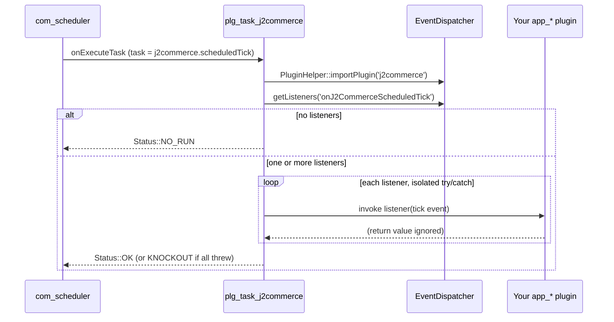

# Scheduled Tasks for App Plugins

Some app plugins need to do work on a schedule rather than in response to a request — expiring a promotion, closing a publish window, re-syncing a remote catalog. J2Commerce ships a core `plg_task_j2commerce` routine, `j2commerce.scheduledTick`, that any `j2commerce`-group plugin can subscribe to via the `onJ2CommerceScheduledTick` event. This gives your plugin a reliable periodic callback without the overhead — and the pitfalls — of writing and maintaining your own `plugins/task/*` extension.

## Requirements

- Joomla 6.x with `com_scheduler` enabled (installed by default).
- J2Commerce 6.x with the core `plg_task_j2commerce` plugin enabled.
- A `j2commerce`-group plugin (`app_*`, `payment_*`, `shipping_*`, or `report_*`) implementing `Joomla\Event\SubscriberInterface`.

:::info

Only `j2commerce`-group plugins need this hook. If your plugin already lives in the `task` group, subscribe to `onExecuteTask` directly — see `plugins/task/j2commerce/src/Extension/J2Commerce.php` for the pattern this routine itself follows.

:::

## Why a `j2commerce`-group Plugin Cannot Schedule Its Own Task

`com_scheduler` only imports the `task` plugin group when it resolves and runs a task (`SchedulerHelper.php:63`, `TaskModel.php:868`, `Task.php:225`). Your `app_*`/`payment_*`/`shipping_*`/`report_*` plugin lives in the `j2commerce` group, which is imported separately — by `plugins/system/j2commerce`, which calls `PluginHelper::importPlugin('j2commerce')` from its `onAfterInitialise` handler.

`onAfterInitialise` is dispatched by `CMSApplication` (`CMSApplication.php:828-831`), which backs the web application. `ConsoleApplication` — the class behind `php cli/joomla.php` — never dispatches it.

The practical effect: if your `j2commerce`-group plugin implements `onTaskOptionsList`/`onExecuteTask` itself, hoping to register as its own scheduled task type, it will appear to work under lazy/web-triggered cron (a browser hit imports the group, so the handler fires) and then silently do nothing under `php cli/joomla.php scheduler:run` — the path Joomla recommends for production cron. That silent CLI no-op is exactly what the core routine exists to close.

## Architecture



The routine invokes each listener individually rather than through `dispatch()`, so a subscriber that throws cannot abort the tick for the ones queued behind it. Core catches `\Throwable` around each call as a backstop.

## Event Specification

| Property | Value |
|---|---|
| Event name | `onJ2CommerceScheduledTick` |
| Type | `Joomla\Event\GenericEvent` |
| Dispatched by | `plg_task_j2commerce`, routine `j2commerce.scheduledTick` |
| Arguments | `context` (string, may be empty), `params` (the task's params object) |
| Return value | Ignored — the routine counts ran/failed, not results |
| Isolation | Each listener runs inside its own try/catch(`\Throwable`); one throwing subscriber does not stop the others |
| `stopPropagation()` | Has no effect on this event — listeners are invoked individually in priority order, not through `dispatch()` |
| Routine status | `NO_RUN` when nothing subscribes, `KNOCKOUT` when every subscriber threw, `OK` otherwise |

## Subscribing to the Tick

Add one entry to your plugin's `getSubscribedEvents()`:

```php
<?php
// File: plugins/j2commerce/app_mailerlite/src/Extension/AppMailerlite.php (illustrative addition)

declare(strict_types=1);

namespace J2Commerce\Plugin\J2Commerce\AppMailerlite\Extension;

\defined('_JEXEC') or die;

use Joomla\Event\Event;

// ...inside the AppMailerlite class:

public static function getSubscribedEvents(): array
{
    return [
        // ...existing entries (onJ2CommerceRegisterApps, onJ2CommerceAppPluginView, etc.)
        'onJ2CommerceScheduledTick' => 'onScheduledTick',
    ];
}

public function onScheduledTick(Event $event): void
{
    $context = (string) $event->getArgument('context', '');

    if ($context !== '' && $context !== 'mailerlite') {
        return;
    }

    // ...sync work goes here, see "Context Semantics" and "Run Conditions" below.
}
```

:::info

This is an illustrative example, not existing behavior. At the time of writing, `app_mailerlite` has no `onJ2CommerceScheduledTick` subscriber — its real event map only covers `onJ2CommerceRegisterApps`, `onJ2CommerceAppPluginView`, `onJ2CommerceAppPluginAjax`, `onAjaxApp_mailerlite`, `onAfterDispatch`, `onJ2CommerceBeforeRegisterUserSave`, `onJ2CommerceAfterSaveOrder`, `onJ2CommerceQueueProcess`, `onJ2CommerceOrderStatusChange`, `onJ2CommerceAfterSaveProduct`, `onJ2CommerceBeforeDeleteProduct`, `onContentAfterSave`, `onContentChangeState`, `onJ2CommerceCheckoutStart`, `onJ2CommerceAfterDisplayShippingPayment`, `onBeforeCompileHead`, `onBeforeRender`, and `onAfterRender` (`plugins/j2commerce/app_mailerlite/src/Extension/AppMailerlite.php`). It is used here only because it is the plugin the tick was designed to unblock — see the next section.

:::

## Why app_mailerlite Needs a Tick

`app_mailerlite` decides whether a product belongs in the exported MailerLite ecommerce catalogue partly from the product's Joomla publish window (`publish_up` / `publish_down`). Every state change that normally drives this decision already raises an event the plugin handles: publishing, unpublishing, and editing an article all fire `onContentAfterSave` or `onContentChangeState`; saving or deleting a J2Commerce product fires `onJ2CommerceAfterSaveProduct` or `onJ2CommerceBeforeDeleteProduct`.

A `publish_down` timestamp simply *elapsing* raises none of those events — nothing touches the article or the product row when the clock crosses the threshold. The mirror case is a `publish_up` arriving in the future and later becoming current. Both leave the exported catalogue stale until an unrelated edit happens to touch the same product. A periodic tick is the only mechanism that closes either gap: on each tick, the handler would re-evaluate publish windows for products near a boundary and push a delta to `EcommerceMapper` via the plugin's existing `QueueGateway` queueing path — the same queue used by `onJ2CommerceQueueProcess`.

## Context Semantics

An empty `context` argument means "run every subscriber." A non-empty value lets a store owner schedule separate ticks — for example an hourly tick for one integration and a nightly tick for another — by creating multiple **J2Commerce: Scheduled Tick** tasks, each with a different `Context` field value.

Every subscriber decides for itself whether a given context belongs to it. The convention is an early return when the context is non-empty and not one the handler answers to, as shown in `onScheduledTick()` above.

## Obligations on Subscriber Authors

- **No CLI assumptions.** The tick can fire inside a normal site request through Joomla's lazy scheduler, not only under `php cli/joomla.php scheduler:run`. A handler must not assume the scheduling administrator's identity, must not branch on `Factory::getApplication()->isClient('cli')`, and must not emit output.
- **`processQueue` carries the same obligation** — if your handler enqueues work rather than doing it inline, the consumer on the other end of that queue (typically your `onJ2CommerceQueueProcess` handler) is bound by the same no-CLI-assumption, no-output rule.
- **Chunk long jobs through the existing J2Commerce queue.** The routine inherits whatever time budget the scheduled task has; a handler that blocks for minutes blocks the whole tick. Enqueue units of work instead of processing everything inline.
- **Catch your own exceptions where you can.** Core catches `\Throwable` as a backstop and logs `Subscriber failed: …`, but a handler that fails cleanly (log, return) is easier to diagnose than one that relies on the backstop.

## Run Conditions

A subscriber's handler is invoked when **all** of the following are true:

- `plg_task_j2commerce` is enabled and a **J2Commerce: Scheduled Tick** task exists and is enabled in **System** -> **Scheduled Tasks**.
- The task's next-run time has arrived (or it was triggered manually via **Run Now**, or via `scheduler:run`).
- Your plugin is enabled in **J2Commerce** -> **Apps** (or the equivalent Payments/Shipping/Reports screen).
- `getSubscribedEvents()` maps `onJ2CommerceScheduledTick` to a real method.
- Either the task's `Context` field is empty, or your handler's own context check accepts the value that was set.

If any of these is false, either nothing is dispatched (routine logs `NO_RUN`) or your handler runs and immediately returns without doing anything — the routine still reports it as "ran," since it does not inspect what a listener did.

## Scheduling and Testing

1. Clear the cache so the new task type and any language changes are picked up:

   ```bash
   php cli/joomla.php cache:clear
   ```

2. In the admin, go to **System** -> **Scheduled Tasks** -> **New**, and select **J2Commerce: Scheduled Tick** as the task type. Optionally set the **Context** field, then choose a run interval and save.
3. Select the task from the list and click **Run**. With no subscribers wired up yet, the task log reads:

   ```
   No subscribers listening for onJ2CommerceScheduledTick.
   ```

   and the task reports `NO_RUN`.

4. Confirm the same result under CLI — this is the path the routine exists to support:

   ```bash
   php cli/joomla.php scheduler:run --id=<taskid>
   ```

5. With a subscriber wired up (see the example above), running the task reports `1 subscriber(s) ran, 0 failed` in the log. Make the handler throw and the log instead records `Subscriber failed: …`, but the task still completes rather than aborting.

## Tips

- Keep the `Context` field empty unless you actually need to separate ticks by schedule — an empty context is the simplest setup and runs every subscriber on every tick.
- Prefer enqueuing work over doing it inline, even for small jobs. It keeps your tick handler's obligations (no CLI assumptions, no output) trivially satisfied, since the actual work runs through the same `onJ2CommerceQueueProcess` path you likely already have.
- Log through `Log::add()` inside your own handler rather than relying solely on the routine's aggregate `ran/failed` count — the routine's log line tells you *that* something failed, not *what*.
- If you need the same periodic logic to run from more than one plugin, give each plugin a distinct `context` string rather than sharing one and racing on the same data.

## Troubleshooting

### Handler never fires under CLI cron but works in the browser

**Cause:** You built your own task routine in a `j2commerce`-group plugin (implementing `onTaskOptionsList`/`onExecuteTask` directly) instead of subscribing to the core tick. `plugins/system/j2commerce` only imports the `j2commerce` group from `onAfterInitialise`, which `ConsoleApplication` never dispatches — so your plugin is invisible to `com_scheduler` under `scheduler:run`.

**Solution:**

1. Remove the `onTaskOptionsList`/`onExecuteTask` handlers from your plugin.
2. Subscribe to `onJ2CommerceScheduledTick` as shown above.
3. Re-test with `php cli/joomla.php scheduler:run --id=<taskid>`, not just a browser-triggered run.

### Task reports NO_RUN

**Cause:** No plugin currently subscribes to `onJ2CommerceScheduledTick` — either your plugin is disabled, the event key is misspelled in `getSubscribedEvents()`, or a stale plugin cache is hiding the change.

**Solution:**

1. Confirm your plugin shows a green checkmark in **J2Commerce** -> **Apps** (or Payments/Shipping/Reports).
2. Check the exact spelling of `onJ2CommerceScheduledTick` in your `getSubscribedEvents()` array.
3. Run `php cli/joomla.php cache:clear`.

### Task reports KNOCKOUT

**Cause:** Every subscriber that ran threw an exception.

**Solution:**

1. Open the task log and look for one or more `Subscriber failed: …` lines — each names the exception message from a specific subscriber.
2. Fix the underlying error in your handler; a handler that only logs and returns instead of throwing will not trip this status.

### Handler runs but does nothing

**Cause:** The scheduled task has a non-empty `Context` value that your subscriber's early-return check does not recognize.

**Solution:**

1. Open the task in **System** -> **Scheduled Tasks** and check the **Context** field value.
2. Either clear the field (to run for all contexts) or change it to match the string your handler checks for.

### Handler runs but the tick appears to time out or hang

**Cause:** A long-running job is executing inline inside the tick instead of being handed off to the queue.

**Solution:**

1. Move the work into a queued job processed by your existing `onJ2CommerceQueueProcess` handler.
2. Have `onJ2CommerceScheduledTick` only enqueue the work and return immediately.

### New routine missing from the Scheduled Tasks type list

**Cause:** The installed `plg_task_j2commerce` predates the `j2commerce.scheduledTick` routine, or the extension/language cache is stale.

**Solution:**

1. Confirm `plg_task_j2commerce` is up to date.
2. Run `php cli/joomla.php cache:clear` and reload **System** -> **Scheduled Tasks** -> **New**.

## Related

- [Registering External Plugins in the Apps View](./apps-view-hook.md) — make your plugin discoverable and toggleable from the J2Commerce Apps view before it can be enabled at all.
