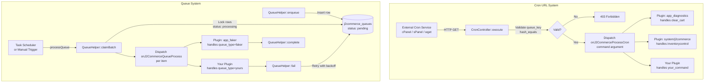

# Cron Tasks and Queue System -- Developer Documentation

## Architecture Overview

J2Commerce provides two distinct mechanisms for background task execution:

1. **Cron URL System** (`onJ2CommerceProcessCron`) -- Simple periodic tasks triggered by external cron services via an HTTP endpoint.
2. **Queue System** (`onJ2CommerceQueueProcess`) -- Asynchronous job processing with retry logic, batching, and status tracking.

Both systems are event-driven. Plugins subscribe to the relevant events and handle their specific commands or queue types.



---

## Cron URL System

### Endpoint

```
GET /index.php?option=com_j2commerce&task=cron.execute&command={COMMAND}&cron_secret={QUEUE_KEY}
```

**Source file:** `components/com_j2commerce/src/Controller/CronController.php`

### Request Flow

1. The controller reads the `queue_key` from `ComponentHelper::getParams('com_j2commerce')`.
2. If the key is empty, the controller returns HTTP 503.
3. The `cron_secret` parameter is compared against the stored key using `hash_equals()` (timing-safe comparison to prevent timing attacks).
4. If the secret is invalid, the controller returns HTTP 403.
5. If no `command` parameter is provided, the controller returns HTTP 501.
6. The controller records the trigger details (date, command, URL, IP) in the component's `cron_last_trigger` parameter.
7. The controller dispatches the `onJ2CommerceProcessCron` event with the `command` argument.
8. The controller outputs `{command} OK` and closes the application.

### Security Model

- **No CSRF token required** -- The endpoint is designed for external callers (cron services, wget, curl) that cannot obtain a Joomla session token.
- **Authentication** -- The `queue_key` parameter serves as a shared secret. It is validated with `hash_equals()` to prevent timing-based attacks.
- **Cache prevention** -- The controller sets `X-Cache-Control: False` to bypass aggressive caching layers (e.g., SiteGround SuperCache).

```php
// From CronController.php -- timing-safe key validation
$secret = $app->getInput()->get('cron_secret', '', 'raw');

if (!hash_equals($queueKey, $secret)) {
    $app->setHeader('status', '403');
    echo 'ERROR: Invalid cron secret';
    $app->close(403);
}
```

### The `onJ2CommerceProcessCron` Event

| Property | Value |
|---|---|
| **Event name** | `onJ2CommerceProcessCron` |
| **Dispatched by** | `CronController::doExecute()` |
| **Arguments** | `command` (string) -- the command name from the URL |
| **Return mechanism** | None -- handlers perform side effects only |

### Built-in Command Handlers

#### `clear_cart` -- AppDiagnostics Plugin

**Source file:** `plugins/j2commerce/app_diagnostics/src/Extension/AppDiagnostics.php`

Deletes carts of type `cart` (not order carts) that are older than the configured expiry period. The expiry is read from `clear_outdated_cart_data_term` in the component config (default: 90 days, converted to minutes). Deletes both `#__j2commerce_cartitems` and `#__j2commerce_carts`.

```php
// From AppDiagnostics.php
public function onJ2CommerceProcessCron($event): void
{
    $command = $event->getArgument('command', '');

    if ($command === 'clear_cart') {
        $this->clearOutdatedCartData();
    }
}
```

#### `inventorycontrol` -- System Plugin

**Source file:** `plugins/system/j2commerce/src/Extension/J2Commerce.php`

Cancels unpaid orders to release reserved inventory. Only executes if both `enable_inventory` and `cancel_order` are enabled in the component config. Delegates to `OrdersModel::cancelUnpaidOrders()`.

```php
// From system/J2Commerce.php
public function onJ2CommerceProcessCron(Event $event): void
{
    $command = $event->getArgument('command', '');

    if ($command !== 'inventorycontrol') {
        return;
    }

    $this->runInventoryControl();
}
```

---

## Creating a Custom Cron Command

To add a new cron command, create a plugin that subscribes to `onJ2CommerceProcessCron`, checks the command string, and performs the work.

### Complete Example: A Plugin That Sends a Daily Report

```php
<?php
declare(strict_types=1);

namespace Acme\Plugin\J2Commerce\DailyReport\Extension;

\defined('_JEXEC') or die;

use Joomla\CMS\Plugin\CMSPlugin;
use Joomla\Database\DatabaseAwareTrait;
use Joomla\Event\SubscriberInterface;

final class DailyReport extends CMSPlugin implements SubscriberInterface
{
    use DatabaseAwareTrait;

    public static function getSubscribedEvents(): array
    {
        return [
            'onJ2CommerceProcessCron' => 'onJ2CommerceProcessCron',
        ];
    }

    public function onJ2CommerceProcessCron($event): void
    {
        $command = $event->getArgument('command', '');

        if ($command !== 'daily_report') {
            return;
        }

        // Your logic here -- send email, generate report, etc.
        $this->sendDailySalesReport();
    }

    private function sendDailySalesReport(): void
    {
        // Implementation...
    }
}
```

The corresponding cron URL would be:

```
https://yoursite.com/index.php?option=com_j2commerce&task=cron.execute&command=daily_report&cron_secret=YOUR_KEY
```

### Key Points

- **Early return if not your command** -- Multiple plugins can subscribe to the same event. Always check the command string and return immediately if it is not yours.
- **No return value needed** -- The event does not use return values. Perform side effects directly.
- **The event argument is `command`** -- Access it with `$event->getArgument('command', '')`.

---

## Queue System

The queue system is designed for asynchronous job processing -- tasks that may fail, need retries, or should be processed in batches.

**Source file:** `administrator/components/com_j2commerce/src/Helper/QueueHelper.php`

### Database Table: `#__j2commerce_queues`

| Column | Type | Description |
|---|---|---|
| `j2commerce_queue_id` | INT (PK) | Auto-increment primary key |
| `relation_id` | VARCHAR | External reference (e.g., order ID) |
| `queue_type` | VARCHAR | Category of work (e.g., `faker`, `shipstation`) |
| `item_type` | VARCHAR | Entity type (e.g., `order`) |
| `queue_data` | TEXT (JSON) | Arbitrary payload for the handler |
| `priority` | INT | Higher values are processed first |
| `status` | VARCHAR | `pending`, `processing`, `completed`, `failed`, `dead` |
| `attempt_count` | INT | Number of processing attempts so far |
| `max_attempts` | INT | Maximum allowed attempts before moving to `dead` |
| `next_attempt_at` | DATETIME | When a failed item can be retried |
| `error_message` | TEXT | Last error message on failure |
| `locked_at` | DATETIME | When the item was claimed for processing |
| `locked_by` | VARCHAR | Lock ID to prevent double-processing |
| `processed_at` | DATETIME | When the item was completed or failed |
| `created_on` | DATETIME | When the item was enqueued |
| `modified_on` | DATETIME | Last modification timestamp |

### Status Lifecycle

```
pending ──> processing ──> completed
                │
                ├──> failed ──> pending (retry with backoff)
                │
                └──> dead (max attempts exceeded)
```

- **pending** -- Waiting to be picked up by a processor.
- **processing** -- Claimed by a batch processor (locked).
- **completed** -- Successfully handled by a plugin.
- **failed** -- Handler reported an error. Will be retried with exponential backoff.
- **dead** -- Maximum attempts reached. Will not be retried automatically.

### Retry Backoff

The `QueueHelper::calculateBackoff()` method uses exponential backoff:

```php
// From QueueHelper.php
public static function calculateBackoff(int $attemptCount): \DateTimeImmutable
{
    $seconds = min((int) (2 ** $attemptCount) * 60, 86400);

    return new \DateTimeImmutable("+{$seconds} seconds");
}
```

| Attempt | Delay |
|---|---|
| 1 | 2 minutes |
| 2 | 4 minutes |
| 3 | 8 minutes |
| 4 | 16 minutes |
| 5 | 32 minutes |
| 6 | ~1 hour |
| 7 | ~2 hours |
| 8 | ~4 hours |
| 9 | ~8.5 hours |
| 10+ | 24 hours (capped) |

### QueueHelper API

#### `enqueue(string $queueType, string $relationId, array $data, string $itemType = 'order', int $priority = 0, int $maxAttempts = 10): int`

Inserts a new item into the queue. Returns the new queue ID.

```php
use J2Commerce\Component\J2commerce\Administrator\Helper\QueueHelper;

$queueId = QueueHelper::enqueue(
    'shipstation',           // queue_type
    $order->order_id,        // relation_id
    ['order_ref' => 'ORD-123', 'action' => 'sync'],  // queue_data (JSON-encoded)
    'order',                 // item_type
    0,                       // priority (higher = processed first)
    10                       // max_attempts
);
```

#### `claimBatch(string $queueType, int $limit = 10, ?string $lockId = null): array`

Claims a batch of pending items by atomically updating their status to `processing` and setting a lock. Returns an array of queue item objects.

- Items are ordered by `priority DESC, created_on ASC`.
- Only items where `next_attempt_at` is null or in the past are eligible.
- If `$queueType` is empty, all types are claimed (used by the Task Scheduler when no type filter is set).

#### `complete(int $queueId): void`

Marks an item as successfully processed. Clears the lock.

#### `fail(int $queueId, string $errorMessage): void`

Records a failure. Increments `attempt_count`. If `attempt_count >= max_attempts`, sets status to `dead`. Otherwise, sets status to `failed` and schedules the next retry using exponential backoff.

#### `releaseStale(int $minutes = 30): int`

Releases items that have been in `processing` status for longer than the specified minutes (stuck due to a crash or timeout). Resets them to `pending`. Returns the number of released items.

#### `purgeCompleted(int $days = 30): int`

Deletes completed items older than the specified number of days. Returns the number of deleted rows.

#### `retryItems(array $ids): int`

Resets the specified items to `pending` with `attempt_count = 0`, clearing all error/lock/timing fields. Useful for manually retrying failed or dead items.

#### `retryDead(string $queueType): int`

Resets all `dead` items of a given queue type back to `pending`.

#### `purgeDead(): int`

Permanently deletes all items with status `dead`.

#### `getStats(): array`

Returns an associative array of `[queue_type => [status => count]]` for dashboard display.

#### `getQueueById(int $queueId): ?object`

Fetches a single queue item by its primary key.

---

## The `onJ2CommerceQueueProcess` Event

This event is distinct from `onJ2CommerceProcessCron`. It fires once per queue item during batch processing.

| Property | Value |
|---|---|
| **Event name** | `onJ2CommerceQueueProcess` |
| **Dispatched by** | Task Scheduler plugin (`processQueue` method) |
| **Arguments** | `item` (object) -- a row from `#__j2commerce_queues` |
| **Handler must** | Call `QueueHelper::complete($id)` or `QueueHelper::fail($id, $message)` |
| **Signaling** | Set `$event->setArgument('handled', true)` to indicate the item was processed |

If no handler marks the item as complete or failed, the Task Scheduler plugin calls `QueueHelper::fail()` with "No handler processed this item".

### Example: AppFaker Queue Handler

**Source file:** `plugins/j2commerce/app_faker/src/Extension/AppFaker.php`

```php
// From AppFaker.php
public static function getSubscribedEvents(): array
{
    return [
        'onJ2CommerceAdminOrderButton' => 'AdminOrderButton',
        'onJ2CommerceQueueProcess'     => 'QueueProcess',
    ];
}

public function QueueProcess(EventInterface $event): void
{
    $item = $event->getArgument('item') ?? null;

    // Only handle items with queue_type = 'faker'
    if (!$item || ($item->queue_type ?? '') !== 'faker') {
        return;
    }

    $data = json_decode($item->queue_data ?? '{}', true);
    $orderRef = $data['order_ref'] ?? 'unknown';

    Factory::getApplication()->enqueueMessage(
        Text::sprintf('PLG_J2COMMERCE_APP_FAKER_PROCESSED', $orderRef),
        'info'
    );

    // Mark as complete
    QueueHelper::complete((int) $item->j2commerce_queue_id);

    // Signal that this item was handled
    $event->setArgument('handled', true);
}
```

Key observations:

1. **Filter by `queue_type`** -- Multiple plugins listen for `onJ2CommerceQueueProcess`. Each plugin must check the `queue_type` field and return early if the item is not for them.
2. **Call `complete()` or `fail()`** -- The handler is responsible for updating the item's status.
3. **Set `handled`** -- This tells the Task Scheduler that the item was processed.

---

## Task Scheduler Plugin

**Source file:** `plugins/task/j2commerce/src/Extension/J2Commerce.php`

The Task Scheduler plugin provides three routines that appear in Joomla's **System > Scheduled Tasks** interface:

### `j2commerce.processQueue`

Processes pending queue items in batches. This is the primary way queue items get processed.

**Parameters (from `forms/processQueue.xml`):**

| Parameter | Type | Default | Description |
|---|---|---|---|
| `queue_type` | text | (empty) | Filter by queue type. Empty = process all types. |
| `batch_size` | number | 10 | Maximum items to process per execution (1-100). |
| `release_stale_minutes` | number | 30 | Release stuck locks older than this many minutes (5-1440). |

**Processing flow:**

1. Call `QueueHelper::releaseStale()` to free any stuck items.
2. Call `QueueHelper::claimBatch()` to lock a batch of pending items.
3. For each item, dispatch `onJ2CommerceQueueProcess`.
4. After dispatch, check the item's status. If still `processing` (no handler claimed it), call `QueueHelper::fail()`.
5. Log results to `#__j2commerce_queue_logs` including timing, success/failure counts, and per-item details.

### `j2commerce.removeNewOrders`

Deletes abandoned orders (status ID 5 = "New") and all related records.

**Parameters (from `forms/removeNewOrders.xml`):**

| Parameter | Type | Default | Description |
|---|---|---|---|
| `older_than_days` | number | 30 | Delete orders older than this many days. 0 = all New orders. |
| `dry_run` | radio | Yes | Preview mode -- reports what would be deleted without deleting. |

**Cascade deletes from:** `#__j2commerce_orderitemattributes`, `#__j2commerce_orderitems`, `#__j2commerce_orderinfos`, `#__j2commerce_orderhistories`, `#__j2commerce_ordershippings`, `#__j2commerce_orderdiscounts`, `#__j2commerce_orderfees`, `#__j2commerce_orderdownloads`, `#__j2commerce_ordertaxes`, `#__j2commerce_orders`.

The entire operation runs inside a database transaction and rolls back on failure.

### `j2commerce.cleanupQueueLogs`

Housekeeping task that cleans up old logs and completed queue items.

**Parameters (from `forms/cleanupQueueLogs.xml`):**

| Parameter | Type | Default | Description |
|---|---|---|---|
| `older_than_days` | number | 90 | Delete log entries older than this. |
| `purge_completed_queue_days` | number | 30 | Delete completed queue items older than this. |
| `dry_run` | radio | Yes | Preview mode. |

---

## Complete Example: Plugin with Both Cron Command and Queue Processing

This example shows a hypothetical ShipStation integration plugin that:
- Responds to a cron command `shipstation_sync` to enqueue pending orders.
- Handles queue items of type `shipstation` to sync each order individually (with retry support).

```php
<?php
declare(strict_types=1);

namespace Acme\Plugin\J2Commerce\ShipStation\Extension;

\defined('_JEXEC') or die;

use J2Commerce\Component\J2commerce\Administrator\Helper\QueueHelper;
use Joomla\CMS\Plugin\CMSPlugin;
use Joomla\Database\DatabaseAwareTrait;
use Joomla\Event\EventInterface;
use Joomla\Event\SubscriberInterface;

final class ShipStation extends CMSPlugin implements SubscriberInterface
{
    use DatabaseAwareTrait;

    public static function getSubscribedEvents(): array
    {
        return [
            'onJ2CommerceProcessCron'  => 'onCron',
            'onJ2CommerceQueueProcess' => 'onQueue',
        ];
    }

    /**
     * Cron handler -- enqueues orders that need syncing.
     *
     * Triggered by: cron.execute&command=shipstation_sync
     */
    public function onCron(EventInterface $event): void
    {
        if ($event->getArgument('command', '') !== 'shipstation_sync') {
            return;
        }

        $db = $this->getDatabase();
        $query = $db->createQuery()
            ->select($db->quoteName(['j2commerce_order_id', 'order_id']))
            ->from($db->quoteName('#__j2commerce_orders'))
            ->where($db->quoteName('order_state_id') . ' = 1'); // Confirmed orders

        $orders = $db->setQuery($query)->loadObjectList();

        foreach ($orders as $order) {
            QueueHelper::enqueue(
                'shipstation',
                $order->order_id,
                [
                    'order_pk'  => $order->j2commerce_order_id,
                    'order_ref' => $order->order_id,
                    'action'    => 'create_shipment',
                ],
                'order',
                0,  // priority
                5   // max 5 attempts
            );
        }
    }

    /**
     * Queue handler -- syncs a single order to ShipStation.
     *
     * Called by the Task Scheduler's processQueue routine.
     */
    public function onQueue(EventInterface $event): void
    {
        $item = $event->getArgument('item');

        if (!$item || ($item->queue_type ?? '') !== 'shipstation') {
            return;
        }

        $queueId = (int) $item->j2commerce_queue_id;
        $data = json_decode($item->queue_data ?? '{}', true);

        try {
            $this->syncToShipStation($data);
            QueueHelper::complete($queueId);
        } catch (\Throwable $e) {
            QueueHelper::fail($queueId, $e->getMessage());
        }

        $event->setArgument('handled', true);
    }

    private function syncToShipStation(array $data): void
    {
        // API call to ShipStation...
    }
}
```

**Setup required:**

1. A cron job calls `command=shipstation_sync` periodically (e.g., every 15 minutes) to enqueue new orders.
2. The Joomla Task Scheduler runs `j2commerce.processQueue` with `queue_type=shipstation` to process the enqueued items.

---

## Relationship Between the Three Systems

| System | Event | Use Case | Trigger |
|---|---|---|---|
| **Cron URL** | `onJ2CommerceProcessCron` | Simple periodic tasks (cart cleanup, inventory check) | External cron via HTTP |
| **Queue** | `onJ2CommerceQueueProcess` | Async jobs needing retry/batching (API syncs, exports) | Task Scheduler or manual |
| **Joomla Task Scheduler** | `onExecuteTask` | Joomla-native scheduling UI for queue processing and housekeeping | Joomla's scheduler cron |

**When to use which:**

- **Cron URL** -- For lightweight tasks that always succeed (or where failure is acceptable). No retry logic. No state tracking. Just "do this thing now."
- **Queue System** -- For tasks that may fail (API calls, external service sync) and need automatic retries with exponential backoff. Each item is tracked individually.
- **Task Scheduler** -- You do not typically create new task types unless you have a standalone routine. The built-in `processQueue` task handles dispatching queue items to plugins. Use the Task Scheduler as the _driver_ for queue processing.

---

## Best Practices

### 1. Always filter by command or queue_type

Multiple plugins can subscribe to the same event. If you do not check the command/queue_type, your handler will run for every cron call or every queue item.

```php
// Good
if ($event->getArgument('command', '') !== 'my_command') {
    return;
}

// Bad -- processes every cron command
public function onJ2CommerceProcessCron($event): void
{
    $this->doWork(); // Runs for clear_cart, inventorycontrol, everything
}
```

### 2. Always call complete() or fail() in queue handlers

If you do not update the item's status, the Task Scheduler will mark it as failed with "No handler processed this item."

### 3. Keep cron handlers fast

The CronController outputs a response and closes the application. Long-running tasks should enqueue work into the queue system rather than executing inline.

### 4. Use the queue system for anything that calls external APIs

External APIs can time out, rate-limit, or return errors. The queue system's retry-with-backoff mechanism handles these gracefully.

### 5. Set appropriate max_attempts

The default is 10 (which maxes out at 24-hour delays between retries). For time-sensitive operations, use a lower value. For operations that may recover after infrastructure issues, keep the default.

### 6. Use the dry_run parameter for destructive Task Scheduler routines

The `removeNewOrders` and `cleanupQueueLogs` tasks default to `dry_run = 1` (Yes). This means they report what they would do without actually deleting anything. Users must explicitly disable dry run to perform real deletions. Follow this pattern for any custom destructive tasks.

---

## Source File Reference

| File | Description |
|---|---|
| `components/com_j2commerce/src/Controller/CronController.php` | Frontend controller for the cron URL endpoint |
| `administrator/components/com_j2commerce/src/Helper/QueueHelper.php` | Queue system API (enqueue, claim, complete, fail, retry) |
| `administrator/components/com_j2commerce/src/Field/QueuekeyField.php` | Queue Key config field with regenerate button |
| `administrator/components/com_j2commerce/src/Field/CronlasthitField.php` | Last Cron Run display field |
| `administrator/components/com_j2commerce/config.xml` (lines 238-261) | Queue Key, Last Cron Run, and Queue Repeat Count field definitions |
| `plugins/j2commerce/app_diagnostics/src/Extension/AppDiagnostics.php` | `clear_cart` cron command handler |
| `plugins/system/j2commerce/src/Extension/J2Commerce.php` | `inventorycontrol` cron command handler |
| `plugins/j2commerce/app_faker/src/Extension/AppFaker.php` | Example queue processor (`queue_type=faker`) |
| `plugins/task/j2commerce/src/Extension/J2Commerce.php` | Joomla Task Scheduler plugin (processQueue, removeNewOrders, cleanupQueueLogs) |
| `plugins/task/j2commerce/forms/processQueue.xml` | Task parameters for queue processing |
| `plugins/task/j2commerce/forms/removeNewOrders.xml` | Task parameters for abandoned order cleanup |
| `plugins/task/j2commerce/forms/cleanupQueueLogs.xml` | Task parameters for log cleanup |
| `plugins/task/j2commerce/language/en-GB/plg_task_j2commerce.ini` | Language strings for Task Scheduler plugin |
