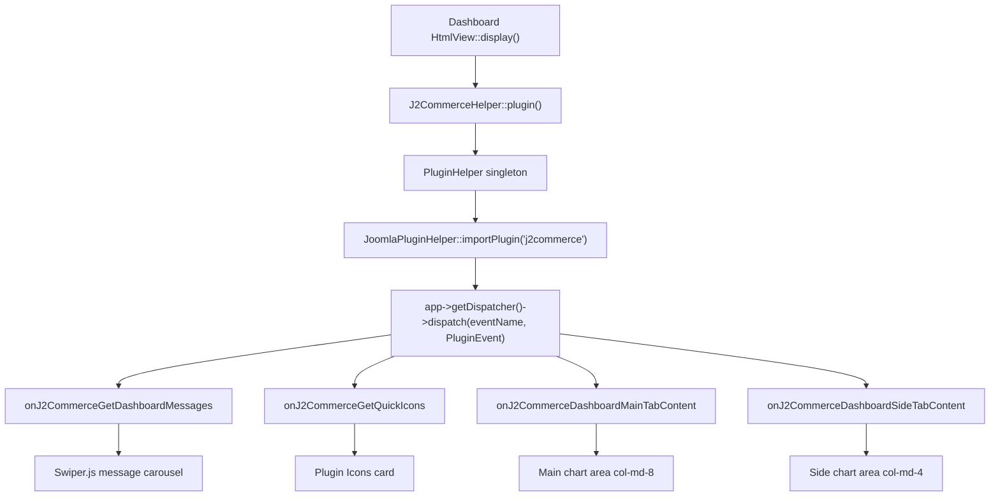

# Dashboard Plugin Events

The J2Commerce admin dashboard exposes four plugin events that allow third-party plugins to inject content without modifying core files. All four events follow the same PSR-14 dispatcher pattern and must be implemented inside plugins in the `j2commerce` plugin group.

The events are dispatched by `HtmlView` in the Dashboard view using the `J2CommerceHelper::plugin()` singleton. Plugins subscribe via `SubscriberInterface` and write data back to the event object using `$event->setArgument()` — return values are silently discarded by the dispatcher.

## Architecture



## Event System Classes

| Class | File | Purpose |
|---|---|---|
| `PluginHelper` | `administrator/components/com_j2commerce/src/Helper/PluginHelper.php` | Singleton that imports plugins and dispatches events |
| `PluginEvent` | `administrator/components/com_j2commerce/src/Event/PluginEvent.php` | Event object extending `AbstractImmutableEvent` |

### PluginHelper Methods

| Method | Return | Purpose |
|---|---|---|
| `event(string $event, array $args, string $prefix)` | `PluginEvent` | Dispatches event; plugins modify event arguments via `setArgument()`. Prefix defaults to `'onJ2Commerce'`. |
| `eventWithHtml(string $event, array $args, string $prefix)` | `PluginEvent` | Same as `event()`, then concatenates all string results into the `html` argument. |
| `eventWithArray(string $event, array $args, string $prefix)` | `array` | Returns the `result` array from the event. |
| `eventWithAppData(string $event, array $args, string $prefix)` | `array` | Collects structured app data for accordion UI rendering. |

### PluginEvent Mutable Arguments

Only three argument keys may be modified by plugin handlers: `result`, `forms`, and `html`. Attempting to set any other key throws a `BadMethodCallException`.

| Method | Purpose |
|---|---|
| `setArgument(string $name, mixed $value)` | Set a mutable argument (`result`, `forms`, or `html`). |
| `getArgument(string $name, mixed $default)` | Get an argument by name. |
| `addResult(mixed $value)` | Append a value to the `result` array. |
| `getEventResult()` | Return the full `result` argument. |

---

## Event 1: `onJ2CommerceGetDashboardMessages`

Adds messages to the Swiper.js carousel rendered at the top of the dashboard.

**Dispatched in** `HtmlView::display()`:

```php
// File: administrator/components/com_j2commerce/src/View/Dashboard/HtmlView.php

$msgEvent    = J2CommerceHelper::plugin()->event('GetDashboardMessages', ['context' => 'j2commerce_dashboard']);
$rawMessages = $msgEvent->getArgument('result', []);
```

Messages are validated for the presence of `id` and `text`, then sorted ascending by `priority` before being passed to the template.

### Message Fields

| Field | Type | Required | Description |
|---|---|---|---|
| `id` | string | Yes | Unique identifier used for dismiss tracking in browser storage. |
| `text` | string | Yes | Message content. HTML is allowed. |
| `type` | string | No | Bootstrap alert variant: `danger`, `warning`, `info`, `success`. Default: `info`. |
| `icon` | string | No | Font Awesome class string (e.g., `fa-solid fa-bell`). Displayed left of text. |
| `priority` | int | No | Sort order. Lower numbers appear first. Default: `500`. |
| `dismissible` | string | No | `none` — cannot dismiss; `session` — dismissed via `sessionStorage`; `forever` — dismissed via `localStorage`. Default: `session`. |
| `link` | string | No | URL for an action button displayed next to the text. |
| `linkText` | string | No | Button label text. Falls back to the Joomla core `JOPTIONS` string. |

### Dismiss Mechanics

JavaScript stores dismissed message IDs in:

- `sessionStorage` key `j2commerce_dismissed_messages_session` for `dismissible: 'session'`
- `localStorage` key `j2commerce_dismissed_messages_forever` for `dismissible: 'forever'`

On page load, Swiper slides whose `data-message-id` appears in either store are hidden before the carousel initialises.

### Swiper Configuration

Auto-play every 10 seconds, fade transition effect, pauses on hover, loop disabled.

### Rendering

Each message is rendered via `layouts/dashboard/message.php`. The layout outputs a `<div class="swiper-slide">` containing a Bootstrap alert with the icon, text, optional link button, and dismiss dropdown.

### Handler Example

```php
// File: plugins/j2commerce/myplugin/src/Extension/MyPlugin.php

use Joomla\Event\Event;

public function onGetDashboardMessages(Event $event): void
{
    $result   = $event->getArgument('result', []);
    $result[] = [
        'id'          => 'myplugin_update_notice',
        'text'        => Text::_('PLG_J2COMMERCE_MYPLUGIN_UPDATE_AVAILABLE'),
        'type'        => 'warning',
        'icon'        => 'fa-solid fa-triangle-exclamation',
        'priority'    => 200,
        'dismissible' => 'session',
        'link'        => 'index.php?option=com_plugins&view=plugins&filter[folder]=j2commerce',
        'linkText'    => Text::_('PLG_J2COMMERCE_MYPLUGIN_UPDATE_NOW'),
    ];
    $event->setArgument('result', $result);
}
```

### Real-World Example

From `plugins/system/j2commerce/src/Extension/J2Commerce.php` — adds a danger alert when no download ID is configured:

```php
// File: plugins/system/j2commerce/src/Extension/J2Commerce.php

public function onGetDashboardMessages(Event $event): void
{
    $params = ComponentHelper::getParams('com_j2commerce');

    if (!empty($params->get('downloadid', ''))) {
        return;
    }

    $result   = $event->getArgument('result', []);
    $result[] = [
        'id'          => 'j2commerce_download_id',
        'text'        => Text::_('COM_J2COMMERCE_DOWNLOAD_ID_DESC'),
        'type'        => 'danger',
        'icon'        => 'fa-solid fa-fingerprint',
        'dismissible' => 'none',
        'link'        => Route::_('index.php?option=com_config&view=component&component=com_j2commerce'),
        'linkText'    => Text::_('COM_J2COMMERCE_DOWNLOAD_ID_BTN'),
        'priority'    => 100,
    ];
    $event->setArgument('result', $result);
}
```

---

## Event 2: `onJ2CommerceGetQuickIcons`

Adds quick action icon tiles to the Plugin Icons card at the bottom of the dashboard.

**Dispatched in** `HtmlView::display()`:

```php
// File: administrator/components/com_j2commerce/src/View/Dashboard/HtmlView.php

$quickIconEvent = J2CommerceHelper::plugin()->event('GetQuickIcons', ['context' => 'j2commerce_dashboard']);
$rawIcons       = $quickIconEvent->getArgument('result', []);
```

Icons are validated: entries missing `id`, `link`, or `text` are filtered out before rendering.

### Icon Fields

| Field | Type | Required | Description |
|---|---|---|---|
| `id` | string | Yes | Unique identifier for the icon tile element. |
| `link` | string | Yes | URL the icon links to. |
| `text` | string | Yes | Label displayed below the icon. |
| `image` | string | No | Font Awesome icon class (e.g., `fa-solid fa-cube`). |
| `class` | string | No | Bootstrap alert color: `success`, `warning`, `info`, `danger`. |
| `badge` | string | No | Badge count displayed next to the label text. |
| `ajaxUrl` | string | No | URL polled via AJAX to update badge count dynamically on page load. |

### AJAX Polling

When `ajaxUrl` is set the dashboard JavaScript polls that endpoint immediately after page load. The endpoint must return JSON:

```json
{
    "amount": 5,
    "class": "warning"
}
```

`amount` updates the badge text. `class` updates the alert color of the tile.

### Rendering

Each icon is rendered via `layouts/dashboard/quickicon.php`.

### Handler Example

```php
// File: plugins/j2commerce/myplugin/src/Extension/MyPlugin.php

use J2Commerce\Component\J2commerce\Administrator\Event\PluginEvent;
use Joomla\CMS\Router\Route;

public function onGetQuickIcons(PluginEvent $event): void
{
    $result   = $event->getArgument('result', []);
    $result[] = [
        'id'      => 'plg_j2commerce_myplugin_quickicon',
        'link'    => Route::_('index.php?option=com_j2commerce&view=orders'),
        'text'    => Text::_('PLG_J2COMMERCE_MYPLUGIN_TITLE'),
        'image'   => 'fa-solid fa-chart-pie',
        'class'   => 'info',
        'badge'   => '5',
        'ajaxUrl' => 'index.php?option=com_j2commerce&task=myapp.getCount&format=json',
    ];
    $event->setArgument('result', $result);
}
```

### Real-World Example

From `plugins/j2commerce/app_bulkdiscount/src/Extension/AppBulkDiscount.php`:

```php
// File: plugins/j2commerce/app_bulkdiscount/src/Extension/AppBulkDiscount.php

use J2Commerce\Component\J2commerce\Administrator\Event\PluginEvent;
use Joomla\CMS\Plugin\PluginHelper;
use Joomla\Registry\Registry;

public function onGetQuickIcons(PluginEvent $event): void
{
    $plugin_data = PluginHelper::getPlugin('j2commerce', $this->_element);
    $params      = new Registry;
    $params->loadString($plugin_data->params);

    if ($params->get('enable_quickicon', 0) !== 1) {
        return;
    }

    $result   = $event->getArgument('result', []);
    $result[] = [
        'id'    => 'plg_j2commerce_' . $this->_element . '_quickicon',
        'link'  => 'index.php?option=com_plugins&task=plugin.edit&extension_id=' . $plugin_data->id,
        'image' => 'icon-cube',
        'class' => 'info',
        'text'  => $params->get('quickicon_title', ''),
    ];
    $event->setArgument('result', $result);
}
```

---

## Event 3: `onJ2CommerceDashboardMainTabContent`

Injects HTML tabs into the main chart area (left column, `col-md-8`).

**Dispatched in** `HtmlView::display()`:

```php
// File: administrator/components/com_j2commerce/src/View/Dashboard/HtmlView.php

$eventData = [$this->monthlySales, $this->yearlySales, $this->revenueByDay];
$this->dashboardMainTabHtml = J2CommerceHelper::plugin()
    ->eventWithHtml('DashboardMainTabContent', $eventData)
    ->getArgument('html', '');
```

### Parameters Available to Handlers

| Index | Variable | Type | Description |
|---|---|---|---|
| `0` | `$monthlySales` | `array` | Monthly revenue, order count, and items sold — all-time aggregate. |
| `1` | `$yearlySales` | `array` | Yearly revenue, order count, and items sold — all-time aggregate. |
| `2` | `$revenueByDay` | `array` | Daily revenue for the currently selected date range. |

### Tab Set ID

The tab set ID **must** be `dashboardMainTabs`. This matches the `HTMLHelper::_('uitab.startTabSet')` call in the dashboard template. Using any other ID will produce orphaned tab panels.

### Rendering Order

Plugin tabs appear after any module tabs rendered from the `j2commerce-dashboard-main-tab` module position.

### Handler Example

```php
// File: plugins/j2commerce/myplugin/src/Extension/MyPlugin.php

use J2Commerce\Component\J2commerce\Administrator\Event\PluginEvent;
use Joomla\CMS\HTML\HTMLHelper;
use Joomla\CMS\Language\Text;

public function onDashboardMainTabContent(PluginEvent $event): void
{
    $monthlySales = $event->getArgument(0, []);
    $yearlySales  = $event->getArgument(1, []);
    $revenueByDay = $event->getArgument(2, []);

    $html  = HTMLHelper::_('uitab.addTab', 'dashboardMainTabs', 'myplugin-main-tab', Text::_('PLG_J2COMMERCE_MYPLUGIN_TAB_TITLE'));
    $html .= '<div class="p-4" style="min-height:350px">';
    $html .= '<canvas id="myplugin-main-chart"></canvas>';
    $html .= '</div>';
    $html .= HTMLHelper::_('uitab.endTab');

    $existing = $event->getArgument('html', '');
    $event->setArgument('html', $existing . $html);
}
```

---

## Event 4: `onJ2CommerceDashboardSideTabContent`

Injects HTML tabs into the side chart area (right column, `col-md-4`).

**Dispatched in** `HtmlView::display()`:

```php
// File: administrator/components/com_j2commerce/src/View/Dashboard/HtmlView.php

$this->dashboardSideTabHtml = J2CommerceHelper::plugin()
    ->eventWithHtml('DashboardSideTabContent', $eventData)
    ->getArgument('html', '');
```

The same `$eventData` array (monthly sales, yearly sales, revenue by day) is passed as for the main tab event.

### Tab Set ID

The tab set ID **must** be `dashboardSideTabs`. Plugin tabs appear after the built-in Monthly and Yearly tabs, and after any module tabs from `j2commerce-dashboard-side-tab`.

### Handler Example

```php
// File: plugins/j2commerce/myplugin/src/Extension/MyPlugin.php

use J2Commerce\Component\J2commerce\Administrator\Event\PluginEvent;
use Joomla\CMS\HTML\HTMLHelper;
use Joomla\CMS\Language\Text;

public function onDashboardSideTabContent(PluginEvent $event): void
{
    $html  = HTMLHelper::_('uitab.addTab', 'dashboardSideTabs', 'myplugin-side-tab', Text::_('PLG_J2COMMERCE_MYPLUGIN_SIDE_TAB'));
    $html .= '<div class="p-3" style="min-height:350px">';
    $html .= '<ul class="list-group">';
    // ... render content
    $html .= '</ul>';
    $html .= '</div>';
    $html .= HTMLHelper::_('uitab.endTab');

    $existing = $event->getArgument('html', '');
    $event->setArgument('html', $existing . $html);
}
```

---

## Plugin Registration

All dashboard events are subscribed in a single `getSubscribedEvents()` declaration. The event names use the full `onJ2Commerce` prefix; the method names are local to your class.

```php
<?php
// File: plugins/j2commerce/myplugin/src/Extension/MyPlugin.php

declare(strict_types=1);

namespace J2Commerce\Plugin\J2Commerce\MyPlugin\Extension;

defined('_JEXEC') or die;

use J2Commerce\Component\J2commerce\Administrator\Event\PluginEvent;
use Joomla\CMS\Language\Text;
use Joomla\CMS\Plugin\CMSPlugin;
use Joomla\Event\Event;
use Joomla\Event\SubscriberInterface;

class MyPlugin extends CMSPlugin implements SubscriberInterface
{
    public static function getSubscribedEvents(): array
    {
        return [
            'onJ2CommerceGetDashboardMessages'   => 'onGetDashboardMessages',
            'onJ2CommerceGetQuickIcons'           => 'onGetQuickIcons',
            'onJ2CommerceDashboardMainTabContent' => 'onDashboardMainTabContent',
            'onJ2CommerceDashboardSideTabContent' => 'onDashboardSideTabContent',
        ];
    }

    public function onGetDashboardMessages(Event $event): void
    {
        // Use Joomla\Event\Event for this handler — PluginEvent is valid but not required
        $result   = $event->getArgument('result', []);
        $result[] = [
            'id'          => 'myplugin_notice',
            'text'        => Text::_('PLG_J2COMMERCE_MYPLUGIN_NOTICE'),
            'type'        => 'info',
            'icon'        => 'fa-solid fa-puzzle-piece',
            'priority'    => 300,
            'dismissible' => 'session',
        ];
        $event->setArgument('result', $result);
    }

    // ... remaining handlers
}
```

---

## Complete Working Example

A fully implemented plugin demonstrating all four events:

```php
<?php
// File: plugins/j2commerce/dashboard_example/src/Extension/DashboardExample.php

declare(strict_types=1);

namespace J2Commerce\Plugin\J2Commerce\DashboardExample\Extension;

defined('_JEXEC') or die;

use J2Commerce\Component\J2commerce\Administrator\Event\PluginEvent;
use Joomla\CMS\HTML\HTMLHelper;
use Joomla\CMS\Language\Text;
use Joomla\CMS\Plugin\CMSPlugin;
use Joomla\CMS\Router\Route;
use Joomla\Event\Event;
use Joomla\Event\SubscriberInterface;

class DashboardExample extends CMSPlugin implements SubscriberInterface
{
    public static function getSubscribedEvents(): array
    {
        return [
            'onJ2CommerceGetDashboardMessages'   => 'onGetDashboardMessages',
            'onJ2CommerceGetQuickIcons'           => 'onGetQuickIcons',
            'onJ2CommerceDashboardMainTabContent' => 'onDashboardMainTab',
            'onJ2CommerceDashboardSideTabContent' => 'onDashboardSideTab',
        ];
    }

    public function onGetDashboardMessages(Event $event): void
    {
        $result   = $event->getArgument('result', []);
        $result[] = [
            'id'          => 'dashboard_example_welcome',
            'text'        => 'Welcome to your custom dashboard extension!',
            'type'        => 'info',
            'icon'        => 'fa-solid fa-puzzle-piece',
            'priority'    => 300,
            'dismissible' => 'forever',
        ];
        $event->setArgument('result', $result);
    }

    public function onGetQuickIcons(PluginEvent $event): void
    {
        $result   = $event->getArgument('result', []);
        $result[] = [
            'id'    => 'dashboard_example_icon',
            'link'  => Route::_('index.php?option=com_j2commerce&view=orders'),
            'text'  => 'My Custom Tool',
            'image' => 'fa-solid fa-screwdriver-wrench',
            'class' => 'success',
        ];
        $event->setArgument('result', $result);
    }

    public function onDashboardMainTab(PluginEvent $event): void
    {
        $revenueByDay = $event->getArgument(2, []);

        $html  = HTMLHelper::_('uitab.addTab', 'dashboardMainTabs', 'example-main-tab', 'My Report');
        $html .= '<div class="p-4" style="min-height:350px">';
        $html .= '<h3>Custom Report</h3>';
        $html .= '<p>Revenue data points available: ' . count($revenueByDay) . '</p>';
        $html .= '</div>';
        $html .= HTMLHelper::_('uitab.endTab');

        $existing = $event->getArgument('html', '');
        $event->setArgument('html', $existing . $html);
    }

    public function onDashboardSideTab(PluginEvent $event): void
    {
        $html  = HTMLHelper::_('uitab.addTab', 'dashboardSideTabs', 'example-side-tab', 'Quick Stats');
        $html .= '<div class="p-3" style="min-height:350px">';
        $html .= '<p>Custom sidebar content from DashboardExample plugin.</p>';
        $html .= '</div>';
        $html .= HTMLHelper::_('uitab.endTab');

        $existing = $event->getArgument('html', '');
        $event->setArgument('html', $existing . $html);
    }
}
```

---

## App Icon Image Resolution

When providing quick icons, the `image` field accepts a Font Awesome class string directly. For file-based icon images, `J2CommerceHelper::getAppImagePath()` resolves the path using this fallback chain:

1. `media/plg_j2commerce_{element}/images/{element}.webp`
2. `media/plg_j2commerce_{element}/images/{element}.png`
3. `media/plg_j2commerce_{element}/images/{element}.jpg`
4. `plugins/j2commerce/{element}/images/{element}.png`
5. `media/com_j2commerce/images/{element}.png`
6. `media/com_j2commerce/images/default-payment.png` (final fallback)

---

## Best Practices

- Check `$event->getArgument('context')` against `'j2commerce_dashboard'` before adding content if your plugin also listens to other contexts.
- Prefix `id` values with your plugin name to prevent collisions with core messages and other plugins.
- Use `priority` values intentionally: `1–100` for critical system messages, `200–400` for important notices, `500+` for informational.
- Set `min-height: 350px` on chart container elements inside tab content to prevent layout shift when the tab becomes active.
- Tab IDs passed to `uitab.addTab` must be unique across all plugins — prefix with your plugin element name.
- Never return a value from an event handler. The Joomla dispatcher discards return values. Always use `$event->setArgument()` or `$event->addResult()`.
- Load your plugin's language file explicitly if your handler calls `Text::_()` and `$autoloadLanguage` is `false`.
- AJAX polling endpoints (`ajaxUrl`) must return JSON with `amount` (string or int) and `class` (Bootstrap color name) keys.

---

## Related

- [Plugin Development Overview](../extensions/plugins/index.md)
- [App Plugin API](../extensions/plugins/app-plugins.md)
- [PluginEvent Class Reference](../api-reference/plugin-event.md)
- [J2CommerceHelper Reference](../api-reference/j2commerce-helper.md)
