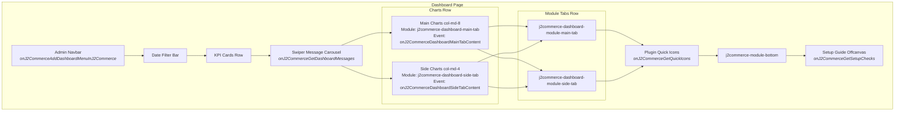
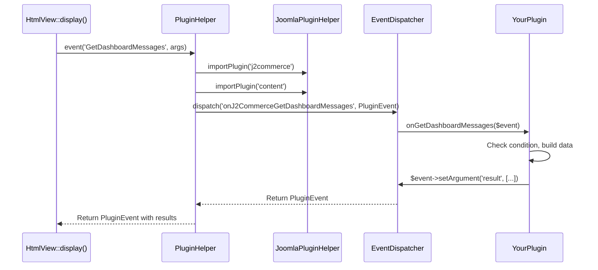

# Dashboard Extension Points

The J2Commerce admin dashboard is designed to be extended by third-party plugins and modules. This document covers every extension point available: plugin events for injecting messages, icons, and chart tabs; module positions for embedding Joomla modules; the admin navbar event for adding menu items; and the setup guide system for registering custom onboarding checks.

All plugin events are dispatched through the `J2CommerceHelper::plugin()` singleton and follow the PSR-14 dispatcher pattern. Plugins must be in the `j2commerce` plugin group and implement `SubscriberInterface`. Return values from event handlers are silently discarded by the Joomla dispatcher -- plugins communicate results back through `$event->setArgument()`.

---

## Dashboard Layout Overview

The following diagram shows the spatial arrangement of all extension points on the dashboard page. Each labeled area corresponds to either a plugin event or a module position.

```
+------------------------------------------------------------------+
|  Admin Navbar  (onJ2CommerceAddDashboardMenuInJ2Commerce)           |
+------------------------------------------------------------------+
|  Date Filter Bar                                                  |
+------------------------------------------------------------------+
|  KPI Cards Row  (Revenue | Orders | Conversion | Sessions)        |
+------------------------------------------------------------------+
|  Swiper Message Carousel                                          |
|  (onJ2CommerceGetDashboardMessages)                              |
+------------------------------------------------------------------+
|  Charts Row                                                       |
|  +--------------------------------------------+-----------------+ |
|  |  Main Charts  (col-md-8)                   | Side Charts     | |
|  |  Tab: Daily Sales (built-in)               | (col-md-4)      | |
|  |  Tabs: j2commerce-dashboard-main-tab       | Tab: Monthly    | |
|  |  Tabs: onJ2CommerceDashboardMainTabContent  | Tab: Yearly     | |
|  |                                            | Tabs: module    | |
|  |                                            | Tabs: plugin    | |
|  +--------------------------------------------+-----------------+ |
+------------------------------------------------------------------+
|  Module Tabs Row (only rendered if modules are published)         |
|  +-------------------------------+------------------------------+ |
|  | j2commerce-dashboard-module-  | j2commerce-dashboard-module- | |
|  | main-tab                      | side-tab                     | |
|  +-------------------------------+------------------------------+ |
+------------------------------------------------------------------+
|  Plugin Quick Icons Card                                          |
|  (onJ2CommerceGetQuickIcons)                                     |
+------------------------------------------------------------------+
|  j2commerce-module-bottom                                         |
+------------------------------------------------------------------+
|  Setup Guide Offcanvas                                            |
|  (onJ2CommerceGetSetupChecks)                                    |
+------------------------------------------------------------------+
```



---

## Event System Architecture

### Dispatch Flow

All dashboard events follow the same dispatch flow:



### Key Classes

| Class | File | Purpose |
|---|---|---|
| `PluginHelper` | `administrator/components/com_j2commerce/src/Helper/PluginHelper.php` | Singleton that imports plugins and dispatches events. |
| `PluginEvent` | `administrator/components/com_j2commerce/src/Event/PluginEvent.php` | Event object extending `AbstractImmutableEvent` with mutable `result`, `forms`, and `html` arguments. |
| `HtmlView` | `administrator/components/com_j2commerce/src/View/Dashboard/HtmlView.php` | Dashboard view that dispatches all events. |

### PluginEvent Mutable Arguments

The `PluginEvent` class extends Joomla's `AbstractImmutableEvent`. Only three argument keys can be modified by handlers:

| Key | Purpose |
|---|---|
| `result` | Array of structured data (messages, icons, etc.) |
| `forms` | Form objects for app plugins |
| `html` | Concatenated HTML string for tab injection |

All other arguments are immutable. Attempting to set them throws `BadMethodCallException`.

### PluginEvent Methods

| Method | Return | Description |
|---|---|---|
| `getArgument(string $name, mixed $default)` | `mixed` | Read any argument. |
| `setArgument(string $name, mixed $value)` | `void` | Write a mutable argument. |
| `addResult(mixed $value)` | `void` | Append to the `result` array. |
| `getEventResult()` | `mixed` | Return the full `result` argument. |
| `setEventResult(mixed $value)` | `void` | Replace the entire `result`. |

---

## Event 1: `onJ2CommerceGetDashboardMessages`

Adds messages to the Swiper.js carousel displayed below the KPI cards.

**Dispatched in:** `HtmlView::display()` (line 178)

```php
// File: administrator/components/com_j2commerce/src/View/Dashboard/HtmlView.php

$msgEvent    = J2CommerceHelper::plugin()->event('GetDashboardMessages', ['context' => 'j2commerce_dashboard']);
$rawMessages = $msgEvent->getArgument('result', []);
```

Messages are validated -- entries missing `id` or `text` are filtered out. The remaining messages are sorted ascending by `priority` (lower numbers appear first, default 500).

### Message Fields

| Field | Type | Required | Default | Description |
|---|---|---|---|---|
| `id` | string | Yes | -- | Unique identifier for dismiss tracking in browser storage. Prefix with your plugin name. |
| `text` | string | Yes | -- | Message content. Raw HTML is allowed. |
| `type` | string | No | `'info'` | Bootstrap alert variant: `info`, `warning`, `danger`, `success`, `purple`. |
| `icon` | string | No | (none) | Font Awesome class (e.g., `fa-solid fa-bell`). Rendered left of the text. |
| `priority` | int | No | `500` | Sort order. Lower values appear first. Use 1-100 for critical, 200-400 for important, 500+ for informational. |
| `dismissible` | string | No | `'session'` | `'none'` -- cannot dismiss. `'session'` -- dismissed via `sessionStorage` (reappears next session). `'forever'` -- dismissed via `localStorage` (persists across sessions). |
| `link` | string | No | (none) | URL for an action button rendered next to the text. |
| `linkText` | string | No | `JOPTIONS` | Button label. Falls back to the Joomla core string `JOPTIONS`. |

### Dismiss Mechanics

The dashboard JavaScript manages dismiss state entirely in the browser:

- **Session dismiss:** Stored in `sessionStorage` key `j2commerce_dismissed_messages_session`. Cleared when the browser tab closes.
- **Forever dismiss:** Stored in `localStorage` key `j2commerce_dismissed_messages_forever`. Persists indefinitely.

On page load, Swiper slides whose `data-message-id` attribute matches a dismissed ID are hidden before the carousel initializes.

When `dismissible` is `'forever'`, the dismiss dropdown offers both options ("Hide for this session" and "Don't show again"). When `dismissible` is `'session'`, only the session option appears.

### Swiper Configuration

The carousel uses Swiper.js with these settings:

- **Transition:** Fade effect (not slide)
- **Auto-play:** 10-second interval between slides
- **Pause on hover:** Yes
- **Loop:** Disabled

### Rendering

Each message is rendered via the layout file `administrator/components/com_j2commerce/layouts/dashboard/message.php`. The layout outputs a `<div class="swiper-slide">` containing a Bootstrap alert with the icon, text, optional action button, and dismiss dropdown.

### Handler Example

```php
<?php
// File: plugins/j2commerce/myplugin/src/Extension/MyPlugin.php

declare(strict_types=1);

namespace Acme\Plugin\J2Commerce\MyPlugin\Extension;

use Joomla\CMS\Language\Text;
use Joomla\CMS\Plugin\CMSPlugin;
use Joomla\CMS\Router\Route;
use Joomla\Event\Event;
use Joomla\Event\SubscriberInterface;

final class MyPlugin extends CMSPlugin implements SubscriberInterface
{
    protected $autoloadLanguage = true;

    public static function getSubscribedEvents(): array
    {
        return [
            'onJ2CommerceGetDashboardMessages' => 'onGetDashboardMessages',
        ];
    }

    public function onGetDashboardMessages(Event $event): void
    {
        // Gate the message behind a meaningful condition
        if (!$this->shouldShowWarning()) {
            return;
        }

        $result   = $event->getArgument('result', []);
        $result[] = [
            'id'          => 'plg_j2commerce_myplugin_warning',
            'text'        => Text::_('PLG_J2COMMERCE_MYPLUGIN_DASHBOARD_WARNING'),
            'type'        => 'warning',
            'icon'        => 'fa-solid fa-triangle-exclamation',
            'dismissible' => 'session',
            'link'        => Route::_('index.php?option=com_plugins&task=plugin.edit&extension_id=' . $this->getPluginId()),
            'linkText'    => Text::_('PLG_J2COMMERCE_MYPLUGIN_CONFIGURE'),
            'priority'    => 200,
        ];
        $event->setArgument('result', $result);
    }

    private function shouldShowWarning(): bool
    {
        // Your condition here -- e.g., missing API key, sandbox mode, etc.
        return true;
    }

    private function getPluginId(): int
    {
        $plugin = \Joomla\CMS\Plugin\PluginHelper::getPlugin('j2commerce', 'myplugin');

        return (int) ($plugin->id ?? 0);
    }
}
```

---

## Event 2: `onJ2CommerceGetQuickIcons`

Adds quick action icon tiles to the "Plugin Icons" card at the bottom of the dashboard.

This event is dispatched from **two locations** with different contexts:

| Location | Context | Where Icons Appear |
|---|---|---|
| `HtmlView::display()` (line 157) | `'j2commerce_dashboard'` | Dashboard "Plugin Icons" card |
| `mod_j2commerce_quickicons` `QuickIconsHelper` (line 142) | `'j2commerce_cpanel'` | Joomla control panel quickicons module |

**Dashboard dispatch:**

```php
// File: administrator/components/com_j2commerce/src/View/Dashboard/HtmlView.php

$quickIconEvent = J2CommerceHelper::plugin()->event('GetQuickIcons', ['context' => 'j2commerce_dashboard']);
$rawIcons       = $quickIconEvent->getArgument('result', []);
```

**Quickicons module dispatch:**

```php
// File: administrator/modules/mod_j2commerce_quickicons/src/Helper/QuickIconsHelper.php

$event = new \Joomla\Event\Event('onJ2CommerceGetQuickIcons', ['context' => 'j2commerce_cpanel']);
\Joomla\CMS\Plugin\PluginHelper::importPlugin('j2commerce');
$dispatcher->dispatch('onJ2CommerceGetQuickIcons', $event);
```

Icons are validated: entries missing `id`, `link`, or `text` are filtered out.

### Icon Fields

| Field | Type | Required | Default | Description |
|---|---|---|---|---|
| `id` | string | Yes | -- | HTML element ID for the icon tile. |
| `link` | string | Yes | -- | URL the icon links to. |
| `text` | string | Yes | -- | Display label shown below the icon. Accepts plain text or a language key. |
| `image` | string | No | (none) | Font Awesome or Joomla icon class (e.g., `fa-solid fa-cube`, `icon-tag`). |
| `class` | string | No | (none) | Bootstrap alert color variant: `success`, `warning`, `info`, `danger`. |
| `badge` | string | No | (none) | Small badge text displayed next to the label (e.g., "SANDBOX", "LIVE", "5"). |
| `ajaxUrl` | string | No | (none) | URL for asynchronous badge polling. See AJAX Polling below. |
| `target` | string | No | (none) | Link `target` attribute (e.g., `'_blank'`). |
| `onclick` | string | No | (none) | JavaScript `onclick` handler. |
| `linkadd` | string | No | (none) | Second link URL. When set, the icon renders as a group with a `+` button linking to this URL. |

### AJAX Badge Polling

When an icon has an `ajaxUrl`, the dashboard JavaScript fetches it after page load and updates the icon's badge. The URL is passed to the frontend via `addScriptOptions('com_j2commerce.quickicons')`.

The endpoint must return JSON:

```json
{
    "amount": 5,
    "class": "warning"
}
```

- `amount` updates the badge text.
- `class` updates the alert color of the tile.

Keep AJAX polling endpoints lightweight -- they execute on every dashboard page load.

### Rendering

Each icon is rendered via `administrator/components/com_j2commerce/layouts/dashboard/quickicon.php`. The layout supports both standard single-link icons and grouped icons (when `linkadd` is set).

### Handler Example

```php
<?php
// File: plugins/j2commerce/myplugin/src/Extension/MyPlugin.php

use J2Commerce\Component\J2commerce\Administrator\Event\PluginEvent;
use Joomla\CMS\Language\Text;
use Joomla\CMS\Plugin\PluginHelper;
use Joomla\CMS\Router\Route;
use Joomla\Registry\Registry;

public function onGetQuickIcons(PluginEvent $event): void
{
    $context = $event->getArgument('context', '');

    // Optionally filter by context
    if ($context !== 'j2commerce_dashboard') {
        return;
    }

    // Respect a plugin parameter to show/hide the icon
    $pluginData = PluginHelper::getPlugin('j2commerce', 'myplugin');
    $params     = new Registry($pluginData->params ?? '{}');

    if (!$params->get('show_dashboard_icon', 1)) {
        return;
    }

    $result   = $event->getArgument('result', []);
    $result[] = [
        'id'      => 'plg_j2commerce_myplugin_icon',
        'link'    => Route::_('index.php?option=com_plugins&task=plugin.edit&extension_id=' . $pluginData->id),
        'text'    => Text::_('PLG_J2COMMERCE_MYPLUGIN_TITLE'),
        'image'   => 'fa-solid fa-gear',
        'class'   => 'info',
        'badge'   => 'LIVE',
        'ajaxUrl' => 'index.php?option=com_ajax&plugin=myplugin&group=j2commerce&format=json&task=getCount',
    ];
    $event->setArgument('result', $result);
}
```

---

## Event 3: `onJ2CommerceDashboardMainTabContent`

Injects HTML tabs into the main chart area (left column, `col-md-8`).

**Dispatched in:** `HtmlView::display()` (line 153)

```php
// File: administrator/components/com_j2commerce/src/View/Dashboard/HtmlView.php

$eventData = [$this->monthlySales, $this->yearlySales, $this->revenueByDay];
$this->dashboardMainTabHtml = J2CommerceHelper::plugin()
    ->eventWithHtml('DashboardMainTabContent', $eventData)
    ->getArgument('html', '');
```

The `eventWithHtml()` method dispatches the event, then concatenates all string results from the `result` array into the `html` argument. The resulting HTML is injected directly into the `dashboardMainTabs` tab set.

### Available Sales Data

Plugins receive three positional arguments containing sales data:

| Index | Variable | Type | Description |
|---|---|---|---|
| `0` | `$monthlySales` | `array` | Monthly revenue, order count, and items sold (all-time aggregate). |
| `1` | `$yearlySales` | `array` | Yearly revenue, order count, and items sold (all-time aggregate). |
| `2` | `$revenueByDay` | `array` | Daily revenue for the currently selected date range. |

### Tab Set ID

The tab set ID **must** be `dashboardMainTabs`. This matches the `HTMLHelper::_('uitab.startTabSet')` call in the dashboard template. Using any other ID produces orphaned tab panels that never display.

### Rendering Order

1. Built-in "Daily Sales" tab (always first)
2. Modules from the `j2commerce-dashboard-main-tab` position
3. Plugin tabs from this event

### Handler Example

```php
<?php
// File: plugins/j2commerce/myplugin/src/Extension/MyPlugin.php

use J2Commerce\Component\J2commerce\Administrator\Event\PluginEvent;
use Joomla\CMS\HTML\HTMLHelper;
use Joomla\CMS\Language\Text;

public function onDashboardMainTabContent(PluginEvent $event): void
{
    $revenueByDay = $event->getArgument(2, []);

    // Build tab HTML using the correct tab set ID
    $html  = HTMLHelper::_('uitab.addTab', 'dashboardMainTabs', 'myplugin-main-tab', Text::_('PLG_J2COMMERCE_MYPLUGIN_TAB_TITLE'));
    $html .= '<div class="p-4" style="min-height:350px">';
    $html .= '<canvas id="myplugin-main-chart"></canvas>';
    $html .= '</div>';
    $html .= HTMLHelper::_('uitab.endTab');

    // Append to existing HTML from other plugins
    $existing = $event->getArgument('html', '');
    $event->setArgument('html', $existing . $html);
}
```

---

## Event 4: `onJ2CommerceDashboardSideTabContent`

Injects HTML tabs into the side chart area (right column, `col-md-4`). This event is the counterpart to `DashboardMainTabContent` for the narrower sidebar.

**Dispatched in:** `HtmlView::display()` (line 154)

```php
// File: administrator/components/com_j2commerce/src/View/Dashboard/HtmlView.php

$this->dashboardSideTabHtml = J2CommerceHelper::plugin()
    ->eventWithHtml('DashboardSideTabContent', $eventData)
    ->getArgument('html', '');
```

The same `$eventData` array (monthly sales, yearly sales, revenue by day) is passed as for the main tab event.

### Tab Set ID

The tab set ID **must** be `dashboardSideTabs`. Plugin tabs appear after the built-in Monthly and Yearly tabs, and after any modules from the `j2commerce-dashboard-side-tab` position.

### Handler Example

```php
<?php
// File: plugins/j2commerce/myplugin/src/Extension/MyPlugin.php

use J2Commerce\Component\J2commerce\Administrator\Event\PluginEvent;
use Joomla\CMS\HTML\HTMLHelper;
use Joomla\CMS\Language\Text;

public function onDashboardSideTabContent(PluginEvent $event): void
{
    $html  = HTMLHelper::_('uitab.addTab', 'dashboardSideTabs', 'myplugin-side-tab', Text::_('PLG_J2COMMERCE_MYPLUGIN_SIDE_TAB'));
    $html .= '<div class="p-3" style="min-height:350px">';
    $html .= '<ul class="list-group">';
    $html .= '<li class="list-group-item">Top product: Widget A</li>';
    $html .= '<li class="list-group-item">Second: Widget B</li>';
    $html .= '</ul>';
    $html .= '</div>';
    $html .= HTMLHelper::_('uitab.endTab');

    $existing = $event->getArgument('html', '');
    $event->setArgument('html', $existing . $html);
}
```

---

## Event 5: `onJ2CommerceAddDashboardMenuInJ2Commerce`

Adds items to the J2Commerce admin navigation bar.

**Dispatched in:** `MenuHelper::getMenuItems()` (line 311)

```php
// File: administrator/components/com_j2commerce/src/Helper/MenuHelper.php

$j2pluginHelper = J2CommerceHelper::plugin();
$j2pluginHelper->event('AddDashboardMenuInJ2Commerce', array(&$items));
```

Unlike the other dashboard events, this event passes the `$items` array **by reference**. Plugins can directly modify the array to add, remove, or reorder menu items.

### Menu Item Structure

Each item in the `$items` array has this structure:

```php
[
    'title'    => 'COM_J2COMMERCE_MY_VIEW',   // Language key for the label
    'view'     => 'myview',                     // View name (used for active state detection)
    'link'     => 'index.php?option=...',       // Full URL (omit for parent-only dropdown items)
    'icon'     => 'fa-solid fa-puzzle-piece',   // Font Awesome icon class
    'children' => [                             // Optional nested dropdown items
        [
            'title' => 'COM_J2COMMERCE_CHILD_VIEW',
            'view'  => 'childview',
            'link'  => 'index.php?option=...',
            'icon'  => 'fa-solid fa-gear',
        ],
    ],
]
```

### Handler Example

```php
<?php
// File: plugins/j2commerce/myplugin/src/Extension/MyPlugin.php

use Joomla\Event\Event;

public function onAddDashboardMenuInJ2Commerce(Event $event): void
{
    // The items array is passed by reference as argument 0
    $items = &$event->getArgument(0);

    $items[] = [
        'title' => 'PLG_J2COMMERCE_MYPLUGIN_MENU',
        'view'  => 'myplugin',
        'link'  => 'index.php?option=com_j2commerce&view=myplugin',
        'icon'  => 'fa-solid fa-wrench',
    ];
}
```

---

## Event 6: `onJ2CommerceGetSetupChecks`

Allows plugins to add custom checks to the Setup Guide wizard. The Setup Guide is an offcanvas panel that appears on the dashboard when the store setup is incomplete. It guides new store owners through essential configuration steps.

**Dispatched in:** `SetupGuideHelper::getChecks()` (line 67)

```php
// File: administrator/components/com_j2commerce/src/SetupGuide/SetupGuideHelper.php

$event = new Event('onJ2CommerceGetSetupChecks', ['checks' => $checks]);
Factory::getApplication()->getDispatcher()->dispatch('onJ2CommerceGetSetupChecks', $event);
$checks = $event->getArgument('checks', $checks);
```

The event receives the array of built-in check objects and lets plugins append additional checks.

### SetupCheckInterface

Every setup check must implement `SetupCheckInterface`:

```php
// File: administrator/components/com_j2commerce/src/SetupGuide/SetupCheckInterface.php

namespace J2Commerce\Component\J2commerce\Administrator\SetupGuide;

interface SetupCheckInterface
{
    public function getId(): string;           // Unique check ID (e.g., 'my_api_key')
    public function getGroup(): string;        // Group ID (see table below)
    public function getGroupOrder(): int;      // Sort order of the group (lower = first)
    public function getLabel(): string;        // Short label shown in the checklist
    public function getDescription(): string;  // Explanation of what this check verifies
    public function check(): SetupCheckResult; // Execute the check
    public function getDetailView(): string;   // HTML for the detail panel
    public function getActions(): array;       // Action buttons (optional)
    public function isDismissible(): bool;     // Can the user skip this check?
    public function getGuidedTourUid(): ?string; // Joomla Guided Tour UID (optional)
}
```

### SetupCheckResult

The `check()` method returns a `SetupCheckResult` value object:

```php
// File: administrator/components/com_j2commerce/src/SetupGuide/SetupCheckResult.php

namespace J2Commerce\Component\J2commerce\Administrator\SetupGuide;

final class SetupCheckResult
{
    public function __construct(
        public readonly string $status,   // 'pass' or 'fail'
        public readonly string $message,  // Human-readable result message
        public readonly array $data = [], // Optional structured data
    ) {}
}
```

### AbstractSetupCheck

Extend `AbstractSetupCheck` for convenience methods:

```php
// File: administrator/components/com_j2commerce/src/SetupGuide/AbstractSetupCheck.php

namespace J2Commerce\Component\J2commerce\Administrator\SetupGuide;

abstract class AbstractSetupCheck implements SetupCheckInterface
{
    protected function getParams(): Registry       // Component params
    protected function getDatabase(): DatabaseInterface
    public function isDismissed(): bool             // Reads setup_dismissed_{id} param
    public function isDismissible(): bool           // Default: true
    public function getActions(): array             // Default: empty
    public function getGuidedTourUid(): ?string     // Default: null
}
```

### Built-in Groups

| Group ID | Label | Order | Description |
|---|---|---|---|
| `store_identity` | Store Identity | 100 | Store name, address, logo, admin email |
| `system_requirements` | System Requirements | 200 | Required plugins enabled, timezone |
| `storefront_pages` | Storefront Pages | 300 | Checkout, cart, profile, confirmation pages |
| `catalog` | Catalog | 400 | First product, category menu |
| `payments_shipping` | Payments & Shipping | 500 | Payment and shipping methods configured |
| `tax` | Tax | 600 | Tax profile configured |
| `localization` | Localization | 700 | Countries enabled |

You can use any of these group IDs to add checks to an existing group, or create your own group name.

### Built-in Checks

The following checks are registered by default:

| Check Class | ID | Group |
|---|---|---|
| `StoreAddressCheck` | `store_address` | `store_identity` |
| `AdminEmailCheck` | `admin_email` | `store_identity` |
| `StoreLogoCheck` | `store_logo` | `store_identity` |
| `TimezoneCheck` | `timezone` | `system_requirements` |
| `SystemPluginCheck` | `system_plugin` | `system_requirements` |
| `ContentPluginCheck` | `content_plugin` | `system_requirements` |
| `UppyPluginCheck` | `uppy_plugin` | `system_requirements` |
| `CheckoutPageCheck` | `checkout_page` | `storefront_pages` |
| `CartPageCheck` | `cart_page` | `storefront_pages` |
| `MyProfilePageCheck` | `myprofile_page` | `storefront_pages` |
| `ConfirmationPageCheck` | `confirmation_page` | `storefront_pages` |
| `CategoryMenuCheck` | `category_menu` | `catalog` |
| `FirstProductCheck` | `first_product` | `catalog` |
| `PaymentMethodCheck` | `payment_method` | `payments_shipping` |
| `ShippingMethodCheck` | `shipping_method` | `payments_shipping` |
| `TaxProfileCheck` | `tax_profile` | `tax` |
| `CountriesCheck` | `countries` | `localization` |

### Handler Example

```php
<?php
// File: plugins/j2commerce/myplugin/src/Extension/MyPlugin.php

declare(strict_types=1);

namespace Acme\Plugin\J2Commerce\MyPlugin\Extension;

use J2Commerce\Component\J2commerce\Administrator\SetupGuide\AbstractSetupCheck;
use J2Commerce\Component\J2commerce\Administrator\SetupGuide\SetupCheckResult;
use Joomla\CMS\Language\Text;
use Joomla\CMS\Plugin\CMSPlugin;
use Joomla\Event\Event;
use Joomla\Event\SubscriberInterface;

final class MyPlugin extends CMSPlugin implements SubscriberInterface
{
    public static function getSubscribedEvents(): array
    {
        return [
            'onJ2CommerceGetSetupChecks' => 'onGetSetupChecks',
        ];
    }

    public function onGetSetupChecks(Event $event): void
    {
        $checks   = $event->getArgument('checks', []);
        $checks[] = new MyApiKeyCheck();
        $event->setArgument('checks', $checks);
    }
}

class MyApiKeyCheck extends AbstractSetupCheck
{
    public function getId(): string
    {
        return 'myplugin_api_key';
    }

    public function getGroup(): string
    {
        return 'payments_shipping';
    }

    public function getGroupOrder(): int
    {
        return 500;
    }

    public function getLabel(): string
    {
        return Text::_('PLG_J2COMMERCE_MYPLUGIN_CHECK_API_KEY');
    }

    public function getDescription(): string
    {
        return Text::_('PLG_J2COMMERCE_MYPLUGIN_CHECK_API_KEY_DESC');
    }

    public function check(): SetupCheckResult
    {
        $params = $this->getParams();
        $apiKey = $params->get('myplugin_api_key', '');

        if (!empty($apiKey)) {
            return new SetupCheckResult('pass', Text::_('PLG_J2COMMERCE_MYPLUGIN_CHECK_API_KEY_PASS'));
        }

        return new SetupCheckResult('fail', Text::_('PLG_J2COMMERCE_MYPLUGIN_CHECK_API_KEY_FAIL'));
    }

    public function getDetailView(): string
    {
        return '<h5>' . $this->getLabel() . '</h5>'
            . '<p>' . $this->getDescription() . '</p>'
            . '<a href="index.php?option=com_config&view=component&component=com_j2commerce" class="btn btn-primary w-100">'
            . Text::_('PLG_J2COMMERCE_MYPLUGIN_CONFIGURE')
            . '</a>';
    }

    public function isDismissible(): bool
    {
        return false;
    }
}
```

---

## Module Positions

The dashboard template checks for and renders five Joomla module positions. These are standard Joomla module positions -- any admin module can be assigned to them.

| Position | Location | Column Layout | Tab Set ID |
|---|---|---|---|
| `j2commerce-dashboard-main-tab` | Charts row, left column | `col-md-8` | `dashboardMainTabs` |
| `j2commerce-dashboard-side-tab` | Charts row, right column | `col-md-4` | `dashboardSideTabs` |
| `j2commerce-dashboard-module-main-tab` | Module tabs row, left | `col-lg-6` or `col-12` | `dashboardModuleTabs` |
| `j2commerce-dashboard-module-side-tab` | Module tabs row, right | `col-lg-6` or `col-12` | `dashboardModuleSideTabs` |
| `j2commerce-module-bottom` | Full width, below everything | `col-12` | -- (no tabs) |

### Rendering Behavior

- **Chart row modules** (`j2commerce-dashboard-main-tab` and `j2commerce-dashboard-side-tab`): Each module becomes a tab. The module's `title` field is used as the tab label. Tabs appear before plugin-injected tabs.

- **Module tabs row** (`j2commerce-dashboard-module-main-tab` and `j2commerce-dashboard-module-side-tab`): Only rendered if at least one module is published to either position. When both positions have modules, they share the row as `col-lg-6` each. When only one has modules, that column expands to `col-12`.

- **Bottom position** (`j2commerce-module-bottom`): Rendered with `style='none'` (no chrome). Appears below the plugin quick icons.

### How to Assign a Module

1. Go to **Content > Administrator Modules > New**.
2. Choose a module type (e.g., Custom HTML, or a custom admin module).
3. Set the **Position** field to one of the positions listed above (type it manually if it does not appear in the dropdown).
4. Set **Menu Assignment** to display on the J2Commerce dashboard page.
5. The module's **Title** becomes the tab label for chart-area positions.

---

## Complete Working Example

A fully implemented plugin demonstrating all dashboard events:

```php
<?php
// File: plugins/j2commerce/dashboard_example/src/Extension/DashboardExample.php

declare(strict_types=1);

namespace Acme\Plugin\J2Commerce\DashboardExample\Extension;

defined('_JEXEC') or die;

use J2Commerce\Component\J2commerce\Administrator\Event\PluginEvent;
use Joomla\CMS\HTML\HTMLHelper;
use Joomla\CMS\Language\Text;
use Joomla\CMS\Plugin\CMSPlugin;
use Joomla\CMS\Router\Route;
use Joomla\Event\Event;
use Joomla\Event\SubscriberInterface;

final class DashboardExample extends CMSPlugin implements SubscriberInterface
{
    protected $autoloadLanguage = true;

    public static function getSubscribedEvents(): array
    {
        return [
            'onJ2CommerceGetDashboardMessages'        => 'onGetDashboardMessages',
            'onJ2CommerceGetQuickIcons'                => 'onGetQuickIcons',
            'onJ2CommerceDashboardMainTabContent'      => 'onDashboardMainTab',
            'onJ2CommerceDashboardSideTabContent'      => 'onDashboardSideTab',
            'onJ2CommerceAddDashboardMenuInJ2Commerce'    => 'onAddNavbarItem',
            'onJ2CommerceGetSetupChecks'               => 'onGetSetupChecks',
        ];
    }

    // --- Messages ---

    public function onGetDashboardMessages(Event $event): void
    {
        $result   = $event->getArgument('result', []);
        $result[] = [
            'id'          => 'dashboard_example_welcome',
            'text'        => 'Welcome to your custom dashboard extension!',
            'type'        => 'info',
            'icon'        => 'fa-solid fa-puzzle-piece',
            'priority'    => 300,
            'dismissible' => 'forever',
        ];
        $event->setArgument('result', $result);
    }

    // --- Quick Icons ---

    public function onGetQuickIcons(PluginEvent $event): void
    {
        $result   = $event->getArgument('result', []);
        $result[] = [
            'id'    => 'dashboard_example_icon',
            'link'  => Route::_('index.php?option=com_j2commerce&view=orders'),
            'text'  => 'My Custom Tool',
            'image' => 'fa-solid fa-screwdriver-wrench',
            'class' => 'success',
        ];
        $event->setArgument('result', $result);
    }

    // --- Main Tab ---

    public function onDashboardMainTab(PluginEvent $event): void
    {
        $revenueByDay = $event->getArgument(2, []);

        $html  = HTMLHelper::_('uitab.addTab', 'dashboardMainTabs', 'example-main-tab', 'My Report');
        $html .= '<div class="p-4" style="min-height:350px">';
        $html .= '<h3>Custom Report</h3>';
        $html .= '<p>Revenue data points available: ' . count($revenueByDay) . '</p>';
        $html .= '</div>';
        $html .= HTMLHelper::_('uitab.endTab');

        $existing = $event->getArgument('html', '');
        $event->setArgument('html', $existing . $html);
    }

    // --- Side Tab ---

    public function onDashboardSideTab(PluginEvent $event): void
    {
        $html  = HTMLHelper::_('uitab.addTab', 'dashboardSideTabs', 'example-side-tab', 'Quick Stats');
        $html .= '<div class="p-3" style="min-height:350px">';
        $html .= '<p>Custom sidebar content from DashboardExample plugin.</p>';
        $html .= '</div>';
        $html .= HTMLHelper::_('uitab.endTab');

        $existing = $event->getArgument('html', '');
        $event->setArgument('html', $existing . $html);
    }

    // --- Navbar Item ---

    public function onAddNavbarItem(Event $event): void
    {
        $items   = &$event->getArgument(0);
        $items[] = [
            'title' => 'PLG_J2COMMERCE_DASHBOARD_EXAMPLE_MENU',
            'view'  => 'dashboardexample',
            'link'  => 'index.php?option=com_j2commerce&view=dashboardexample',
            'icon'  => 'fa-solid fa-puzzle-piece',
        ];
    }

    // --- Setup Checks ---

    public function onGetSetupChecks(Event $event): void
    {
        // Append custom checks (see Event 6 documentation)
    }
}
```

---

## Best Practices

### 1. Always Gate Messages Behind a Condition

Do not unconditionally add dashboard messages. Every message should check a meaningful condition -- a missing API key, sandbox mode enabled, an update available, etc. Unconditional messages create noise and annoy store administrators.

### 2. Use Unique, Prefixed IDs

All `id` values (for messages, icons, and tab panes) must be unique across all plugins. Prefix them with your plugin name:

```php
// Good
'id' => 'plg_j2commerce_paypal_sandbox_warning'

// Bad -- will collide with other plugins
'id' => 'sandbox_warning'
```

### 3. Set Appropriate Priority Values

| Range | Use Case |
|---|---|
| 1--100 | Critical system messages (missing license, security issues) |
| 200--400 | Important notices (sandbox mode, pending configuration) |
| 500+ | Informational (tips, promotions, changelog notices) |

### 4. Prefer Session Dismiss for Recurring Conditions

Use `'session'` for conditions that may resolve (sandbox mode might be toggled). Use `'forever'` only for true one-time notices (welcome message, migration complete). Use `'none'` for critical issues that must be addressed (missing download ID).

### 5. Respect Plugin Parameters for Quick Icons

Quick icons should be gated behind a plugin parameter like `show_dashboard_icon` or `enable_quickicon`. This lets store administrators control which icons appear without disabling the entire plugin.

### 6. Keep AJAX Endpoints Lightweight

AJAX polling URLs (`ajaxUrl` on quick icons) fire on every dashboard page load. The endpoint should return a simple count query, not a full report computation.

### 7. Use Correct Tab Set IDs

| Chart Area | Tab Set ID |
|---|---|
| Main (col-md-8) | `dashboardMainTabs` |
| Side (col-md-4) | `dashboardSideTabs` |

Using the wrong ID creates orphaned tab panels that are invisible.

### 8. Set min-height on Tab Content

Tab content containers should set `min-height: 350px` to prevent layout shift when switching tabs. This matches the built-in chart containers.

### 9. Never Return Values from Event Handlers

The Joomla PSR-14 dispatcher discards return values from `SubscriberInterface` handlers. Always communicate results via:

```php
// Correct
$event->setArgument('result', $data);

// Wrong -- value is silently discarded
return $data;
```

### 10. Load Language Files Explicitly

If `$autoloadLanguage` is `false` on your plugin, load the language file explicitly before calling `Text::_()`:

```php
$lang = Factory::getApplication()->getLanguage();
$ext  = 'plg_j2commerce_myplugin';
$lang->load($ext, JPATH_ADMINISTRATOR) || $lang->load($ext, JPATH_PLUGINS . '/j2commerce/myplugin');
```

---

## Source File Reference

| File | Description |
|---|---|
| `administrator/components/com_j2commerce/src/View/Dashboard/HtmlView.php` | Dashboard view -- dispatches all events |
| `administrator/components/com_j2commerce/tmpl/dashboard/default.php` | Dashboard template -- renders messages, charts, tabs, icons, modules |
| `administrator/components/com_j2commerce/tmpl/dashboard/default_setup_guide.php` | Setup Guide offcanvas template |
| `administrator/components/com_j2commerce/src/Helper/PluginHelper.php` | Plugin dispatch singleton (`event()`, `eventWithHtml()`) |
| `administrator/components/com_j2commerce/src/Event/PluginEvent.php` | Event class with mutable `result`, `forms`, `html` arguments |
| `administrator/components/com_j2commerce/src/Helper/MenuHelper.php` | Admin navbar builder, dispatches `AddDashboardMenuInJ2Commerce` |
| `administrator/components/com_j2commerce/layouts/dashboard/message.php` | Swiper slide layout for a single message |
| `administrator/components/com_j2commerce/layouts/dashboard/quickicon.php` | Quick icon tile layout |
| `administrator/components/com_j2commerce/src/SetupGuide/SetupGuideHelper.php` | Setup Guide orchestrator, dispatches `GetSetupChecks` |
| `administrator/components/com_j2commerce/src/SetupGuide/SetupCheckInterface.php` | Interface for custom setup checks |
| `administrator/components/com_j2commerce/src/SetupGuide/SetupCheckResult.php` | Value object for check results |
| `administrator/components/com_j2commerce/src/SetupGuide/AbstractSetupCheck.php` | Base class with convenience methods for setup checks |
| `administrator/modules/mod_j2commerce_quickicons/src/Helper/QuickIconsHelper.php` | Quickicons module -- dispatches `GetQuickIcons` with `j2commerce_cpanel` context |

---

## Related Documentation

- [Dashboard Plugin Events](dashboard-events.md) -- Focused reference for the four core dashboard plugin events
- [Cron Tasks and Queue System](cron-tasks.md) -- Background task processing and scheduling
