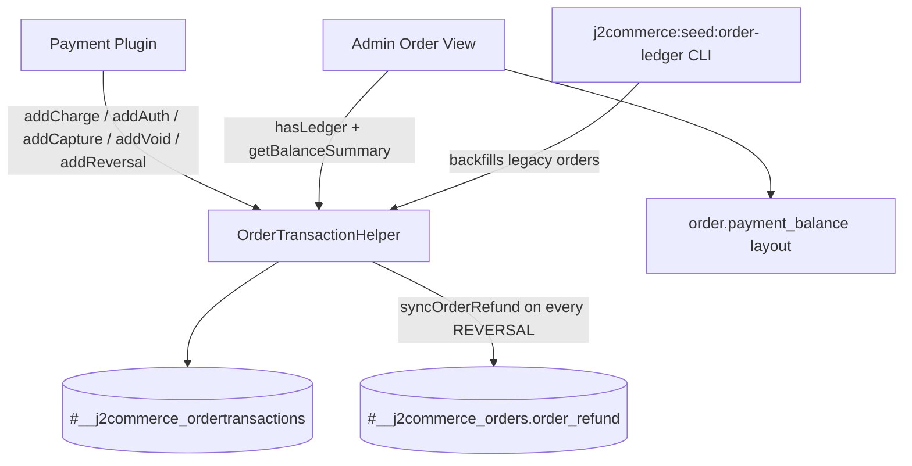

# Order-Transaction Ledger

J2Commerce 6.4.0 introduces a shared, core-level ledger for every capture, authorization, refund, and void that a payment plugin records against an order. Before 6.4.0, each gateway hand-rolled its own accounting inside the order's `transaction_details` JSON blob, so "amount paid," "refundable," and "net paid" were computed differently by every plugin. `OrderTransactionHelper` is now the single source of truth for that math, backed by the `#__j2commerce_ordertransactions` table.

Plugins that never adopt the ledger are unaffected — `OrderTransactionHelper` falls back to the legacy `order_total`/`order_refund` columns for any order with no ledger rows, so existing behavior is preserved byte-for-byte until a plugin starts writing to the ledger.

## Architecture



## Database Schema

Table: `#__j2commerce_ordertransactions`
Primary key: `j2commerce_ordertransaction_id`
Foreign key: `order_id` (`int`) references `#__j2commerce_orders.j2commerce_order_id` — the integer primary key, **not** the `varchar(255)` `orders.order_id` display/invoice string.

| Column | Type | Null | Default | Notes |
|--------|------|------|---------|-------|
| `j2commerce_ordertransaction_id` | `int` | NO | auto_increment | Primary key |
| `order_id` | `int` | NO | — | FK to `j2commerce_orders.j2commerce_order_id` |
| `plugin` | `varchar(255)` | NO | `''` | Payment plugin element, e.g. `payment_finix` |
| `type` | `varchar(20)` | NO | `DEBIT` | One of `DEBIT`, `CAPTURE`, `AUTH`, `REVERSAL`, `VOID` |
| `gateway_txn_id` | `varchar(255)` | YES | `NULL` | Gateway transaction id. `NULL` means a manual/offline entry |
| `parent_txn_id` | `varchar(255)` | NO | `''` | The `gateway_txn_id` a `CAPTURE`/`REVERSAL`/`VOID` refers back to |
| `amount` | `decimal(15,5)` | NO | `0.00000` | ORDER (display) currency — see [D1](#d1--currency-of-amount) |
| `currency_code` | `varchar(255)` | NO | `''` | Matches the order's `currency_code` |
| `state` | `varchar(20)` | NO | `succeeded` | `succeeded`, `pending`, or `failed` |
| `created_at` | `datetime` | NO | — | |
| `created_by` | `int` | NO | `0` | Admin user id for manual/admin-initiated rows; `0` = customer/system |

Indexes: `UNIQUE (order_id, gateway_txn_id, type)` (`uq_order_txn_type`), `idx_order (order_id)`, `idx_order_type_state (order_id, type, state)`, `idx_gateway_txn (gateway_txn_id)`.

`type` and `state` are `varchar`, not native `ENUM` — `OrderTransactionTable::check()` validates `type` against a PHP allow-list (`DEBIT`, `CAPTURE`, `AUTH`, `REVERSAL`, `VOID`) and throws `\UnexpectedValueException` on anything else.

## OrderTransactionHelper API Reference

Class: `J2Commerce\Component\J2commerce\Administrator\Helper\OrderTransactionHelper`
All methods are static. All amounts are `float` in the **order's display currency** (see [D1](#d1--currency-of-amount)).

### Write methods

```php
public static function addCharge(
    int $orderId,
    string $pluginEl,
    string $gatewayTxnId,
    float $amount,
    string $currencyCode,
    int $createdBy = 0
): int
```
Records a `DEBIT` row — a single-step capture (no separate auth). Returns the row id.

```php
public static function addAuth(
    int $orderId,
    string $pluginEl,
    string $gatewayTxnId,
    float $amount,
    string $currencyCode,
    int $createdBy = 0
): int
```
Records an `AUTH` row. `AUTH` rows are excluded from `getCaptured()`/`getNetPaid()` — only a subsequent `addCapture()` counts as paid.

```php
public static function addCapture(
    int $orderId,
    string $pluginEl,
    string $gatewayTxnId,
    string $parentAuthTxnId,
    float $amount,
    int $createdBy = 0
): int
```
Records a `CAPTURE` row against a prior `AUTH`. `$currencyCode` is not a parameter here — it is looked up from the order row internally.

```php
public static function addReversal(
    int $orderId,
    string $pluginEl,
    string $refundTxnId,
    string $parentTxnId,
    float $amount,
    int $createdBy = 0
): int
```
Records a `REVERSAL` (refund) row against a prior succeeded `DEBIT`/`CAPTURE`, and re-syncs `#__j2commerce_orders.order_refund` (base currency) from the ledger. Throws `\InvalidArgumentException` if `$parentTxnId` does not resolve to a succeeded capture — see [the refundable invariant](#voids-and-the-refundable-invariant).

```php
public static function addVoid(
    int $orderId,
    string $pluginEl,
    string $parentTxnId,
    string $gatewayTxnId = '',
    int $createdBy = 0
): int
```
Records a `VOID` row that neutralizes `$parentTxnId` entirely. If `$gatewayTxnId` is omitted, it defaults to `$parentTxnId` so replayed void webhooks dedupe on the same `(order_id, gateway_txn_id, type)` key as every other row.

### Read methods

```php
public static function getCaptured(int $orderId): float
public static function getRefunded(int $orderId): float
public static function getNetPaid(int $orderId): float
public static function getRefundable(int $orderId): float
public static function getCharges(int $orderId): array   // newest-first ledger rows
public static function hasLedger(int $orderId): bool
public static function getBalanceSummary(int $orderId): array
    // returns ['captured' => float, 'refunded' => float, 'net_paid' => float]
public static function allocateRefund(int $orderId, float $amount, ?string $targetTxnId = null): array
    // returns [['gateway_txn_id' => string, 'amount' => float], ...]
```

`getBalanceSummary()` is the efficient way to read captured/refunded/net_paid together — it issues one `hasLedger()` check plus one grouped `SUM()` query, instead of three separate round trips. `getCaptured()`, `getRefunded()`, and `getNetPaid()` are convenience wrappers around it. Use `getBalanceSummary()` directly whenever you need more than one of the three figures (as the payment balance layout does).

`getCharges(int $orderId): array` returns the raw ledger rows for an order, ordered newest-first (`created_at DESC, j2commerce_ordertransaction_id DESC`), with columns `j2commerce_ordertransaction_id`, `order_id`, `plugin`, `type`, `gateway_txn_id`, `parent_txn_id`, `amount`, `currency_code`, `state`, `created_at`, `created_by`. Empty array for a legacy order with no ledger rows.

## The Three Contracts

### D1 — Currency of `amount`

Every `amount` column value is stored in the **order's display currency** — the same currency as `orders.currency_code`, not the store's base currency that `orders.order_total` is stored in. This matches what the gateway actually charged and what the balance card displays.

`orders.order_refund` remains a base-currency column and is kept in sync separately: every `addReversal()` call re-derives `Σ succeeded REVERSAL` in display currency, divides by the order's `currency_value`, rounds to the **store base currency's** decimal places (via `CurrencyHelper::getDecimalPlace(ConfigHelper::getDefaultCurrency())`), and writes it directly to `#__j2commerce_orders.order_refund`. This write bypasses `OrderTable::store()` deliberately — in a CLI/console context (the seeder), `getIdentity()` is null, and `OrderTable::store()` would fault trying to read `$user->id`; `modified_on`/`modified_by` are set explicitly instead so that side effect isn't lost.

### D2 — Idempotency

Every write method is safe to call from duplicate webhook deliveries:

1. When `$gatewayTxnId` is non-empty, `writeRow()` selects first on `(order_id, gateway_txn_id, type)`. If a row already exists, its id is returned and no insert happens (upgrading `state` to `succeeded` in place if the existing row was `pending`/`failed`).
2. The `uq_order_txn_type` unique index backstops the race window: on a MySQL 1062 duplicate-key error, the helper re-selects and returns the surviving row's id instead of raising.
3. An empty `$gatewayTxnId` (`''`) is stored as `NULL` and **always inserts fresh** — MySQL unique indexes permit multiple `NULL` values, and manual/offline entries are admin-initiated, not webhook-replayed, so they don't need the idempotency guard.

### D3 — `allocateRefund()` LIFO allocation

```php
public static function allocateRefund(int $orderId, float $amount, ?string $targetTxnId = null): array
```

`allocateRefund()` does not touch the database — it is a pure allocation planner. It walks the order's succeeded `DEBIT`/`CAPTURE` rows **newest-first** (LIFO), each paired with a "remainder" (`amount` minus the sum of prior succeeded `REVERSAL`s against that specific capture), and greedily allocates the requested `$amount` across those remainders until it is exhausted. The return value is a list of legs: `[['gateway_txn_id' => '...', 'amount' => 12.50], ...]`.

Pass `$targetTxnId` to force the entire `$amount` against one specific capture instead of LIFO — the amount is validated against that capture's own remainder and a `\RuntimeException` is thrown if it's insufficient.

`allocateRefund()` throws `\RuntimeException` if `$amount` exceeds the total refundable remainder across all captures (or the targeted capture's remainder, when `$targetTxnId` is given).

**Failure contract for callers:** execute the returned legs against the gateway **in order**. Call `addReversal()` immediately after each leg succeeds. If a leg's gateway call fails partway through, do not record it — an unrecorded failed leg means the ledger (and therefore `getRefundable()`) stays accurate for a subsequent retry, rather than drifting out of sync with what the gateway actually reversed.

## Voids and the Refundable Invariant

`getRefundable(int $orderId): float` is the machine-refundable ceiling, and it is defined to always equal the total that `allocateRefund()` will authorize — both derive from the same internal `capturesWithRemainders()` computation. This is intentionally **narrower** than `getNetPaid()` whenever the order has a manual capture:

- A manual/offline capture (`gateway_txn_id` is `NULL` — e.g. cash, money order, an admin note with no gateway reference) counts toward `getCaptured()` and `getNetPaid()` — it was paid, and the balance card must show that.
- It contributes **zero** to `getRefundable()` — there is no gateway id to attribute a machine refund against. Reversing it requires a manual `addReversal()` call with an empty `$parentTxnId`, which `assertReversalParent()` permits **only** when the order has at least one manual (`NULL gateway_txn_id`) capture to attribute it to. Any other empty-or-unmatched `$parentTxnId` throws `\InvalidArgumentException`.

`addVoid(orderId, pluginEl, parentTxnId, gatewayTxnId = '', createdBy = 0)` records a `VOID` row that neutralizes its parent capture entirely: a succeeded `VOID` row excludes its parent `DEBIT`/`CAPTURE` from both `getBalanceSummary()`'s captured sum and `capturesWithRemainders()` (and therefore `getRefundable()`/`allocateRefund()`) via a correlated `NOT EXISTS` subquery — a voided capture never took money, so it can never be refunded or counted as paid.

## Adoption Guide for Payment Plugin Authors

The steps below mirror how `payment_finix` (`plugins/j2commerce/payment_finix/src/Service/PaymentProcessor.php`) wires the ledger into its checkout, admin-charge, admin-void, and admin-refund flows. All examples use PHP 8 named arguments, matching the codebase convention.

### 1. Record charges only on confirmed gateway events

Write `addCharge()`/`addCapture()` only after the gateway has confirmed success — never speculatively. `finalizeOrder()` writes the ledger row right after the order row is updated to `Completed`/`Authorized`:

```php
// File: plugins/j2commerce/payment_finix/src/Service/PaymentProcessor.php

if ($pk > 0 && $chargeAmount > 0.0 && $transId !== '') {
    if ($isAuthOnly) {
        OrderTransactionHelper::addAuth(
            orderId: $pk,
            pluginEl: $this->pluginName,
            gatewayTxnId: $transId,
            amount: $chargeAmount,
            currencyCode: $currencyCode
        );
    } else {
        OrderTransactionHelper::addCharge(
            orderId: $pk,
            pluginEl: $this->pluginName,
            gatewayTxnId: $transId,
            amount: $chargeAmount,
            currencyCode: $currencyCode
        );
    }
}
```

For an admin-initiated top-up charge (charging an outstanding balance after checkout), the same `addCharge()` call is used with the admin user id:

```php
$adminUserId = (int) (Factory::getApplication()->getIdentity()?->id ?? 0);
OrderTransactionHelper::addCharge(
    orderId: $pk,
    pluginEl: $this->pluginName,
    gatewayTxnId: $transferId,
    amount: round($chargeAmount, 2),
    currencyCode: $currencyCode,
    createdBy: $adminUserId
);
```

### 2. Get the parent transaction ids right

`addCapture()` needs the prior `AUTH`'s `gatewayTxnId` as `parentAuthTxnId`. `addReversal()` needs the `gatewayTxnId` of the specific `DEBIT`/`CAPTURE` being refunded as `parentTxnId` — never the order's top-level `transaction_id` unless that value really is the capture's own gateway id. `addVoid()` needs the parent capture's `gatewayTxnId` as well:

```php
OrderTransactionHelper::addCapture(
    orderId: $pk,
    pluginEl: $this->pluginName,
    gatewayTxnId: $debitTransferId,
    parentAuthTxnId: $transactionId,
    amount: $captureAmount,
    createdBy: $adminUserId
);
```

```php
OrderTransactionHelper::addVoid(
    orderId: $pk,
    pluginEl: $this->pluginName,
    parentTxnId: $transactionId,
    createdBy: $adminUserId
);
```

### 3. Wire the refund flow: `getRefundable()` -> `allocateRefund()` -> per-leg `addReversal()`

```php
$refundable = OrderTransactionHelper::getRefundable($pk);

if ($refundable <= 0.0) {
    return ['success' => false, 'error' => Text::_('...ERR_INVALID_ORDER')];
}

$refundAmount = $amount !== null ? min($amount, $refundable) : $refundable;

try {
    // LIFO across prior succeeded captures — see OrderTransactionHelper::allocateRefund().
    $legs = OrderTransactionHelper::allocateRefund($pk, $refundAmount);
} catch (\RuntimeException $e) {
    return ['success' => false, 'error' => Text::_('...ERR_REFUND_EXCEEDS_CAPTURED')];
}

$reversedTotal = 0.0;

foreach ($legs as $leg) {
    $chargeTxnId = (string) $leg['gateway_txn_id'];
    $take        = (float) $leg['amount'];

    $response = $this->payments->refundTransfer($chargeTxnId, /* ... */);

    if (!$this->client->isSuccessful($response)) {
        // A failed leg is simply not recorded — the ledger stays accurate for a retry.
        break;
    }

    $lastRefundId = (string) ($response['id'] ?? '');
    OrderTransactionHelper::addReversal(
        orderId: $pk,
        pluginEl: $this->pluginName,
        refundTxnId: $lastRefundId,
        parentTxnId: $chargeTxnId,
        amount: $take,
        createdBy: $adminUserId
    );

    $reversedTotal += $take;
}
```

After the loop, reload the order row before writing any other order-table fields — `addReversal()` already wrote `order_refund` directly to the database, and an in-memory `$orderTable` from before the refund would clobber it on the next `store()` call.

### 4. Stop rendering your own balance card

Once your plugin writes to the ledger, `hasLedger($orderId)` returns `true` for that order, and the core admin order view (`administrator/components/com_j2commerce/tmpl/order/view_details.php`) automatically renders the shared `order.payment_balance` layout — Order Total / Amount Paid / Refunded / Net Paid / Balance Due — using `OrderTransactionHelper::getBalanceSummary()`. The rendering condition is:

```php
$ledgerOrderId = (int) ($item->j2commerce_order_id ?? 0);
if ($ledgerOrderId > 0 && OrderTransactionHelper::hasLedger($ledgerOrderId)) :
    echo LayoutHelper::render('order.payment_balance', [
        'order_id'       => $ledgerOrderId,
        'order_total'    => (float) ($item->order_total ?? 0),
        'currency_code'  => (string) ($item->currency_code ?? 'USD'),
        'currency_value' => (float) ($item->currency_value ?? 1.0),
    ], JPATH_ADMINISTRATOR . '/components/com_j2commerce/layouts');
endif;
```

Remove any plugin-local balance card/layout you were rendering via the `AfterAdminOrderPayment` event — the core card now covers it, and rendering both would duplicate the information.

## `hasLedger()` Fallback Behavior

```php
public static function hasLedger(int $orderId): bool
```

Returns `true` as soon as **any** row exists for the order in `#__j2commerce_ordertransactions` (memoized per-request; the memo is flipped live by `writeRow()` after an insert, so a `hasLedger()` call immediately after a write does not need a fresh query).

For an order with `hasLedger() === false` (a legacy order predating 6.4.0 that was never seeded and whose plugin has not adopted the ledger), every read method falls back to the pre-ledger computation:

- `getBalanceSummary()`/`getCaptured()`/`getRefunded()`/`getNetPaid()` derive from `orders.order_total`/`orders.order_refund`, converted from base currency to display currency via `CurrencyHelper::convertForOrder()`. `captured` is `order_total` when `transaction_status` is `Completed`, `Refunded`, or `Partially Refunded`, and `0.0` otherwise.
- `getRefundable()` falls back to `max(0.0, getNetPaid())`.

This reproduces exactly the pre-6.4.0 behavior — a plugin that never calls any `add*()` method sees no change at all.

## The Seeder as a Migration Reference

`administrator/components/com_j2commerce/src/CliCommands/SeedOrderLedgerCommand.php` (console command `j2commerce:seed:order-ledger`, run via `php cli/joomla.php j2commerce:seed:order-ledger`) is the one-time, idempotent backfill that populates the ledger from legacy `transaction_details` JSON for existing orders. It is also the reference implementation for migrating a plugin's own local ledger format into the shared table:

- It is guarded per-order by `OrderTransactionHelper::hasLedger($orderId)`, so re-running it is always safe and never double-seeds.
- It processes orders in fixed-size batches (500 rows, ordered by primary key) rather than loading the whole table into memory.
- Only orders with `transaction_status IN ('Completed', 'Refunded', 'Partially Refunded')` are seedable.
- Its priority order for reconstructing charges from `transaction_details` — `charges[]` array (finix-style multi-charge) > scalar `captured` > scalar `amount` > `order_total` fallback — is the pattern to follow when migrating any other plugin-local JSON shape into `addCharge()` calls.
- When migrating a legacy per-order refund (`order_refund`) that must be split across multiple reconstructed charges, `seedChargesReversal()` shows the pattern: split newest-first (LIFO, mirroring `allocateRefund()`), give each leg a distinct `refundTxnId` (suffixed `-seed-N`) so the `(order_id, gateway_txn_id, type)` unique key doesn't collide across legs, and log + skip (never throw) when a refund can't be attributed to any reconstructed charge id.
- Per-order failures are caught, logged via `Log::add(..., Log::WARNING, 'j2commerce')`, and skipped — the command never aborts an entire run because one order's data is malformed.

`SeedOrderLedgerCommand::run(): array` returns `['seeded' => int, 'skipped' => int, 'failed' => int, 'reversalsSkipped' => int]`. The CLI wraps this in a Symfony Console table with the headings **Seeded**, **Skipped (already has ledger)**, **Failed**, and **Reversals skipped (unattributable)**.

## Related

- [Order-Transaction Ledger (User Guide)](../../../docs-v6/sales/order-transaction-ledger.md)
- [Payment Plugin Development](../../extensions/plugins/payment/payment-plugin-development.md)
- [CLI Plugin Development](../../tools/cli-plugin-development.md)
