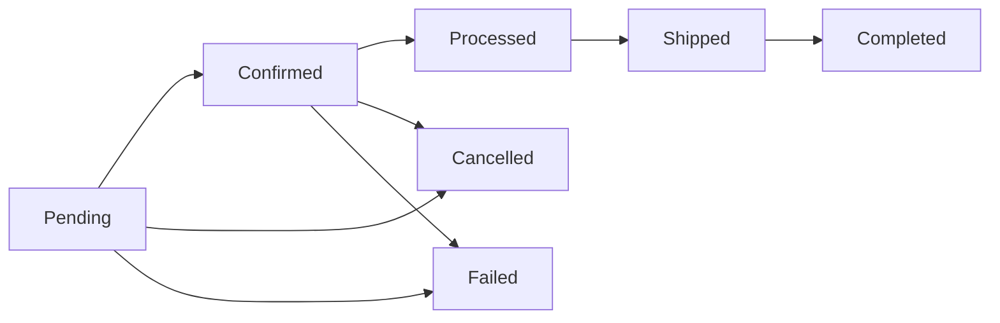

# Order Statuses

Order statuses define the stages an order passes through in your store. Each status represents a step in the order lifecycle, from initial placement through processing, shipping, and completion. J2Commerce includes core statuses that are required by the system, and you can add custom statuses to match your specific workflow.

## Requirements

- PHP 8.3.0+
- Joomla 6.x
- J2Commerce 6.x

## Accessing Order Statuses

Order statuses are managed from the J2Commerce Dashboard.

1. Go to **Components -> J2Commerce ->** **Dashboard**.
2. Click **Setup** in the left sidebar.
3. Click **Order Statuses**.

<!-- TEMP_IMG_OFF  -->
## Order Status List

The Order Statuses list displays all statuses configured in your store. Each status shows:

**Checkbox:** Select statuses for batch actions.

**Status Name:** The display name of the order status.

**CSS Class:** The Bootstrap badge class controls the visual appearance.

**Core:** Indicates whether this is a system-required status (cannot be deleted).

**Status:** Published (green check) or Unpublished (red X).

**Ordering:** Drag-and-drop to reorder the display sequence.

## Core Order Statuses

J2Commerce includes the following core statuses that cannot be deleted:

**Pending:** Initial status for new orders. Order received, awaiting payment or processing.

**Confirmed:** Order ready for processing. Payment received, order confirmed.

**Processed:** Items picked and packed. Order prepared and ready for shipment.

**Shipped:** Shipping carrier has collected the order. Order dispatched to customer.&#x20;

**Completed:** Final successful status. Order fulfilled and transaction complete.

**Cancelled:** Customer changed mind, fraud, or admin intervention. Order cancelled by customer or admin.

**Failed:** Payment declined, out of stock, etc. Payment or processing failed.

These core statuses are essential for J2Commerce's order processing and cannot be removed.

## Adding an Order Status

1. Click the **New** button in the toolbar.
2. Fill in the status details (see Configuration below).
3. Click **Save** or **Save & Close**.

<!-- TEMP_IMG_OFF  -->
## Configuration

**Status Name:** The display name shown to customers and in admin lists. **Example:** `On Hold`

**CSS Class:** Bootstrap badge class controlling the visual appearance of the status badge. **Example:** `badge text-bg-warning`

**Core Status:** Indicates if this is a system-required status. Core statuses cannot be edited or deleted. **Example:** No (read-only)

**Status:** Set to **Published** to make the status available for use.

### CSS Class Options

The CSS Class field uses Bootstrap 5 badge classes. Common combinations:

| CSS Class                 | Appearance       | Use Case                    |
| ------------------------- | ---------------- | --------------------------- |
| `badge text-bg-primary`   | Blue badge       | Informational statuses      |
| `badge text-bg-secondary` | Grey badge       | Neutral statuses            |
| `badge text-bg-success`   | Green badge      | Positive/completed statuses |
| `badge text-bg-danger`    | Red badge        | Error/failure statuses      |
| `badge text-bg-warning`   | Yellow badge     | Pending/caution statuses    |
| `badge text-bg-info`      | Light blue badge | Informational statuses      |
| `badge text-bg-light`     | Light badge      | Neutral/pending statuses    |
| `badge text-bg-dark`      | Dark badge       | Serious/processed statuses  |

You can also create custom CSS classes in your template for unique styling.

## How Order Statuses Are Used

Order statuses control the order workflow throughout J2Commerce:

### Order Placement

- New orders start with **Pending** status.
- Payment methods may automatically change status (e.g., to **Confirmed** after successful payment).

### Payment Processing

- Successful payments change status to **Confirmed**.
- Failed payments change status to **Failed**.
- Some payment gateways may use additional statuses for pending payments.

### Order Processing

- Admins can manually change status to **Processed** when preparing the order.
- Inventory may be reserved at certain statuses depending on configuration.

### Shipping

- When an order ships, status changes to **Shipped**.
- Shipping plugins may automatically update order status.
- Customers receive email notifications when status changes.

### Completion

- Delivered orders may automatically change to **Completed**.
- Admins can manually mark orders as **Completed**.

### Cancellation

- Customers or admins can cancel orders (status: **Cancelled**).
- Cancellation may trigger refunds depending on payment gateway.

## Order Status Workflow

A typical order status progression:

Orders can move between statuses in various ways:

- **Manual changes** — Admin changes status in the order detail page.
- **Automatic updates** — Payment gateways update status on payment success/failure.
- **Plugin triggers** — Shipping, inventory, or custom plugins update status based on events.
- **Customer actions** — Some systems allow customers to cancel orders (changes to Cancelled).

## Tips

- **Create statuses for your workflow** — Add custom statuses for stages unique to your business (e.g., "Awaiting Stock", "Quality Check", "Partial Shipment").
- **Use consistent colours** — Apply Bootstrap classes consistently so statuses are visually clear in the admin.
- **Consider customer visibility** — Some statuses may be visible to customers in order history; use clear, customer-friendly names.
- **Plan transitions** — Document which status transitions are allowed and who can trigger them.
- **Don't delete core statuses** — Core statuses are required by J2Commerce; unpublish them instead of trying to delete.

## Common Custom Order Statuses

| Status Name      | CSS Class                 | Use Case                                        |
| ---------------- | ------------------------- | ----------------------------------------------- |
| On Hold          | `badge text-bg-warning`   | Awaiting payment clarification or manual review |
| Awaiting Stock   | `badge text-bg-info`      | Items out of stock, will ship when available    |
| Quality Check    | `badge text-bg-secondary` | Order being verified before shipment            |
| Partial Shipment | `badge text-bg-primary`   | Some items shipped, others pending              |
| Return Requested | `badge text-bg-danger`    | Customer has requested a return                 |
| Refunded         | `badge text-bg-dark`      | Order refunded to customer                      |

## Troubleshooting

### Order Status Not Changing After Payment

**Cause:** Payment gateway not configured to update order status automatically.

**Solution:**

1. Check your payment method plugin configuration.
2. Verify the "Order Status After Payment" setting is set to **Confirmed** or your preferred status.
3. Check the payment gateway logs for errors.

### Cannot Delete Order Status

**Cause:** Core statuses cannot be deleted as they are required by the system.

**Solution:**

- Core statuses (Pending, Confirmed, Processed, Shipped, Completed, Cancelled, Failed) are protected.
- Unpublish the status if you don't want it available for use.
- Create custom statuses for your specific needs.

### Order Status Badge Not Displaying Correctly

**Cause:** CSS class is incorrect or custom CSS conflicts.

**Solution:**

1. Edit the order status.
2. Verify the **CSS Class** uses valid Bootstrap 5 badge classes.
3. Common format: `badge text-bg-success` (note the space between `badge` and `text-bg-*`).
4. Clear browser cache and Joomla cache.

### Customers Not Receiving Status Update Emails

**Cause:** Email notifications not configured for status changes.

**Solution:**

1. Go to **J2Commerce -> Setup -> Configuration ->** **Email Templates**.
2. Verify email templates exist for order status updates.
3. Check that the **Email on Status Change** option is enabled.
4. Verify your Joomla mail settings are working.
