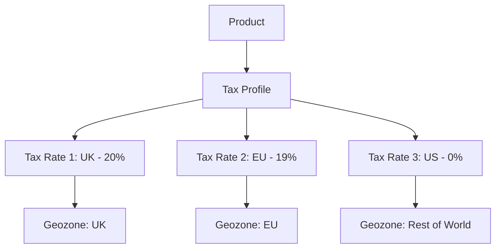

# Tax Profiles

Tax profiles (also called tax classes) group tax rules together and are assigned to products. When a customer purchases a product, J2Commerce calculates tax based on the product's tax profile, the customer's location (geozone), and the applicable tax rates. This allows different products to have different tax rates—essential for stores selling both taxable and tax-exempt items, or items with reduced tax rates.

## Requirements

- PHP 8.3.0+
- Joomla 6.x
- J2Commerce 6.x

## Accessing Tax Profiles

Tax profiles are managed from the J2Commerce Dashboard.

1. Go to **Components** -> **J2Commerce** -> **Dashboard**.
2. Click **Localisation** in the left sidebar.
3. Click **Tax Profiles**.

## Tax Profile List

The Tax Profiles list displays all tax profiles configured in your store. Each profile shows:

| Column | Description |
|--------|-------------|
| **Checkbox** | Select profiles for batch actions. |
| **Tax Profile Name** | The display name of the tax profile. |
| **Description** | A brief description of the tax profile purpose. |
| **Status** | Published (green check) or Unpublished (red X). |
| **Ordering** | Drag-and-drop to reorder the display sequence. |

## Adding a Tax Profile

1. Click the **New** button in the toolbar.
2. Fill in the tax profile details (see Configuration below).
3. Click **Save** or **Save & Close**.

## Configuration

| Field | Description | Required | Example |
|-------|-------------|----------|---------|
| **Tax Profile Name** | A descriptive name for this tax profile. | Yes | `Standard VAT` |
| **Status** | Set to Published to make the profile available for use. | Yes | Published |

## How Tax Profiles Work

Tax profiles act as a bridge between products and tax rates:

1. **Create Tax Profiles** — Define profiles for different product categories (e.g., "Standard VAT", "Reduced VAT", "Zero Rate", "Exempt").
2. **Create Geozones** — Define geographic zones for tax jurisdictions (e.g., "UK", "EU", "California").
3. **Create Tax Rates** — Define tax percentage rates for each geozone/profile combination.
4. **Assign to Products** — Products are assigned a tax profile; when purchased, the correct tax rate is calculated.

### Tax Profile Hierarchy

## Common Tax Profiles

Most stores need a few standard tax profiles:

| Tax Profile | Description | Use Case |
|-------------|-------------|----------|
| **Standard VAT/GST** | Standard rate tax for most products. | General merchandise, electronics, clothing. |
| **Reduced VAT** | Lower rate for essential items. | Food, books, children's clothing. |
| **Zero Rate** | Zero tax rate but still tracked. | Exports, certain medical supplies. |
| **Exempt** | No tax applied, not tracked. | Educational materials, charities. |
| **Not Taxable** | No tax applied. | Digital downloads in some jurisdictions. |

## Assigning Tax Profiles to Products

After creating tax profiles, assign them to products:

1. Go to **J2Commerce** -> **Products**.
2. Edit a product.
3. In the product settings, find the **Tax Profile** field.
4. Select the appropriate tax profile from the dropdown.
5. Save the product.

## Tax Rate Assignment

Tax profiles themselves don't contain rates. Instead, you create tax rates that link:

- A **Tax Profile** (e.g., "Standard VAT")
- A **Geozone** (e.g., "UK")
- A **Tax Percentage** (e.g., 20%)

See [Tax Rates](tax-rates.md) for detailed configuration.

## Tips

- **Create meaningful names** — Use names that clearly indicate the tax category (e.g., "Standard Rate", "Reduced Rate", "Digital Goods").
- **Document your setup** — Keep notes on which products use which profiles and why.
- **Consider future changes** — Tax rates may change; having profiles means you only update rates, not products.
- **Create an "Exempt" profile** — Useful for customers with tax exemption certificates.
- **Sync with geozones** — Ensure your tax profiles have corresponding tax rates for each geozone you sell to.

## Example Configuration

A UK-based store selling internationally:

### Tax Profiles

| Name | Description |
|------|-------------|
| Standard VAT | Standard 20% VAT rate for most products |
| Reduced VAT | Reduced 5% VAT rate for books, children's clothing |
| Zero Rate | 0% for exports and exempt items |
| Not Taxable | No tax for digital services outside EU |

### Tax Rates (per profile)

For **Standard VAT**:

| Geozone | Rate |
|---------|------|
| United Kingdom | 20% |
| EU Member States | Varies by country |
| Rest of World | 0% |

For **Reduced VAT**:

| Geozone | Rate |
|---------|------|
| United Kingdom | 5% |
| EU Member States | Varies (often 5-7%) |

For **Zero Rate**:

| Geozone | Rate |
|---------|------|
| All Geozones | 0% |

## Troubleshooting

### Tax Not Calculating on Checkout

**Cause:** Product has no tax profile assigned, or the tax profile has no tax rates for the customer's geozone.

**Solution:**

1. Edit the product and verify a **Tax Profile** is assigned.
2. Go to **J2Commerce** -> **Localisation** -> **Tax Rates**.
3. Check that tax rates exist for the product's tax profile and the customer's geozone.
4. Verify the geozone includes the customer's country/zone.

### Wrong Tax Rate Applied

**Cause:** Multiple tax rates matching the customer's location, or incorrect geozone assignment.

**Solution:**

1. Review your geozones to ensure no overlap in country/zone rules.
2. Check tax rates for the applicable tax profile.
3. Verify each tax rate is linked to the correct geozone.
4. Ensure only one tax rate per profile/geozone combination.

### Products Missing Tax Profile

**Cause:** Products created without tax profile assignment.

**Solution:**

1. Go to **J2Commerce** -> **Products**.
2. Use the filter to find products without a tax profile.
3. Bulk edit products to assign the default tax profile.
4. Set a default tax profile in configuration for new products.

### Tax Profile Not Appearing in Product Edit

**Cause:** Tax profile is unpublished or does not exist.

**Solution:**

1. Go to **J2Commerce** -> **Localisation** -> **Tax Profiles**.
2. Verify the tax profile exists and is published (green check).
3. Create a new tax profile if needed.

## Related Topics

- [Geozones](geozones.md) — Create geographic zones for tax jurisdictions.
- [Tax Rates](tax-rates.md) — Define tax percentages for profile/geozone combinations.
- [Countries](countries.md) — Configure countries before creating geozones.
- [Zones](zones.md) — Configure zones within countries for precise tax rules.