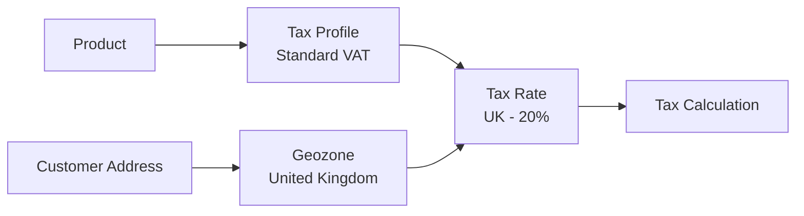

# Tax Rates

Tax rates define the actual percentage of tax to apply based on a customer's location (geozone) and the product's tax profile. Each tax rate links a tax profile, a geozone, and a percentage. When a customer checks out, J2Commerce calculates tax by finding the matching tax rate for the product's tax profile and the customer's geozone.

## Requirements

- PHP 8.3.0+
- Joomla 6.x
- J2Commerce 6.x

## Accessing Tax Rates

Tax rates are managed from the J2Commerce Dashboard.

1. Go to **Components** **-> J2Commerce ->** **Dashboard**.
2. Click **Localisation** in the left sidebar.
3. Click **Tax Rates**.

<!-- TEMP_IMG_OFF  -->
## Tax Rate List

The Tax Rates list displays all tax rates configured in your store. Each rate shows:

**Checkbox:** Select rates for batch actions.

**Rate Name:** The display name of the tax rate.

**Tax Profile:** The tax profile this rate belongs to.

**Geozone:** The geographic zone where this rate applies.

**Rate %:** The tax percentage.

**Status:** Published (green check) or Unpublished (red X).

**Ordering:** Drag-and-drop to reorder priority.

## Adding a Tax Rate

1. Click the **New** button in the toolbar.
2. Fill in the tax rate details (see Configuration below).
3. Click **Save** or **Save & Close**.

<!-- TEMP_IMG_OFF  -->
## Configuration

**Rate Name:** A descriptive name for this tax rate. **Example:** `UK Standard VAT 20%`

**Tax Percentage:** The tax rate as a percentage. Supports decimal precision. **Example:** `20.000`

**Geozone:** The geographic zone where this tax rate applies. **Example:** `United Kingdom`

**Status:** Set to **Published** to make the rate active.

### Tax Percentage Precision

The tax percentage field supports up to 3 decimal places for precision:

- **Standard rate**: `20.000` (20%)
- **Fractional rate**: `7.500` (7.5%)
- **Precise rate**: `8.375` (8.375%)

This precision is useful for regions with specific tax rates that aren't whole numbers.

## How Tax Rates Are Used

Tax rates connect three elements together:

When a customer places an order:

1. J2Commerce identifies the customer's shipping/billing address country and zone.
2. The address is matched to geozones to find applicable tax geozones.
3. For each product in the cart, J2Commerce finds the product's tax profile.
4. The matching tax rate is found for the tax profile + geozone combination.
5. Tax is calculated as `product_price × tax_rate / 100`.

## Tax Rate Priority

When multiple tax rates could apply, J2Commerce uses priority and specificity:

1. **Geozone specificity** — A geozone matching a specific zone takes precedence over "All Zones" for a country.
2. **Ordering** — Lower ordering numbers are checked first.
3. **Tax profile** — Only rates matching the product's tax profile are considered.

## Tax Calculation Examples

### Example 1: UK Store with EU Sales

| Tax Profile  | Geozone          | Rate                    |
| ------------ | ---------------- | ----------------------- |
| Standard VAT | United Kingdom   | 20%                     |
| Standard VAT | EU Member States | 19% (varies by country) |
| Standard VAT | Rest of World    | 0%                      |
| Reduced VAT  | United Kingdom   | 5%                      |
| Reduced VAT  | EU Member States | 5-7% (varies)           |

A UK customer buying a book (Reduced VAT profile) pays 5% tax. An EU customer buying a standard product (Standard VAT profile) pays their local VAT rate.

### Example 2: US Store with Nexus States

| Tax Profile | Geozone    | Rate  |
| ----------- | ---------- | ----- |
| Sales Tax   | California | 7.25% |
| Sales Tax   | New York   | 8.00% |
| Sales Tax   | Texas      | 6.25% |
| Sales Tax   | Rest of US | 0%    |

A California customer pays 7.25% sales tax on taxable items. A Florida customer (no nexus state) pays 0% tax.

### Example 3: Mixed Tax Profile Store

| Tax Profile   | Geozone        | Rate           |
| ------------- | -------------- | -------------- |
| Standard VAT  | United Kingdom | 20%            |
| Digital Goods | United Kingdom | 0%             |
| Standard VAT  | EU             | 19%            |
| Digital Goods | EU             | VAT MOSS rates |

Physical goods sold to UK: 20% VAT. Digital goods sold to UK: 0% (reverse charge). Digital services sold to EU: Customer's local VAT rate (VAT MOSS).

## Creating Tax Rates for a Tax Profile

After creating a tax profile, you need tax rates for each geozone:

1. Go to **J2Commerce** **-> Localisation ->** **Tax Rates**.
2. Click **New**.
3. Enter the rate name (e.g., "UK Standard VAT 20%").
4. Enter the tax percentage (e.g., `20`).
5. Select the geozone (e.g., "United Kingdom").
6. Select the tax profile (e.g., "Standard VAT").
7. Save the rate.
8. Repeat for each geozone/profile combination.

## Tips

- **Name rates descriptively** — Include the region and rate in the name (e.g., "California Sales Tax 7.25%").
- **Create rates for all regions** — Ensure every geozone has a tax rate for each tax profile.
- **Use 0% for tax-free** — Create explicit 0% rates rather than leaving regions without rates.
- **Document nexus states** — For US stores, clearly document which states you have tax nexus in.
- **Update for rate changes** — Tax rates change frequently; set a reminder to review quarterly.
- **Test checkout** — After configuration, test checkout with addresses in each geozone.

## Common Tax Rate Configurations

### VAT-Based Systems (UK, EU)

Create a geozone for each country/region with different VAT rates:

| Geozone        | Profile: Standard | Profile: Reduced |
| -------------- | ----------------- | ---------------- |
| United Kingdom | 20%               | 5%               |
| Germany        | 19%               | 7%               |
| France         | 20%               | 5.5%             |
| Ireland        | 23%               | 9%               |

### US Sales Tax

Create a geozone for each state where you have tax nexus:

| Geozone    | Profile: Taxable | Profile: Exempt |
| ---------- | ---------------- | --------------- |
| California | 7.25%            | 0%              |
| New York   | 8.00%            | 0%              |
| Texas      | 6.25%            | 0%              |
| Florida    | 0%               | 0%              |

### GST-Based Systems (Australia, Canada)

| Geozone   | Profile: Standard    |
| --------- | -------------------- |
| Australia | 10%                  |
| Canada    | 5% (plus provincial) |

## Troubleshooting

### Tax Shows 0% When It Should Show Tax

**Cause:** No tax rate exists for the customer's geozone and product's tax profile.

**Solution:**

1. Go to **J2Commerce** **-> Localisation -> Tax Rates**.
2. Click **New** to create a rate.
3. Select the appropriate **Tax Profile** and **Geozone**.
4. Enter the tax percentage.
5. Save and test checkout.

### Wrong Tax Rate Calculated

**Cause:** Multiple tax rates match, or geozone rules overlap incorrectly.

**Solution:**

1. Review your geozones for overlapping country/zone rules.
2. Check tax rates for duplicate profile/geozone combinations.
3. Verify the customer's address is correctly matched to a geozone.
4. Check the product's assigned tax profile.

### Customer Geozone Not Found

**Cause:** Customer's country or zone is not included in any geozone.

**Solution:**

1. Go to **J2Commerce** **-> Localisation -> Geozones**.
2. Create a "Rest of World" or catch-all geozone for countries without specific rates.
3. Add countries not covered by existing geozones.
4. Create a 0% tax rate for this geozone if you don't charge tax to those regions.

### Tax Rate Changes Not Applying

**Cause:** Cache or rate not updated.

**Solution:**

1. Clear Joomla cache: **Home Dashboard -> System** **->** **Clear Cache**.
2. Verify the tax rate is published (green check).
3. Check that the old rate is unpublished or deleted.
4. Test with a new browser session.
