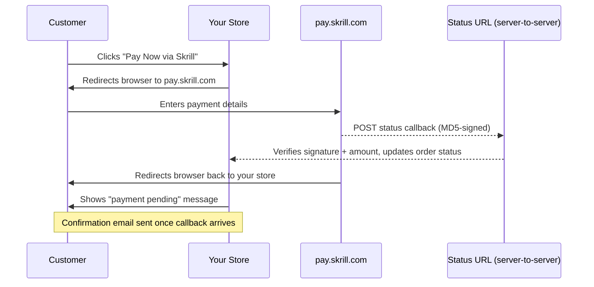

# Skrill

Skrill Quick Checkout lets customers pay on Skrill's hosted page at pay.skrill.com. Your store never sees card numbers — customers enter their payment details directly on Skrill's site. Once payment is complete, Skrill sends a signed server-to-server callback that confirms the order automatically.

This makes Skrill a good fit for stores that want a simple, globally-recognised wallet payment option without handling PCI compliance for card data.

## Prerequisites

- A [Skrill merchant account](https://www.skrill.com/en/business/) with Quick Checkout enabled
- Your Skrill merchant email address (the email you use to log in to Skrill)
- Your Skrill **secret word** (set in your Skrill merchant settings — see Step 2 below)
- A publicly reachable HTTPS store URL so Skrill can deliver the status callback

:::info Add-on Extension

Skrill is a separate add-on available from the [J2Commerce Extensions Store](https://www.j2commerce.com). It is not included with the core J2Commerce component.

:::

## Purchase and download

This plugin is a separate add-on available from the [J2Commerce Extensions Store](https://www.j2commerce.com). It is not included with the core J2Commerce 6 component.

1. Go to the [J2Commerce website](https://www.j2commerce.com) and locate **Skrill**.
2. Add it to your cart and complete checkout.
3. Go to **My Downloads** under your account profile and find the plugin.
4. Click **Available Versions** -> **View Files** -> **Download Now** to download the ZIP file.

## Install the plugin

In the Joomla Administrator, go to **System** -> **Install** -> **Extensions**.

Upload the `plg_j2commerce_payment_skrill.zip` file.

## Enable the Plugin

Once you have installed the App, you will need to enable it. There are **two** ways you can access the App.&#x20;

**Option A:** Go to the **J2Commerce** icon at the top right corner **-> Setup -> Payment Methods**

**Option B:** Go to **Components** on the left sidebar **-> J2Commerce -> Dashboard** **-> Setup** **-> Payment Methods**

To help you narrow down the list, you can do a search for **Skrill**, click the **X,** and it will turn into a green checkmark. It is now enabled and ready for setup.

## Configure the plugin

Click the **Skrill** title next to the green checkmark to open the configuration screen.

:::tip

Click the **Toggle Inline Help** button at the top of any plugin configuration page to show a short description beneath each field.

:::

### Credentials tab

**Sandbox Mode:** Enable for testing with a Skrill test account

**Merchant ID:** Your numeric Skrill Merchant ID

**Merchant Email:** Email registered with your Skrill account

**Secret Word:** Shared secret for MD5 callback signing

**Sandbox Merchant ID:** Merchant ID for your sandbox test account

**Sandbox Merchant Email:** Email for your sandbox test account

**Sandbox Secret Word:** Secret word for your sandbox test account

**Status URL:** Read-only. Auto-generated URL to paste into Skrill's merchant settings

**Status URL Override:** Override the auto-detected URL. Use this for ngrok/reverse-proxy setups

**Debug Logging:** Log Skrill activity to `logs/payment_skrill.php`

### Get the secret word in your Skrill account

The secret word is a password you choose. You set the same value in both J2Commerce and your Skrill account. Skrill uses it to sign the status callback, and J2Commerce uses it to verify that the callback is genuine.

1. Log in to your Skrill merchant account at [https://www.skrill.com](https://www.skrill.com).
2. Go to **Settings** -> **Developer Tools** (the exact menu path may vary by Skrill account type).
3. Find the **Secret Word** or **Merchant Settings** section.
4. Enter the same secret word you typed in J2Commerce.
5. Save your Skrill settings.

:::warning Must match exactly
The secret word in J2Commerce and in your Skrill account must be identical, including uppercase and lowercase letters. A mismatch causes every callback to fail with a signature error, and orders will stay in their initial status after payment.
:::

### Get the status URL into your Skrill account

The status URL is the address Skrill calls after each payment to confirm the result. J2Commerce generates this URL automatically.

1. In the Skrill plugin settings, look for the **Status URL** field. It displays a read-only URL with a **Copy** button.
2. Click **Copy** to copy the URL.
3. In your Skrill merchant account, go to **Settings** -> **Developer Tools** -> **Merchant Settings** (or the equivalent section).
4. Paste the URL into the **Status URL** field.
5. Save your Skrill settings.

:::info Localhost will not work

Skrill's servers cannot reach `localhost` or `127.0.0.1`. During development, use a tunnelling tool such as [ngrok](https://ngrok.com/) to expose your local site with a public HTTPS URL. Paste the ngrok URL into the **Status URL Override** field (see the [configuration table](#configuration-reference) below) rather than changing your Skrill dashboard each time.

:::

### Display tab

**Display Name:** Name shown at checkout

**Display Image:** Payment logo shown at checkout

**Show Dashboard Icon:** Show a quick-access icon on the J2Commerce dashboard

**Template:** Layout template: Bootstrap 5 or UIkit

**Recipient Description:** Short text shown on the Skrill page next to your name (max 30 chars)

**Return Button Text:** Text for the "back to store" button on Skrill's confirmation page

**Logo URL:** HTTPS URL of your logo shown on Skrill's payment page

### Message tab

**Pre-Payment Message:** Optional HTML message shown before the redirect button

**Post-Payment Message:** Optional HTML message shown after the customer returns from Skrill

**Cancel Message:** Optional HTML message shown when the customer cancels on Skrill

### Restriction tab

**Geo Zone:** Restrict Skrill to customers in a specific geographic zone. Leave at 0 for all customers

**Minimum Subtotal:** Hide Skrill for orders below this amount. Enter 0 for no minimum

**Maximum Subtotal:** Hide Skrill for orders above this amount. Enter 0 for no maximum

### Order Status tab

Order statuses tell J2Commerce what to do with an order when Skrill reports each payment outcome. If you skip the **Confirmed Payment Status**, paid orders will pass signature verification but remain in their initial status — they will never advance automatically.

**Confirmed Payment Status:** Skrill sends `status=2` (payment processed). **Required.**

**Pending Payment Status:** Skrill sends `status=0` (payment pending)

**Failed Payment Status:** Skrill sends `status=-1` (cancelled), `-2` (failed), or `-3` (chargeback)

**Refunded Status:** Admin clicks **Mark as Refunded** in the order view

:::danger Dashboard warning

If **Confirmed Payment Status** is left empty, a red warning banner appears on the J2Commerce dashboard. Paid orders validate correctly but stay on their original status until you configure this setting.

:::

:::info

If the order status you want is not listed, create it first under **J2Commerce** -> **Setup** -> **Order Statuses**.

:::

***

## How a Payment Works

Understanding the flow helps you troubleshoot if something goes wrong.

1. The customer selects Skrill at checkout and clicks **Pay Now via Skrill**.
2. The browser is redirected to `pay.skrill.com` with a signed form containing the order details.
3. The customer completes payment on Skrill's hosted page.
4. Skrill sends a server-to-server POST to your **Status URL** with an MD5 signature.
5. J2Commerce verifies the signature, the receiving email, and the payment amount — then advances the order status.
6. The customer's browser is redirected back to your store, which shows a "payment being processed" message at this point.

The order status change (and any confirmation email) happens when the **status callback** arrives — not when the browser returns. There is typically a delay of a few seconds between the two.

## Sandbox Testing

Skrill provides a separate test environment with a dedicated test merchant account.

1. Set **Sandbox Mode** to **Yes** in the plugin.
2. Fill in the **Sandbox Merchant ID**, **Sandbox Merchant Email**, and **Sandbox Secret Word** fields — these come from your Skrill test account, not your live account.
3. Because Skrill's status callbacks require a public URL, you need to use a tunnel:

   - Install [ngrok](https://ngrok.com/) and run `ngrok http 443` (or your local port).
   - Copy the `https://...ngrok.io` URL ngrok gives you.
   - Add your full status URL using that ngrok host in the **Status URL Override** field: `https://your-tunnel.ngrok.io/index.php?option=com_ajax&group=j2commerce&plugin=payment_skrill&format=raw&task=status`
4. Place a test order and complete payment on Skrill's sandbox. The callback should arrive within a few seconds and advance the order status.
5. When finished, set **Sandbox Mode** back to **No** and clear the **Status URL Override** field.

***

## Limitations

Skrill Quick Checkout has some important limitations to be aware of before choosing it as your payment gateway.

**No programmatic refunds.** Skrill does not provide a refund API for Quick Checkout. To refund a customer, you must log in to your Skrill merchant dashboard and issue the refund there. In J2Commerce, the **Mark as Refunded** button in the order admin only updates the order status — it does not contact Skrill. The confirmation dialog explains this before you click.

**No saved cards.** Skrill Quick Checkout is a hosted redirect. There is no tokenization or saved-payment-method feature. Returning customers must re-enter their details (or log in to Skrill) each time.

**No automatic subscription renewals.** Because Skrill does not support merchant-initiated charges, J2Commerce subscriptions cannot be renewed automatically via Skrill. Use a gateway with tokenization support (such as Stripe or Braintree) if you sell subscription products.

**Multi-currency is supported.** Skrill accepts over 40 currencies. J2Commerce sends the order's display-currency amount and currency code, so customers are charged in your store's selected currency rather than a base currency conversion.

***

## What's New vs the J2Store Version

If you previously used the Skrill plugin with J2Store, here is what changed in J2Commerce 6.

| Area              | J2Store                | J2Commerce 6                                                                |
| ----------------- | ---------------------- | --------------------------------------------------------------------------- |
| Architecture      | FOF 2 framework        | Native Joomla 6 MVC, fully namespaced                                       |
| Callback security | MD5 check only         | MD5 signature + receiver email check + amount tolerance check               |
| Multi-currency    | Base currency only     | Full `CurrencyHelper::gatewayAmount()` — correct amount in display currency |
| Order events      | Direct database writes | `OrderModel::updateOrderStatus()` — triggers emails and action-log entries  |
| Dashboard health  | None                   | Red banners for missing credentials and missing confirmed status            |
| Debug logging     | None                   | Optional Joomla log (`logs/payment_skrill.php`)                             |
| Sandbox           | Shared credentials     | Separate sandbox credentials tab                                            |
| Refund UX         | Silent status change   | Confirmation dialog with explicit note to refund in Skrill dashboard        |

***

## Troubleshooting

### Order stays in "New" or initial status after payment

**Cause 1 — Confirmed Payment Status not set.** Go to the **Order Statuses** tab and choose a status for **Confirmed Payment Status**. A dashboard warning will be visible if this is missing.

**Cause 2 — Status URL unreachable.** Skrill could not deliver the callback. Check that the Status URL is correctly pasted in your Skrill account settings. Test it by enabling **Debug Logging** and checking `logs/payment_skrill.php` for incoming requests. If running on localhost, use ngrok and the **Status URL Override** field.

**Cause 3 — Wrong secret word.** The secret word in J2Commerce and in your Skrill account must match exactly. A signature mismatch appears in the log as "Status callback check 1 FAIL: signature mismatch". Re-copy the secret word from J2Commerce and paste it into Skrill (or the other way around).

### "Skrill Merchant Email or Secret Word is not configured" warning on dashboard

Open the **Skrill** plugin settings and fill in the **Merchant Email** and **Secret Word** fields under the **Skrill Credentials** tab. Both must be non-empty.

### Signature mismatch in the log

The most common causes are:

- The secret word does not match between J2Commerce and Skrill.
- The **Merchant ID** field is empty or incorrect — the signature calculation requires it.
- The status URL is receiving requests from a source other than Skrill (a scanner or test tool).

Enable **Debug Logging**, place a test order, and check `logs/payment_skrill.php` for the exact fields received in the callback.

### Status callback arrives but amount check fails

This is logged as "Status callback check 3 FAIL: amount mismatch". The amount Skrill reports (`mb_amount`) differs from the order's gateway amount by more than 0.01. Check that:

- No currency conversion error affected the order.
- The currency code in J2Commerce matches a currency accepted by your Skrill account.

### Customer redirected back but order not confirmed yet

This is expected behaviour. The browser return happens immediately after the customer pays on Skrill. The status callback — which confirms the order — arrives a few seconds later as a separate server-to-server request. The store shows a "payment being processed" message on the return page. If the order does not advance within a minute, see the steps above.

### Sandbox mode left on in production

A yellow warning banner on the J2Commerce dashboard reads "Skrill is in SANDBOX mode. No real transactions will be processed." Go to **J2Commerce** -> **Setup** -> **Payment Methods** -> **Skrill**, set **Sandbox Mode** to **No**, and save.

***

## Related Topics

- [Payment Methods Overview](../setup/payment-methods.md)
- [Order Statuses](../sales/order-statuses.md)
- [Geo Zones](../setup/geo-zones.md)
- [Multi-Currency](../setup/currencies.md)
