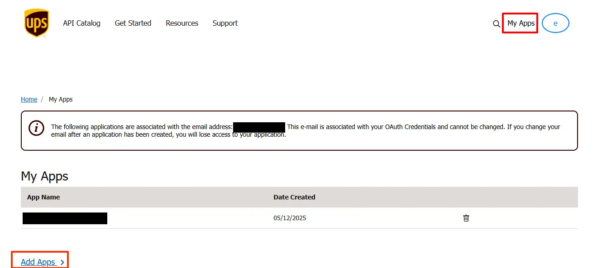
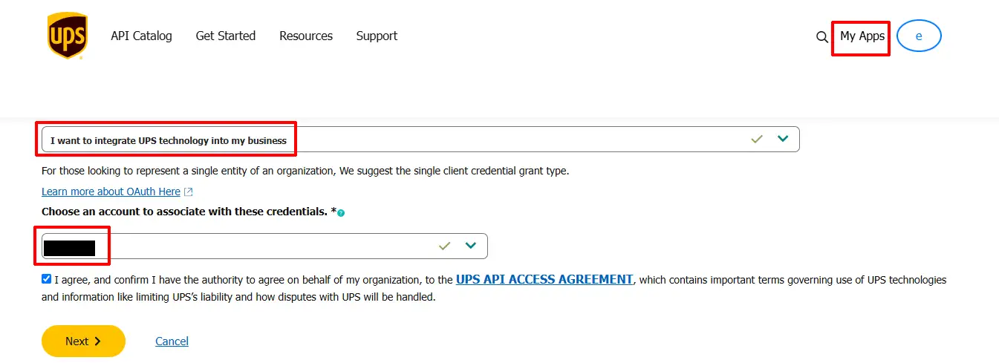
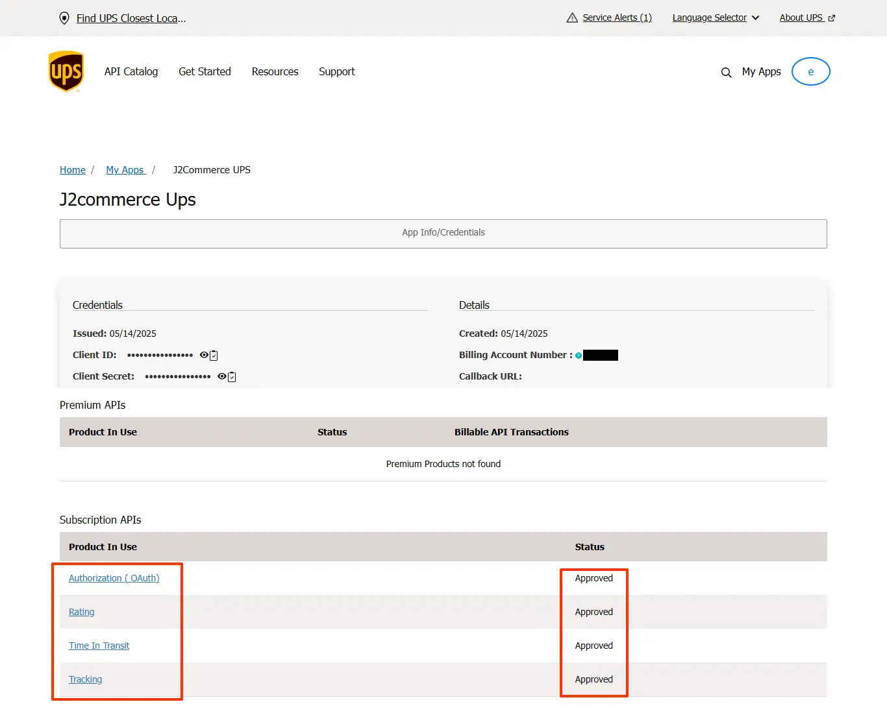
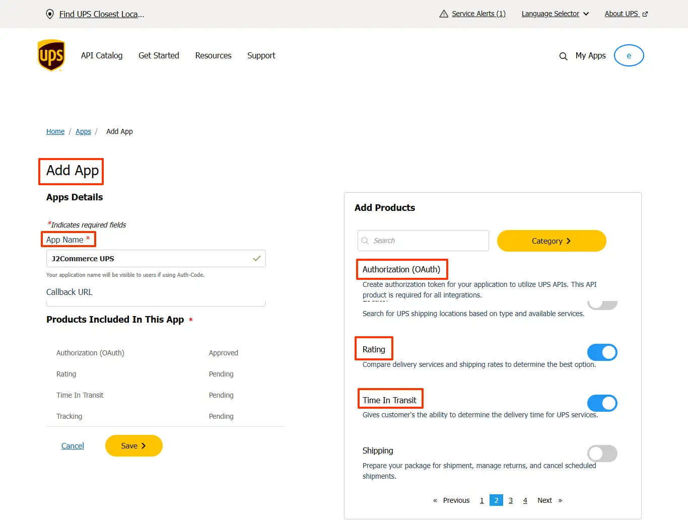

# UPS Shipping

The UPS Shipping plugin fetches live carrier rates from UPS and shows them to customers at checkout. Rates are calculated in real time based on the customer's destination, your origin address, and the weight and size of the items in the cart.

UPS requires OAuth 2.0 credentials. The plugin handles token caching automatically — you just need a Client ID and Client Secret from the UPS Developer portal.

## Prerequisites

- J2Commerce is installed and configured
- At least one shipping zone set up in **J2Commerce** -> **Shipping** -> **Shipping Methods**
- Products must have weight values set (dimensions are optional but recommended)
- An active UPS account with API access

## Requirements

- with PHP 8.3.0 +
- Joomla! 6.x
- J2Commerce 6.x

## Purchase and Download

You can install this **USP** shipping plugin using the Joomla installer. The following steps help you with a successful installation.

‌**Step 1:** Go to our [**J2Commerce** website](https://www.j2commerce.com/) **->** **Extensions -> Shipping Plugin**

**Step 2:** Locate the **UPS** Plugin **->** click **View Details** **->** **Add to cart -> Checkout**.&#x20;

**Step 3:** Go to your **My Downloads** under your profile button at the top right corner and search for the app. Click **Available Versions -> View Files -> Download Now**

## Install the Plugin

You can install this **UPS** shipping plugin using Joomla installer. The following steps help you with a successful installation.

In the Joomla admin, go to **System -> Install -> Extensions**

Upload the plugin ZIP file or use the Install from URL option.

 (1).webp>)

## Enable the Plugin

Once you have installed the extension, you will need to enable it. There are **two** ways you can access the extension.&#x20;

**Option A:** Go to the **J2Commerce** icon at the top right corner **-> Setup -> Shipping Methods**

**Option B:** Go to **Components** on the left sidebar **-> J2Commerce -> Dashboard -> Setup -> Shipping Methods**

Look for **UPS** Shipping, click the **X,** and it will turn into a green checkmark. It is now enabled and ready for setup.

:::note

NOTE: Before you can start configuring the plugin, you will need your API Credentials from UPS. &#x20;

:::

## Getting Your UPS API Credentials

UPS uses OAuth 2.0 for all API access. You need a **Client ID** and **Client Secret** from the UPS Developer portal. Follow these steps to get them.

### Step 1: Create a UPS Developer Account

1. Go to [developer.ups.com](https://developer.ups.com) and click **Sign Up** (or **Log In** if you already have a UPS account).
2. Complete registration using your business email address.
3. Once logged in, you land on the **My Apps** dashboard.

### Step 2: Create a New App

Click **Add Apps** (or **Create App**) on the **My Apps** page.

Enter an **App Name** — for example, `J2Commerce Shipping`.

Under **I want to integrate UPS technology into my business**, select **Get Rates and Service Commitments** (or similar — the wording may vary, but you need access to the Rating API).

Accept the UPS Developer Kit Agreement and click **Save**.

Complete the contact info

Then select the Rating, Tracking, and Time In Transit API's (I believe the Authorization(OAuth) is automatically added when you save)

(Right now, we aren't using the Tracking API, but we do plan on incorporating that in later versions, so better to add it now so you don't need to worry about adding it later...)

After saving, you should be able to see the Client ID and client Secret under the App Info/Credentials page

### Step 3: Copy Your Credentials

After saving, UPS displays your app credentials:

- **Client ID** — a long alphanumeric string
- **Client Secret** — click the eye icon to reveal it

Copy both values. You will paste them into the plugin settings in the next section.

:::note

NOTE: **Keep your Client Secret safe.** Treat it like a password — do not share it or commit it to version control.

:::

### Step 5: Link Your UPS Account Number (Optional)

Your UPS shipper number (account number) appears on your UPS invoices and in your UPS.com profile. It is only required if you want negotiated (discounted) rates. You can find it by:

1. Logging in to [ups.com](https://www.ups.com).
2. Go to your **Account Summary** or **Payment** page.
3. Your account number appears in the **My Accounts** section — it is a six-character alphanumeric code.

## Creating a UPS Shipping Method

Go to the **J2Commerce** icon at the top right corner **-> Setup -> Shipping Methods**

Select **UPS Shipping** from the shipping method list

Click on the UPS Shipping title to start the configuration

## Configuration Reference

:::tip

**Tip**: Click on the Toggle Inline Help button on any app/plugin you install and it will show a description below each section. See image below

:::

The settings are grouped into logical sections below.

### API Credentials

**Production Client ID:** Enter the Client Key provided by the UPS Developer Portal ([https://developer.ups.com/](https://developer.ups.com/)).

**Production Client Secret:** Enter the Client Secret provided by the UPS Developer Portal  ([https://developer.ups.com/](https://developer.ups.com/)).

‌**Shipper Number:** Your UPS shipper number (account number). Required for negotiated rates.

### Services

**Rating Request Type:**&#x20;

- **Shop** asks UPS for rates on all available services at once.&#x20;

- **Rate** requests a rate for one specific service only. Use Shop for most stores.

**Enabled Services:** Select which UPS services to show at checkout. Only services that UPS returns as available for the shipment will appear.

Select multiple services using the dropdown — customers will see all available services at checkout, each with its own rate.

### Package Settings

**UPS Packaging Box:** The UPS packaging type code sent in rate requests. Use **Customer Supplied Package** for your own boxes or mailers.

**Packing Mode:**&#x20;

- **Per Item** sends one package to UPS for each item in the cart.&#x20;

- **Box Packing** uses a 3D bin-packing algorithm to fit items into configured boxes before requesting rates. Box Packing gives more accurate rates for multi-item orders.

**Weight Unit:** Weight unit your products use (`lb` or `kg`). Must match the unit set on your products

**Dimension Unit:** Dimension unit your products use (`in` or `cm`). Must match the unit set on your products.

**Send Package Dimensions:** Include length, width, and height in rate requests. Disable only if none of your products have dimensions set

**Default Weight:** Fallback weight when a product has no weight configured

**Default Length:** Fallback length when a product has no length configured

**Default Width:** Fallback width when a product has no width configured

**Default Height:** Fallback height when a product has no height configured

### Origin Address

These fields tell UPS where your shipments originate. The postal code is required — city and state improve accuracy.

**Shipping Postal Code:** ZIP or postal code of your warehouse or dispatch location

**Shipping Country:** Country where your shipments originate

**Shipping State:** State or province of your shipping location. Populated automatically when you select a country

**Shipping City:** City name of your shipping location

**Shipping Origin Address Type:** Set to **Yes** if UPS delivers to a residential address. UPS applies a residential surcharge. Set to **No** for commercial addresses

### Rate Options

**Enable Negotiated Rate:** Request your account's negotiated (discounted) rates. Requires a valid Shipper Number and negotiated rates enabled on your UPS account.

**Pickup Type:** How UPS collects packages from you. Most stores use **Daily Pickup**

**Delivery Confirmation Option:** Require proof of delivery. Signature options add a surcharge per package.

**Handling Cost:** A fixed amount or percentage added to every UPS rate. Set to `0` for no handling cost.

**Handling Cost Type:** Whether the Handling Cost is a **Flat Amount** or a **Percentage** of the shipping rate.

**Tax Profile:** Apply a tax profile to shipping costs. Select **None** for no shipping tax.

**Geozone Restriction:** Restrict this shipping method to customers in a specific geozone. Leave as **None** to make it available to all customers.

**Show Delivery Date:** Display estimated business days in transit next to each UPS option at checkout.

**Debug Mode:** Write API requests and responses to `administrator/logs/shipping_ups.php`. Disable in production.

## UPS Services Reference

The following UPS service codes are supported. Select any combination in the **Enabled Services** field.

| Service Code | Service Name                  | Typical Use                        |
| ------------ | ----------------------------- | ---------------------------------- |
| 01           | UPS Next Day Air              | Overnight domestic delivery        |
| 02           | UPS 2nd Day Air               | Two-day domestic delivery          |
| 03           | UPS Ground                    | Standard domestic ground           |
| 07           | UPS Worldwide Express         | International express              |
| 08           | UPS Worldwide Expedited       | International economy express      |
| 11           | UPS Standard                  | Standard cross-border (US/CA/MX)   |
| 12           | UPS 3 Day Select              | Three-day domestic delivery        |
| 13           | UPS Next Day Air Saver        | Overnight, end-of-day delivery     |
| 14           | UPS Next Day Air Early        | Overnight, early morning delivery  |
| 54           | UPS Worldwide Express Plus    | International, very early morning  |
| 59           | UPS 2nd Day Air A.M.          | Two-day, morning delivery          |
| 65           | UPS Worldwide Saver           | International, end-of-day express  |
| 72           | UPS Worldwide Economy DDP     | International economy, duties paid |
| 96           | UPS Worldwide Express Freight | International freight, palletized  |

:::tip

**Tip**: Not all services are available for every origin-destination pair. UPS returns only the eligible services for each shipment, so customers will only ever see rates for services that UPS can actually provide.

:::

## Tips

- **Start in sandbox mode.** Enable **Debug Mode** and place a test order to confirm rates appear correctly before switching to production credentials.
- **Set weight on all products.** The plugin uses your **Default Weight** as a fallback, but this gives less accurate rates. Set real weight values on every product.
- **Use Box Packing for multi-item stores.** Per Item mode can over-estimate shipping costs when customers buy several small items that would fit in one box.
- **Negotiated rates require your Shipper Number.** If you have a UPS account with volume discounts, fill in the **Shipper Number** field and enable **Enable Negotiated Rate** to pass your discounts to customers.
- **Geozone restrictions.** If you only ship domestically, create a domestic geozone in **J2Commerce** -> **Shipping** -> **Geo Zones** and select it in the **Geozone Restriction** field. This prevents the plugin from trying to fetch rates for unsupported destinations.
- **The checkout image.** A UPS logo ships with the plugin and is set as the default. You can replace it with a custom image using the **Checkout Image** field.

## Troubleshooting

### No UPS rates appear at checkout

**Cause:** There are several common reasons rates do not show.

**Solution:** Work through this checklist:

1. Enable **Debug Mode** and place a test order. Check `administrator/logs/shipping_ups.php` for error messages.
2. Confirm **Sandbox Mode** is set to match the credentials you entered. Sandbox credentials do not work against the production endpoint.
3. Verify your Client ID and Client Secret are correct — copy and paste them directly from the UPS Developer portal rather than typing them.
4. Make sure at least one **Enabled Service** is selected. If the field is empty, no rates will be shown even if UPS returns them.
5. Check that your **Origin Postal Code** and **Origin Country** are filled in — both are required.
6. Confirm the products in the test cart have a weight set. UPS will not return rates for zero-weight packages.

### UPS returns an authentication error (401)

**Cause:** The Client ID or Client Secret is wrong, or the app on the UPS Developer portal does not have access to the Rating API.

**Solution:**

1. Log in to [developer.ups.com](https://developer.ups.com) and open your app.
2. Confirm the app includes the **Rating** API product. If it does not, edit the app and add it.
3. Re-copy the Client ID and Client Secret — regenerating the secret invalidates the old one.
4. Paste the fresh credentials into the plugin and save.

### Negotiated rates are not showing

**Cause:** Negotiated rates require a Shipper Number and must be activated on your UPS account.

**Solution:**

1. Make sure your **Shipper Number** (UPS account number) is entered in the plugin.
2. Confirm **Enable Negotiated Rate** is set to **Yes**.
3. Contact UPS to verify that your account has negotiated rates enabled — not all accounts have this feature.

### Box Packing produces unexpected package counts

**Cause:** Some items may be larger than all configured boxes and fall back to per-item packing.

**Solution:**

1. Enable **Debug Mode** — the log file reports when items cannot be packed and which method was used.
2. Add larger custom box sizes in the **Custom Box Sizes** field to accommodate oversized items.
3. If certain items should never be combined with others, consider setting them as individual products with their own shipping class.
