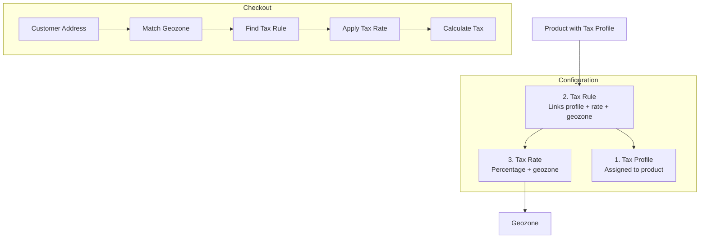

# Taxation

Taxation in J2Commerce uses a three-tier system: Tax Profiles, Tax Rates, and Tax Rules. Understanding how these work together is essential for configuring accurate tax calculations for your store.

## Requirements

- PHP 8.3.0+
- Joomla 6.x
- J2Commerce 6.x

## Taxation Architecture

J2Commerce calculates taxes using three interconnected components:

## Three-Tier System

### 1. Tax Profiles

A **Tax Profile** is a named tax configuration that you assign to products. Think of it as a "tax category."

| Example Profiles | Use Case |
|------------------|----------|
| Standard VAT | Regular products subject to standard VAT |
| Reduced VAT | Essential goods with lower tax rate |
| No Tax | Tax-exempt products |
| US Sales Tax | Products sold in specific US states |

**Location:** J2Commerce → Dashboard → Localisation → Tax Profiles

### 2. Tax Rates

A **Tax Rate** defines the actual percentage charged and the geographic zone where it applies.

| Example Rates | Percentage | Geozone |
|--------------|------------|---------|
| UK Standard VAT | 20% | United Kingdom |
| US California Sales Tax | 9.25% | California |
| Switzerland VAT | 7% | Switzerland |

**Location:** J2Commerce → Dashboard → Localisation → Tax Rates

### 3. Tax Rules

A **Tax Rule** connects a Tax Profile to a Tax Rate for a specific address type (billing or shipping).

**Location:** J2Commerce → Dashboard → Localisation → Tax Rules

## How Tax Calculation Works

When a customer checks out:

1. **Get customer's address** — Billing or shipping address (based on rule configuration)
2. **Match to Geozone** — Find which geozone the address belongs to
3. **Find Tax Rules** — Look for rules matching the product's Tax Profile
4. **Calculate Tax** — Apply the Tax Rate percentage to the product price

### Example: UK Customer Ordering a Standard Product

1. Product has **Tax Profile: Standard VAT**
2. Customer shipping address is in **United Kingdom**
3. Tax Rule matches: **Standard VAT** + **Shipping Address** + **UK VAT Rate**
4. Tax Rate applies: **20% UK VAT**
5. Tax calculated: Product price × 20%

## Address Type Selection

Tax Rules can use either **Billing Address** or **Shipping Address** for geozone matching:

| Address Type | Use When |
|--------------|----------|
| **Billing** | Tax based on where the customer is billed |
| **Shipping** | Tax based on where the product is delivered |

For US sales tax, use **Shipping Address**. For VAT in the EU, use **Billing Address**.

## Compound Tax

When multiple tax rules match, J2Commerce can apply compound tax:

- **Priority 1**: First tax rate applied to base price
- **Priority 2**: Second tax rate applied to price + first tax
- **Priority 3**: Third tax rate applied to cumulative total

Lower priority numbers are calculated first.

## Quick Setup Guide

### For a Single Tax Rate (e.g., UK VAT)

1. **Create a Geozone**
   - Go to **J2Commerce → Localisation → Geozones**
   - Create a geozone for "United Kingdom"
   - Add the UK country (and zones if needed)

2. **Create a Tax Rate**
   - Go to **J2Commerce → Localisation → Tax Rates**
   - Create "UK Standard VAT 20%"
   - Set rate: `20`
   - Assign geozone: "United Kingdom"

3. **Create a Tax Profile**
   - Go to **J2Commerce → Localisation → Tax Profiles**
   - Create "Standard VAT"

4. **Create a Tax Rule**
   - Go to **J2Commerce → Localisation → Tax Rules**
   - Select Tax Profile: "Standard VAT"
   - Select Tax Rate: "UK Standard VAT 20%"
   - Address Type: "Billing"

5. **Assign to Products**
   - Edit each product
   - Set the Tax Profile to "Standard VAT"

## Related Topics

- [Tax Rules](tax-rules.md) — Detailed configuration guide
- [Geozones](../localisation/geozones.md) — Create geographic zones for tax rates
- [Tax Profiles](../localisation/tax-profiles.md) — Manage tax categories
- [Tax Rates](../localisation/tax-rates.md) — Define tax percentages