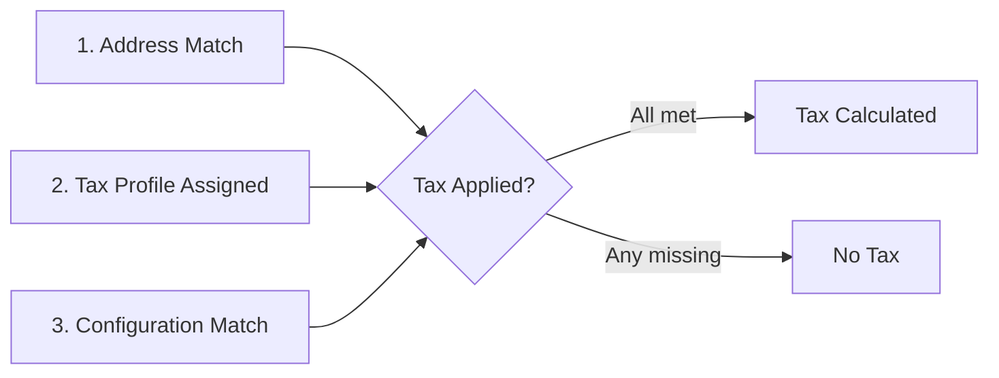

# How Tax is Calculated

Understanding how J2Commerce calculates tax is essential for troubleshooting why tax may or may not appear at checkout. The system follows a strict logic chain — if any link is broken, tax will not apply.

## The Three Requirements for Tax

For tax to be calculated correctly, **all three** conditions must be met:

### 1. Geographic Location Match

The customer's address must fall within a configured Geozone:

1. **Customer selects country and zone** during checkout
2. **System checks if that location is in a Geozone** that has a tax rate
3. **If not in any Geozone:** No tax applies

### 2. Address Type Alignment

The tax rule's "Associated Address" must match the global configuration:

- **Tax Rule setting:** Billing or Shipping address
- **Global configuration:** "Calculate tax based on" setting
- **The match:** Both must use the same address type

If your Tax Profile uses "Shipping" but global config uses "Billing," the tax rule will not match.

### 3. Product Tax Profile Assignment

Every taxable product must have a Tax Profile:

- Set in the product's **J2Commerce tab** → **General tab**
- If no profile is selected, the product is treated as tax-exempt

## Detailed Checklist

Use this checklist when tax is not appearing as expected:

- [ ] Is the customer's address in a defined **Geozone**?
- [ ] Is there a **Tax Rate** linked to that Geozone?
- [ ] Does the **Tax Profile** contain that Tax Rate?
- [ ] Does the **Associated Address** in the Tax Profile match the **Calculate tax based on** setting in Global Configuration?
- [ ] Is the **Product** assigned to that Tax Profile?
- [ ] Is the Tax Profile **enabled**?
- [ ] Is the Tax Rate **enabled**?

## Troubleshooting

### Tax is applied to the wrong amount
**Cause:** The "Apply discounts" setting in global configuration is likely incorrect.
**Solution:** Go to **J2Commerce** -> **Setup** -> **Configuration** -> **Tax tab** and verify if discounts should be applied **Before tax** or **After tax**.

### Tax is not appearing for some products but works for others
**Cause:** The affected products are likely missing a Tax Profile assignment.
**Solution:** Edit the product and ensure a valid **Tax Profile** is selected in the J2Commerce General tab.
