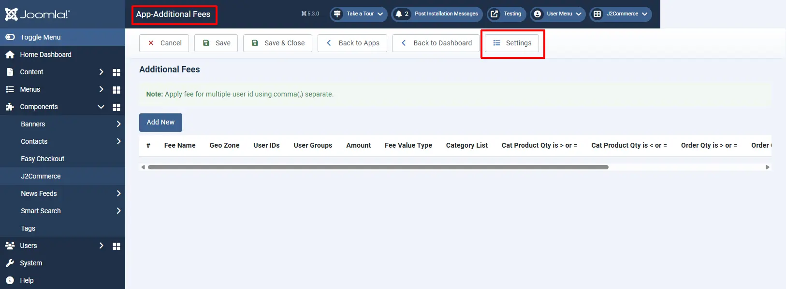
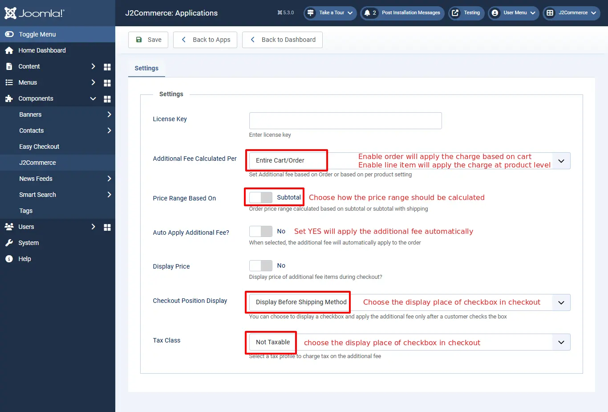
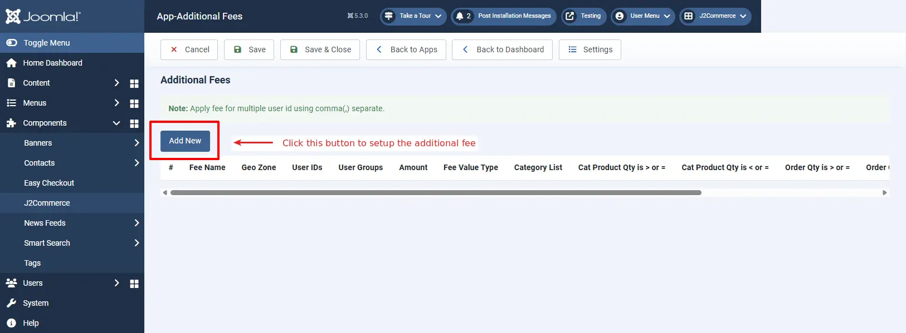
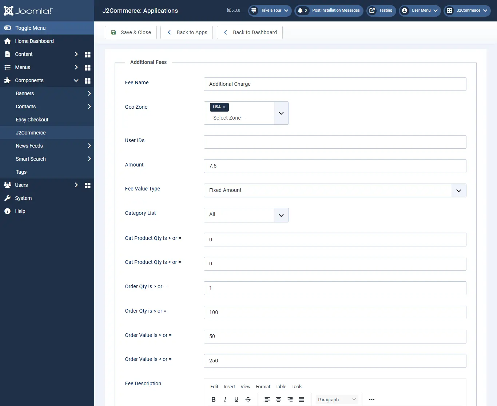

# Additional Fee

## Requirements <a href="#requirements" id="requirements" />

1. PHP 8.1.0 +
2. Joomla! 4.x/ Joomla! 5.x +
3. J2Commerce / J2Store 4.x +

## Purchase the App

**Step 1:** Go to our [J2Commerce website](https://www.j2commerce.com/) > Extensions > Apps

**Step 2:** Locate the Additional Fee App > click View Details > Add to cart > Checkout.&#x20;

**Step 3:** Go to your My Downloads under your profile button at the top right corner and search for the app. Click Available Versions > View Files > Download Now

## Install the App

Go to System > Install > Extensions > Install the app

.webp>)

## Enable the App

&#x20;Go to J2Commerce > Apps > search for the Additional Fee&#x20;

Click on the 'X' under Status to enable it.

## Setting up the Parameters

Now it's time to open the app and configure the settings.&#x20;

Click on "Open App" or the Title to start setting up the app

Click the Settings tab at the top right corner.

### Basic tab

**An additional fee should be calculated per:** Set the additional fee based on the order or based on per product setting

- **Entire Cart/Order:** This will apply the additional fee globally, i.e., based on the cart.
- **Line item(Per Product):** This will apply the additional charge based on the product. You can set an additional fee to the product individually in the apps tab on j2store cart. Once you enabled Line item, the amount/charge will be applied to the individual products.

**Price Range Based On:** Select Yes to define whether the order total after applying the additional fee should be calculated based on the subtotal or based on the subtotal including the shipping price.

**Auto Apply Additional Fee?** Select Yes to apply the additional fee at checkout automatically. Set No will hide the additional fee displaying in cart page and checkout, and it will display the checkbox at the payment step, allowing customers to choose the fees.

***\*\*If Auto Apply Additional Fee in the App settings is set to No, it will appear on the checkout page as an optional choice for the customer. The image below shows what it will look like on the frontend once the additional fees are applied to the product.***

***\*\*If Auto Apply Additional Fee in checkout is set to Yes, it will charge the customer for all of the Additional Fees you set up. Which, depending on the type of product, may not be what you want. The image below shows what it will look like on the frontend once the additional fees are applied to the product.***

**Display Price:** Select Yes to display the price of the additional fee items during checkout.

**Checkout Position Display:** You can change the position of the checkbox by selecting either&#x20;

- Display before shipping method

- Display after payment methods.

**Tax Class:** Specify the tax class to charge tax on shipping. Leave empty if you do not want to charge tax on shipping

## Setting up Additional Fees

Open the app and click the Add New button to create a new fee.

**Fee Name:** Enter the name for the additional fee. The value given here will be displayed during checkout.

**Geo Zone:** Restrict applying additional charge based on region. If you want to apply an extra charge only for customers from the United States, then create a geo zone for the US and assign it here.

**User IDs:** You could also apply the charge only to a specific customer by adding the user id of the customer here. You can add multiple user ids with a comma(,) separated.

**User groups:** It is also possible to restrict additional fees by user group. The additional fee will be applicable to the customers belongs to the user group selected here.

**Amount:** Enter the amount to be charged.

**Fee value type:** Choose whether the additional charge should be a fixed price or based on a percentage.

**Category list:** If you would like to apply the extra charge by category, then all you have to do is select the category to which the additional fee should be applied.

**Apply when category product quantity is greater than or equal to,** and **Apply if category product quantity is less than or equal to:** If you want to apply the fee for the particular quantity range of the product from the particular category chosen above, specify the quantity range here.

**Apply when total order quantity is greater than or equal to:** Enter the quantity range. For example, set quantity range **2**. So an additional fee will be applied when the quantity reaches **2** or **above 2**.

**Apply if the total order quantity is less than or equal to:** An additional fee will be applied when the quantity reaches the value entered here. For example, set quantity range **2**. So an additional fee will be applied when the quantity is **2** or **fewer than 2**.

**Apply when total order value is greater than or equal to:** An additional fee will be applied when the total order price reaches the value entered here. For example, set the value to **50**. So the charge will be applied when the order value is **50** or **above 50**.

**Apply if total order value is less than or equal to:** An additional fee will be applied when the total order price reaches the value entered here. For example, set the value to **40**. So the charge will be applied when the order value is **40** or **less than 40**.

**Fee Description:** You can describe what the fee is for and why it's there.

***The image below shows all of the additional fees you have created***

## Applying Addition Fees to Products

- Go to Content > Article
- Open the article/product > J2Store cart tab.
- Navigate to the Apps tab and click add new button to set up the additional fee for that product. Refer to the image below.

  <figure>
    

    <figcaption>
      The&#x20;
    </figcaption>
  </figure>
