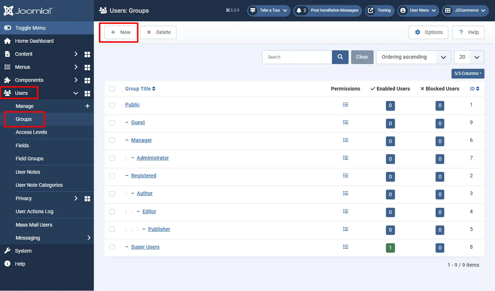
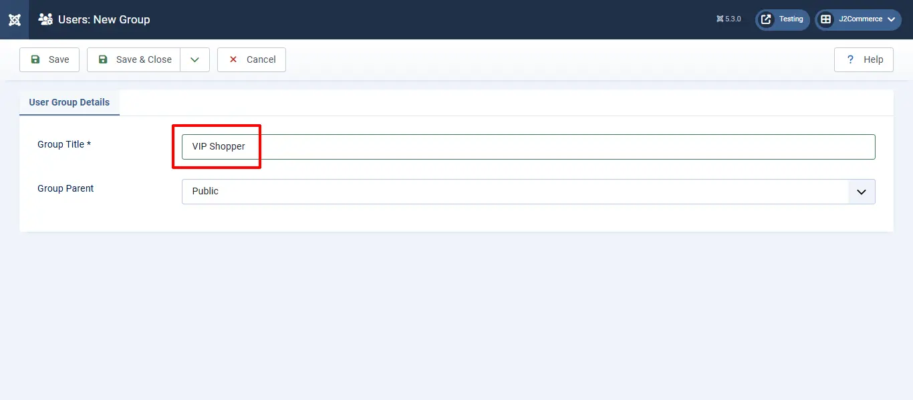
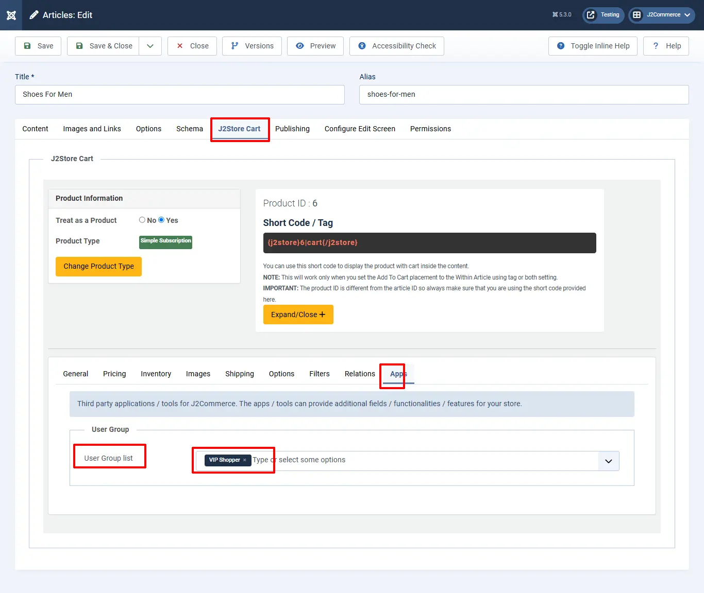

# Add to User Group

The Purpose of this app is to add users to the user group for selected order statuses and product selected groups.

## Requirements <a href="#requirements" id="requirements" />

- PHP 8.1.0 +
- Joomla! 4.x/ Joomla! 5.x +
- J2Commerce / J2Store 4.x +

## Purchase the App

**Step 1:** Go to our [J2Commerce website](https://www.j2commerce.com/) > Extensions > Apps

**Step 2:** Locate the Add to User Group App > click View Details > Add to cart > Checkout.&#x20;

**Step 3:** Go to your My Downloads under your profile button at the top right corner and search for the app. Click Available Versions > View Files > Download Now

## Install the App

Go to System > Install > Extensions > install the app

.webp>)

## Enable the App

Go to J2Commerce > Apps > search for Product Reviews to narrow down your search.&#x20;

Click on the 'X' under Status to enable it. &#x20;

## Creating Unique User Groups

Once you have enabled the app, you can create as many unique groups as you need so you can organize your customers.  This will be very helpful when wanting to send a specific group of customers marketing material, promotions, new products, etc.&#x20;

For example, if your customer is buying a digital product, you can add them to a special digital group, or if they are an important shopper, you can add them to a VIP shopper group and give them special access to certain products or documents.

### Create New User Groups

Go to Users > groups > New. Now name it whatever you want.&#x20;

In this example, we have named it VIP Shoppers.&#x20;

### Add Groups to Specific Products

Open the product in the Article Manager. Go to J2Store Cart tab > Apps > Add your new User Group

## Setting up the App Configuration

Click on "Open App" or the Title to start setting up the app.&#x20;

.webp>)

### Basic Settings tab

**Order Status:** The selected order status here will be compared with the order status of the order made by the user. For example, if you set the order status as confirmed and if the user’s order status is also confirmed, then the user will be moved to the user group selected in the product.

.webp>)

**Support**

Still have questions? You can contact support: [Click here](https://www.j2commerce.com/support)

Thank you for using our extension.
