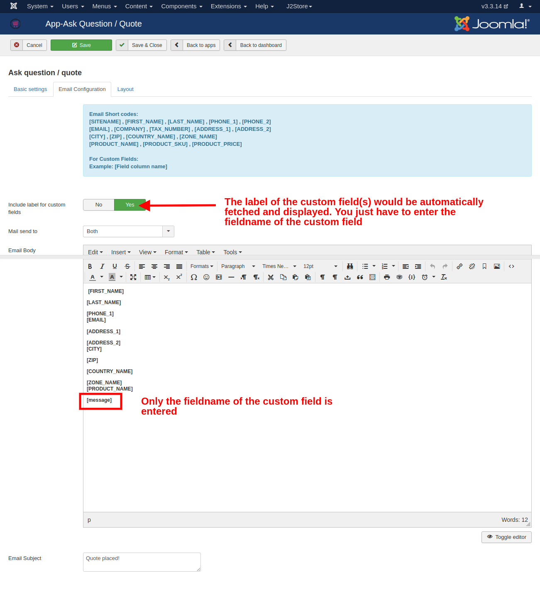

# Ask Question / Quote

This app allows customers to enquire a product or to ask quote for a product through email.

Using this app itself, you can use your store in catalog mode since this app has an option to hide the add to cart button. Clicking on a single button will enable communication between the store owner and the customer.

**Requirements**

- PHP 8.1.0 +
- Joomla! 4.x/ Joomla! 5.x +
- J2Commerce / J2Store 4.x +

**Switch off catalog mode:**

**NOTE:** **If you are having the shop in catalog mode, the ask quote button wouldn’t come up on the storefront.**

Alternatively, you could turn off the catalog mode and hide the add to cart buttons in the site using the **Hide add to cart button for all products?** in the basic settings of the Ask Quote plugin.

## Purchase the App

**Step 1:** Go to our [J2Commerce website](https://www.j2commerce.com/) > Extensions > Apps

**Step 2:** Locate the Ask Question / Quote App > click View Details > Add to cart > Checkout. 

**Step 3:** Go to your My Downloads under your profile button at the top right corner and search for the app. Click Available Versions > View Files > Download Now

## Install the App

Use the Joomla! installer to install the app. Go to System > Install > Extensions > install the app

## Enable the App

Go to J2Commerce > Apps > search for the Ask Questions app. 

Click on the 'X' under Status to enable it.  

Click on "Open App" or the Title to start setting up the app. 

**Global level**

In the global settings of the app, you can configure

- How and where the ask quote app would appear at the storefront.
- The look of the email is triggered when a user submits the ask quote form.
- The layout of the ask quote modal form.

## Setting up the Parameters

### Basic Settings tab

**Enable the Ask quote button for all products:** Select YES or NO to enable and disable the Ask quote button for all products.

**Hide Add to Cart button for all products:** Select YES or NO to hide the Add to Cart button.

**Hide Zero Price Cart Button:** Select yes or no to hide the cart if the price of the product in the cart is zero

**Display form style:** Select the view of the Ask Quote form.

**POP-UP:** Select this to display the ask quote form in a separate pop-up window.

**Accordion:** Select this to display the ask quote form in an accordion view

**Display position:** Choose whether you wish to have the add to quote form before or after the cart.

**Display button / link in:** Select the location (Product view, category view, Both views) where the Ask Quote button should be displayed.

**Display button/link:** Selecting display type here will make the text be displayed in button / link.

**Display text for button/link:** Change the button text / link text by entering custom text here.

Use the language constant PLG\_J2STORE\_PRODUCTQUOTE\_LINK\_TEXT to translate the text when you are using a multilingual site.

### Email Configuration tab

**Include label for custom fields:** If you wish that the label of the custom fields you use should be available on the email, then set this to Yes.

**Mail sent to:** You could choose whether the user alone or admin alone or both should receive the ask quote email.

**Email body:** Enter the body of the email here. You can use the below shortcodes in the text editor:

\[SITENAME]\
\[FIRST\_NAME]\
\[LAST\_NAME]\
\[PHONE\_1]\
\[PHONE\_2]\
\[EMAIL]\
\[COMPANY]\
\[TAX\_NUMBER]\
\[ADDRESS\_1]\
\[ADDRESS\_2]\
\[CITY]\
\[ZIP]\
\[COUNTRY\_NAME]\
\[ZONE\_NAME]\
\[PRODUCT\_NAME]\
\[PRODUCT\_SKU]\
\[PRODUCT\_PRICE]\\

**To display the custom field data:** To display the custom field information entered by the user when filling form in an email that the customer and admin receive, it is possible by adding the shortcode of the respective custom field in the Email body editor.

*For example, if you are having a text area as a custom field in your product quote form, then copy the field name(you can get it in the custom field section J2Store > Setup > Custom fields) and paste it in the Email body editor. The custom field shortcode should be enclosed with square braces. For example, \[message].*

**Email Subject**

Choose a subject line for the quote email notifications.

With that, the Email configuration is complete.

### Layout tab

If you would like to add / remove the fields in the product quote form without affecting checkout form fields, it is possible in this section.

In this section, you can create a custom form by adding the field shortcode given at the top of the layout tab page and displaying that field in the form.

To add any new fields, go to J2Commerce > Setup > Custom fields. Click NEW to create a new field.

Here is how you could create a new custom field.

Now, in the form layout, add the shortcodes of the fields you want to display in the product quote form.

To add the custom field shortcode, copy the field name in J2Commerce > Setup > Custom Fields section and paste it in the form. The field name should be enclosed in square braces. For example, \[message].

That's it! The data entered on this custom field at the ask quote form during quote submission would show up at the ask quote email.

## Adding to the product

This app allows you to enable the Ask Quote button for a specific product.

Go to the Article Manager and open the article/product.

Under the J2Commerce (J2Store cart) tab, navigate to the Apps menu.

Enable the Ask quote button by setting YES to Enable ask question / quote. Refer to the image below.

**Frontend**

**Ask quote enabled on a single product- At the product article**

#### Ask quote enabled on all products - in the global settings

**Support**

Still have questions? You can contact support: [Click here](https://www.j2commerce.com/support)
