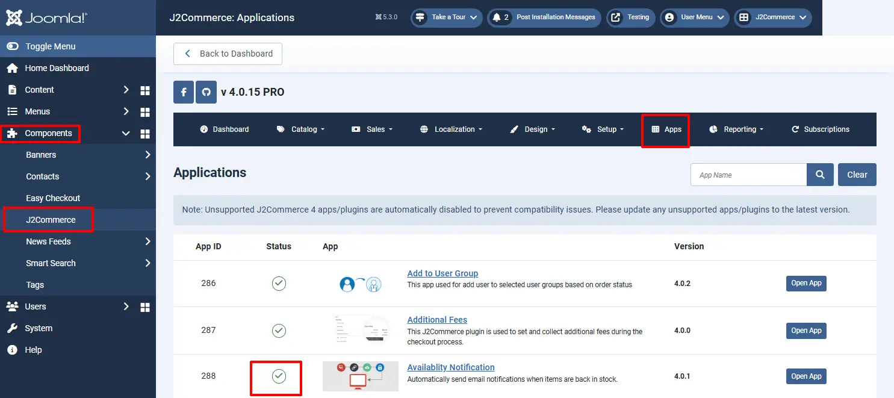
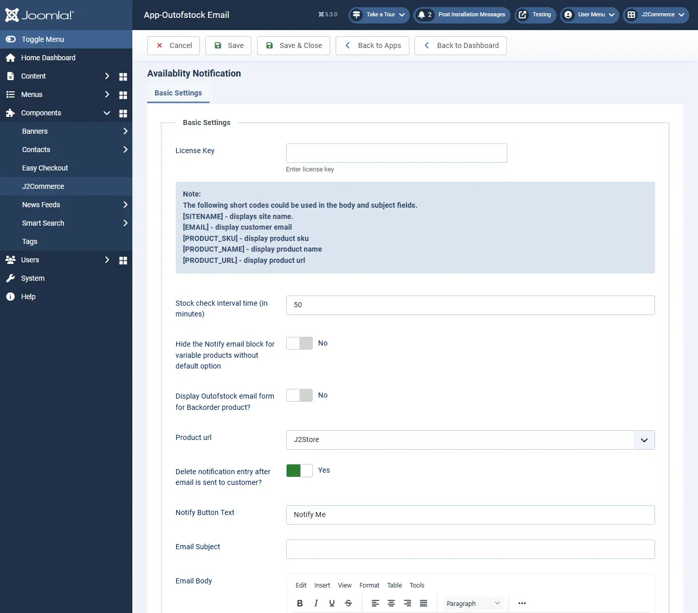

# Availability-notification

This app allows store owners to notify customers regarding stock availability. Ifthe  product’s stock goes to “OUT OF STOCK”, then the Notify Me button will be generated where the customer can type his / her Email id and click Notify Me. So when the product’s stock becomes available, customers get an email notification.

## Requirements

- PHP 8.1.0 +
- Joomla! 4.x/ Joomla! 5.x +
- J2Commerce / J2Store 4.x +

## Purchase the App

**Step 1:** Go to our [J2Commerce website](https://www.j2commerce.com/) > Extensions > Apps

**Step 2:** Locate the Availability Notification App > click View Details > Add to cart > Checkout.&#x20;

**Step 3:** Go to your My Downloads under your profile button at the top right corner and search for the app. Click Available Versions > View Files > Download Now

## Install the App

Go to System > Install > Extensions > Install the app

.webp>)

## Enable the App

&#x20;Go to J2Commerce > Apps > search for the Availability Notifications app&#x20;

Click on the 'X' under Status to enable it.

Now it's time to open the app and configure the settings.&#x20;

Click on "Open App" or the Title to start setting up the app

## Setting up the Parameters

### Basic Settings tab

**Delete notification entry after email is sent to customer?** Select Yes to delete the email id from the Email text box once the email has been sent.

**Notify Button Text:** The Default button text is "J2STORE\_APP\_OUTOFSTOCK\_NOTIFY\_ME". You can enter the custom text for the button. If you are using a multilingual site, create a language override for the language constant.

**Email Subject:** It is the Email subject section. Text entered here will be displayed as the subject of the email.

**Email Body:** It is the Email body section. Text entered here will be displayed in the Body of the email. You can use the shortcodes that are provided at the top.&#x20;

**Frontend**

When Product’s stock goes out of stock, you will get the screen like below

After sending email, you will get thank you message like below screen

**Support**

Still have questions? You can contact support: [Click here](https://www.j2commerce.com/support)

Thank you for using our extension.
