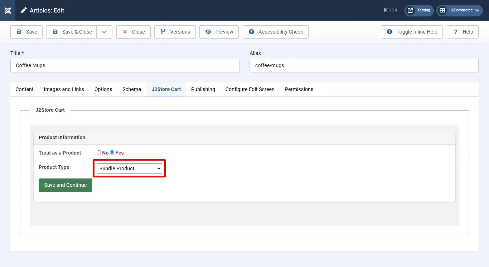

# Bundled Products

This app allows store owners to combine the products and sell them as a single product. When bundling products, the app will allow only simple, configurable, and downloadable product types without options. Product which are having options can’t be added.

## Requirements <a href="#requirements" id="requirements" />

1. PHP 8.1.0 +
2. Joomla! 4.x/ Joomla! 5.x +
3. J2Commerce / J2Store 4.x +

## Purchase the App

**Step 1:** Go to our [J2Commerce website](https://www.j2commerce.com/) > Extensions > Apps

**Step 2:** Locate the Bundle Product App > click View Details > Add to cart > Checkout.&#x20;

**Step 3:** Go to your My Downloads under your profile button at the top right corner and search for the app. Click Available Versions > View Files > Download Now

## Install the App

Go to System > Install > Extensions > Install the app

.webp>)

## Enable the App

&#x20;Go to J2Commerce > Apps > search for the Additional Fee&#x20;

Click on the 'X' under Status to enable it.

Now it's time to open the app and configure the settings.&#x20;

Click on "Open App" or the Title to start setting up the app

## Setting up the Parameters

### Basic Settings App

**Note:**\
**1. Bundled Product types must be simple, configurable, or downloadable.**\
**2. Product cannot have options**\
**3. Variable product types cannot be added to bundle products.**

**Inventory Handling:**&#x20;

- **Handle at the Bundle Level:** Inventory should be maintained for the bundled product.

- **Handle at the Items Level:** Inventory will apply for the products in the bundle.

**Tax Based On:**&#x20;

- **Bundled Products**

- **Individual Products**

## Creating a Bundled Product

Once you enable and set up the app, you can see Bundle Product as one of the product types listed in the product type dropdown. Refer the picture below&#x20;

Select the product type, Bundle Product, and click Save and Continue

Go to the J2Commerce (J2Store cart) tab and scroll down where you can see the navigation menus (General, Pricing, Inventory, Images, Shipping, Filters, Relations, Apps)

### General tab

In the general tab, choose Yes to make it visible in the storefront

Then navigate through the different tabs (Pricing, Inventory, Images, etc) to add price, image, and maintain stock, and fill in the necessary information

### Apps tab

**Search Product by SKU:** Type a few characters in the product SKU you want to add. Once the products are added, save the article and check in the frontend.

**Note:** If the product you are searching for is not listed, the reason is that the product might be because of the following:

The product may have options. The product searched may be a Variable product type. Since this app only allows products *without* options, the product *with* options cannot be added to the group.

**Reminder:**\
**1. Bundled Product types must be simple, configurable, or downloadable.**\
**2. Product cannot have options**\
**3. Variable product types cannot be added to bundle products.**

**Display Avg Price Per Each:** Select Yes to display the total count and average price per each item in a single line below the product price.

**Unit Title (Single):** Customize the Avg Price Per Each display by adding the title of the unit of measurement for the items in this bundled product. For instance, if each item was measured in pounds, then you would add Pound.

**Unit Title (Plural):** Customize the Avg Price Per Each display by adding the title of the unit of measurement for more than one unit.For instance, if each item was measured in pounds and there were more than one item, then you would add Pounds. (If you leave empty, it will use the singular unit title above.

**Note:** You can add a bulk discount to the bundled products if you have already installed the Bulk Discount app.  To find out more about the Bulk Discount App, visit the [Bulk Discount documentation](https://docs.j2commerce.com/apps/bulk-discounts)
