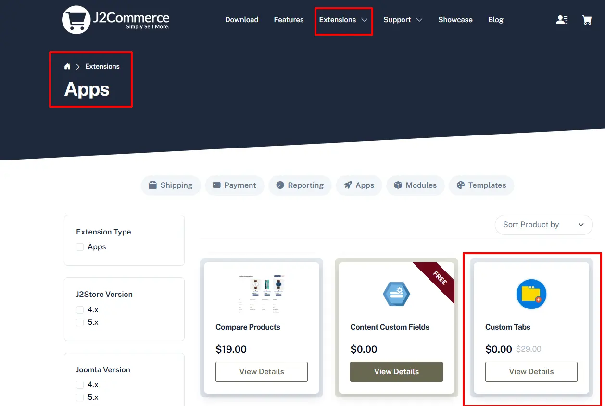
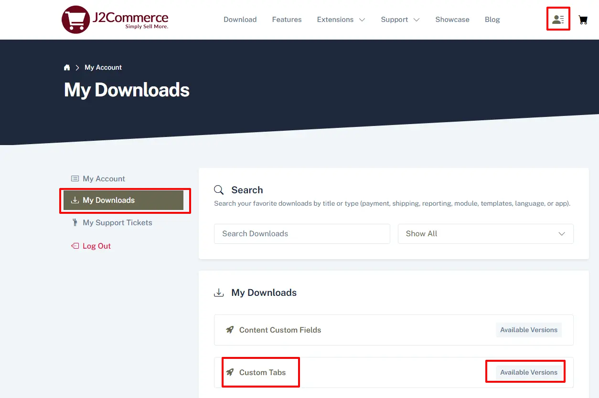
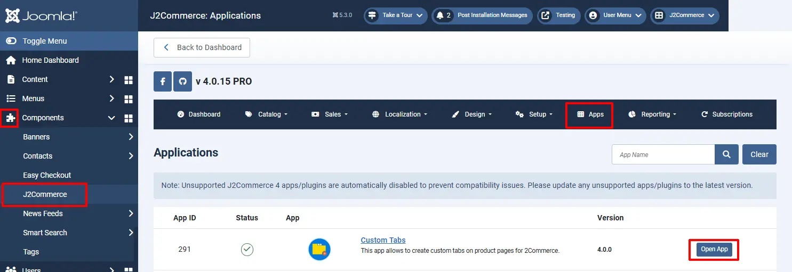

# Custom Tabs

Do you wish to create beautiful tabbed content for your product pages?

You can create any number of tabs to display in the product page. You can enter any type of content, like features, video, and more. You can enter the content for the tabs while creating / editing your product itself. You can create the content quickly by using the Editor.

**IMPORTANT NOTE:** The app supports only the J2Store / J2Commerce's Product List layout and Joomla! articles that are treated as products. That is, the catalog source should be Joomla! articles.

## Requirements <a href="#requirements" id="requirements" />

1. PHP 8.1.0 +
2. Joomla! 4.x/ Joomla! 5.x +
3. J2Commerce / J2Store 4.x +

## Installation:

**Step 1:** Go to our [J2Commerce website](https://www.j2commerce.com/) > Extensions > Apps

**Step 2:** Locate the Custom Tabs App > click View Details > Add to cart > Checkout.&#x20;

**Step 3:** Go to your My Downloads under your profile button at the top right corner and search for the app. Click Available Versions > View Files > Download Now

**Step 4:** Use the Joomla! installer to install the app. Go to System > Install > Extensions > Download the app

.webp>)

**Step 5:** Go to J2Commerce > Apps > search for Custom Tabs to narrow down your search.&#x20;

**Step 6:** Click on the 'X' under Status to enable it.

## Settings:

Now it's time to open the app and configure the settings.&#x20;

**Step 1:** Go to Components > J2Commerce > Apps&#x20;

Locate the Custom Tabs App and click on "Open App" or the title to configure the app's basic settings.

**Prepare Content:** Select 'Yes' to prepare the content with the Joomla Content Plugins

**Custom Field Short Code:** Select 'Yes' to choose if to prepare the data for the Custom tab or not.

**Display Brand Details:** Select 'Yes' to display the product's Manufacturer / Brand details in a separate tab. Depending on your country, this may be a mandatory requirement.

**Position Brand:** Select 'Before' or 'After' to choose whether to display the Manufacturer / Brand tab before or after the additional tabs.

\*\*The **Display Brand Details and Position Brand**  fields are the latest Add-ons. It adds a way to add the manufacturer/brand to the tabs, before or after the other ones. Some countries require the display of brand information, including the address. The manufacturer information tab can be modified by creating a template override. The override needs to be `/templates/[the default template]/html/plugins/j2store/app_customtabs/brand.php` The tab text can be modified by creating a language override for PLG\_J2STORE\_APP\_CUSTOMTABS\_MANUFACTURER\_DETAILS

**To learn how to set up Language Overrides, go to**

[https://docs.j2commerce.com/translation/language-overrides-in-joomla-with-examples](https://docs.j2commerce.com/translation/language-overrides-in-joomla-with-examples)

Below is a detailed video on setting up the Custom Tab for a Product:

\\
