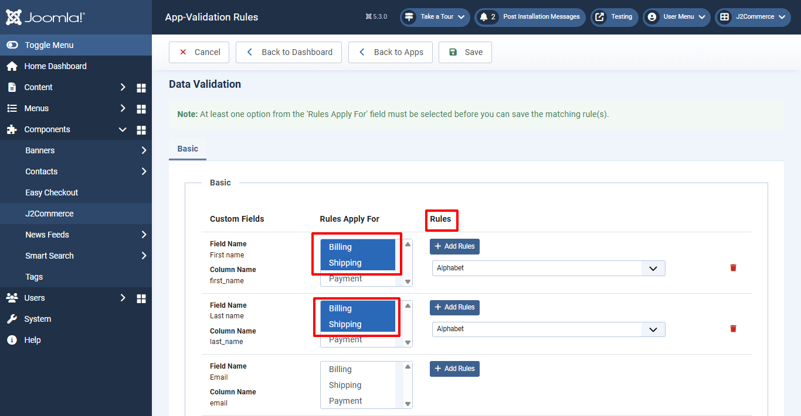

# Data Validation

The data validation app is especially useful on the checkout page. With the data validation app, you can create rules so that only valid data from the customer is accepted into the various checkout fields. A checkout field that requires the phone number of the customer can be configured to accept only numeric input from the customer. You can also set it to reject special characters and letters. This way, the customer will be informed to only enter a valid phone number, address, or any other details in the checkout field.

## Requirements <a href="#requirements" id="requirements" />

1. PHP 8.1.0 +
2. Joomla! 4.x/ Joomla! 5.x +
3. J2Commerce / J2Store 4.x +

## Purchase the App

**Step 1:** Go to our [J2Commerce website](https://www.j2commerce.com/) > Extensions > Apps

**Step 2:** Locate the Data Validation App > click View Details > Add to cart > Checkout.&#x20;

**Step 3:** Go to your My Downloads under your profile button at the top right corner and search for the app. Click Available Versions > View Files > Download Now

## Install the App

Go to System > Install > Extensions > Install the app

.webp>)

## Enable the App

&#x20;Go to J2Commerce > Apps > search for the Data Validation app&#x20;

Click on the 'X' under Status to enable it.

Click on "Open App" or the Title to start setting up the app

## Setting up the Parameters

### Basic tab

The app will show you 3-column tables.

- Custom Fields:
- Rules Apply for:
- Rules:

**Custom Fields:** All the custom fields you have in the J2Commerce custom fields section will be listed in this column.

If you want to add a new Custom Field, go to J2Commerce > Setup > Custom Fields

**Rules Apply for:** You can choose at which section (Billing, Shipping, Payment) the rule should be applied. Choose Billing or shipping or payment or all three.

**Rules:** Click on the “Add Rules” button to display the dropdown lists of 10 types of rules. You can select the rule to be applied from the dropdown list.

***Available rules are:*** *Match Field, Max Length, Min Length, Numeric, Alphabet, Alphanumeric, Phone, Email, Postal/Zip Code, and Match Table Field.*

For example, if you would like to apply rules for the field “Billing”, go to the field Billing and navigate to the column Rules Apply For and choose the section where you actually would like to apply the rules. If you choose Billing, the validation rule will be applied only at Billing section.

Now move to the column “Rules” and click the " Add Rules button. Choose the rules from the dropdown list. In our case, choose Numeric.&#x20;

You can add multiple rules to every individual field.

## Frontend View

