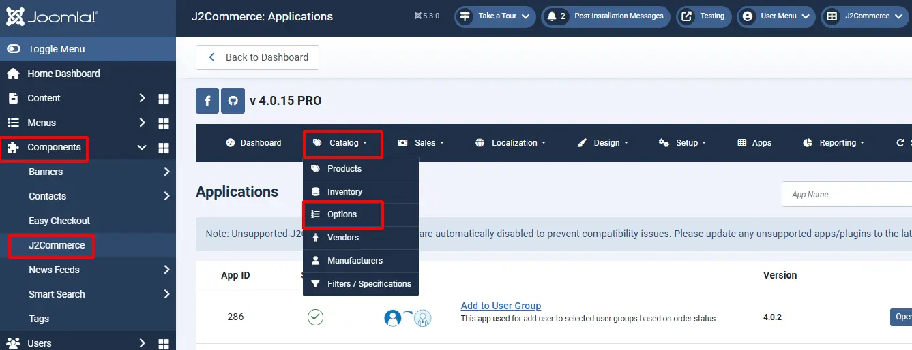
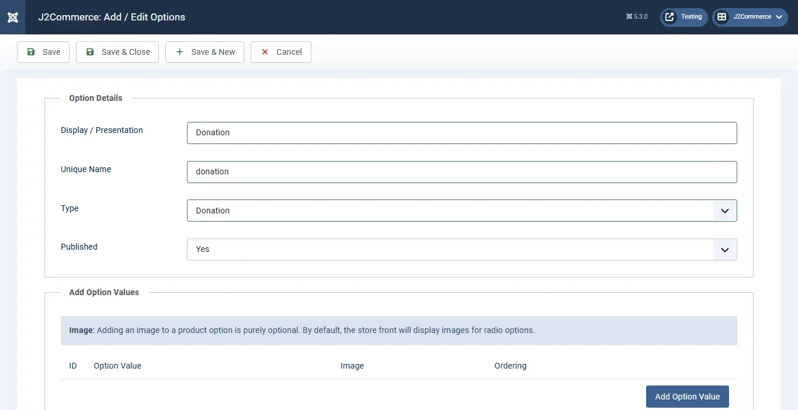
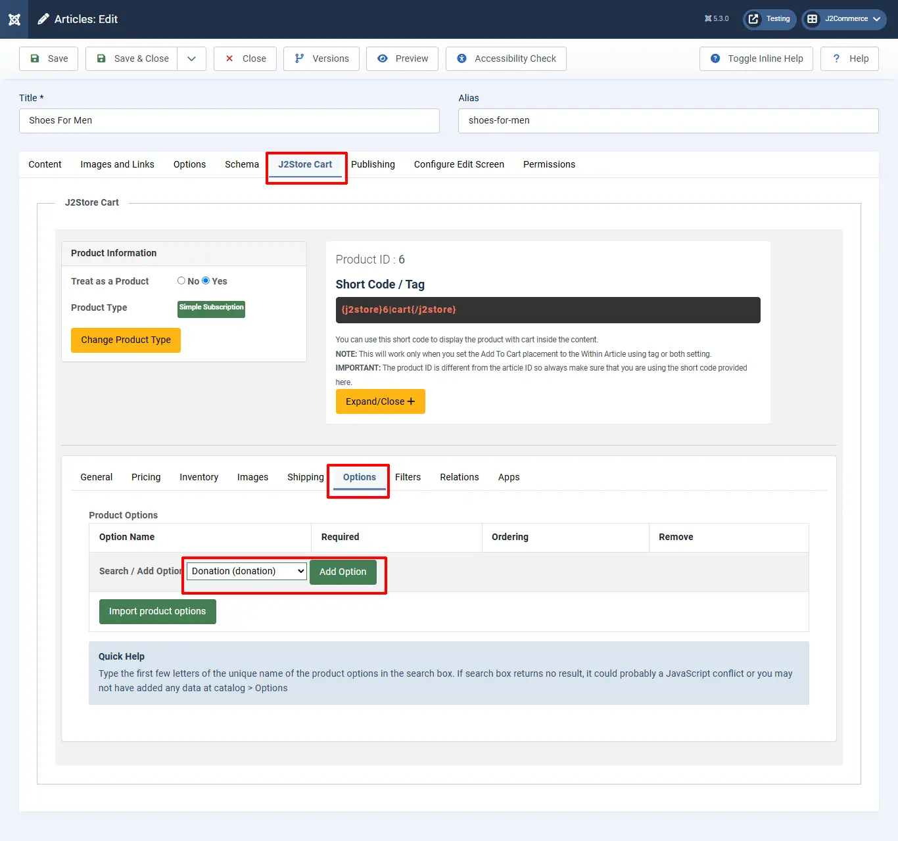

# Donation

The app adds donation as a product option, allowing the store owners to collect donations in addition to selling their products.

The customer will be able to enter the amount of the donation in a text box. You give the liberty of choosing the amount to your user.

The app seamlessly integrates with J2Commerce. You will be able to create a donation option type and associate it with the product. No complex configuration is required to use this app. Just install the plugin on your site, start creating options, and add it to as many products as you like.

## Limitations:

When using the donation option type, avoid using another option with a price modifier (***like a select or radio type option that adds/modifies the price***)

## Requirements <a href="#requirements" id="requirements" />

1. PHP 8.1.0 +
2. Joomla! 4.x/ Joomla! 5.x +
3. J2Commerce / J2Store 4.x +

## Purchase the App

**Step 1:** Go to our [J2Commerce website](https://www.j2commerce.com/) > Extensions > Apps

**Step 2:** Locate the Donation App > click View Details > Add to cart > Checkout.&#x20;

**Step 3:** Go to your My Downloads under your profile button at the top right corner and search for the app. Click Available Versions > View Files > Download Now

## Install the App

Go to System > Install > Extensions > Install the app

.webp>)

## Enable the App

&#x20;Go to J2Commerce > Apps > search for the Donations app&#x20;

Click on the 'X' under Status to enable it.

Click on "Open App" or the Title to start setting up the app

## Setting up a Donation Option for a Product?

Once you have enabled the Donation App, you may consider creating an Option for Donations.

Go to J2Commerce > Catalog > Options > New.&#x20;

Name it Donation, the type is Donation, and make sure it's Published.

Once you have created the Option type as Donation, you may add the option type to your desired product that you wish to receive donations.

Go to J2Commerce > Catalog > Products > Select your product.

Under J2Commerce (J2Store cart) tab > Options tab > Select the Donation option you created and click on Add option. Select Donation from the drop-down menu and click Save and Close

## Frontend View

Now your store frontend should display the Donation option for the respective Product.

