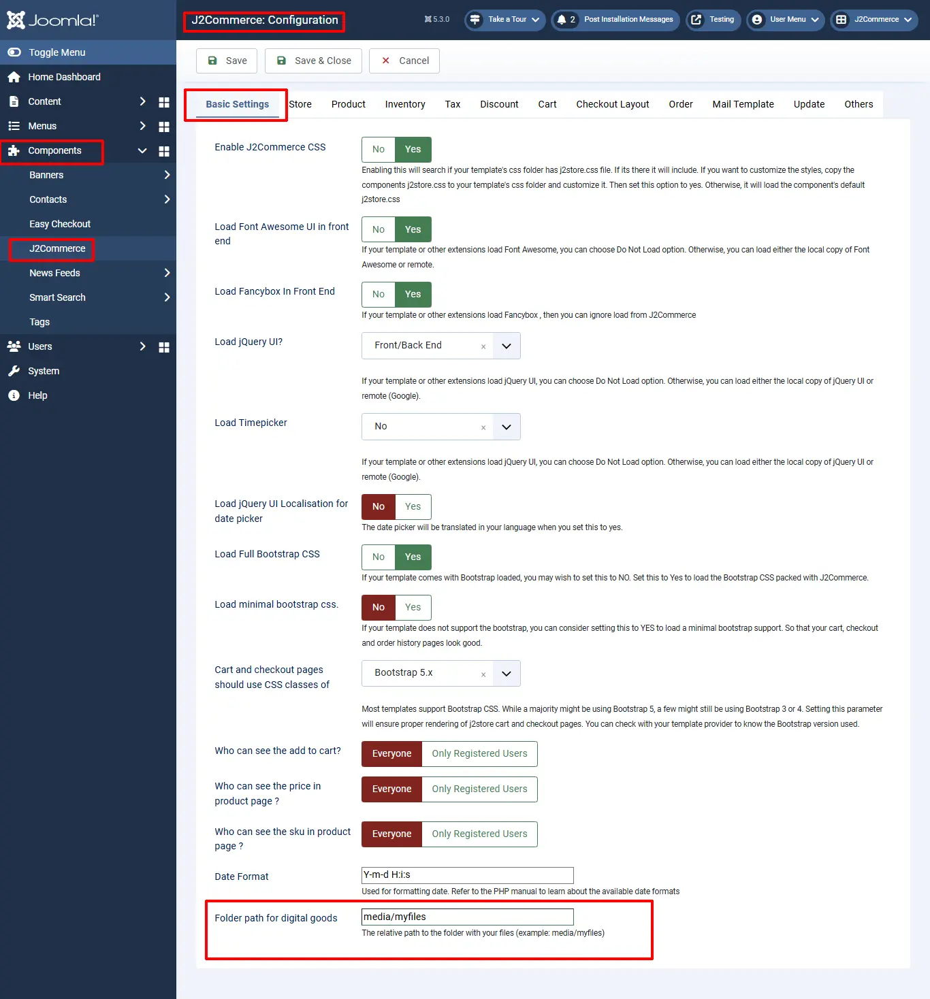
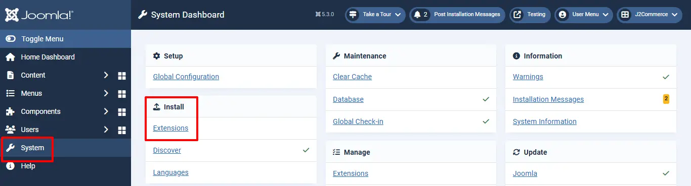

# Drop-box

## Requirements <a href="#requirements" id="requirements" />

1. PHP 8.1.0 +
2. Joomla! 4.x/ Joomla! 5.x +
3. J2Commerce / J2Store 4.x +

Sell your files stored in Dropbox with J2Commerce Joomla! e-commerce platform. The app enables you to connect your Dropbox and securely share files.

**Important Notes**

**NOTE 1:**

The download link sent in the email uses the Dropbox API’s method to create a temporary URL.

The API does not allow us to set a custom expiry date (like in Amazon S3). Dropbox itself sets the expiry time. ***The link expires after a few hours.***

After the link expires, the customer cannot download using that link. He will have to visit the site, log in, and then click the Download. This would create another temporary download URL and allow the customer to download.

Now there are two ways of solving this

1. You can mention in the email that the link is valid only for a few hours. If it expired, customers have to log in to your site to download the file.
2. Dropbox API now allows creating a permanent shareable link. Once created, it is valid till your file is removed from Dropbox.

You can use the app’s settings to choose whether to send a temporary URL or a permanent URL. In your app’s settings, you can see the following parameter

**Choose the type of link to be included in the email**

- Choose Send a Temporary link if you want to send a temporary link to your customers. This URL will expire in a few hours.
- Choose Send a Shareable link if you want to send a permanent link. This URL never expires unless you delete the shared file in your Dropbox account.

**NOTE 2:**

\*\*Before proceeding with setup for the app, make sure you defined a local folder path in Components > J2Commerce > Setup > Configuration

### Basic Settings tab:

For example, **Folder Path for Digital Goods:** media/myfiles

**Key features**

- Sell any file stored in Dropbox
- Enables you to retrieve the files from the Dropbox remotely.
- Generates a temporary URL for the downloadable files, which expires within minutes
- Allows you to control the expiry of the URL from settings

**Known Limitations**

- When you are using Dropbox for selling digital files, do set the download limit and Download expire days.

## Purchase the App

**Step 1:** Go to our [J2Commerce website](https://www.j2commerce.com/) > Extensions > Apps

**Step 2:** Locate the Dropbox App > click View Details > Add to cart > Checkout.&#x20;

**Step 3:** Go to your My Downloads under your profile button at the top right corner and search for the app. Click Available Versions > View Files > Download Now

## Install the App

Go to System > Install > Extensions > Install the app

## Enable the App

&#x20;Go to J2Commerce > Apps > search for the Dropbox app&#x20;

Click on the 'X' under Status to enable it.

Click Enable in the Nexmo SMS app as shown in the image below.

4\. Once the app is enabled, click open to set up the Basic settings of the app.

**How to generate an access token, key, and secret key?**

**Step 1:** Go to [https://www.dropbox.com/developers/apps](https://www.dropbox.com/developers/apps) and log in using your Dropbox account. After logging in, you will be on the page with the Create app. Click on the Create app button.

**Step 2:** Clicking on the Create app button will ask you complete several steps to create the app.

- Choose the Dropbox API as the API in your first step of creating the app

- Choose your access type. App folder: A dedicated folder named after your app is created within the Apps folder of a user’s Dropbox. Your app gets read and write access to this folder only. Full Dropbox: You get full access to all the files and folders in a Dropbox.
- Give the name for your app and agree to the terms and conditions and click Create App.

Click on Generate button to generate an access token for your app.

**Step 3:** Now the app page will be displayed, which contains your \*\*App key \*\*and App Secret key.

**Step 4:** Click on the " Generate button to generate an access token for your app.

**Step 5:** Copy all the credentials in your notepad and paste it in the J2Commerc’s Dropbox app basic settings.

Basic Settings

**Folder Name:** Enter the name of the folder. The folder will be created(with the name entered here) in the path that you have entered in the J2Commerce configuration. All the files stored in your Dropbox account will be fetched and stored in this folder. Access Token: Enter the valid access token for your account provided by Dropbox.

**Dropbox Key:** Enter the valid app key associated with your Dropbox account.

**Access Token:** Enter the valid access token for your account provided by Dropbox.

**Dropbox secret key:** Enter the valid app secret key associated with your Dropbox account. Choosing files for creating a digital product

1. Once finished configuring basic settings, go to the article manager and open your product.
2. Move to the J2Store cart tab and then navigate to the Files tab
3. Click on Set Product files

1. Click on Choose file will display the folder named with the folder name you have given in the basic settings.
2. Choose your file and save.

**Support**

Still have questions? You can contact support: [Click here](https://www.j2commerce.com/support)

Thank you for using our extension.
