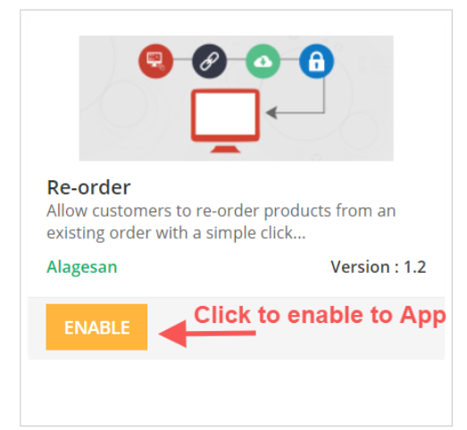
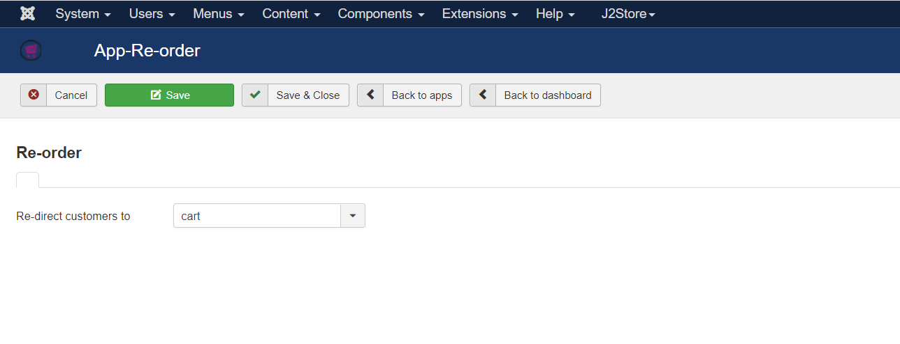
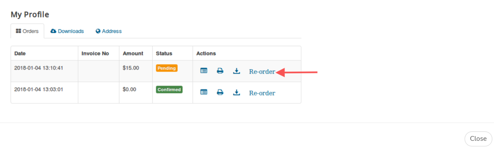

# Easy Re-Order

Allow your customers to re-order with a single click.

Instead of going through the process of adding the same products in their next purchase, let them re-order. All they have to do is click a button/link from their order history (my profile) page.

## Requirements <a href="#requirements" id="requirements" />

1. PHP 8.1.0 +
2. Joomla! 4.x/ Joomla! 5.x +
3. J2Commerce / J2Store 4.x +

## Purchase the App

**Step 1:** Go to our [J2Commerce website](https://www.j2commerce.com/) > Extensions > Apps

**Step 2:** Locate the Easy Reorder App > click View Details > Add to cart > Checkout.&#x20;

**Step 3:** Go to your My Downloads under your profile button at the top right corner and search for the app. Click Available Versions > View Files > Download Now

## Install the App

Go to System > Install > Extensions > Install the app

Download the Re-Order App and install it using Joomla! installer.

After installing Re-Order, in the backend, go to J2Commerce Dashboard  > Apps

Click Enable in the Re-Order App.

Once the app is enabled, click on Open to set the configuration for the app.

## Configuration:

Once you have enabled the Re-Order App under J2Commerce > Apps, the app places a button on the My Profile page, allowing users to re-order the items of an existing order in a few clicks.

Now, click on "Open" under J2Commerce > Apps > Re-Order, and configure the App.

Select the page that the customer should be redirected to post clicking on the Re-Order button displayed next to the order placed by the customer at the My Profile page.

Now when the customer has placed order for a product and want to re-order the same product they visit the My profile page and click on the "Re-order" button to be directed to either the Cart page or Checkout page (Based on redirect option you set at store backend) and then complete placing the order further from there.

\\
