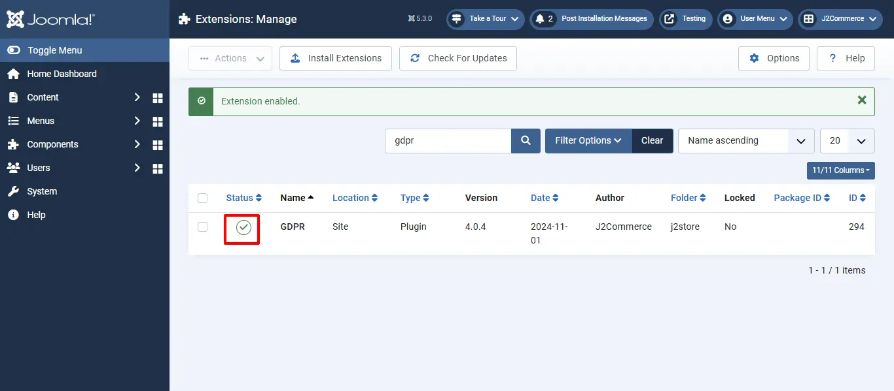
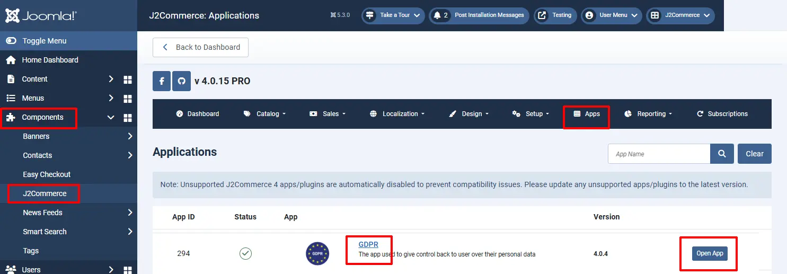
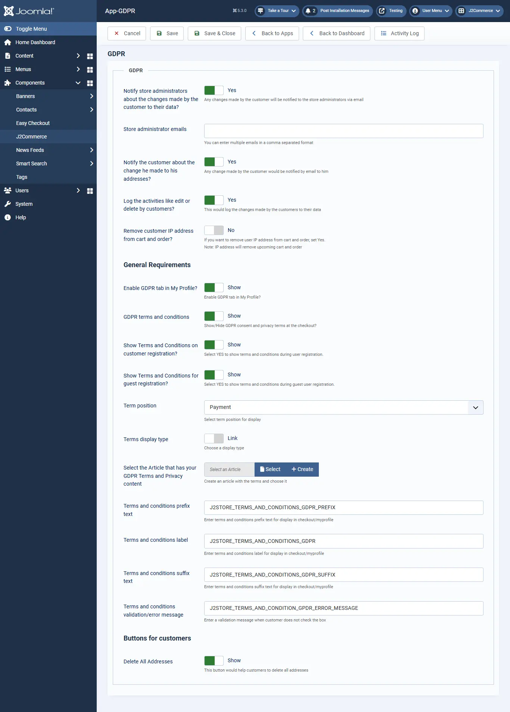

# GDPR Compliance

The GDPR Compliance plugin of J2Commerce makes it feasible for online merchants to comply with the recent GDPR regulations on their store developed with J2Commerce.

This plugin now provides users the privilege to have control over their information, which they have used on the online store at the time of placing orders or purchasing products.

## Requirements

1. PHP 8.1.0 +
2. Joomla! 4.x/ Joomla! 5.x +
3. J2Commerce / J2Store 4.x +

## Purchase the App

**Step 1:** Go to our [J2Commerce website](https://www.j2commerce.com/) > Extensions > Apps

**Step 2:** Locate the GDPR App > click View Details > Add to cart > Checkout.&#x20;

**Step 3:** Go to your My Downloads under your profile button at the top right corner and search for the app. Click Available Versions > View Files > Download Now

## Install the App

Go to System > Install > Extensions > Install the app

.webp>)

## Enable the App

&#x20;Go to J2Commerce > Apps > search for the Bulk Discount app&#x20;

Click on the 'X' under Status to enable it.

Click on "Open App" or the Title to start setting up the app

## Setting up the Parameters

**Notify store administrators about the changes made by the customer to their data?** When this parameter is set to Yes, the store administrators will be informed when the users make any changes to their data stored on the store. You can enable this if you wish to be notified of the changes made by the users.

**Store administrator emails:** The email address(es) of the store administrator(s) could be specified here, separated by commas.

**Notify the customer about the change he made to his address?** Select Yes to notify the users about the changes made to their data.

**Log the activities like edit or delete by customers?** When this option is turned on, the changes made by the user will be maintained as a log, and the store administrators can access this log under the “Activity log” tab.

**Remove customer IP address from cart and order?** If you want to remove user's IP address from the cart and order, set Yes.\
**Note:** The IP address will remove the upcoming cart and order

### General Requirements

**Enable GDPR tab in My Profile?** Select Show to allow the display of a GDPR Request tab on the My Profile/My Account tab

Thus, this paves the way for the users to send a custom request to the store administrators.

**GDPR terms and conditions:** When you switch this option to Yes, the customer would see a statement on the checkout page that would request the customer’s consent for the GDPR terms and conditions.

**Show Terms and Conditions on customer registration?** Select YES to show terms and conditions during user registration.

**Show Terms and Conditions for guest registration?** Select YES to show terms and conditions during guest user registration.

**Term position:** Select term position for display. ie: Billing or Payment

**Terms display type:** You could choose how the terms and conditions would be displayed on the checkout, either as a link or as the checkout.

**Select the Article that has your GDPR Terms and Privacy content:** With this option, you could associate the terms and conditions article with GDPR regulations. All you have to do is create an article specifying GDPR terms and regulations and link that article here.

**Terms and conditions prefix text:** Enter terms and conditions prefix text for display in checkout/myprofile

**Terms and conditions label:** Enter terms and conditions label for display in checkout/myprofile. You could mention the label of the terms and conditions statement. For example, if we have specified “GDPR”, then it would be displayed on the frontend.

*For a multi-lingual site, a language constant(apart from the one inserted here already) could be entered here, and a language override could be created. Instance: If you specify the language constant, J2STORE\_GDPR\_TERMS\_LABEL, here, then you could create an override for the above constant. Or you could just create an override for the one that is already there.*

**\*\*Prefix:** If you wish to add a prefix to the terms and conditions label for GDPR. For example, if you specify “I agree to” here, then that would be displayed as the screenshot specified here:

For a multi-lingual site, a language constant could be entered here, and a [language override](http://docs.j2store.org/articles/2064496-language-overrides-in-joomla-with-examples-using-j2store) could be created. Instance: If you specify the language constant, J2STORE\_GDPR\_PREFIX here, then you could create an override for the above constant. Or you could just create an override for the one that is already there.

**\*\*Suffix:** The text you specify here will be the one that is displayed on the terms and conditions consent statement at the end. For example, If you have set this text as “terms and conditions”, then it would be displayed as follows:

For a multi-lingual site, a language constant could be entered here, and a language override could be created. Instance: If you specify the language constant, J2STORE\_GDPR\_SUFFIX here, then you could create an override for the above constant. Or you could just create an override for the one that is already there.

### Validation message

You could enter the error message that has to be displayed if the user doesn’t agree to the terms and conditions for GDPR.

For a multi-lingual site, a language constant could be entered here, and a [language override](http://docs.j2store.org/articles/2064496-language-overrides-in-joomla-with-examples-using-j2store) could be created. Instance: If you specify the language constant, J2STORE\_GDPR\_VALIDATION here, then you could create an override for the above constant. Or you could just create an override for the one that is already there.

### Buttons for customers

**Delete All Addresses:** This would display a button at the My Profile page, allowing users to delete all their addresses with a single click. The button would be displayed as follows:

