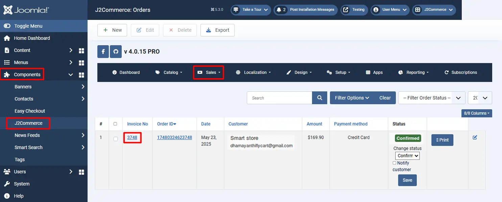
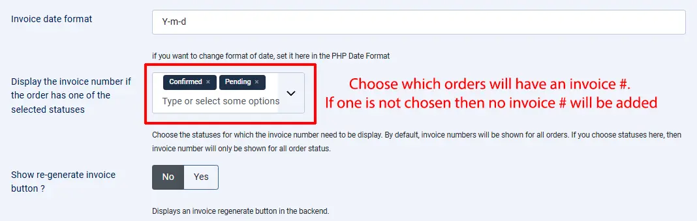
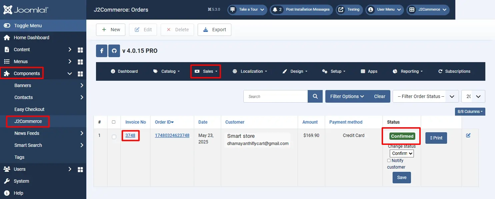
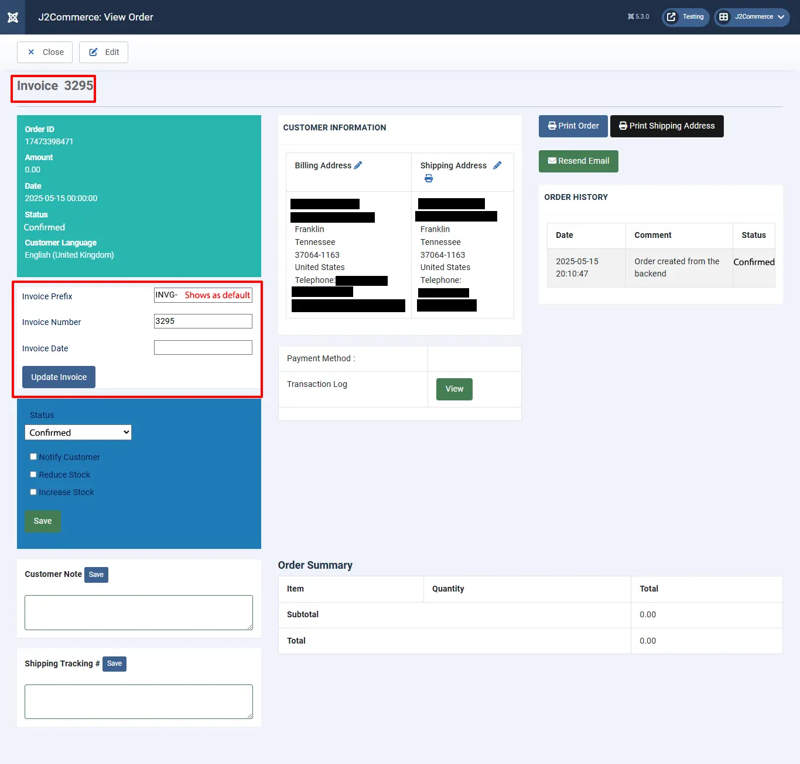

# Invoice Prefix Generator

This app allows you to generate a sequential invoice number for orders with a **Confirmed** status using the prefix you have entered in the app. You can also add it to all statuses, not just confirmed.&#x20;

For example, a customer adds products to the cart but does not complete the order, and there is still an invoice number generated.

**Here is the reason for generating the invoice number:**

Quite a number of gateways, including PayPal, require an invoice number to be sent along with the payment request. Some gateways, like Mollie, require you to register the order with an invoice number even before the payment is processed. So an invoice number is kind of mandatory in those gateways.

**Features**

- Generate a sequence invoice number for orders with status “CONFIRMED”.
- The default invoice number (used by J2Store / J2Commerce) would be used for all orders with the NEW status. You can treat these numbers as temporary numbers.
- The app also allows you to edit the invoice number and change it manually when required.
- Allows for the definition of a number of zeros to be displayed after the invoice number.

## Purchase the App

**Step 1:** Go to our [J2Commerce website](https://www.j2commerce.com/) > Extensions > Apps

**Step 2:** Locate the Invoice Prefix Generator App > View Details > Add to cart > Checkout.&#x20;

**Step 3:** Go to your My Downloads under your profile button at the top right corner and search for the app. Click Available Versions > View Files > Download Now

## Install the App

Go to System > Install > Extensions > Install the app

.webp>)

## Enable the App

&#x20;Go to J2Commerce > Apps > search for the Invoice *Number* Generator&#x20;

Click on the 'X' under Status to enable it.

Click on "Open App" or the Title to start setting up the app

## Setting up the Parameters

**Invoice prefix**

The prefix entered here will be used for the sequence invoice number generated.

**Number of leading zeros**

This option allows you to add zeros to be displayed after the invoice prefix and before the invoice number. If you have an invoice prefix (for example, **INV-**) and leading zeros as 4, then the invoice number would be **INV-0001, INV-2,…, INV-0010**. See the image below, which shows the leading zeros are set to 3, so the invoice numbers are **INVG-001, INVG-002**,..

.webp>)

The example below shows no invoice prefix or zeros added before the invoice number.

To view your sales orders, go to Components > J2Commerce > Sales > Orders

### Automatically generate an invoice number

Choosing Yes will generate the invoice number only when the order status matches the status selected below. See the image below.

**Generate an invoice number if the order has one of the selected statuses**

The invoice number will be generated only for the orders with the statuses selected here. For example, if you choose the status “Confirmed” and "Pending", then the invoice number will be generated only for the **Confirmed** and **Pending** order statuses. See the image below

### Manually generate an invoice number

Choosing this option, 'Yes' will allow the store owner to edit the invoice number by going to J2Commerce > Sales > Orders > open the order.&#x20;

For example, sometimes you may need to change the invoice number fora  particular order status. In this case, you can use this option to edit the invoice number manually. See the image below

