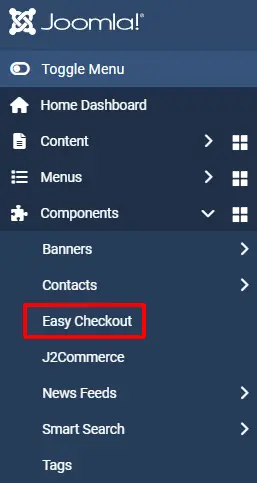
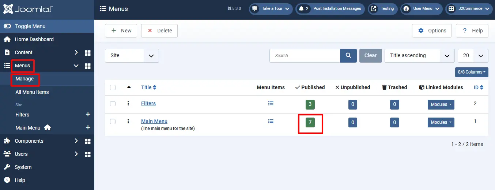
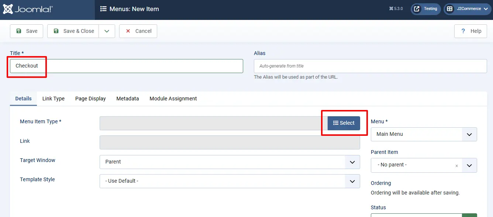
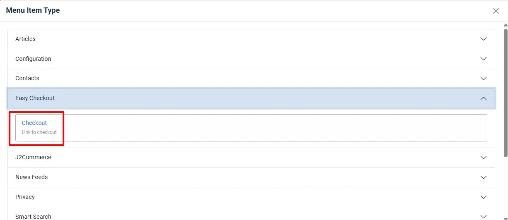

# Easy checkout

With online shopping moving quickly, convenience is becoming a must for customers. Overcomplicating your checkout process can result in lost sales and unsatisfied customers. One would think that fewer steps would make it easier for the customer to check out, but that is not always the case.

Here we are coming up with an **Easy checkout** for J2Commerce that makes the checkout process easier.

Easy checkout is nothing but a one-page checkout that displays all elements of a standard checkout, including basket contents, billing and shipping address, shipping options, and payment information on one page. Originally, one-page checkouts were put into practice in an effort to simplify the checkout process with fewer clicks and fewer pages.

It will be easier to complete as fewer steps can appeal to time-conscious customers.

**Requirements**

1. Joomla! 4.x/ Joomla! 5.x +
2. PHP 8.1.0 +
3. J2Commerce / J2Store 4.x +

## Purchase the App

**Step 1:** Go to our [J2Commerce website](https://www.j2commerce.com/) > Extensions > Apps

**Step 2:** Locate the Easy Checkout App > click View Details > Add to cart > Checkout.&#x20;

**Step 3:** Go to your My Downloads under your profile button at the top right corner and search for the app. Click Available Versions > View Files > Download Now

## Installation

Go to System > Install > Extensions and install the Easy Checkout Zip File

After installing, go to System > Manage > Plugins.&#x20;

Search for Easy Checkout, and make sure that the plugin System - Easy Checkout has been enabled by clicking on the 'X'

.webp>)

Once you enable the system plugin, J2Commerce’s normal checkout will be replaced and the single-step checkout will be activated. Once enabled, Easy Checkout will appear in the side menu bar under Components.

## Setting up the Parameters

Go to J2Commerce > Setup > Configuration

### **Cart** tab

**Add to cart placement:** Add to cart placement

**Add to cart action:** Choose an action that happens when the customer clicks add to cart

**Continue Shopping URL:** Where a customer should be taken when they click the continue shopping button

**Enter a URL:** Enter a full URL

**Menu:** Choose a menu to which the customer should be redirected

**Add to Cart button class:** CSS class for the add to cart button

**Empty cart redirect URL:** Where a customer should be taken when the cart is empty

**Empty cart redirect menu:** Choose a menu to which the customer should be redirected

**Empty cart custom redirect URL:**  Enter a full URL

**Product Thumbnail:** The chosen thumbnail image will be shown in the cart view

**Show tax for each cart item:** Setting this to YES will display tax for each item in the cart

**Enable shipping address fields:** Set yes to enable shipping address collection

**Show login form during checkout:** Show/hide login form during checkout

**Allow quick new user registration:** If the new user registration option is set to Yes, they will see a small checkbox labelled **Create an account for later usage** in the checkbox. This checkbox will be checked automatically. If customers don’t want to register, they can uncheck the checkbox and proceed further as a guest (Non-registered).

**Joomla Password Validation:** If set to Yes, the Password will be validated based on Joomla User Manager > Options settings for password rules

**Allow Guest Checkout?** Set Yes to allow guest checkout. The guest checkout form is a must for all online stores for customers who don’t want to have an account

**Show customer note:** Set this to no to hide the customer note field shown in the checkout steps

**Show tax and shipping estimate tool:** Set this to YES to show the tool for estimating the tax and shipping

**Show Empty Cart button:** Select Show to enable the empty Cart button. The empty cart button clears all the cart items in a single click

**Make postal code required in the shipping/tax estimator:** This will make the entry of postal code mandatory while estimating shipping and tax in the cart page

**Clear cart items:** Choose when to clear the cart. On order placement: The Cart will be emptied when the customer places the order. On confirmation: when the order is confirmed by the payment gateways

**Default payment method:** Choose your default payment method. This will be selected by default when customers check out

**Prevent customers from checking out if the  shipping method was not chosen:** You can prevent customers from checking out if the  shipping method was not selected. VERY IMPORTANT: Make sure you have configured your shipping methods correctly. Otherwise, shipping methods will not show up, and your customers won't be able to place an order

**Auto apply if only one shipping method is available:** Useful when you have only one shipping method and it needs to be automatically selected when the customer checks out

**Hide shipping costs until an address is entered:** Shipping methods will be shown only when an address (at least country and zone) is entered

**Clear Cart data Older than:** Clears the cart data that is older than the days selected in the options

**\*\*The screenshot below is the Frontend View**

## Existing Customers Login

The existing customers can place the order by using the login form. You would see the login form by clicking on **Login**.

## Creating the Checkout Menu

The SEF is the most important one for all the online stores. Similar to the Normal checkout, the easy checkout also has the menu item type.

By using this menu type, you can have the SEF URL for the checkout page.

Go to Menus > Manage and create the menu item under Main Menu.&#x20;

Select New and name the menu Checkout.&#x20;

**Menu Item Type:**  Select > Easy checkout > Checkout.

The image below is a screenshot of the option to select.

**\*\*The screenshot below is the Frontend View**

## Final Parameter Setup

After installing, enabling, and creating a menu for easy checkout, go to Easy Checkout > Options

.webp>)

### Settings tab

**Enable Easy Checkout:** Select Yes to enable the Easy Checkout on the frontend

**Easy Checkout Menu:** Select the Checkout option from the dropdown menu.  *If Checkout doesn't appear, then you skipped the previous step of creating the Menu.*

**Enable Coupons:** Select Yes to enable if you offer Coupons

**Enable Vouchers:** Select Yes to enable if you offer Vouchers

**Confirm payment step display in:** You can select either Same page or Next page.&#x20;

\*\*The screenshot below is the Frontend View with the Coupons and Voucher set as Yes

