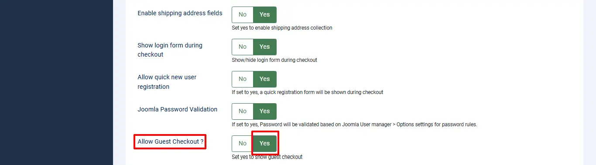

# Easy checkout

With online shopping moving quickly, convenience is becoming a must for customers. Overcomplicating your check out process can result in lost sales and unsatisfied customers. One would think that fewer steps would make it easier for the customer to check out, but that is not always the case.

Here we are coming up with **Easy checkout** for J2Commerce that makes the checkout process easier.

Easy checkout is nothing but an one-page checkout that displays all elements of a standard checkout including basket contents, billing and shipping address, shipping options, and payment information on one page. Originally, one-page checkouts were put into practice in an effort to simplify the check out process with fewer clicks and fewer pages.

It will be easier to complete as less steps can appeal to time-conscious customers.

**Requirements**

1. Joomla! 4.x/ Joomla! 5.x +
2. PHP 8.1.0 +
3. J2Commerce / J2Store 4.x +

## Download

**Step 1:** Go to our [J2Commerce website](https://www.j2commerce.com/) > Extensions > Apps

**Step 2:** Locate the Easy Checkout App > click View Details > Add to cart > Checkout.&#x20;

**Step 3:** Go to your My Downloads under your profile button at the top right corner and search for the app. Click Available Versions > View Files > Download Now

## **Installation**

Go to System > Install > Extensions and download the Easy Checkout Zip File

After installing, go to System > Manage > Plugins.&#x20;

Search for Easy Checkout, and make sure that the plugin System - Easy Checkout has been enabled by clicking on the 'X'

.webp>)

Once you enable the system plugin, J2Commerce’s normal checkout will be replaced and the single-step checkout will be activated. Once enabled, Easy Checkout will appear in the side menu bar under Components.

## **Setting up the Parameters**

A few points that have to be remembered

### **Guest checkout**

The guest checkout form is a must for all online stores for customers who don’t want to have an account.

To enable the Guest checkout, go to J2Commerce > Setup > Configuration > Cart tab

Set **YES** to Allow guest checkout

Save.

### **New account registration**

To enable the New account registration option in Easy checkout,

Go to Component > J2Commerce > Setup > Configuration > Cart tab

Set 'YES' to allow quick new user registration

Save.

.webp>)

If the new user registration option is enabled, you would see a small checkbox labelled **Create an account for later usage** in the checkbox.

This checkbox will be checked automatically.

If customers don’t want to register, they can uncheck the checkbox and proceed further as a guest (Non-registered).

### **Existing customers**

The existing customers can place the order by using the login form. You would see the login form by clicking on **Login**.

## **Creating the Checkout Menu**

The SEF is the most important one for all the online stores. Similar to the Normal checkout, the easy checkout also has the menu item type.

By using this menu type, you can have the SEF URL for the checkout page.

Go to Menus > Manage and create the menu item under Main Menu.&#x20;

Select New and name the menu Checkout.&#x20;

**Menu Item Type:**  Select > Easy checkout > Checkout.

The image below is a screenshot of the option to select.

## **Frontend Screenshots**

## Final Parameter Setup

After installing, enabling, and creating a menu for easy checkout, go to Easy Checkout > Options

.webp>)

### Settings tab

**Enable Easy Checkout:** Select Yes to enable the Easy Checkout on the frontend

**Easy Checkout Menu:** Select the Checkout option from the dropdown menu.  *If Checkout doesn't appear, then you skipped the previous step of creating the Menu.*

**Enable Coupons:** Select Yes to enable if you offer Coupons

**Enable Vouchers:** Select Yes to enable if you offer Vouchers

**Confirm payment step display in:** You can select either Same page or Next page.&#x20;

### **Frontend View with the Coupons and Voucher set as Yes**

