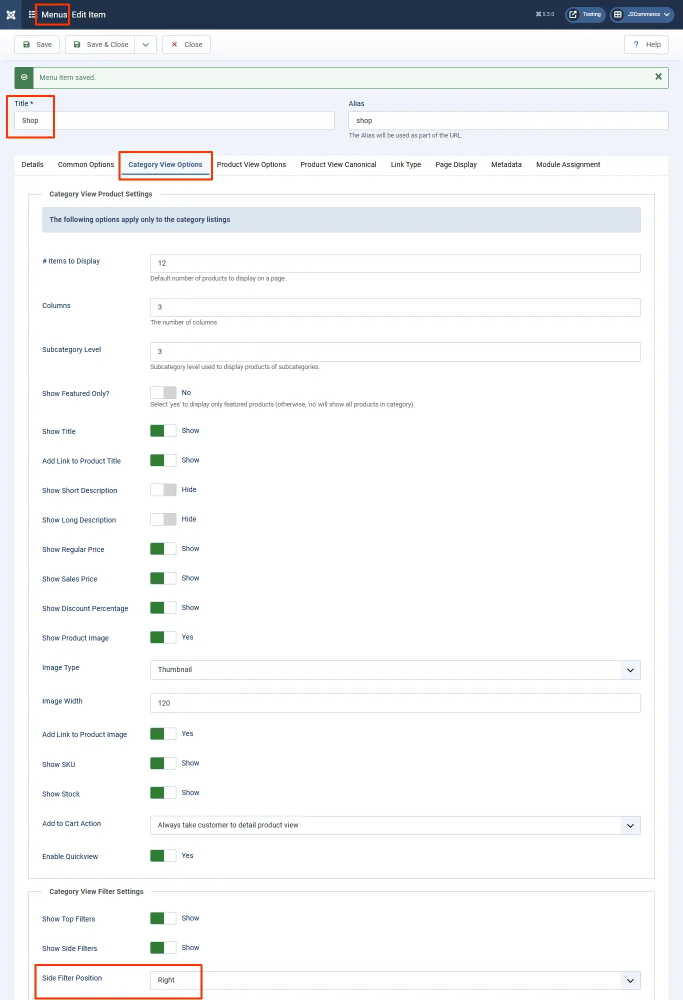

# Category Tree for displaying filters

Sometimes you might want to display the filters in a tree structure. Or achieve a SEF URL for category filters. Here is what you can do to achieve that.

## Steps to be followed: <a href="#steps-to-be-followed" id="steps-to-be-followed" />

1. Create a menu with the name filters by going under Menu > Manage.
2. Select New to create a new menu item named Filters with the Unique Name: filters (lower case)
3. Create menu items with the names of the categories.
4. Add the menu items to the Filters menu.
5. Navigate to Content > Site Modules > New > Menu Module.
6. Choose the Filters menu in the option “Select Menu”.
7. If your filters are displayed on the right, then set the position to `j2store-filter-right-top`. If your filters are displayed on the left, then set the position to `j2store-filter-left-top`.
8. Please note that you have to type this fully in the position field and then hit enter (it won't automatically display in the list of module positions).
9. If you're unsure where to see the filter positions, [click here](https://docs.j2commerce.com/j2commerce/layout/product-layout#item-view-options-in-category-listings)

   1. The first photo below is where you find the filter position

## Relevant Screenshots <a href="#relevant-screenshots" id="relevant-screenshots" />

The following screenshots will be of help:

## Create a Filter Menu

Go to Menus > Manage > New

**Title:** Filters

**Unique Name:** filters

Add menu items with category names to the Filter menu:

### Create a new Filter Sub-Menu

You can either click where the sub-menu section is highlighted in the image above, or go to Menus > Filters > New

### Setting up the Filter Categories Parameters

**Step 4:** **Details Tab:**

**Title:** Name the Filter Category

**Menu Item Type:** Select > System Links > Menu Item Alias

**Menu Item:** Assign the menu item

Save and Close

## Create a Filter Menu Module&#x20;

Go to Content > Site Modules > New

### Setting up the Filter Module Parameters

**Module Tab:**

**Title:** Show

**Select Menu:** Filters

**Position:** type, **j2store-filter-right-top**

## **Frontend View**

The frontend view will be as follows:

