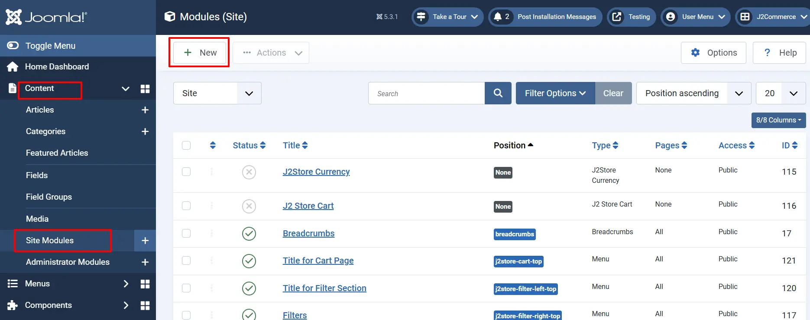
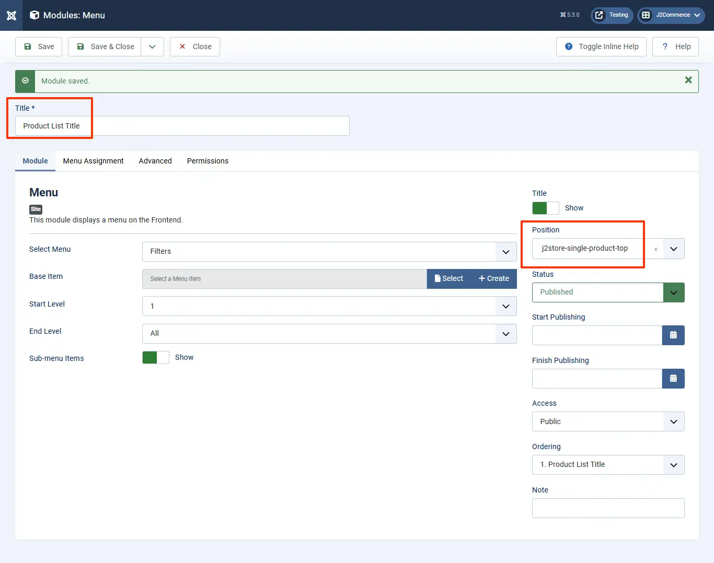
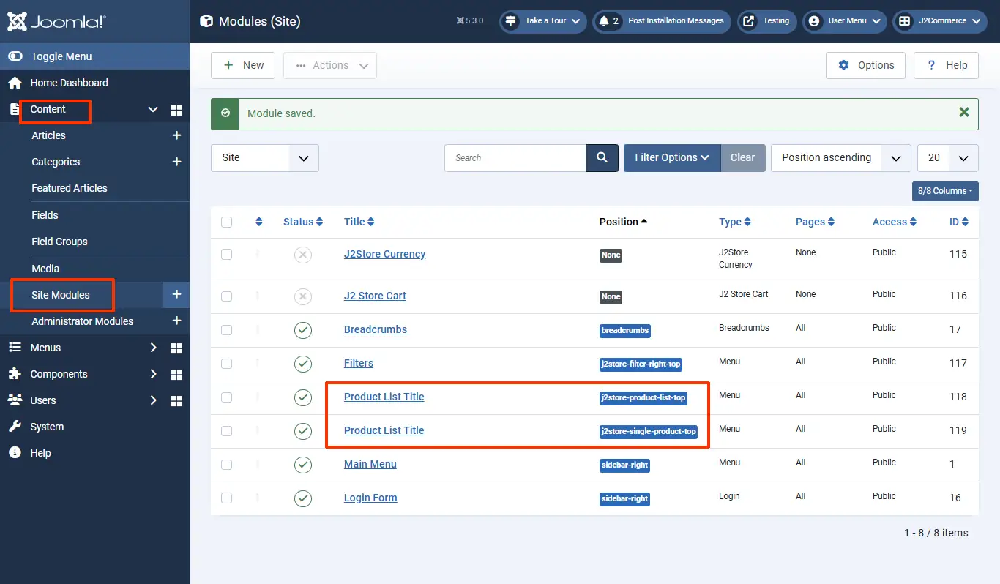
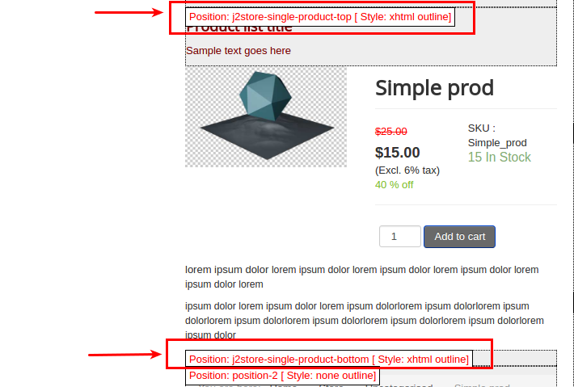
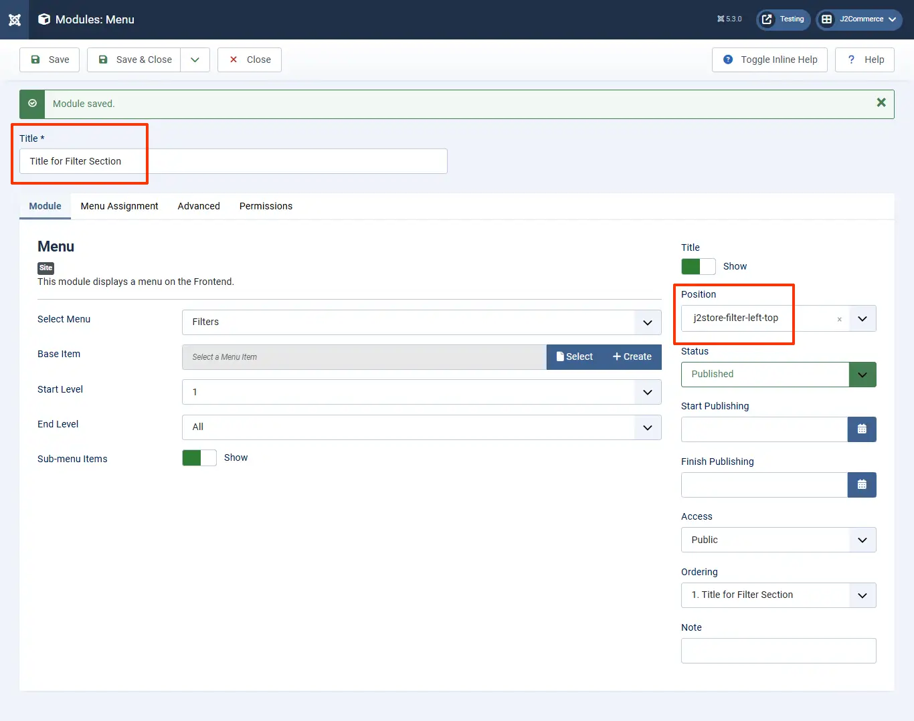

# Special module positions

J2Commerce offers special module positions to place the Joomla’s custom HTML module or any other modules (for example, cart module) in store pages.

- Go to Content > Site Modules > New.

- Select any module in the list.&#x20;
- Enter the title and set the status to Published.
- Simply copy the module position from the list given below and paste it in the "position" search box on the right and press Enter.
- Assign the module to the menu and save.

**The following are the custom module positions :**

## Product Category listing <a href="#product-category-listing" id="product-category-listing" />

**j2store-product-list-top** - Top of product category listing page

**j2store-product-list-bottom** - Bottom of product category listing page

.webp>)

## Single product view <a href="#single-product-view" id="single-product-view" />

**j2store-single-product-top** - Top of product view layout

**j2store-single-product-bottom** - Bottom of product view layout

## Filter Section <a href="#filter-section" id="filter-section" />

**j2store-filter-left-top** - Top of left filter

**j2store-filter-left-bottom** - Bottom of left filter

**j2store-filter-right-top** - Top of right filter

**j2store-filter-right-bottom** - Bottom of right filter

## Cart page <a href="#cart-page" id="cart-page" />

**j2store-cart-top** - Top of cart page

**j2store-cart-bottom** - Bottom of cart page

**Video Tutorial:**

## Checkout page <a href="#checkout-page" id="checkout-page" />

**j2store-checkout-top** - Top of checkout page

**j2store-checkout-bottom** - Bottom of checkout page

## Checkout Results page <a href="#checkout-results-page" id="checkout-results-page" />

**j2store-postpayment-top** - Top of Checkout Results page

**j2store-postpayment-bottom** - Bottom of Checkout Results page

## Special Module Positions for J2Commerce Dashboard <a href="#special-module-positions-for-j2store-dashboard" id="special-module-positions-for-j2store-dashboard" />

There is also special module positions available for customizing J2Commerce Cpanel (Dashboard).

**j2store-module-position-1 j2store-module-position-3 j2store-module-position-4 j2store-module-position-5**

Go to Systems > Manage > Administrator Modules.&#x20;

Choose the **Administrator** section, click 'New', and choose custom module.&#x20;

Choose Custom from the options.&#x20;

Enter the name of the module and set the position to one of J2Commerce backend special module positions (given above).&#x20;

Now you can see your store statistics on the J2commerce dashboard

