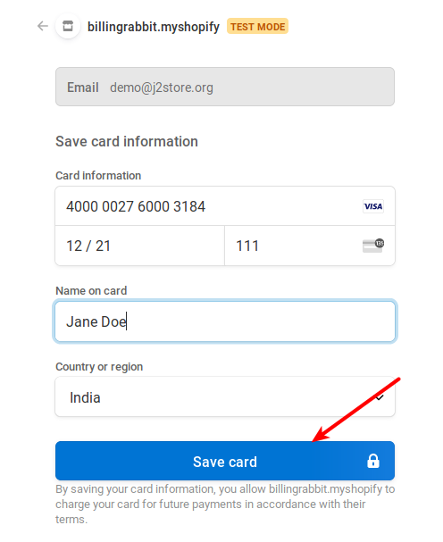
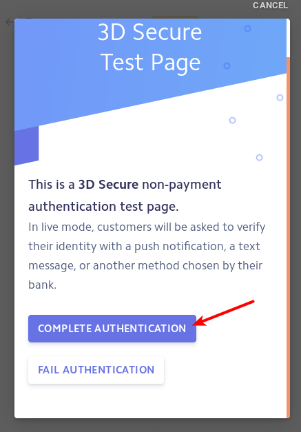
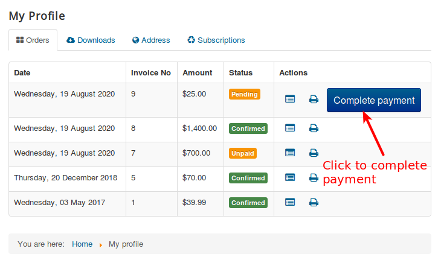
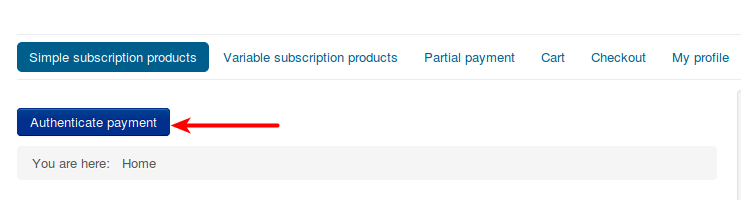
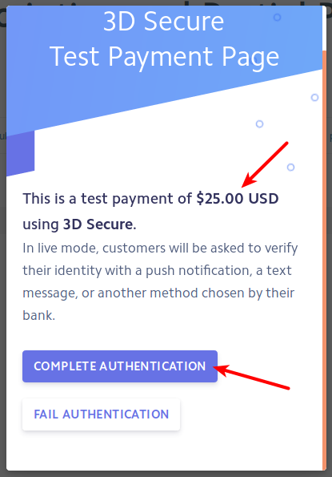
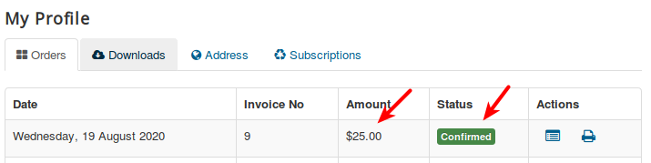

# Stripe

This plugin integrates the Stripe Payment gateway with J2Commerce. It works and is compatible with the latest Stripe API: 2014-01-31 (latest)

> NOTE: If you are using Stripe’s in built form, Please make sure that you have enabled SSL. If not, this might cause issues in the Stripe’s Javascript from loading on the site, thus blocking the checkout process.

With the purchase of Stripe integration, you would get access to two packages, namely, **Stripe direct (The default checkout) and Stripe checkout (Hosted).**

You could download both packages from the [My downloads](https://www.j2commerce.com/my-account/my-downloads) section of the J2Commerce site.

## Stripe Direct vs Stripe Hosted checkout <a href="#stripe-direct-vs-stripe-hosted-checkout" id="stripe-direct-vs-stripe-hosted-checkout" />

**Stripe direct.** This is the standard version of the Stripe plugin that most of you might have used until now. This integration offers three modes: 1. Normal form, 2. Pop-up form 3. In-built form(Recommended)\
Among the above three modes, only the In-built form supports SCA regulations that have been in effect since September, 2019. The following is a guide on how to install and configure the Stripe Direct payment plugin.

**Stripe Hosted checkout**

The Hosted checkout transactions would take place in the Stripe payment window. So, you need not worry about SCA compliance since the transactions are handled by Stripe itself. Hence, this integration is ideal for Merchants who wish to support both Normal and 3-D secure card payments.

## Connecting Stripe directly with your store <a href="#connecting-stripe-direct-with-your-store" id="connecting-stripe-direct-with-your-store" />

You could configure the Stripe direct payments on your site by following the steps:

1. Retrieving the API keys
2. Installation
3. Connecting your store with Stripe

### How to retrieve your Stripe API keys <a href="#how-to-retrieve-your-stripe-api-keys" id="how-to-retrieve-your-stripe-api-keys" />

To configure the Stripe Hosted checkout, you might want to retrieve the API keys (Both Test and Live keys).

Click [here](https://stripe.com/docs/keys) to know how to retrieve the API keys.

## Purchase the Plugin

**Step 1:** Go to our J2Commerce website > Extensions > [Payment Plugins](https://www.j2commerce.com/extensions/payment-plugins)

**Step 2:** Locate the Stripe Plugin > click View Details > Add to cart > Checkout.&#x20;

**Step 3:** Go to your My Downloads under your profile button at the top right corner and search for the Plugin. Click Available Versions > View Files > Download Now

## Install the Plugin

Go to System > Install > Extensions > Upload the Stripe zip file.

.webp>)

## Enable the Plugin

Go to J2Commerce > Setup > Payment Methods

Search for Stripe to narrow down your search.&#x20;

Click on the 'X' to enable both plugins. &#x20;

## Payments Supported

**Payments supported by J2Commerce Stripe direct integration**

J2Commerce’s Stripe integration supports the following types of payments:

- Credit card payment
- Cryptocurrency

## Payments not supported

J2Commerce’s Stripe integration doesn’t support the following payments:

- Paypal
- SEPA
- SOFORT

## Configuring Stripe

**Connecting your store with Stripe**

Open the plugin: Go to J2Commerce > Setup > Payment Methods > Stripe.

The plugin has the following options:

\
**Payment Option Title:** The value entered here will be used as the title for this payment method. The customer will see this value when he checks out. If you have a multi-lingual site and wish to translate the title in other languages of your site, you could mention a custom language constant like **J2STORE\_*PAYMENT\_*METHOD\_*STRIPE\_*TITLE** and create a [language override](https://docs.j2commerce.com/translation/language-overrides-in-joomla-with-examples-using-j2store/) to translate it into the other languages.

**Plugin Display Image:** The image chosen here will be displayed when the payment options are listed on the checkout page

**Surcharge Percentage:** Enter the percentage here. Surcharge will be calculated based on the percentage of the total order, and the cost will be added to the order.

**Surcharge Fixed Value:** Enter the fixed value here. The value entered will be added to the total order.

**Use Test Mode:** If you wish to test the Stripe payment plugin, then you can set this option, which will change the Stripe to test mode instead of live mode.

**Live Secret API Key:** Enter your live Stripe account’s secret API key.

**Live Publishable Key:** Enter your live Stripe publishable key.

**Transaction Mode:** Choose the charge mode.

- **Sale** - Captures the amount immediately.&#x20;

- **Authorize** - the charge issues an authorization (or pre-authorization), and will need to be captured later. Charges not captured expire in 7 days, Default is sale

**Credit Card Form Type:** Select which type of payment form for Stripe. Popup form displays inthe  confirm page. Normal form display in the payment select page.

**Note:**\
**1. Strong Customer Authentication (SCA) is a new regulatory requirement, will impact many European online payments.**\
**2. In Stripe inbuilt form, we can enable payment intent. It will handle SCA automatically.**\
**3. For more information about Stripe payment plugin read our [documentation](https://docs.j2commerce.com/j2commerce/payment-methods/stripe).**

**Force cURL to Use Latest SSL/TLS:** This will force the cURL to connect using the latest TLS version if multiple TLS versions are available on your server

**Enable 'Remember Me':** If you want to enable the 'remember me' feature, set to Yes.

**Send Customer Address:** This is optional. If yes, customer billing address will be sent using the Stripe API

**Send Shipping Address:** Do not enable this if you are not shipping any products or shipping address is optional in your store

**Article ID for thank you message:** You can create an article with a thank you message and enter its ID here. The article will be shown to the customer after he completes checkout

**Geo Zone:** By selecting a Geozone here, you can restrict this payment method from showing to customers from only that geo-region. Choose all Geo zones to show this method to all customers

**Subscription Renewal Description Text:** Subscription renewal description for renewal order will be displayed in payment details on stripe dashboard

**You can use the following shortcodes in Subscription renewal description \[PRODUCT\_NAME], \[INVOICE\_NUMBER]**\
**Eg: Renewal for \[PRODUCT\_NAME] and invoice #\[INVOICE\_NUMBER]**

**Display text on selection:** The text entered here will be displayed when the customer selects this payment method. You can enter a language constant as a value here if you are using a multi-lingual site and then write a language override. Refer the User guide for more information

**Tip - ONLY FOR MULTI-LINGUAL SITES**

For example, enter a language constant:

J2STORE\_\_TEXT\_\_TO\_\_DISPLAY\_\_ON\_SELECTION

Now you can go to System (in your Joomla Dashboard Side Panel) > Language Manager > Overrides and create overrides for the language constant in all your languages.

**Display text before payment:** The text entered here will be displayed to the customer at the order summary screen before he makes the payment. You can enter a language constant as a value here if you are using a multi-lingual site and then write a language override. Refer the User guide for more information

**Display text on after payment:** The text entered here will be displayed after the customer completes the payment. You can enter a language constant as a value here if you are using a multi-lingual site and then write a language override. Refer the User guide for more information

**Display text on error in payment:** The text entered here will be displayed when there is an error in payment. You can enter a language constant as a value here if you are using a multi-lingual site and then write a language override. Refer the User guide for more information

**Display Text if customers cancel payment:** The text entered here will be displayed when the customer cancels the payment at the gateway. You can enter a language constant as a value here if you are using a multi-lingual site and then write a language override. Refer the User guide for more information

**Payment Button Text:** Name of the payment button. Default is: Place order. You can enter a language constant as a value here if you are using a multi-lingual site and then write a language override. Refer the User guide for more information

**Card update payment button text:** Name of the Card update payment button. Default is: Place order. You can enter a language constant as a value here if you are using a multi-lingual site and then write a language override. Refer the User guide for more information

**Debug:** Show Debug Messages For Purolator. This option is chosen in order to enable or disable the display of log file. This should be in disable for live sites.

Thus, once you have mentioned the necessary details for the above parameters, you are ready to receive payments via Stripe on your store.

## Configuring Stripe Checkout

\*\*Make sure you have installed the Stripe Checkout Plugin and enabled it by following the same steps at the beginning of this document.

**Stripe checkout (Hosted)**

As mentioned in the introduction, Stripe Checkout(Hosted) is compliant to SCA by default since the transactions are handled by Stripe itself. Also, you need not worry about the payment method layout being responsive since users would be redirected to Stripe for the transactions.

### Configuring the Stripe (Hosted) checkout on your site

You could configure the Stripe Hosted payments on your site by following the steps:

1. Retrieving the API keys
2. Installation
3. Connecting your store with Stripe

**Retrieving the API keys:**

The same keys used for Stripe direct can also be used to connect your store to the Stripe (hosted) checkout as well.

### Connecting your store with Stripe Checkout <a href="#connecting-your-store-with-stripe-checkout" id="connecting-your-store-with-stripe-checkout" />

Once the API keys are retrieved and the plugin is installed, the next step is to connect the store with your Stripe account.

Stripe Hosted checkout uses almost the same parameters as the Stripe direct payment method described above, except for the **Create/Update Webhook** parameter

**Purpose of Webhooks on Stripe**

As mentioned above, with Stripe Hosted checkout, all the transactions occur in the Stripe window, so the merchant site has to be informed of the changes that occur with the transaction. Only then will the corresponding orders be updated on the merchant site. Webhooks are for this purpose. They are similar to IPN callbacks that are used as a communication between the Payment gateway and your e-commerce store.

**Update/ Create webhook:** This option in the Stripe checkout wouldn’t have any values initially when you have just installed the plugin. However, after you enter the API keys in the plugin and save, a value will appear.

**Note:** Once you entered the credentials and saved the plugin, an **Update webhook** button will show up as follows:

**Where to find your site’s webhook in Stripe dashboard:** Once you connect your store with Stripe by entering the API keys, there will be a webhook created in the Stripe dashboard. For the transactions to be updated in your J2Commerce orders, you will have to ensure that a webhook is created on your Stripe dashboard.

To check this, navigate to Stripe dashboard > Developers > Webhooks.

In the above screenshot, a webhook is created once for the corresponding store as indicated. This means that the transactions would be successfully communicated to the store that is connected to this account.

**When should you update your webhook?** If you have regenerated your Stripe API keys, then it means that your webhook should be updated. So, every time you regenerate your Stripe API keys, make sure that you have updated the Webhook in your Stripe Checkout plugin.

**NOTE:** Without the webhook being generated, the status of the transactions would not be communicated to the J2Commerce orders. Hence, your order statuses would not be updated accordingly.

## SCA compliance

### Enabling SCA Compliance for Stripe direct

For the Stripe direct payment method, only the in-built mode supports SCA compliance. To enable SCA on Stripe directly, follow the steps:

1. Navigate to J2Commerce > Setup > Payment methods > Stripe.
2. Set the option **Credit card form display type** to **Stripe in-built form**

1. After choosing the Display mode as Inbuilt form, enable the option **Enable payment intent (SCA Complaints) in Inbuilt form ?** to **YES**.

Now, Stripe Direct is compliant with SCA regulations.

## Testing SCA compliance

After enabling Payment intent on your Stripe direct plugin settings, you can test if the payment method is compatible with 3-D Secure cards. Follow the steps to test SCA compliance

1. Enable Sandbox mode in the Stripe plugin.
2. Navigate to the storefront. Add a product to the cart and initiate the checkout process.
3. At the checkout, choose Stripe as your payment method.

1. Use the following cards:

- 4000 0025 0000 3155 4000 0027 6000 3184&#x20;

- 4000 0082 6000 3178 4000 0000 0000 3055

 NOTE: You will not be able to test SCA Compliance if you use normal test cards. SCA compliance can be tested only with 3-D secure test cards.

1. Click on the Place order button to see the 3-D secure pop-up as follows:

1. Click on **Complete authentication** to approve the transaction and complete the purchase.
2. The order should be placed and should be in **Confirmed** status as follows:

Now, we have tested that your Stripe payment method is compliant with the SCA regulations.

## Subscription Support for Stripe Checkout

We have now introduced Subscription support for the Stripe Checkout plugin.

Here is how you could test subscription support for Stripe checkout plugin.

### Testing Subscription Support for Stripe checkout

**Pre-requisites:**

- Stripe checkout plugin should be installed.
- API keys should be entered.

**Steps to be done:**

The following are the steps to be done to test if the Stripe (hosted) plugin works fine with the subscription product.

1. Placing a test order
2. Authenticating the transaction.
3. Completing the payment.

#### **Placing a test order**

- Add a subscription product to the cart.
- Proceed to checkout and choose Stripe Hosted as the payment method.
- Once you click on the Place order button, you will be redirected to the Stripe page asking for the card details.
- Here is the document where you would find the test cards to be used. Click [here](https://stripe.com/docs/testing#regulatory-cards).
- Use one of the cards found in the above document and click on the Save card button at the pop-up. **First, the card details entered would be saved and payment would not be processed.**

#### Authenticating the transaction

- Once you click on Save card, you will see a pop-up asking for Authentication like this:

#### Completing the payment

- Once the authentication is complete, you will be redirected to the Merchant site. Click on the " Go to order history" button.
- Or, you can log in to the My profile page, where you would see a **Complete Payment** button.

- You would again be asked to authenticate. Click on the **Authenticate payment** button.

- An authentication pop-up would come up. Click on Authenticate payment.

- Now the payment would be completed and the order status should be confirmed.

This indicates that the Stripe checkout plugin works fine with the Subscription product. You can set the payment live.

#### How it works for Recurring Payments

Once the initial order for the Subscription is confirmed, a renewal order will be generated under J2Commerce > Sales > Orders.

When the renewal due date approaches, if you have used a test card that requires authentication on all transactions (some cards mentioned[ here ](https://stripe.com/docs/testing#regulatory-cards)require authentication for all the payments, as mentioned in the description), then you would receive an email asking you to authenticate the payment.

If you have used a card that requires one-time authentication, the initial authentication is good enough. No further authentication would be requested. Once the renewal due date approaches, the payment will go through automatically.

**Still got questions?**

In case of any further queries, please feel free to reach us via the [Priority ticket system](https://www.j2commerce.com/support)
