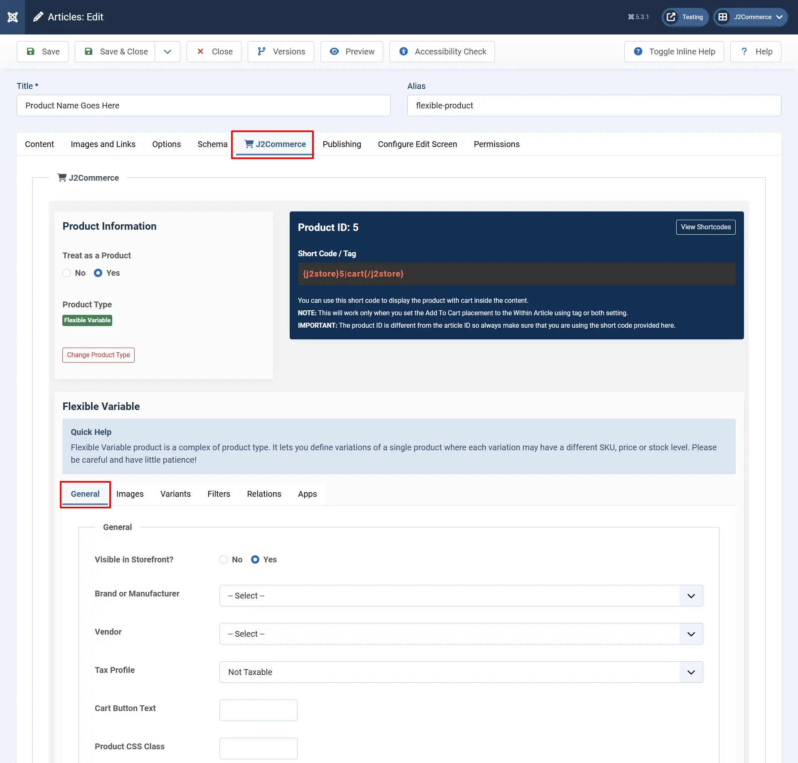
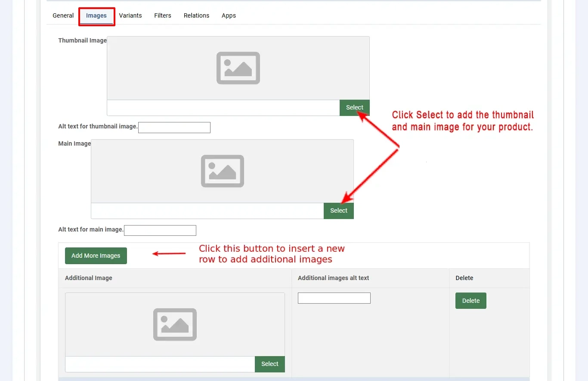
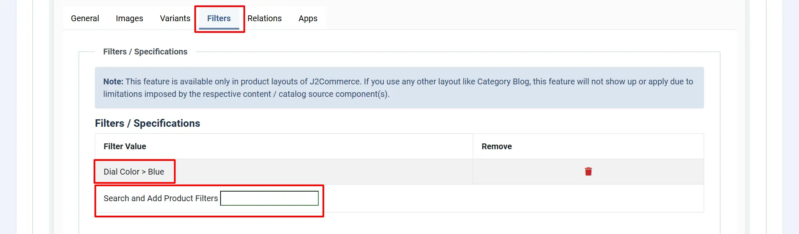
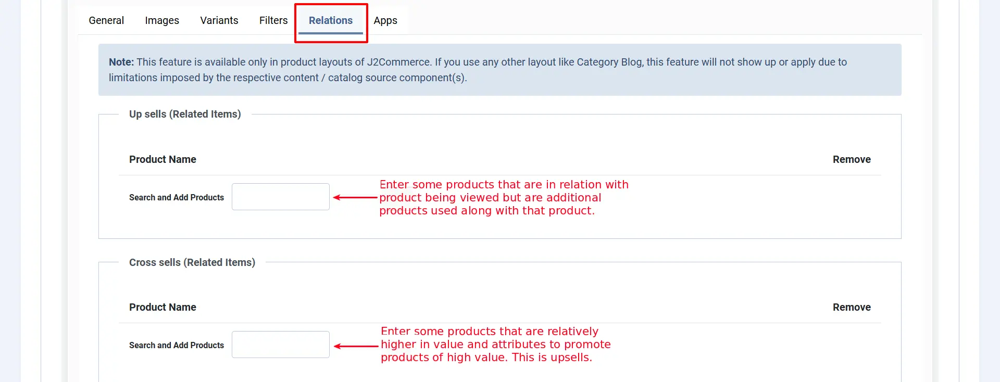
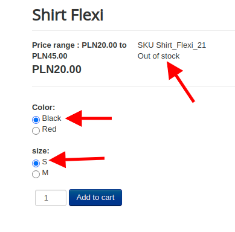

# Flexible variable product

Flexible Variable is another new product type that we came up with. It is similar to variable product type, but it has quite different features when compared to variable product type.

Like variable product type, it also lets you define variations of a product where each variant may have different attributes, e.g., SKU, price, and stock level.

The only difference is that this product type does not generate variants automatically. The variant has to be generated manually by clicking on **Add variant** button. So that the store owner could remove/delete the variant that has zero stock available and add the variant once it is available.

Since adding/removing a single variant will be possible with this product type, it will be easier for you to manage variants that are out of stock.

## How to create a FlexiVariable Product:

Start by creating a New' Article. Go to Content > Article > New.

Name your product and then go to the J2Commerce (or J2Store Cart) tab. Select 'Yes' to Treat as a Product and in the dropdown menu select 'Flexible Variable'.

.webp>)

## General <a href="#general" id="general" />

- **Visible in Storefront**: First, select whether the product is to be displayed in front of the store. If it is, set the option to ‘Yes’
- **Brand or Manufacturer:** Select the brand or manufacturer of the product from the available list
- **Vendor:** Select the vendor from whom the product is available for purchase - This is J2Store PRO feature
- **Tax Profile:** Specify whether the product is taxable and if it is, select the taxprofile relevant to the product
- **Cart button text:** It allows you to define the custom text to be displayed in the add to cart button

## Images <a href="#general" id="general" />

This feature is available for native Joomla articles and in J2Commerce Product Layouts

To display the thumbnail, main, and additional images in Joomla articles, you should first configure the Content - J2Commerce plugin in the Plugin Manager. Otherwise, you won't see these images in your products.

Let's assume that a customer would like to purchase a car. The car images need to be loaded in this tab.

- **Main Image:** The main image will be a general photo image of the car, which has to be uploaded by clicking on the ‘Select an image’ button and selecting the appropriate image from the files.
- **Thumbnail Image:** The thumbnail image would be something that represents the original product, but it would be a much smaller one to fit into a button, which will be shown in the cart. By seeing this, the customer will understand that his product is displayed on the button and will click the button to see more details about the car.
- **Additional Images:** Additional images help the customer to know more details about the car, which will show the car view from many angles, and the customer will understand it clearly how it looks, what the technical details of the car are, the color, and so on.

**NOTE: For the images set for the variants to appear on the frontend, the main image and thumbnail image have to be set. Only then, when the variants are chosen on the frontend, their corresponding images would come up.**

## Variants <a href="#variants" id="variants" />

Variants are products of the same type and nature but with different attributes. For e.g., consider a T-shirt of a particular brand with certain attributes, say

- Color - Blue
- Size - Large
- SKU - TSL001
- Price - $12
- Brand - Flying machine

and so on. This is a variant of the particular brand. Now, the same product with the same brand will be another variant with some attributes changed, like

- Color - Red
- Size - Small
- SKU - TSL002
- Price - $15
- Brand - Flying machine

For both items, a brand name may be the same, but the attributes like color, price, and SKU differ. These are two variants of a particular T-shirt brand.

- A variant defines how this product differs from other products of the same type
- It may be SKU no, price, stock level, or color

Let's discuss it with some image illustrations:

**Step 1:** Select the Color option from the dropdown list and then click on the Add option. The size will be added as a variant option.

**Step 2:** Then choose the Size option and add it to the variant options list in the same way.&#x20;

After adding color and size, your screen will look like below:&#x20;

**Step 3:** Now you will get options to add variants to the product. Choose a size from the drop-down “All sizes” and then choose the color and click on the **Add variant** button.&#x20;

Don't forget that with Flex Variants, you must have the same options for each item. Think of it like an equal grid.&#x20;

For example. The Red shirt can't have a size small if the other colors don't offer a small.&#x20;

Now the screen will look like below:

**Step 5: This step is extremely important.** You must choose one of the variants to be the featured one on the frontend.  If you don't do this step, the front end may not work properly.

**Step 6:** You should edit the parameters of the variants independently. Open each variant by clicking on the small down arrow given next to the variant name. You will get the screen like below:

**SKU:** Add the SKU number for this particular variant. This is very important for your inventory and future bulk changes.

**Price:** This is the price the customers will see

**Advanced Pricing:** You can set special discounted pricing for specific groups. ie: VIPs, Employees, etc.

**Image:** You can add a photo of each variant so the customer can see what it looks like, as well as clicking "Thumbnail" and it can show up on the invoice or in the shopping cart.

**Enable Shipping:** Set this to Yes if you ship your products

**Weight & Length:** You can set the shipping parameters for each variant independently

**Manage Stock:** Set this to Yes, so you can keep control of your supply amount. This will allow you to have more control over your inventory that is available to customers.&#x20;

**Stock Quantity:** How many do you have left in stock

**Allow Backorders:** Do you want to allow customers to be able to place an order when the stock says 0.

**Stock Status:** Is the item in stock or out of stock

If a variant becomes out of stock temporarily, you can select "out of stock", and the quantity is set as '0'. This will now show "Out of stock" instead of "Add to cart".

If any one of your variants is no longer available and you want to remove that variant from displaying in the frontend, you could do so by clicking on the delete icon. With flex variants, you can always add them again in the future without having to redo the existing ones.

**Notify If Below:** You can have the system notify you when your inventory reaches a specific amount so you can restock it.

**Quantity Restriction:** You can restrict the amount of inventory the customer purchases for this specific variant. This is handy during sales and promotions

Below is the screenshot of how the flex variable product shows in the site’s frontend.

## Filters <a href="#filters" id="filters" />

Filters are certain attributes that help narrow the search for a particular product.

For e.g., assume that a customer searches for purple t-shirts in the store. Now, the product filter is set as color > Blue, to narrow the search. See the image below:

Now the cart will display only the Blue t-shirts.

## Relations <a href="#relations" id="relations" />

- In this tab page, relations are set for Upsells and Cross-sells
- An upsell is to get the customer to spend more money – buy a more expensive model of the same type of product considered for purchase.
- A cross-sell is to get the customer to spend more money by adding more products from other categories, additionally, along with the product intended for purchase.
- Example: The terms cross-sell and upsell are often used interchangeably because, let’s face it, this gets confusing. Say the customer is viewing a Laptop with 2GB/500GB for $500. 4GB/500GB > $550 - Upsell, same product family, more expensive 4GB/1TB > $700 - Upsell, same product family, but it's more expensive. Laptop Bag > $25 - Cross sell, related product = additional sale

## Apps <a href="#apps" id="apps" />

Custom fields / settings from applications will be displayed in this tab.

The 'user group' app allows you to add a user to a specific user group based on the product that they purchased, so each product could essentially give somebody access to a certain area of the site simply by adding the add to user group app and opening up a product in the app section and then selecting the user group you wish them to be added to when the person purchases that product

.webp>)

## Video Tutorial <a href="#video-tutorial" id="video-tutorial" />

#### Limitation:

The Flexi variable product comes with a set of limitations as follows:

- The availability of a particular variant combination cannot be previously determined, and the particular option cannot be hidden based on the option value chosen in the previous option.

**Example:** That is, if you have options like Color and Size, and if the size S is unavailable for the Blue color, then it is not possible to hide the option value S when the user chooses the Blue color.

Instead, when the user chooses the Blue color and S size (which is unavailable), then there would be a message indicating that the particular variant is unavailable, as shown below:

##
