# Simple product

## Introduction 

A most common product type. It suits the requirements of most of the store owners.

You can create a simple product with or without product options. The inventory for this product type is managed for the primary product (Not for the options). All option types can be associated with the simple product. A simple product is great for someone who only needs to keep track of inventory for the primary product, and there is only one SKU for all of the options the product offers, ie: size, color, etc.&#x20;

Start by creating a 'New' Article. Go to Content > Article > New.

Name your product and then go to the J2Commerce (J2Store Cart) tab. Select 'Yes' to Treat as a Product and in the dropdown menu select 'Simple'.

**Note: If you have multiple SKUs and want to keep track of individual inventory, then you would want to set up your product as a Flexible or Advanced Product instead of a Simple Product.**

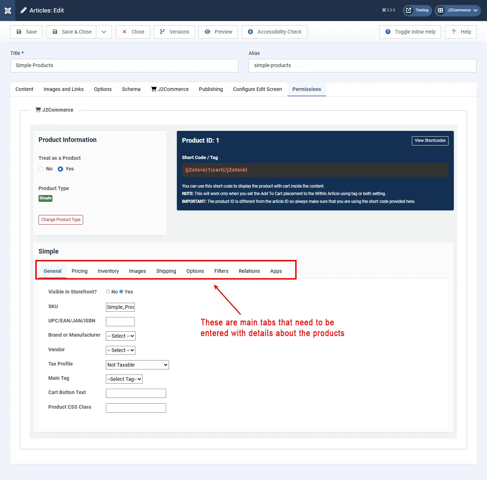

## Creating a simple product 

Let's go through the available settings / fields for the simple product type.

### General 

The general tab has several fields, in which we need to enter the necessary and relevant details, attached with the product.

Have a look at the image below:

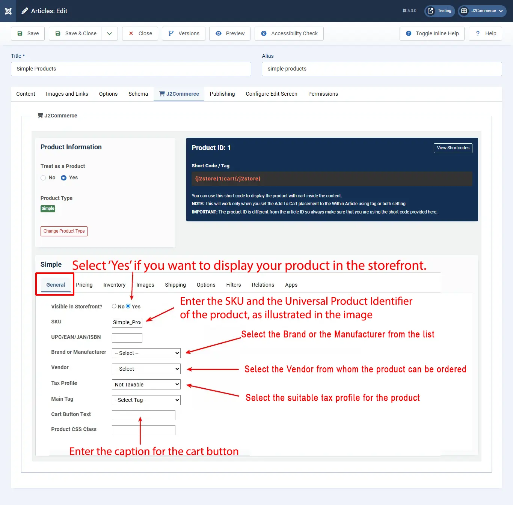

* **Visible in Storefront:** \* **IMPORTANT**: Set this to YES if you want this product to be shown in the storefront.
* **SKU:** Enter the SKU number of the product
* **UPC/EAN/JAN/ISBN:** Enter UPC/EAN/JAN/ISBN code for the product, whichever is relevant. UPC - Universal Product Code (In US/North America) EAN - European Article Number (Outside North America/Europe) JAN - Japanese Article Number (Only in Japan) ISBN - International Standard Book Number (Globally) MPN - Manufacturer Part Number (Globally)
* **Brand or Manufacturer:** Select the brand or manufacturer of the product from the available list
* **Vendor:** Select the vendor from whom the product is available for purchase. Note: This feature is available in J2Commerce PRO version only
* **Tax Profile:** Specify whether the product is taxable, and if so, select the tax profile relevant to the product
* **Main Tag:** The tag selected here will be used for the canonical URL. More details about the canonical URL can be found [here](https://docs.j2commerce.com/plugins/canonical-url-plugin)
* **Cart Button Text:** Enter the text to be displayed in the cart button
* **Product CSS class:** Use this option to add a unique CSS class to each product.

### Pricing 

Add the price of your product. Depending on your requirements, you can also choose to configure an advanced pricing plan from here.

Now, check the image below:

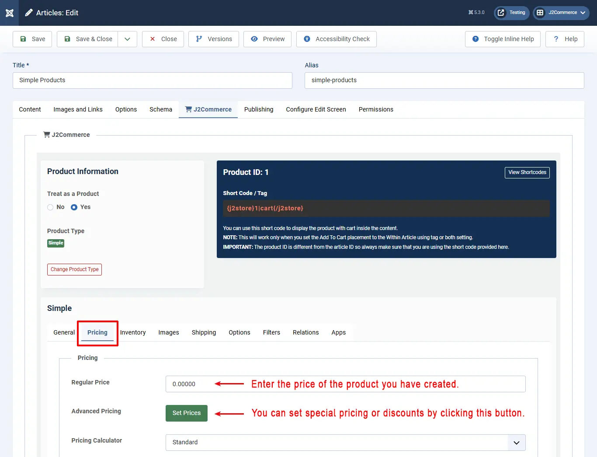

As illustrated in the image, you can set the regular price by entering the value in the text box.  If you want advanced pricing, which is special pricing for certain groups ie: VIPs, Managers, Developers, Schools, etc., click the ’**Set Prices**’ button and it will open up a pop-up window to allow you to set an advanced price setting.

Leave the date range blank if you want that specific group to awlays receive the special pricing.

Check the image below:

* Select the dates (optional) between which you wish to set the advanced price. This option is not mandatory. For instance, you can offer a special price throughout the year for a bulk purchase.
* The quantity range for this price to apply. This is also optional, and if there is no minimum quantity required, just leave it empty.
* Select the customer group to which you offer this special price. Default: Public
* Now enter the special price and click Create.

The price will be added and displayed below. You can edit that if you need, and click **Save all prices**.

If you want to remove that, you can do it by clicking the **Remove** button.

### Inventory 

* This is J2Commerce PRO exclusive feature \*

This tab has the configuration setup facility for inventory management. Here you can set the following details with respect to inventory.&#x20;

Check the image below:

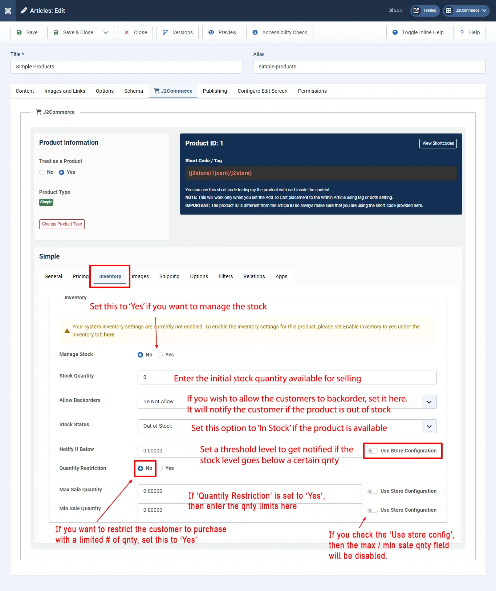

From the image, you can understand the following:

* **Manage Stock:** To enable Stock Management, select 'Yes'
* **Stock Quantity:** Enter the initial stock quantity
* **Allow Backorders:** Choose from the options whether or not to allow backorders to customers, i.e., the customer can order a product even if there is 'No stock allow but notify customers'. The second option would allow customers to purchase a product even if it is not in stock. A message will appear (a notification) before the price stating that: This item can be backordered.

This comes from the language file. The constant is: J2COMMERCE\_BACKORDER\_NOTIFICATION

You can write a language override for this constant and display a customized message.

NOTE: This notification will display if:

* Stock is 0

This option is for those who sell fast-moving products. So even if a product stock reaches 0, the customers could still order.

* **Stock Status:** Select stock status, i.e, In stock or Out of stock
* **Notify if stock goes below:** Set minimum stock level for low stock alert
* **Quantity Restriction:** Choose whether the purchase quantity is restricted, and if 'Yes', set the limits for minimum and maximum quantity for a purchase by entering the quantities in the fields provided
* **Use store configuration:** If you select 'Use store configuration', you cannot enter the max and min quantity fields, as they will be disabled

### Video Tutorial: 

### Images 

In this tab, you can add images that can help the customer understand more clearly the product they want to buy. Images help the prospect to imagine how the product they intend to purchase will look.

See the image below:

Let us understand this with an example.

Let's assume that a customer would like to purchase a car. Now, car images need to be loaded in this tab.

* **Main Image:** The main image will be a general photo image of the car, which has to be uploaded by clicking on the ‘Select an image’ button and selecting the appropriate image from the files.
* **Thumbnail Image:** The thumbnail image would be something that represents the original product, but it would be a much smaller one to fit into a button, which will be shown in the cart. By seeing this, the customer will understand that his product is displayed on the button and will click the button to see more details about the car.
* **Additional Images:** Additional images help the customer to know more details about the car, which will show the car view in many angles, and the customer will understand it clearly how it looks, what the technical details of the car are, the color, and so on.

### Shipping 

This tab has the configuration settings for shipping. Any product that has been purchased has to be shipped to the customer if the product is physically deliverable.

Consider the image below:

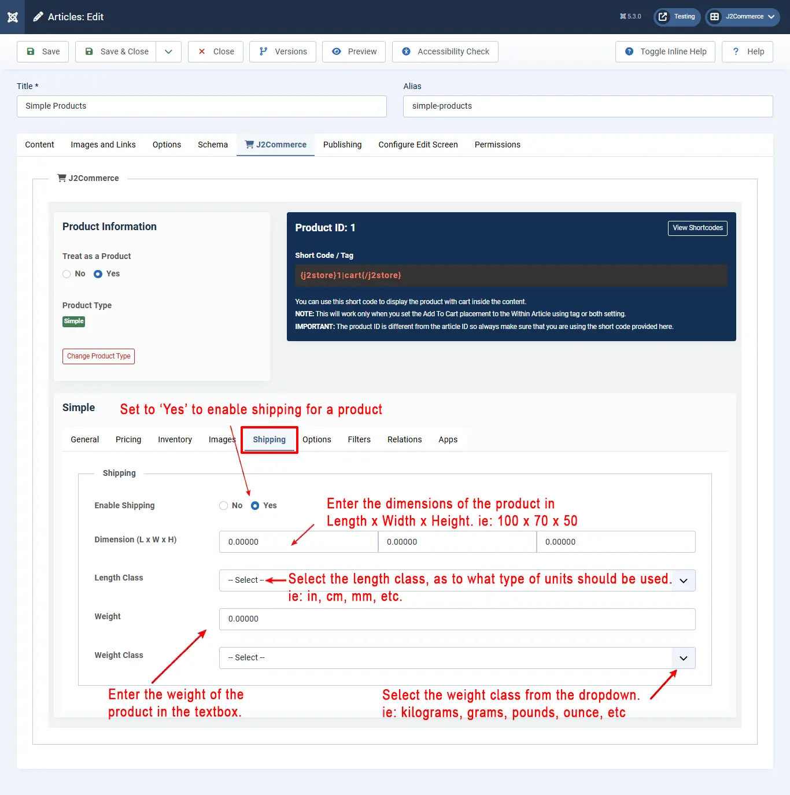

As shown in the image, you need to do the following activities to configure shipping:

* **Enable Shipping:** Select 'Yes' to enable shipping
* **Dimensions:** Enter the dimensions of the packed product in Length x Width x Height
* **Length Class:** Choose a length class from the list e.g., cm, mm, inch, etc.
* **Weight:** Enter the net weight of the product when packed in the field provided
* **Weight Class:** Select the weight class from the list like Kg, grams, pounds, etc.

### Options 

In this tab, you can set your preferred options for a particular product like, color of the product, size of the product, weight of the product, mass of the product etc.

See the image on how to set the option for a product.

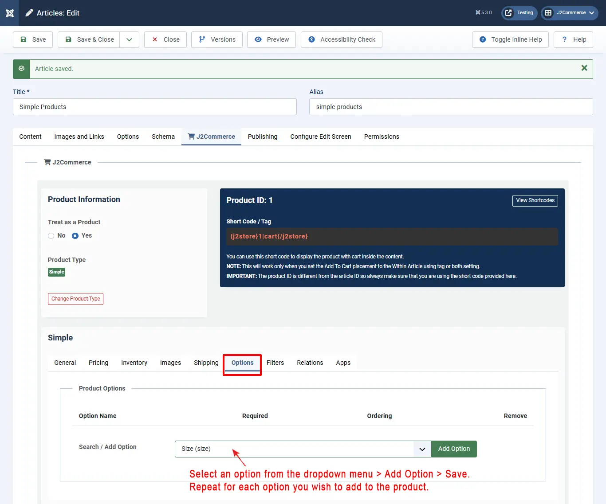

Once you select the option from the dropdown list, it will be added, as you can see in the image below.

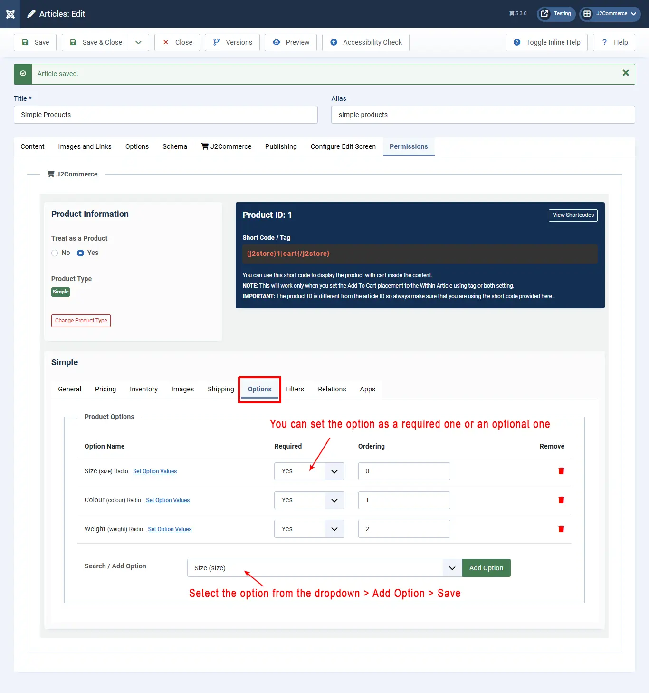

In the image, you have a text field to enter the option name, like color, size etc. Just enter that in the text field. It will be set as the preferred option.

If an option is created and set already, you can also import it here rather than create a new option. Click the button and it will direct you to the predefined options, if any.

### Filters 

Filters are certain attributes that help narrow the search of a particular product.

For e.g., assume that a customer searches for purple t-shirts in the store. Now, the product filter is set as color > purple, to narrow the search.&#x20;

See the image below:

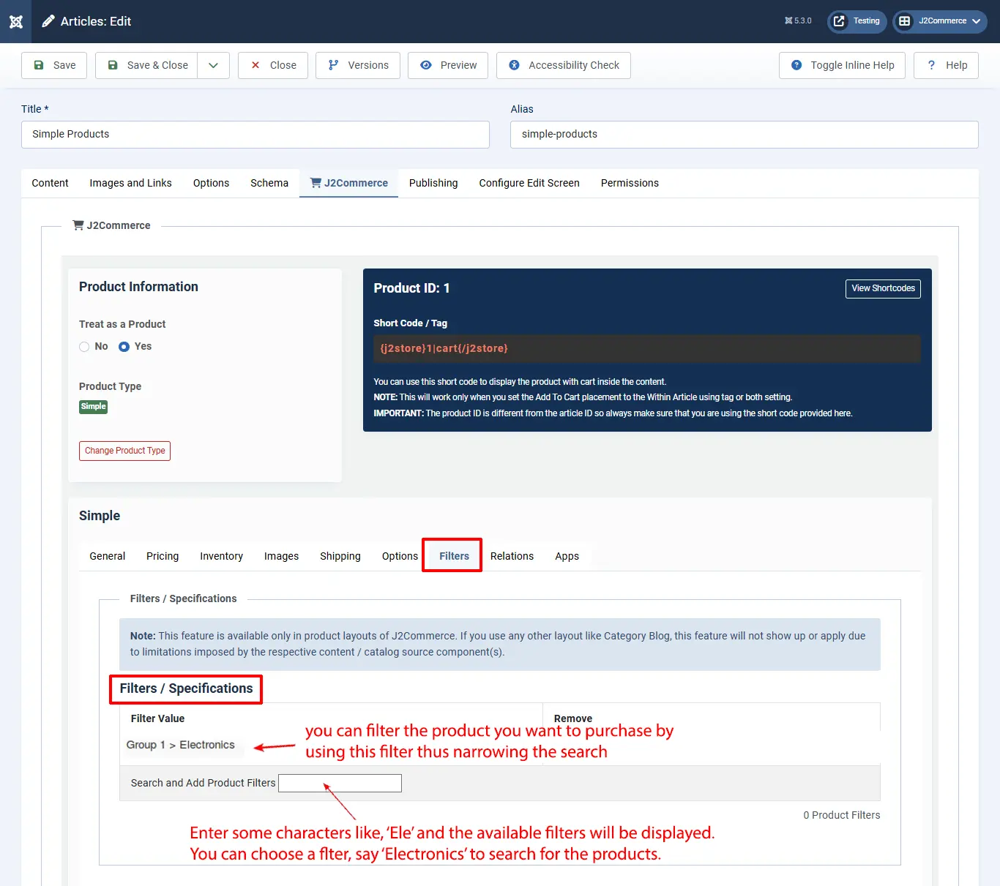

Now the cart will display only the purple t-shirts.

### Relations 

Relations are used to promote sales by suggesting to the customer higher value products than the one being looked at and additional products to be bought with a particular product.

* In this tab page, relations are set for Upsells and Cross-sells
* An upsell is to get the customer to spend more money – buy a more expensive model of the same type of product considered for purchase.
* A cross-sell is to get the customer to spend more money by adding more products from other categories, additionally, along with the product intended for purchase.
* Example: The terms cross-sell and upsell are often used interchangeably because, let’s face it, this gets confusing. Say the customer is viewing a Laptop with 2GB/500GB for $500.

You can suggest the customer with some options, so that the customer may be convinced to buy one of your options, thus promoting a higher sale for you.

Your suggestions could be like this:

* 4GB/500GB-> $550 - Upsell, same product family, more expensive
* 4GB/1TB -> $700 - Upsell, same product family, more expensive
* Laptop Bag -> $25 - Cross-sell, related product, additional sell

## App 

Custom fields / settings from applications will be displayed in this tab.

### A step-by-step guide to creating a simple product 

**J2Store** implements an innovative concept in creating products. It uses the Joomla! articles as products. To create a product is to create an article.

So, let's create an article a.k.a a simple product

Creating an article / product.  As given in the illustration below, click in the top menu or in the left pane of the control panel. You will get a new screen like this.

Have a look at the image below:

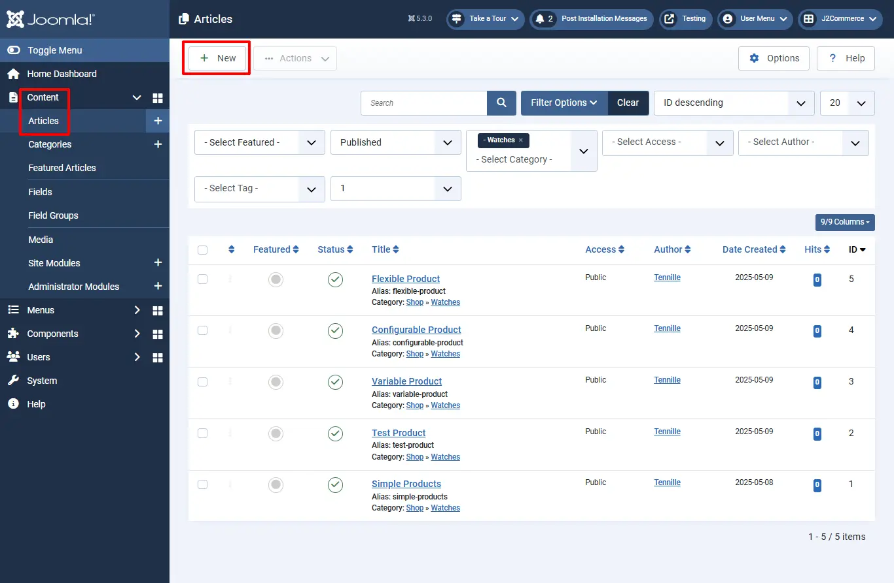

* Enter a name for the product you want to create.
* Select the ‘J2Commerce Cart’ tab below.
* Select ‘Yes’ in the option ‘Treat as product’.
* The next option is product type. From the available list, select ‘Simple’, as shown in the image.
* Now click the button, ‘save and continue’.

.webp>)

Your product will be saved, and it will continue to configure the product. Now, add a description to your product in the editor.&#x20;

See the image below:

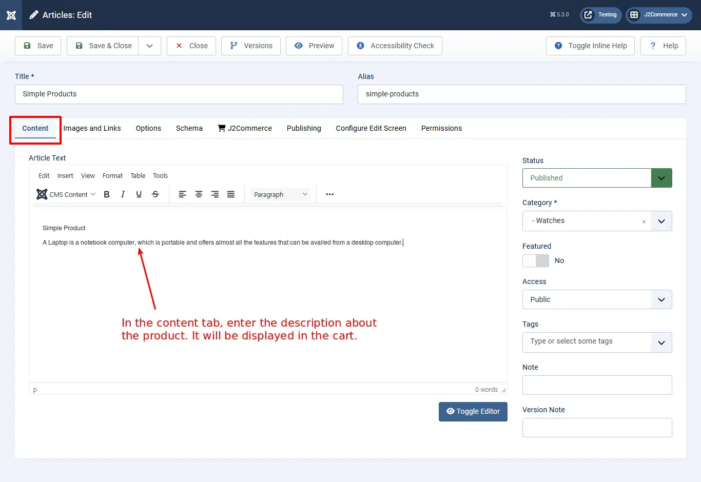

Let's add the other primary details of the product in the "store" section.&#x20;

**General tab:** You can set up the basic information about the product, like SKU, Universal Product Identifier, Brand etc. You can decide whether the product is to be displayed in the storefront.&#x20;

See the image below.

.webp>)

**Pricing tab:** Here, enter the price of the product. If you want to set advanced prices, like special discounts, click the ‘Set Prices’ button and you will get a pop-up window where you can set the special prices.&#x20;

See the image below to understand how it is done.

.webp>)

**Advanced Pricing:** Enter the dates between which the special price is offered, the minimum quantity to avail the special price, the user group eligible, the special price and click ‘Create’. Now, the new price is listed as a row below. You can further edit and save or delete if you want.  You can also leave the date range empty if you want the special pricing to always be available.

&#x20;**Inventory:** _This is a_ J2Commerce _PRO exclusive feature_

Select ‘Yes’ if you want inventory management. Enter all the fields as required. They are fairly self-explanatory, but still assisted in the image.

.webp>)

**Images:** Here, you can add the images for your product. The main product image, thumbnail image, and additional images for the product are added here.&#x20;

.webp>)

To add an image, click the green button, ‘Select', which will bring up a pop-up window, where you can select the product image. The image below shows how to create a new image folder. Once you have created or located an existing folder, just double-click to open it. Once inside the folder, you can either upload a new image or select an existing image and click 'Select/ to add it to the product

See the image below:

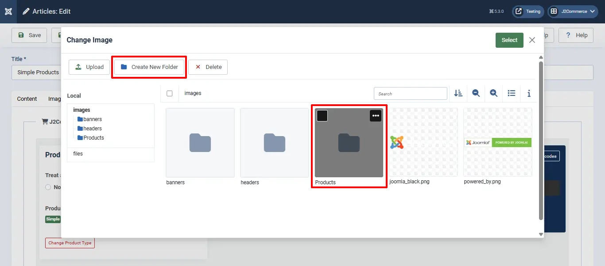

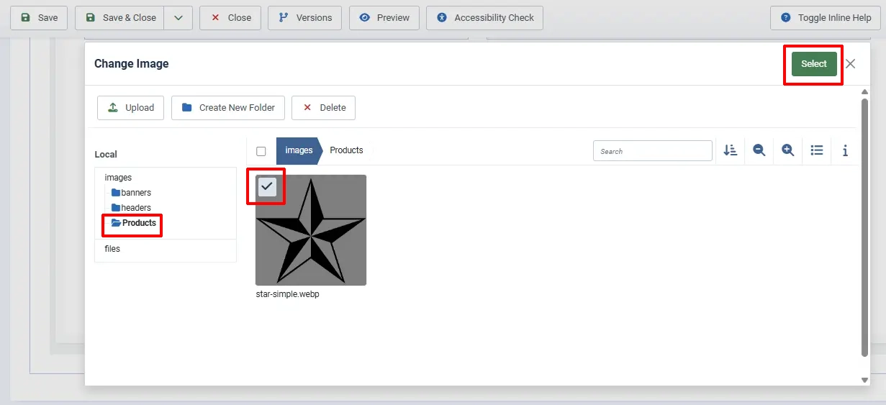

Now the image has been added to your main product with an image description for the visually impaired shoppers

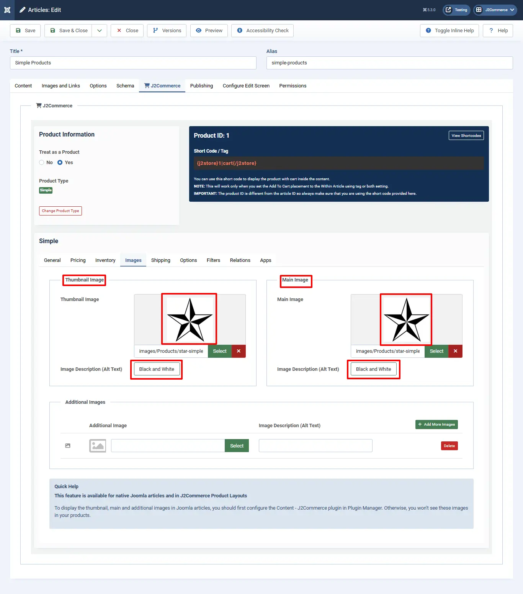

**Shipping:** Enter the options with details according to your needs to enable shipping, the dimensions and weight of the product, and classes for length and weight.&#x20;

See the image below:

.webp>)

&#x20;Options: This section allows a shopper to choose different options for the product. ie: size, color, material, etc.  In order for any options to appear, you first need to set up the options you want for your products. &#x20;

\* To create new options, go to _**Components > J2Commerce > Catalog > Options > New**_.  See image below.

Now that you have created product options, you can find them in the dropdown menu. To add the options, select the option > Add Option > Save. You can repeat this for as many options as your product will have.

.webp>)

Once you are finished adding the options, you can select if you want them to be a required option or not. You can also select the order in which they will appear on the frontend. See image below

.webp>)

Next, you will want to show all of the attributes for each option. This can be done by clicking on 'Set Option Value'. For example, if the product offers different sizes, then click on each size that is offered. Repeat this for each size and then do the same thing for the next option that you set up.&#x20;

If the attributes are all the same pricing then leave the price section blank but if you want to charge more or less for a specific attribute then you can specify that in this section. for example. If the 30 ft option is $5 more than the primary product, you will want the Prefix set as '+' and the Price set as $5.00. And if the 10 ft option is offered at $2 less than the primary product, then set the Prefix as '-' and the Price as $2.00. See example below.

See image below

The image below shows what your product will look like on the front end after adding your specific options and image.

**Filters:** You can filter the products by their name or type to narrow the search. Just like 'options', you need to set this up beforehand. Go to _**Components > J2Commerce > Catalog > Filter / Specifications > New.**_&#x20;

For example, if you want ‘Electronics’ as a filter, only electronics goods will be searched for your product, thus saving time. You can set filters as shown in the image.

.webp>)

**Relations:** Here, you can add products of higher value than the one being viewed by the customer and recommend the customer to buy that product, citing its advantages and additional features. This is an upsell.

Also, you can add some other products to convince the customer to buy more products. This is cross-selling. For more detailed explanation, refer to the **Relations** section of the **Simple Product**.&#x20;

Refer the image below:

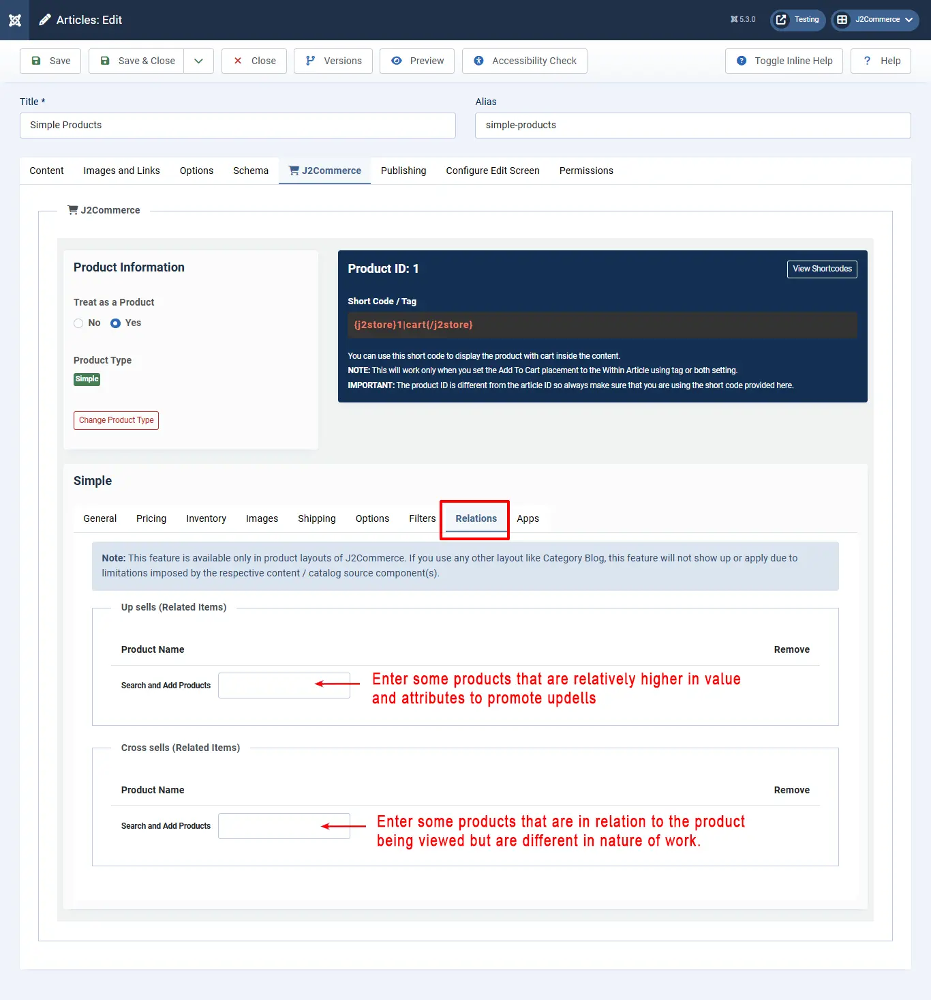

**Apps:** In this tab, you can add third-party tools or plugins that are available to enhance the J2Commerce functionality, like adding additional fields, applications, functions, or features.&#x20;

For example, you can organize shoppers by what they purchased so you can later send those specific shoppers promotional material or pre-sale emails based on what they purchased before.

The 'user group' app allows you to add a user to a specific user group based on the product that they purchased, so each product could essentially give somebody access to a certain area of the site simply by adding the add to user group app and opening up a product in the app section and then selecting the user group you wish them to be added to when the person purchases that product

.webp>)

Now, let's have a look at how your product is viewed in your online store. Check the image below:

### Video Tutorials: 

