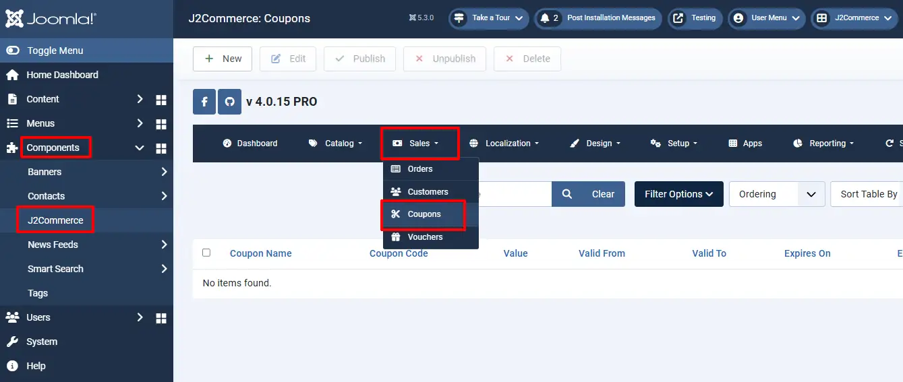
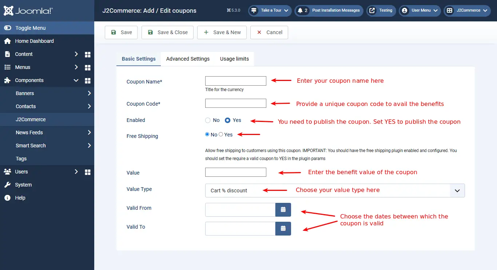
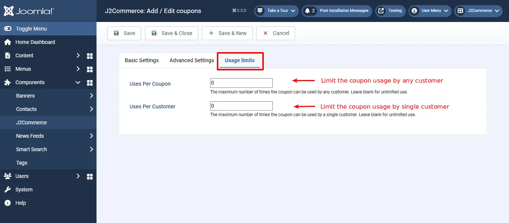

# Coupons

This is J2Commerce PRO exclusive feature

Coupons are vouchers preloaded with specific values and discount credentials that enable customers to shop online with extra privileges.

Coupons preloaded with specific values enable customers to shop online with no shipping cost.

**Step 1:** Go to Components > J2Commerce > Sales > Coupons

## Setting up the Coupon Parameters

### **Basic Settings Tab**

Click New, and now in the Basic Settings Tab you can create a coupon and add the details of the coupon, such as Coupon Name, Coupon Code, Published, Value, Valid from, and Valid up to etc.

- **Coupon Name:** Name of the coupon you wish to offer
- **Coupon Code:** A Unique code assigned to the coupon for the customers to make use of the coupon
- **Published:** Set this to ‘Yes’ to make the coupon available to customers
- **Free Shipping:** Set this to ‘Yes’ to make shipping free of cost
- **Value:** Value of the coupon
- **Value Type:** Value of the coupon is a fixed amount or a specific percentage of the order value
- **Valid from and Valid from/to:** Set the coupon validation here. Choose the dates between which the coupon is valid.

The above image shows how to create a coupon and add the details for a coupon.&#x20;

### **Advanced Settings Tab**

.webp>)

- **Product Categories:** Choose the categories to which the coupon must be applied.
- **Products:** Coupon usage is applicable to the products added here.
- **Brand or Manufacturer:** Coupon usage applicable to the brands or manufacturers added here.
- **Customer Groups:** Coupon usage will be restricted to the user groups selected here.
- **Users:** IDs of users for whom the coupon should apply, empty for all customers
- **Minimum spending:** The minimum value required to avail the coupon privilege.

### Usage Limits Tab

- **Uses per coupon:** limit of using the coupon for privileges by any user, empty value is for unlimited use
- **Uses per customer:** limit of using the coupon for privileges by one customer, empty value for unlimited use

Coupons hold the following information required for a successful process of purchase.

Free shipping after coupon applied!

**Additional Note**

For any coupon to be displayed on the add to cart page, it must be enabled in the following places:

**Step 1:** Under Components > J2Commerce > Setup > Configuration

**Step 2:** Go to the Discount tab > Enable Coupons

**Step 3:** Under Components > J2Commerce > Sales > Coupons

&#x20;**Step 4:** Choose the coupons that you want to enable or disable by selecting the 'X' or checkmark

