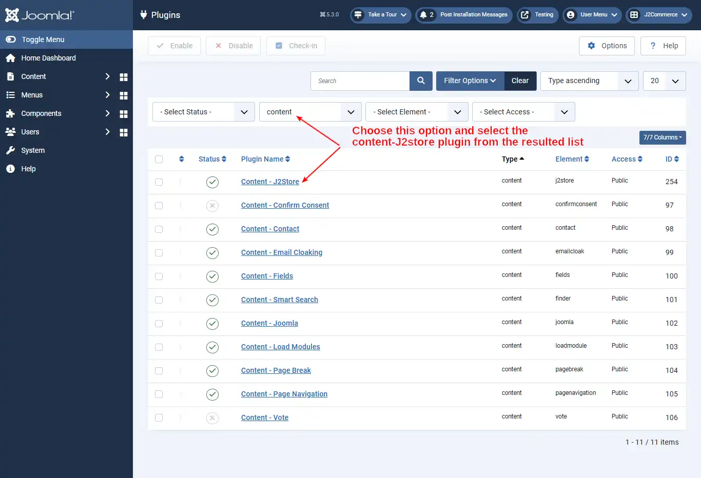

# Content plugin settings

To control the display in the cart section, to show or hide the images, enabling zoom effects etc., some settings have to made in advance to achieve the desired results. The content plugin settings would also take effect when you have displayed your products using short code on the Joomla layout. This section explains about how the settings can be made.

**Procedures**

* From the Joomla main menu, go to System > Manage > Plugins
* From the resulting window, select Filter Option. In the dropdown window select Content.  Select Content - J2Store (or J2Commerce) from the list, as illustrated in the image below

* You would see the following window where you could allow frontend article editing. When the option is set to Yes, the users with appropriate permissions would be able to view the J2Commerce (J2Store cart) tab on the product articles on the frontend.

Next is the category view tab, where you can find settings for controlling the behavior on the category view of products.

* From the resulting window, select the Category View tab to set the values, as shown in the image below:

* Follow the steps for the settings to be made:

**Add to cart and options display**

**Display the options and cart**- This would display the options and the cart button on the list view page itself.

**Display choose options button only if the product has options. If no options are there, display the cart**- This would display the view details button if there are options in the product. If no options are available, the add to cart button would be shown in the list view page.

**Do not display. Always take the customer to the detail view**- This would display the view details button regardless of the product having options or not.

**Product block position**

**Top:** This would display the add to cart, price, options above the description or other content of the product article.

**Bottom:** This would display the add to cart, price, options below the description, or any other content of the product article.

**AfterDisplayContent:** This would display the product block in the place where the AfterDisplayContent event is used.

**Display image:** To display the image, select Yes

**Image type:** Select from the three options : Thumbnail, Main, Both Main and additional images

**Link image to product**

Choose Yes if the image is to be linked with the product

**Enable zoom effect:** Select Yes to enable the zoom effect

**Image width & Additional image width:** Set the width of the image in pixels

* Save the settings and go to the Item View tab to set the values, as shown in the image below:

**Product block position**

**Top**: This would display the add to cart, price, options above the description, or other content of the product article.

**Bottom**: This would display the add to cart, price, options below the description, or any other content of the product article.

**AfterDisplayContent**: This would display the product block in the place where the AfterDisplayContent event is used.

**Display image:** To display the image, select Yes

**Image type:** Select from the three options: Thumbnail, Main, Both Main and additional images

**Link image to product:** Choose Yes if the image is to be linked with the product

**Enable zoom effect:** Select Yes to enable the zoom effect

**Image width & Additional image width:** Set the width of the image in pixels
