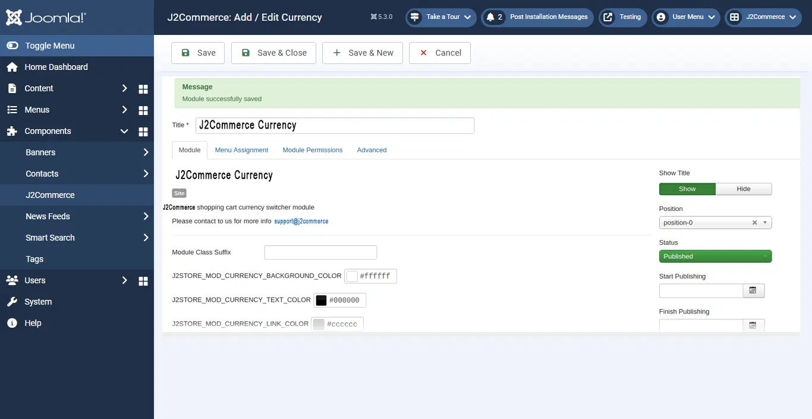

# Set up multi-currency

**J2Commerce Multi Currency**

J2Commerce multi currency feature allows store owner to setup multiple currencies. For example, if the location of store is United States and the store owner wants his store to be accessed by customers from Japan and European countries, then he / she will have to create one primary currency (for united states) and two secondary currencies (one for Japan and other for European countries).

## How to setup Primary or default currency? 

First, you have to decide your primary or default currency for your store. The **value** option in currency settings is used to set the default currency. If the value is set be 1.000000 for a particular currency, it will serve as the default currency.

For e.g., if US $ is been set the value 1, it will be the default currency and the corresponding value will be 0.81 for Euro. In this way J2Commerce will calculate the prices for products based on currency transitions.

To make the currency value auto update, go to **J2Commerce > Setup > Configuration > Store tab** and choose **YES** to Auto Update Currency.

&#x20;

Choose the Default Currency as **USD** in your store configuration.

After choosing Auto update currency to YES, when you are going to create a secondary currency, the value of the currency will be updated automatically. See the picture below.&#x20;

.webp>)

## J2Commerce Currency Switcher 

Go to System > Manage > Extension.

Select the Filter Options tab. Then, in the dropdown menu for Select Type, click on Module.&#x20;

Find the J2Store Currency (or J2Commerce currency) module and enable it.

Open the module, set the module position to any one of your template’s positions.

Assign it to the All pages or to a particular menu, and save it.

**Frontend**&#x20;

**Video Tutorial:** Here is a video that would assist you on setting up multi-currency on your site:

