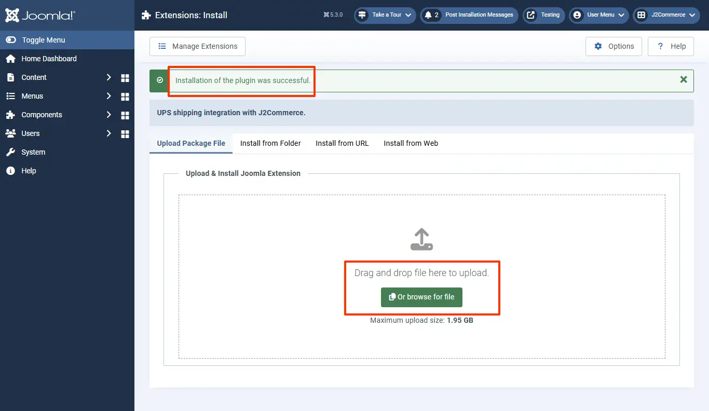
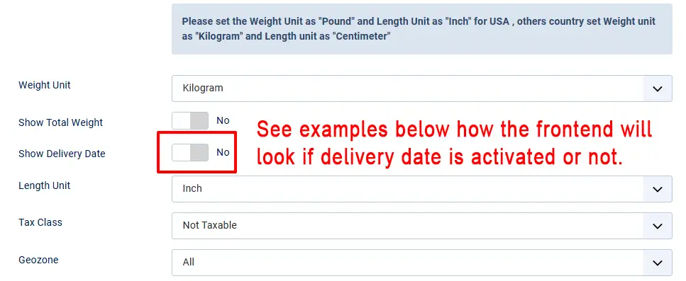
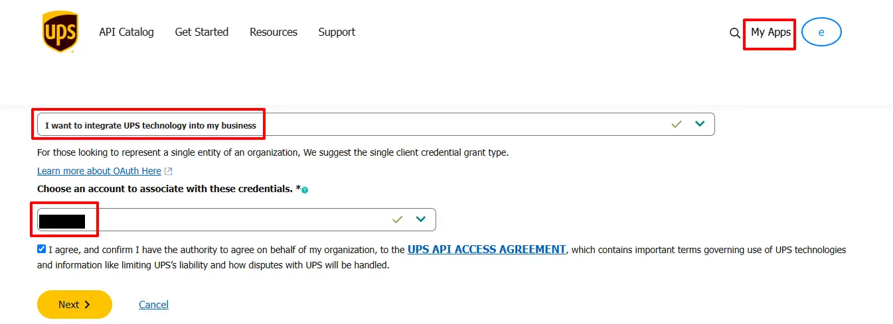
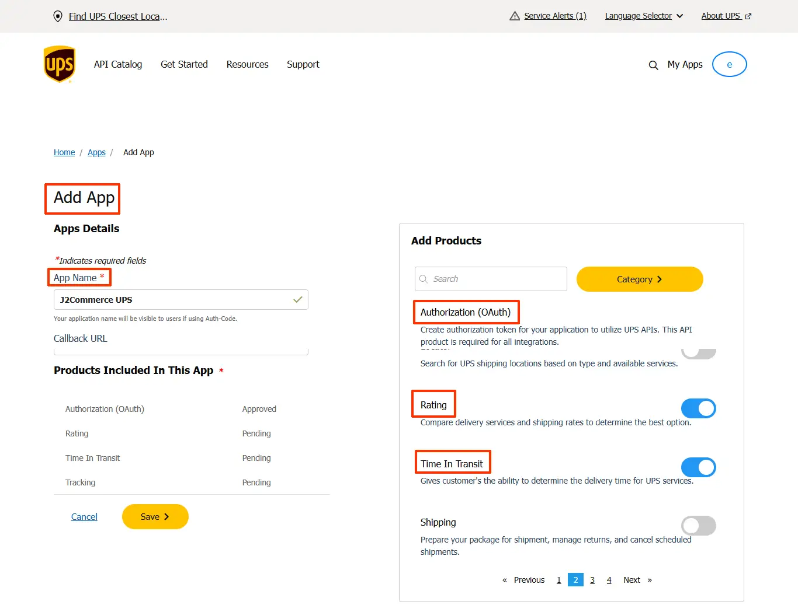
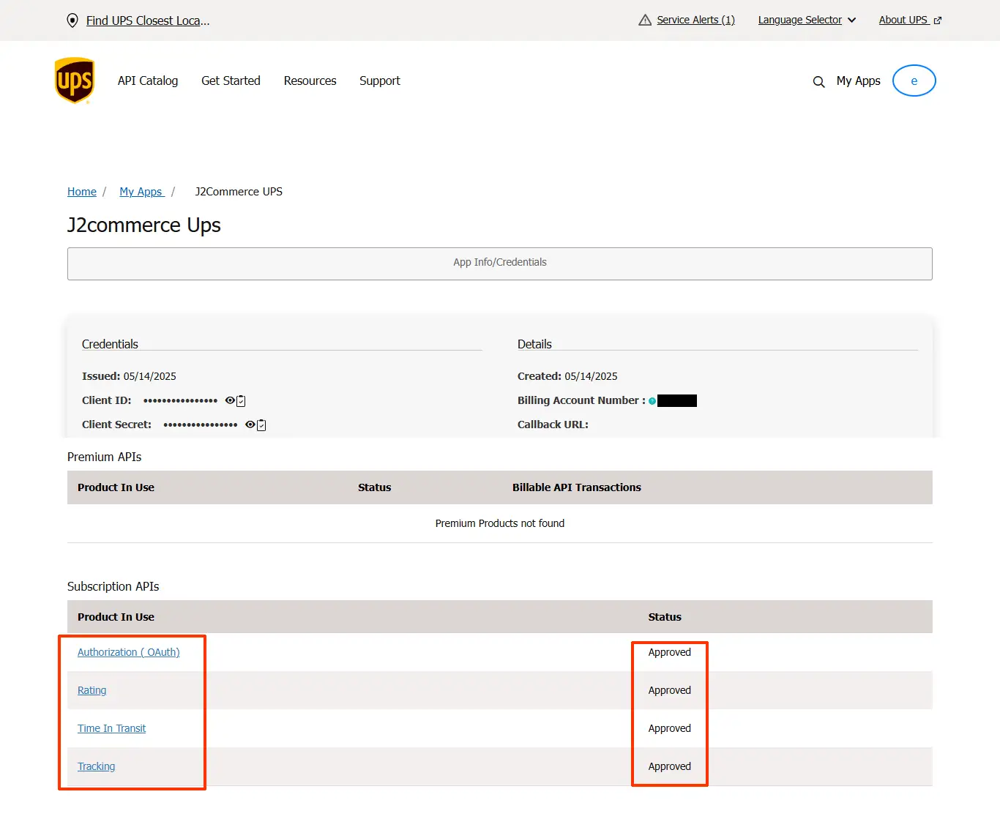

# UPS Shipping

This plugin integrates the UPS Shipping Rate API with J2Commerce.

**Requirements**

- with PHP 8.1.0 +
- Joomla! 4.x/ Joomla! 5.x +
- J2Commerce / J2Store 4.x +**‌**

#### **Configuration:**

Prior to configuring the plugin, you should have an active account with UPS and have received API keys. Contact UPS to register and get API keys.

#### **‌**Installation:

You can install this USP shipping plugin using joomla installer. The following steps help you with a successful installation.

‌

**Step 1:** In the Joomla admin, go to System > Install > Extensions

 (1).webp>)

**Step 2**: Click on the Browse button and select the UPS Shipping zip file you saved during the download process. You will receive a message of success once installed.

**Step 3:** Select J2Commerce >setup > shipping methods

.webp>)

**Step 4:**

- Now, the UPS shipping for J2Commerce page will appear on the screen.
- Enable the plugin.
- Configure the shipping plugin by entering the plugin parameters.

#### Plugin Settings:

**Client Key:** Client Key provided by the UPS Developer Portal ([https://developer.ups.com/](https://developer.ups.com/)).

**Client Secret:** Client Secret provided by the UPS Developer Portal  ([https://developer.ups.com/](https://developer.ups.com/)).

‌**Shipper Number:** Enter the UPS account Shipper number

.webp>)

‌**Parcel Packing Method:** You may select the parcel method for packing the products.

‌**UPS Packaging Box:** You may consider selecting the available UPS box.

Note: If you choose Pack into boxes with weights and dimensions (Recommended) but have not chosen any UPS Packaging, nor defined any custom boxes (as explained below), the plugin displays the error message: “UPS is enabled, and Parcel Packing Method is set to ‘Pack into boxes’, but no UPS Packaging is selected and there are no custom boxes defined. Items will be packed individually.”

‌**Custom Box:** You may enter the dimensions here the items will be packed into these boxes based on item dimension and volume. Outer dimension will be passed to UPS, whereas the inner dimension will be used for packing. Items not fitting into boxes will be packed individually.

This Custom Box is to be chosen only when “Box packing” is selected.

‌**Handling Cost:** Apply an additional fee to the shipping cost calculated.

‌**Send Product Amount to UPS:** Select Yes to send the product price to UPS.

‌‌**Enable Negotiated Rate:** Set this to Yes for negotiated rate.

‌**Delivery Confirmation Option:** You can confirm the delivery using a signature with UPS.

‌**Services:** Select the UPS services to be offered.

‌**Pickup Type:** Choose the required pickup type here.‌

‌**Weight Unit:** Select if you want the weight set as grams, pounds, kilograms, or ounces.

‌**Show Weight Total:** Set this to Yes to show the weight total next to the shipping service name.

**Show Delivery Date:** Set this to yes to show the delivery date next to the shipping service name. The delivery times are provided by the UPS API for shipping services that specify specific delivery days, such as Next Day Air, Second Day Air, etc.

.webp>)

‌**Length Unit:** If you have not set the length unit in the product, the value selected here will be used. Inch vs cm

**Tax Class:** Here, you can specify the Tax class to charge the Tax on shipping. Leave empty if you do not want to charge tax.

‌**Geozone:** If you choose a Geozone, then this shipping plugin will apply only to customers coming from the countries/zones added under the chosen Geozone. Leave empty to show the method to all Geozones.

**Shipping Origin Address Type:** If your origin shipping address is a home, then change to residential.

‌‌**Shipping Origin Address:** Enter the address from which you ship.

‌**Shipping Origin City:** Enter the city from which you ship.

‌**Shipping Origin Zin/Postalcode:** Enter the Postcode from where you ship.

‌**Country:** Select the Country from which you ship.

**‌Zone:** Select the Zone/State from which you ship.

**Debug:** If you set this to Yes, the system will log the requests and responses, which will help you debug. The logs will be saved in the Cache folder.

**Note:** In the production environment, it must be set to NO.

## How to obtain UPS OAuth Credentials:

The following instructions will help walk you through the process of obtaining your new UPS OAuth Client ID and Client Secret.&#x20;

**Step 1:** Go to UPS.com and log in.

**Step 2:** Click My Apps in the top right corner

**Step 3:** Click Add Apps in the bottom left corner

**Step 4:** Then, I need API credentials because I want to integrate UPS technology into my business.

**Step 5:** On the same page as #4: Select the client's UPS account you need to link it to

**Step 6:** Complete the contact info

**Step 7:** Then select the Rating, Tracking, and Time In Transit API's (I believe the Authorization(OAuth) is automatically added when you save)

(Right now, we aren't using the Tracking API, but we do plan on incorporating that in later versions, so better to add it now so you don't need to worry about adding it later...)

**Step 8:** After saving, you should be able to see the Client ID and client Secret under the App Info/Credentials page

